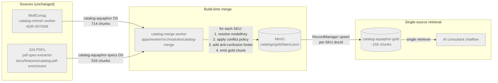

# ADR-010: Hybrid indexing — build-time merge ERP + Specs в gold Document Store

## Статус
🟡 **Draft pending proof point** — 2026-05-21.

Контекст черновика: после Step 6.5 R&D (prompt-tuning floor 52% real-world accuracy) гипотеза этого ADR — что **inter-source conflict resolution** = главный bottleneck. Гипотеза **не доказана**: Step 6.5 показал только что multi-DS retrieval даёт 52%, но не локализовал корень. Возможны 4 ортогональных корня:

1. Retrieval semantic miss (Q4 mixers) → gold DS не поможет, нужен FTS hybrid.
2. Inter-source conflict resolution → этот ADR.
3. System prompt накопил rules под 2-DS реальность → новый prompt и так помог бы.
4. Исходные данные устаревшие (specs PDF) → gold DS усугубит ситуацию (single source of bad).

До принятия этого ADR — **Phase 0 measurement** (feature plan, 1-2 дня): на existing PoC chunks (13 моделей из `experiments/specs-enrichment/poc-ds-merge/merged-chunks.json`) залить temp gold DS, замерить accuracy lift vs baseline 2-DS на 30Q real-world. Gate criterion — **accuracy lift ≥ 10pp**. Положительный proof → status переходит в ✅ Принято, идёт infrastructure build. Отрицательный → ADR-010 retired, переключаемся на гипотезу (1) / (3) / (4) с отдельным ADR.

См. `docs/experiments/specs-enrichment/2026-05-21-summary-evening.md` и `NEXT-SESSION-HANDOFF.md` для R&D контекста.

## Контекст

AI-консультант для PROSTOR (catalog + water page) построен по pattern AgentFlow V2 + multi-DS retrieve через Haiku 4.5. На сегодня под управлением Flowise живут **два независимых Document Store**:

| DS | Источник | Что внутри | Chunks (2026-05-21) |
|---|---|---|---|
| `catalog-aquaphor` | МойСклад → CRM bulk-export → MinIO `latest.json` → `apps/worker/catalog-refresh` (ADR-007 + ADR-008) | ERP-карточки: name / sku / salePrice / productCategory / description / extras (services, components) | 714 |
| `catalog-aquaphor-specs` | Публичные PDF паспорта Аквафор → docling → `pdf-spec-extractor` агент (см. `docs/features/catalog-pdf-enrichment.md`) | Tech depth: производительность / давление / габариты / срок службы / совместимость / схемы | 534 |

AI-консультант делает multi-query retrieve (top-K из обоих DS) и склеивает context для финального ответа. На **cherry-picked 20Q reference test set** показатель был 92.5%. На **real-world 30Q** (vague / typos / multi-problem / colloquial) — **50-55%**.

### Что выяснилось в Step 6.5 (R&D 2026-05-20…21)

1. **Prompt-tuning floor ~52%.** Добавили rules 23-27 (anti-confusion / domain warnings / WS classification / anti-hallucination / multi-query) — gain +2pp accuracy, −22% high-sev wrong claims. Diminishing returns: дальше нужна architectural работа, не promptware.

2. **Inter-source conflicts реальны.** Один и тот же PDF паспорт self-contradicts: в разделе «Назначение» DWM-102S Pro указаны модули К7М (устаревший snapshot), в «Расходниках» — корректные Pro 1 / Pro 2 / Pro 100 / Pro BMg. ERP содержит current правду (Pro BMg). Без явной conflict-resolution policy retriever достаёт оба варианта, LLM путается и в ~30% случаев берёт устаревшее.

3. **Multi-DS retrieve = double surface для hallucination.** При K=3 на каждом store финальный context = 6 чанков по разным source. LLM «синтезирует» цены из specs PDF (где их нет) и tech specs из ERP description (где их частично нет), теряя trace источника.

4. **Q4 mixers retrieval bug.** Запросы вида «какие у вас смесители 2-в-1?» — semantic miss на обоих DS, потому что embedding для смесителей в catalog-aquaphor сидит рядом с водоочистителями (одна категория словаря в МойСкладе), а в specs — отдельный «accessory» bucket. Нужен metadata filter `category=mixer`.

5. **Auto-grader через Flowise judge chatflow** (Sonnet 4.6 over Haiku output) показал что false positives в моих KNOWN_FACTS дают −5 wrong claims per setup. Real ground-truth audit: 5 из 7 моих «verified facts» были неверны при сверке с specs PDF.

**Корень problem'ы**: retrieve-time fusion из двух DS = race condition по чанкам + duplicated cost на embedding одних и тех же моделей в разной форме + no single trust anchor для LLM.

## Решение

**Build-time merge ERP + Specs в третий "gold" Document Store** (`catalog-aquaphor-gold`) с явной conflict-resolution policy и anti-confusion footers на чанк. AI-консультант после миграции retrieve'ит **только из gold DS** (single-source-of-truth).

Industry name pattern: **hybrid indexing** / **knowledge fusion at ingest**.

### Architecture



### Conflict resolution policy

| Field family | Authoritative source | Reason | Tie-breaker |
|---|---|---|---|
| `name` / `sku` / `salePrice` / `productCategory` / availability | **ERP** | МойСклад — operational truth (менеджеры обновляют в течение дня; цены — daily; новые SKU — single point of entry) | ERP wins always |
| `services` / `components` (bundle extras) | **ERP** | Те же причины + ERP содержит attribute-level breakdown (System Bundle pattern, см. ADR-007) | ERP wins always |
| `description` (маркетинговое) | **ERP** | Менеджерская копия для витрины | ERP wins; specs `purpose` идёт как secondary `tech_purpose` поле |
| `productionRate` / `pressureRange` / `dimensions` / `weight` / `installSchema` | **Specs** | ERP не имеет этих полей (Slice 6 ERP guide → менеджеры не вовлечены) | Specs wins; если specs нет — `null` (явно), не fabrication |
| `compatibleModules` / `replacementCartridges` | **Specs** secondary + **ERP** `components` primary | ERP `components` = current bundle config; specs = full compatibility matrix (включая старые/новые модули) | ERP `components` wins для дефолтной конфигурации, specs дополняет как «также совместимо» |
| `serviceLife` (срок службы модулей/смол) | **Specs** | Slice 8 lifespanMonths в ERP только начался — coverage пока ~10% | Specs wins; ERP `lifespanMonths` если есть — overrides specs |
| `certifications` / `warranty` | **Specs** | Не дублируется в ERP | Specs only |

**Anti-confusion footer** добавляется в gold chunk **explicitly** когда detected drift:

```
## Внутренние пометки (anti-confusion):
- Spec passport раздел «Назначение» упоминает модули К7М — это устаревший snapshot.
  Trust ERP: current модули = Pro 1 / Pro 2 / Pro 100 / Pro BMg.
- Series Pro != series base: модули несовместимы (Pro BMg НЕ подходит к DWM-101S).
```

Эти пометки — часть retrievable text, видны LLM в context. Generation rule (system prompt) обязывает trust footer over plain sections если есть конфликт.

### Gold chunk schema

Один **chunk на SKU** (контраст с текущим где ERP даёт 4-5 chunks на SKU из-за splitter'а):

```typescript
type TGoldChunk = {
    text: string;        // ~1500-2500 chars, structured sections
    metadata: {
        sku: string;                // canonical SKU из ERP
        modelKey: string;           // kebab-case lowercase для retrieve / cross-ref
        category: TProductCategory; // enum из ERP (см. Slice 2)
        salePriceKopecks: number;   // ERP current
        erpDocId: string;           // backreference в catalog-aquaphor для debug
        specsDocIds: string[];      // backreference в catalog-aquaphor-specs (может быть N PDFs)
        hasSpecs: boolean;          // false если PDF spec отсутствует — для retrieve weighting
        conflictsResolved: string[]; // массив applied policy IDs ('outdated-pro-modules', 'led-error-codes', ...)
        builtAt: string;            // ISO timestamp когда merge ran
        sourceDigest: string;       // sha256(erpChunk.contentHash + specsChunks.contentHash) — для skip-if-unchanged
        source: 'gold-merged';
    };
};
```

Chunk text — **fixed sections** (не narrative): `## Каталог (ERP)` / `## Технические характеристики (Specs)` / `## Совместимость` / `## Anti-confusion`. Это даёт LLM consistent layout для extraction.

### Pipeline ownership

- **Slovo владеет merge logic** — отдельный модуль `apps/worker/src/modules/catalog-merge/`. Worker запускается **после** catalog-refresh (cron `0 4 * * *` смещён на ~30 мин: `30 4 * * *`).
- **Slovo владеет gold DS** (catalog-aquaphor-gold). Upsert через тот же `@slovo/mcp-flowise` / `flowise-client` pattern что catalog-refresh (RecordManager + Redis loader-mapping, ADR-007 дополнение 2026-05-01).
- **Conflict policies хранятся в коде** (`apps/worker/src/modules/catalog-merge/policies/`), один файл на SKU-pattern (e.g. `dwm-pro-series.policy.ts`). Каждая policy — pure function `(erp, specs) → { textPatch, footerAdditions, conflictIds[] }`.
- **Output в MinIO** (`catalogs/gold/latest.json` + `history/<ts>.json`) — для audit / rollback / replay, по тому же pattern что ERP `latest.json` (ADR-007).

### Immutability принцип

**Ничего из существующего не мутируется.** Все артефакты этого ADR — **новые**:

- Новый module `apps/worker/src/modules/catalog-merge/` (не extension catalog-refresh).
- Новый Document Store `catalog-aquaphor-gold` (отдельный storeId, своя таблица `catalog_aquaphor_gold_chunks`).
- Новый MinIO префикс `catalogs/gold/` (рядом с существующим `catalogs/aquaphor/`).
- Новый Redis ключ-namespace `slovo:catalog-merge:*` (рядом с `slovo:catalog:loaders`).
- Новый AI consultant chatflow `agentflow-haiku-gold-v1` (clone, не replace).
- Новый system prompt **с нуля** под gold semantics, не diff против rules 1-27 существующего.

### Что НЕ меняется

- `catalog-refresh worker` (ERP ingest) — unchanged.
- `pdf-spec-extractor` + docling pipeline для specs — unchanged.
- `catalog-aquaphor` DS — unchanged (продолжает daily refresh из ERP).
- `catalog-aquaphor-specs` DS — unchanged (продолжает обновляться по своему scheduler).
- Существующие chatflows (`agentflow-haiku` / `agentflow-gpt` / `toolagent-haiku` / judge) — unchanged, остаются live для side-by-side measurement и debug. Их судьба после launch gold DS — **undecided pending accuracy measurement** (см. Open Q #2).

## Альтернативы

### A. Runtime fusion (status quo)

Multi-DS retrieve, склейка контекста в prompt'е, LLM сам разруливает конфликт.

**Плюсы:** zero infra change, можно итерировать prompt'ом.

**Минусы:** floor 52% (доказано). Hallucination растёт с size context'а — двойной surface. LLM не имеет ground-truth anchor когда два чанка противоречат друг другу.

**Отклонена:** R&D Step 6.5 показал что prompt-tuning floor достигнут.

### B. Re-ranker между retrieve и LLM (Cohere Rerank / cross-encoder)

Добавить re-ranker слой который выбирает top-N из 2K retrieved chunks с учётом метаданных.

**Плюсы:** lighter implementation чем full merge (одна нода в chatflow). Может быть orthogonal'но к merge — добавлен поверх gold DS.

**Минусы:** не решает inter-source conflict — оба противоречивых chunk'а могут пройти rerank. Re-ranker оптимизирует relevance, не consistency. Добавляет latency (~200-400ms на запрос).

**Отклонена в качестве standalone-решения**, но **может быть надстройкой** над gold DS если retrieval recall начнёт страдать.

### C. RAG fusion / RRF (Reciprocal Rank Fusion)

Стандартный multi-retriever pattern: запустить N retrievers (full-text BM25 + dense pgvector + metadata-filtered), смерджить ranks по RRF, top-K.

**Плюсы:** улучшает recall на edge-cases (Q4 mixers semantic miss). Не требует rebuild DS.

**Минусы:** опять не решает inter-source conflict — RRF выбирает по rank, не по trust. Усложняет chatflow. Дублирует embedding cost (нужно retrieve по нескольким стратегиям).

**Отклонена в качестве standalone**, но FTS hybrid retrieval может стать частью gold DS retrieval pipeline позже (отдельный sprint).

### D. Materialized view в PostgreSQL (без отдельного DS)

Merge ERP + Specs прямо в Postgres view с tsvector + embedding column, retrieve через slovo NestJS endpoint без Flowise.

**Плюсы:** меньше движущихся частей. Slovo владеет всем pipeline.

**Минусы:** ломает текущий pattern (Flowise = LLM runtime per ADR-008). AI-консультант chatflow тогда становится narrow tool-agent с одним кастомным tool вместо стандартного retriever. Усложняет добавление новых retrieval-стратегий (re-rank, hybrid FTS) которые в Flowise — drop-in ноды.

**Отклонена** — гибридная архитектура с slovo как orchestrator + Flowise как runtime остаётся принципом slovo (ADR-008).

### E. Tool-grounded verification (без merge, но с verify-endpoint)

Оставить multi-DS retrieve, но добавить `POST /catalog/verify` endpoint который AI-консультант дёргает перед финальным ответом для verify конкретных fact'ов (цена / совместимость / срок службы).

**Плюсы:** snapped к ERP truth моментально (verify читает live из БД). Latency budget — может быть OK через streaming.

**Минусы:** не решает inter-source conflict в context'е (LLM уже видел два варианта); verify работает post-hoc. Требует LLM понимать когда вызывать verify — добавочный hallucination surface.

**Не отклонена окончательно** — может быть **дополнением** к hybrid indexing (verify endpoint для confidence-critical claims типа цены и совместимости). Решение отложено до accuracy measurement на gold DS.

### F. LLM-агент сам делает merge (build-time)

Вместо TS pure-functions и hardcoded conflict policies — Sonnet 4.6 (или Haiku 4.5) reasons over ERP-chunk + specs-chunks per SKU и генерирует gold chunk с anti-confusion footer.

```
for each SKU:
    erp = vectorstoreQuery(catalog-aquaphor, sku, K=3)
    specs = vectorstoreQuery(catalog-aquaphor-specs, modelKey, K=5)
    goldChunk = await llm({
        system: "Merge ERP + specs into single gold chunk. ERP wins для price/modules/availability. Specs wins для tech specs. Flag conflicts in footer.",
        input: { erp, specs }
    })
    upsert(catalog-aquaphor-gold, goldChunk)
```

**Плюсы:**
- **Семантическое распознавание конфликтов** — LLM видит что «Назначение» противоречит «Расходникам» в одном PDF без явной policy для каждой пары секций.
- **Rich anti-confusion footer** с reasoning, не template-based.
- **Coverage long-tail без manual labor** — нет policy backlog, новый wrong-pattern автоматически детектится при следующем merge.
- **Адаптивно к новым SKU / PDF** — добавили модель в ERP, выкатили новый PDF паспорт → агент сам разберётся без code change.

**Минусы:**
- **Non-determinism ломает RecordManager idempotency.** Same input → different output between runs → `metadata.sourceDigest` всегда меняется → full re-embed каждый cron tick. Embedding cost растёт с $0.04 / rebuild до $0.04 / day = $1.2/мес (bounded, но проблема глубже — gold DS теряет stability).
- **Стоимость merge step.** 155 SKU × ~5000 tokens context × Sonnet 4.6 ≈ **$12 / run**. Daily cron = $360/мес ≈ 35k₽/мес. Weekly cron = $50/мес ≈ 4.8k₽/мес — приемлемо для pilot, но против operational расхода (executive summary AI-консультанта построен на pass-through pricing — каждый рубль явно учитывается).
- **Hallucination в gold chunk = single source of garbage.** Gold DS высоко-trusted retriever для AI-консультанта. Если merge-агент сочинит факт которого нет ни в ERP ни в specs — этот факт retrieve'нется с полным confidence. TS pure-function не может галлюцинировать (либо exception либо deterministic output), LLM может subtly invent.
- **Audit harder.** `metadata.conflictsResolved[]` (TS approach) — точный массив applied policy IDs. LLM-approach — verbose reasoning в footer, harder to grep / aggregate / build analytics.
- **Failure mode не bounded.** LLM может вернуть structurally валидный chunk с тонко wrong fact, который пройдёт zod-schema + RecordManager + Vector Store без alerts.

**Статус:** under consideration as part of approach selection. Решение между TS / LLM / hybrid (Альтернатива G) — **после** Phase 0 proof point (feature plan).

### G. Гибрид: TS skeleton + LLM enrichment только для detected drift

Deterministic TS-функция строит gold chunk skeleton (sections, fixed layout, ERP/specs source markers). LLM вызывается **только** для SKU где TS detected конфликт между ERP и specs (e.g. specs PDF упоминает К7М в одной секции и Pro BMg в другой → TS flag → LLM пишет contextual footer).

**Плюсы:**
- **Deterministic core** — RecordManager idempotency работает (LLM-output попадает в стабильную часть chunk и стабилен per-SKU при тех же inputs либо детерминизируется через cache).
- **Cost bounded.** ~15-20 LLM calls per merge run (только SKU с detected drift), не 155 → ~$1 / run. Daily = $30/мес — приемлемо.
- **LLM добавляет semantic depth там где нужно**, не везде.
- **Hallucination scope ограничен** anti-confusion footer'ом (а не основным содержанием gold chunk) → wrong fact в footer повлияет на edge-case ответы, не на mainstream queries.

**Минусы:**
- **Сложнее чем TS-only** — двухслойная архитектура, две failure mode'ы.
- **LLM-output в footer всё ещё non-deterministic** между runs если не cached → можно зафиксировать через `metadata.footerLlmHash` + skip-if-unchanged check на input pair (erp + specs).
- **Drift detector тоже policy code** — определить «есть ли конфликт» = pattern matching, fundamentally тот же manual labor что и TS policies (но lighter: только detection, не resolution).

**Статус:** **наиболее вероятный финальный choice**, но решение откладывается до Phase 0 proof point. Если accuracy lift подтвердится на manual-merge 13 моделей — выбираем approach (TS / LLM / hybrid) на данных.

## Последствия

### Положительные

- **Single trust anchor для LLM.** Один chunk на SKU = LLM видит одну правду + явную anti-confusion footer для известных edge cases. Ожидаемый lift accuracy: 52% → ~70-75% baseline (по аналогии с PoC на 13 моделях, см. `experiments/specs-enrichment/poc-ds-merge/`).
- **Reduced context tokens.** Сейчас K=3 × 2 DS = 6 chunks × ~500 tokens = ~3000 tokens context. Gold: K=3 × 1 DS = ~3 chunks × ~1500 tokens = ~4500 tokens — больше per-chunk, но меньше шума и duplicated info. Net cost — neutral или slight increase.
- **Conflict policies — code, не prompt.** Detection + resolution живёт в TypeScript с unit-tests. Регрессии ловятся CI, не на live трафике.
- **Auditability.** `metadata.conflictsResolved` + `metadata.sourceDigest` дают per-chunk explanation что именно merge сделал. Дебаг wrong-answer'ов сводится к одному chunk + двум исходным.
- **Cost saving на retrieve.** При proven gold DS — выключение `catalog-aquaphor` / `catalog-aquaphor-specs` для consumer-флоу = −2 embedding pipelines в hot path (остаются для debug / legacy chatflows).
- **Подготовка к Q-quality bumps.** Будущие интеграции (FTS hybrid через tsvector, metadata filter `category=mixer` для Q4 retrieval bug) встают на gold DS как первый класс, не как третий retriever.

### Отрицательные

- **Build-time latency.** Каждый merge run = read 2 DS целиком + apply policies × 155 SKU + bulk upsert. Estimate ~3-5 мин per cron tick. Не critical (cron daily, не real-time), но больше moving parts чем status quo.
- **Three DS вместо двух (на период deprecation).** На 4 недели после launch держим 3 параллельных store'а. Cost: лишние ~155 chunks × $0.13/M × 3072 dim ≈ незаметно ($0.002 за rebuild при unchanged content — RecordManager skip).
- **Conflict policies — codebase liability.** Каждая нашедшая edge-case policy = код который надо maintain. Mitigation: policy files small (~30-50 LOC each), unit-test coverage обязателен, retirement criteria — closed как «source upstream fixed» (e.g. specs PDF переиздан).
- **Дополнительный failure mode.** Merge worker может упасть посередине → gold DS в inconsistent состоянии. Mitigation: full snapshot в MinIO `history/<ts>.json` + Flowise RecordManager `cleanup=full` mode на финальной фазе upsert (атомарный switch).
- **Зависимость merge от обоих upstream.** Если catalog-refresh упал — gold не обновится. Если pdf-spec-extractor не выкатил новый PDF — gold не получит новые specs. Mitigation: merge продолжает работать с last-known-good на каждой стороне, alerting через Langfuse traces + Telegram (как budget-cap pattern в vision-catalog).

### Нейтральные

- **Существующие 2 DS** становятся **internal sources of truth, не consumer-facing.** Это правильное разделение responsibility, но требует discipline — debug flows должны явно target'ить ERP-only или specs-only DS.
- **Один chunk на SKU** — больше per-chunk content, потенциально на пороге chunk_size 1024 splitter'а. Решение: chunk_size = 4096 для gold DS (custom от 1024 в существующих), retrieve K=3 даёт ~12k tokens context — в пределах Haiku budget.
- **Multi-tenant readiness** не страдает — gold DS становится per-tenant `catalog-aquaphor-gold-<tenant>` так же как existing.

## Open questions

1. **Гипотеза не доказана.** Phase 0 proof point на existing PoC chunks (13 моделей) до infrastructure build. Gate: accuracy lift ≥ 10pp на 30Q real-world vs baseline. Положительный → status → ✅ Принято + продолжение по feature plan. Отрицательный → ADR-010 retired, переключаемся на корни (1) / (3) / (4) контекста с отдельным ADR.
2. **Approach selection — TS policies vs LLM-agent merge vs гибрид** (Альтернативы F / G). Решается **после** Phase 0 proof point. Critical trade-off: determinism + RecordManager idempotency + audit (TS wins) vs coverage long-tail conflicts без manual labor + adaptive (LLM wins). Гибрид (G) выглядит наиболее сбалансированно но усложняет архитектуру. Default position для Phase 0 — **manual merge** (PoC скриптом или руками, без production-ready logic) — это исключает variable «качество merge approach» из measurement.
3. **Production accuracy floor для launch.** 70% / 80% / 85%? До определения — gold DS уходит в shadow-mode (новый chatflow создаётся параллельно, замеряем side-by-side vs текущий 2-DS). **Не в scope этого ADR**, решается отдельно (см. handoff).
4. **Судьба existing 2 DS после launch gold.** Решение **отложено** до accuracy measurement. Варианты: (a) keep как internal debug sources навсегда — не consumer-facing но live для retro-анализа; (b) deprecate после sustained accuracy lift ≥10pp; (c) hard cutover если accuracy lift подтверждён smoke-тестом. Default position — **не трогать**, не consumer-routing на них через ADR-008 naming gate (новые chatflows должны target'ить только gold). Decision — ADR-amendment после Phase 4 feature plan.
5. **Confidence-based handoff к менеджеру** (когда AI не уверен — escalate). Внешний UX, **не в scope этого ADR**. Backend hook (`/chat` response include confidence + suggested action) можно добавить orthogonal'но после launch gold DS.
6. **FTS hybrid retrieval (postgres tsvector + pgvector RRF)** — отложено до измерения retrieval recall на gold DS. Если на 30Q real-world recall@3 ≥ 90% — не нужен. Если < 90% — отдельный sprint.
7. **Policy file structure / discovery** (применимо если pick approach = TS или гибрид). Auto-load всех `*.policy.ts` из directory vs explicit registry? Решение в feature plan (по умолчанию — auto-discovery + ESLint правило что каждая policy экспортирует typed `TConflictPolicy`).
8. **Gold DS upsert mode.** RecordManager `cleanup=incremental` (как catalog-refresh) или `cleanup=full` (atomic swap)? Default: `incremental` с REMOVED-sweep на SKU отсутствующие в новом payload (mirror ERP pattern). `full` рассматриваем если будут drift-incident'ы.

## Связанные ADR

- **ADR-001** (Modular Monolith) — `catalog-merge` остаётся в monorepo, отдельный модуль worker'а, не сервис.
- **ADR-002** (PostgreSQL + pgvector) — gold DS лежит на тех же postgres + pgvector таблицах что existing 2 DS. Vectorstore config = postgres / `slovo` collection / table `catalog_aquaphor_gold_chunks`.
- **ADR-006** (Knowledge Base) — gold DS unrelated к knowledge-base feature (catalog ≠ KB), но pattern «build-time merge → gold DS → single retriever» переиспользуем в KB Phase 2 если потребуется.
- **ADR-007** (Catalog ingest via MinIO) — gold DS использует тот же MinIO contract (`catalogs/gold/latest.json` + history) для audit / rollback.
- **ADR-008** (Flowise MCP) — bulk-upsert в gold DS через `@slovo/mcp-flowise` (REST), не через Flowise UI. Те же 3 critical tools: `flowise_docstore_upsert` / `flowise_docstore_search_by_name` / `flowise_docstore_vectorstore_query`.

## Когда пересмотреть

- **Accuracy gain < 10pp** на 30Q real-world после прода gold DS → ADR-amendment: возможны 2 path'а (1) добавить re-ranker / FTS hybrid (Альтернативы B/C как дополнение); (2) если корень problem'ы — quality исходных данных, а не fusion, отказ от gold DS и переход на verify-endpoint (Альтернатива E).
- **Объём данных вырастет в 10×** (≥1500 SKU) → пересмотр chunk_size / retrieve K / возможно sub-DS по категориям (`catalog-gold-osmosis` / `catalog-gold-mixers` / etc.) с router-нодой в chatflow.
- **Появится feedback loop** (user thumbs-up/down на ответы AI) → дополнить policies статистикой реальных wrong-claims, автоматизировать addition of anti-confusion footers по top-N reported errors.
- **Multi-tenant** → DS становится per-tenant, merge worker запускается per-tenant cron. Contract не меняется.

## Триггер старта реализации

**Phase 0 proof point** запускается прямо сейчас (status «Draft pending proof»). См. feature plan `docs/features/catalog-merge-gold-ds.md` секция Phase 0.

**Полный sprint** (Phase 1+, infrastructure build) — только после положительного Phase 0:
- Accuracy lift ≥ 10pp на 30Q real-world (manual-merge 13 SKU vs baseline 2-DS).
- Approach selection (TS / LLM / hybrid) на данных Phase 0.
- Status этого ADR → ✅ Принято с amendment по результатам.

При отрицательном Phase 0 — ADR retired, проблема перенаправляется в новый ADR на один из корней (1) / (3) / (4) контекста.

Default scope **полного** sprint: все 155 SKU сразу (build-time merge на полный каталог — единственный путь без двух параллельных pipeline'ов и без partial state в проде).
