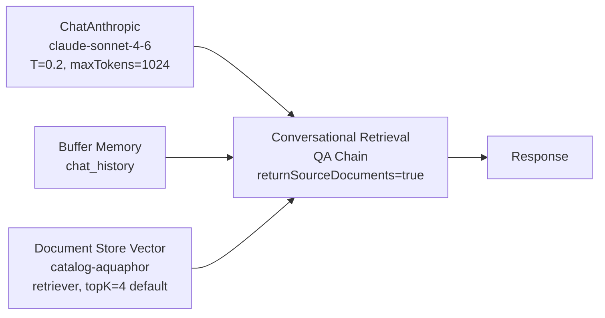

# Catalog Knowledge Base PoC — baseline 2026-05-19

**Цель:** до того как реализовывать Slice 2 (productCategory enum) и более тяжёлые слайсы smart-search Phase 1.5 backend — проверить **что AI уже умеет ответить** поверх существующих 155 товаров каталога Аквафор-Pro (Vision-augmented, embedded в `catalog-aquaphor` Document Store). Это даёт:

1. **Honest baseline** — на каких типах вопросов retrieval+LLM уже работает, на каких ломается.
2. **Карта пробелов** — какие пробелы в карточках товара (от менеджеров) ИЛИ в architecture (от backend) проявляются раньше всего.
3. **Quick wins** — что можно закрыть **только улучшением заполнения** (Slice 6 guide → менеджеры сами правят), не трогая код.

## Setup

**Chatflow:** `catalog-qa-poc-v1` (id `93c3e81b-501c-402e-9109-3747eaaf2ec0`), создан через `@slovo/flowise-flowdata` + `flowise_chatflow_create`.

**Retrieval:** `documentStoreVS` в режиме `output=retriever`, поверх существующего `catalog-aquaphor` DS (3 072-dim embeddings от OpenAI `text-embedding-3-large`, postgres pgvector, 682 chunks / 155 products, recordManager `catalog-aquaphor` namespace).

**Системный prompt:** заменён с дефолтного «I am a document» на роль AI-консультанта Аквафор-Pro с явными правилами:

- отвечать **только** на данных из контекста,
- честно признавать «в каталоге нет» когда retrieval не дал релевантных,
- называть точные модели (DWM-101S, Кристалл А и т.д.),
- не выдумывать ТТХ/цены/сроки замены,
- кратко (2-4 предложения), по-русски, дружелюбно.

**Rephrase prompt:** дефолтная LangChain заглушка с инструкцией сохранять детали воды/бюджета/помещения.

**Метод:** 7 reference Q&A покрывают типичные сценарии менеджера / клиента:

| # | Вопрос | Сценарий |
|---|--------|----------|
| Q1 | Какой фильтр посоветуешь для квартиры с жёсткой водой 12 мг-экв/л? | Жёсткая вода → out-of-range |
| Q2 | У меня скважина с железом 1.5 мг/л. Что предложишь? | Скважина + железо → специфика |
| Q3 | Чем DWM-101S отличается от Фаворита? | Сравнение моделей |
| Q4 | Как работает обратный осмос? | Education / технология |
| Q5 | DWM-101S — какие картриджи и когда менять? | Bundled services / сроки |
| Q6 | Подбери фильтр для квартиры с бюджетом до 15 000 ₽. | Бюджетный подбор |
| Q7 | Удаляет ли ваш фильтр бактерии? | Yes/no + объяснение |

Stateless mode (каждый Q отдельный sessionId через batch-runner `experiments/poc-catalog-qa/run-smoke.ts`).

**Метрики:**

- **Honesty** — признаёт ли AI пробел когда retrieval нерелевантен.
- **Relevance** — все ли 4 retrieval-источника связаны с вопросом.
- **Specificity** — называет ли AI **конкретную** модель vs общими формулировками.
- **Factuality** — нет ли выдуманных ТТХ/цен/сроков (ground truth — карточка из catalog-aquaphor).
- **Latency** — round-trip от prediction REST до response.

Полные результаты — `experiments/poc-catalog-qa/results.json` (gitignored).

## Aggregate

- **7/7 успешных prediction'ов**, 0 errors.
- **Latency:** 4.2-7.0 sec, median 6.0 sec. Sonnet 4.6 + rephrase + retrieval + final answer укладывается в один request к Flowise REST.
- **Все 7 ответов с возвратом sourceDocuments** (returnSourceDocuments=true в Chain). Это даёт UX-возможность показать «откуда AI взял этот ответ» — клиенту видны точные карточки.

## Per-Q&A анализ

### Q1: жёсткая вода 12 мг-экв/л ✅ honesty

AI цитирует Кристалл ECO H Pro и Кристалл А как «модели рассчитаны до 5 мг-экв/л» и говорит: для 12 ни один товар каталога не подходит. Предлагает уточнить параметры (возможна путаница единиц) или связаться со специалистом для специализированного решения. **Не выдумывает.**

Retrieval: 4 источника, все на тему фильтрации мягкой/средней воды (Кристалл H, K3-K2-K7B, ECO H Pro, Кристалл А для жёсткой). AI правильно увидел потолок 5 мг-экв/л в описаниях.

**Insight:** retrieval+honesty работают на out-of-range запросах. Нет «галлюцинации модели». Это базовое качество knowledge base — лучшее доказательство что система НЕ выдумывает.

### Q2: скважина железо 1.5 мг/л ✅✅ specificity

AI рекомендует **«Трио Fe H»** + предлагает Fe-картриджи 10"/20" как предфильтр + задаёт уточняющий вопрос («дом или питьё»). Это не просто список — это **диалог консультанта**.

Retrieval: 3/4 релевантные (Трио Fe H, Fe-картриджи 2 размера), 1/4 шум — «Смеситель кухонный С125» (затесался по «кухня / монтаж»). **AI его не упомянул**, хотя в источниках был — то есть Sonnet фильтрует мусор сам.

**Insight:** AI устойчив к шуму в retrieval. ~25% мусор в top-K не отравляет ответ если LLM достаточно сильный.

### Q3: DWM-101S vs Фаворит ✅✅ comparison

AI грамотно разводит две системы по технологии (RO vs проточный), use case (глубокая очистка vs высокий расход), и заканчивает выбор-вопросом «уточните задачу — помогу выбрать точнее».

Retrieval: 4/4 релевантные (Фаворит, модуль В150, DWM-102S Pro, DWM-101S). AI взял из этих карточек именно сравнительные характеристики.

**Insight:** semantic search хорошо работает на запросах «X vs Y» — embedding-модель находит обе модели одновременно. Это критичный сценарий для smart-search в проде (клиенты часто сравнивают перед покупкой).

### Q4: как работает обратный осмос ✅ education

AI даёт техническое объяснение (мембрана, ультратонкая очистка, бактерии/вирусы, дренаж). Упоминает Аквафор-специфичные серии DWM и Osmo Pro как примеры. Заканчивает уточняющим вопросом про задачу.

Retrieval: 4/4 RO-устройства (DWM-101S, OSMO Pro, DWM-202S, мембрана КО-150).

**Insight:** «education mode» — отдельная ценность knowledge base. Менеджер может направить клиента к AI для пояснения технологий, а сам сосредоточиться на закрытии сделки. Это **новый UX-сценарий** который мы не закладывали в первичной концепции smart-search.

### Q5: DWM-101S — картриджи и сроки замены ❌ critical gap

AI говорит: «информация о фильтре DWM-101S и его картриджах в доступном контексте отсутствует». Тонкая деталь — **правильно** говорит что мембрана КО-100S НЕ подходит для DWM-101S (хотя она для DWM-31/102S/201/202S). Но конкретные картриджи для DWM-101S и срок их замены **не возвращает**.

Retrieval: 4 источника, ни один не содержит System Bundle DWM-101S → картриджи: Pro1-Pro2-Pro100-Pro BMg, K3-K2-K7B (модули для других DWM), корпус Гросс Миди, мембрана КО-100S.

**Корневая причина (2 параллельных пробела):**

1. **DWM-101S карточка в Document Store не содержит ссылок на свои картриджи через System Bundle.** В МС System Bundle привязан к **папке** товара (через `fetchGroupContext`), а у DWM-101S либо не привязан, либо не попал в loader.
2. **Отсутствует атрибут «Средний срок службы расходника, месяцев»** на картриджах — Slice 6 guide уже это заложил.

**Insight:**
- **Quick win** — заполнить атрибут «Средний срок службы расходника» на 17 картриджах (см. ERP product card guidelines v1.6). Возможно AI начнёт отвечать на «когда менять».
- **Backend gap** — System Bundle для DWM-101S → проверить feeder (CRM `fetchGroupContext`) на конкретный товар. Если bundle есть — почему не в embedding text. Если нет — это инвентаризационная задача менеджеру.
- Это **самый частый сценарий** клиента после покупки фильтра — «что и когда менять» — и AI его сейчас не закрывает. Бизнес-приоритет высокий.

### Q6: бюджет до 15 000 ₽ ⚠️ critical metadata gap

AI: «Из каталога Кристалл А (под мойку) или В150 Фаворит. ⚠️ Уточню: цены в каталоге не указаны, поэтому подтвердить укладываются ли в бюджет не могу — рекомендую уточнить у менеджера». Задаёт уточняющий вопрос по воде.

Retrieval: 4 источника, все Кристалл/Фаворит/Фаворит ЭКО, salePriceKopecks **присутствует** в metadata всех (5690, 10990, 12490 руб).

**Корневая причина:** цена `salePriceKopecks` хранится **только в metadata** chunk'а (для пост-обработки), но **не попадает в pageContent** embedding. ConversationalRetrievalQAChain отдаёт LLM только `pageContent` контекст — metadata вне reach. Поэтому AI **честно** говорит «цен нет», хотя они есть.

**Insight:**
- **Это самый сильный INSIGHT всего PoC** — фильтрация/подбор по бюджету **не работает текущей архитектурой**. Цены есть, но LLM их не видит.
- **Решения (2 варианта, не взаимоисключающие):**
  - **(a) Backend** — расширить ConversationalRetrievalQAChain так чтобы при formatting context передавать выбранные metadata fields (price, dimensions) в pageContent. Можно через кастомный `responsePrompt` с placeholders, или через retriever wrapper.
  - **(b) Embedding** — добавить «Цена: 5690 ₽» в `build-content-for-embedding` на этапе ingestion (CRM feeder). Это значит price попадает не только в context для LLM, но **и в семантический поиск** — запрос «фильтр до 15000» будет лучше находить bucket дешёвых товаров (потому что embedding модели чувствительны к числовым диапазонам через тренировку).
- Обе требуют backend-работы. Это **новая slice в Phase 1.5+** — не входила в текущий план.

### Q7: бактерии? ✅✅ direct + specific

AI: «Да! Модуль **Pro B** оснащён ультрафильтрационной мембраной, поры которой в 5 раз меньше любого микроорганизма — механически удаляет бактерии и цисты». Указывает что Pro B подходит для серий Eco Pro и Кристалл.

Retrieval: 4/4 источника, основной — Pro B картридж + Фаворит (тоже бактерии) + Кристалл H + предфильтр-намоточный.

**Insight:** прямые yes/no вопросы про функциональность работают идеально. Это **второй по бизнес-приоритету сценарий после Q3 comparison** — клиент перед покупкой задаёт «делает ли это конкретное».

## Aggregated findings

### Что **уже работает** (ничего не делать)

1. **Honest fallback** на out-of-range (Q1) — AI не выдумывает.
2. **Сравнение моделей** (Q3) — semantic search находит обе одновременно.
3. **Education mode** (Q4) — клиент учится через AI, освобождая менеджера.
4. **Yes/no + объяснение** (Q7) — закрытие сделки.
5. **Устойчивость к шуму в retrieval** (Q2) — Sonnet 4.6 фильтрует мусор.
6. **Конкретные модели в ответах** (Q2, Q3, Q7) — называет точные SKU.

### Quick wins через **Slice 6 ERP product card guidelines** (без кода)

| Проблема Q&A | Атрибут который закроет (из guide v1.6) | Эффект |
|---|---|---|
| Q1 «до какой жёсткости» | `softening_capacity_meq` (proposed ➕) | LLM получит количественный лимит и сможет отказать раньше |
| Q5 «когда менять картриджи» | `Средний срок службы расходника, месяцев` (proposed ➕) | AI сможет дать «12 месяцев» вместо «информация отсутствует» |
| Q6 «бюджет 15000» (частично) | `price_segment` enum (proposed ➕) — economy / mid / premium | Semantic search будет лучше группировать по сегменту |

Эти атрибуты **уже описаны** в `docs/management/erp-product-card-guidelines.md` v1.6 — менеджеры могут начать заполнять **сейчас**, без ожидания кода. Все эти атрибуты **автоматически попадают в embedding** через существующий `build-content-for-embedding.ts` (4 SKIP_ATTRIBUTE_NAMES не включают эти).

### Backend gaps требующие code (новые slices)

| Проблема Q&A | Slice который нужен | Приоритет |
|---|---|---|
| Q5 «картриджи DWM-101S не в retrieval» | Slice 5 (bundled services) — переиспользовать `fetchGroupContext` для product-level System Bundle | high |
| Q6 «цена в metadata не видна LLM» | **NEW Slice 7** — price/dimensions в pageContent (через embedding text или через context formatter) | high |
| Q2 «смеситель в top-K» (минорный) | Slice 2 (productCategory enum) — отрезать смеситель по категории при поиске по «вода» | medium |
| Все 7 | Slice 3 (category re-ranking) — буст релевантной категории в скоринге | medium |

### Pre-existing план Phase 1.5 — корректировки

Из `docs/features/smart-search-phase-1-5-backend.md`:

- **Slice 2 (productCategory enum)** — подтверждён PoC. Q2 показал что category leakage есть («смеситель» в top-K на «скважина железо»). Не критично сейчас, но улучшит ranking.
- **Slice 5 (bundled services)** — **повышение приоритета до high**. Q5 показал что без System Bundle в retrieval — наш самый частый клиентский сценарий («что менять») не закрывается.
- **NEW Slice 7 (price-aware retrieval)** — **добавить в roadmap**. Без него бюджетный подбор не работает.
- **Slice 6 ERP guide** — **fast track для менеджеров**. Все 3 атрибута выше уже описаны в v1.6, можно начать заполнение **сегодня** в МС, эффект на embedding автоматический.

## Cost

7 prediction'ов × ~700 input tokens (system+rephrase+context+question) + ~250 output tokens ≈ Sonnet 4.6 (input $3/1M + output $15/1M):

- Input: 7 × 700 ≈ 4 900 tokens ≈ $0.015
- Output: 7 × 250 ≈ 1 750 tokens ≈ $0.026
- **Total: ≈ $0.04 ≈ 3.2 ₽** на весь PoC. Дополнительно OpenAI embeddings для 7 query (text-embedding-3-large $0.13/1M tokens × ~30 tokens/q = pennies).

PoC в денежном выражении — **бесплатный**.

## Открытые вопросы

1. **System Bundle DWM-101S** — есть ли он в МС вообще, или это unfilled карточка? → нужна проверка в МС UI или через `fetchGroupContext('DWM-101S')` в CRM API. Если есть — почему не в embedding loader. Если нет — это задача менеджеру.
2. **Price in pageContent — embedding side effect** — добавление «Цена: 5690 ₽» в embedding text может улучшить bucket-поиск, но может и зашумить (числовые значения часто весят неправильно). Нужен A/B на 10-20 reference queries после re-ingest. Откладываем до Slice 2 завершения.
3. **Conversational follow-up** — мы не тестировали. AI задавал уточняющие вопросы в Q2/Q4/Q6 — если клиент ответит, retrieval второго хода может вернуть другие источники. Это критично для Phase 2 voice/multi-turn. Откладываем до Phase 2.
4. **Тon ответов** — AI ставит эмодзи 😊 в Q2/Q3/Q4/Q7. Это дружелюбно, но может быть слишком неформально для B2B (бурильщики). Параметризовать тоном в RESPONSE_PROMPT под аудиторию. Минор.

## Решение

**Перед Slice 2 — закрыть Slice 6 first** (ERP guide → менеджеры начинают заполнять атрибуты `softening_capacity_meq`, `cartridge_lifetime_months`, `price_segment`). Re-ingest catalog после первой партии заполнений (~20-30 товаров) — посмотреть улучшения Q1/Q5/Q6.

**Параллельно** — мы получили **новый Slice 7** (price-aware retrieval) которого не было в роадмапе. Добавить в `smart-search-phase-1-5-backend.md` после Slice 6. Реализация: расширить `build-content-for-embedding.ts` чтобы price из `salePriceKopecks` попадала в текст embedding как «Цена: X₽» (одна строка). Этого достаточно как первого шага.

**Slice 2 (productCategory enum)** оставляем в плане — он улучшит Q2-style случаи и закроет смеситель leakage. Но не блокирует все остальные insights.

---

## Артефакты

- `experiments/poc-catalog-qa/build-flowdata.ts` — генерация flowData с post-processing для UI-render корректности (см. memory `feedback_flowise_flowdata_ui_render_requires_filePath`).
- `experiments/poc-catalog-qa/create-chatflow.ts` / `update-chatflow.ts` — POST/PUT в Flowise REST.
- `experiments/poc-catalog-qa/run-smoke.ts` — batch-runner 7 Q&A.
- `experiments/poc-catalog-qa/results.json` — полный output 7 запросов (gitignored).
- `experiments/poc-catalog-qa/flowdata.json` — final flowData (gitignored).
- Flowise chatflow: `catalog-qa-poc-v1` (id `93c3e81b-501c-402e-9109-3747eaaf2ec0`) — оставляем в инстансе для будущих smoke'ов.
