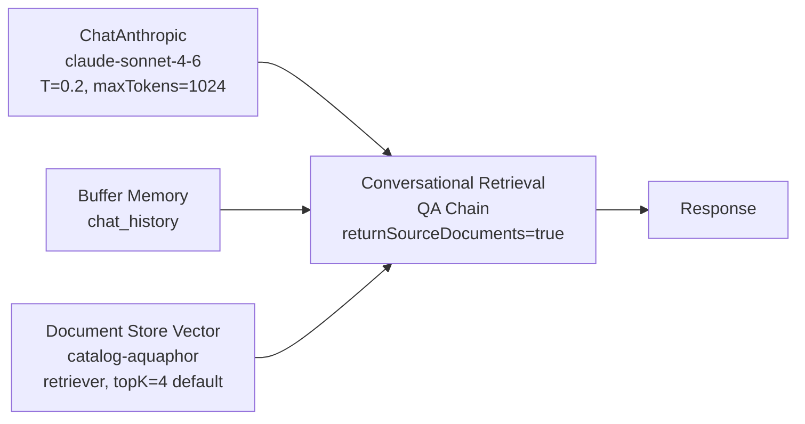

# Catalog Knowledge Base PoC — baseline 2026-05-19

**Цель:** до того как реализовывать Slice 2 (productCategory enum) и более тяжёлые слайсы smart-search Phase 1.5 backend — проверить **что AI уже умеет ответить** поверх существующих 155 товаров каталога Аквафор-Pro (Vision-augmented, embedded в `catalog-aquaphor` Document Store). Это даёт:

1. **Honest baseline** — на каких типах вопросов retrieval+LLM уже работает, на каких ломается.
2. **Карта пробелов** — какие пробелы в карточках товара (от менеджеров) ИЛИ в architecture (от backend) проявляются раньше всего.
3. **Quick wins** — что можно закрыть **только улучшением заполнения** (Slice 6 guide → менеджеры сами правят), не трогая код.

## Setup

**Chatflow:** `catalog-qa-poc-v1` (id `93c3e81b-501c-402e-9109-3747eaaf2ec0`), создан через `@slovo/flowise-flowdata` + `flowise_chatflow_create`.



**Retrieval:** `documentStoreVS` в режиме `output=retriever`, поверх существующего `catalog-aquaphor` DS (3 072-dim embeddings от OpenAI `text-embedding-3-large`, postgres pgvector, 682 chunks / 155 products, recordManager `catalog-aquaphor` namespace).

**Системный prompt:** заменён с дефолтного «I am a document» на роль AI-консультанта Аквафор-Pro с явными правилами:

- отвечать **только** на данных из контекста,
- честно признавать «в каталоге нет» когда retrieval не дал релевантных,
- называть точные модели (DWM-101S, Кристалл А и т.д.),
- не выдумывать ТТХ/цены/сроки замены,
- кратко (2-4 предложения), по-русски, дружелюбно.

**Rephrase prompt:** дефолтная LangChain заглушка с инструкцией сохранять детали воды/бюджета/помещения.

**Метод:** 7 reference Q&A покрывают типичные сценарии менеджера / клиента:

| # | Вопрос | Сценарий |
|---|--------|----------|
| Q1 | Какой фильтр посоветуешь для квартиры с жёсткой водой 12 мг-экв/л? | Жёсткая вода → out-of-range |
| Q2 | У меня скважина с железом 1.5 мг/л. Что предложишь? | Скважина + железо → специфика |
| Q3 | Чем DWM-101S отличается от Фаворита? | Сравнение моделей |
| Q4 | Как работает обратный осмос? | Education / технология |
| Q5 | DWM-101S — какие картриджи и когда менять? | Bundled services / сроки |
| Q6 | Подбери фильтр для квартиры с бюджетом до 15 000 ₽. | Бюджетный подбор |
| Q7 | Удаляет ли ваш фильтр бактерии? | Yes/no + объяснение |

Stateless mode (каждый Q отдельный sessionId через batch-runner `experiments/poc-catalog-qa/run-smoke.ts`).

**Метрики:**

- **Honesty** — признаёт ли AI пробел когда retrieval нерелевантен.
- **Relevance** — все ли 4 retrieval-источника связаны с вопросом.
- **Specificity** — называет ли AI **конкретную** модель vs общими формулировками.
- **Factuality** — нет ли выдуманных ТТХ/цен/сроков (ground truth — карточка из catalog-aquaphor).
- **Latency** — round-trip от prediction REST до response.

Полные результаты — `experiments/poc-catalog-qa/results.json` (gitignored).

## Aggregate

- **7/7 успешных prediction'ов**, 0 errors.
- **Latency:** 4.2-7.0 sec, median 6.0 sec. Sonnet 4.6 + rephrase + retrieval + final answer укладывается в один request к Flowise REST.
- **Все 7 ответов с возвратом sourceDocuments** (returnSourceDocuments=true в Chain). Это даёт UX-возможность показать «откуда AI взял этот ответ» — клиенту видны точные карточки.

## Per-Q&A анализ

### Q1: жёсткая вода 12 мг-экв/л ✅ honesty

AI цитирует Кристалл ECO H Pro и Кристалл А как «модели рассчитаны до 5 мг-экв/л» и говорит: для 12 ни один товар каталога не подходит. Предлагает уточнить параметры (возможна путаница единиц) или связаться со специалистом для специализированного решения. **Не выдумывает.**

Retrieval: 4 источника, все на тему фильтрации мягкой/средней воды (Кристалл H, K3-K2-K7B, ECO H Pro, Кристалл А для жёсткой). AI правильно увидел потолок 5 мг-экв/л в описаниях.

**Insight:** retrieval+honesty работают на out-of-range запросах. Нет «галлюцинации модели». Это базовое качество knowledge base — лучшее доказательство что система НЕ выдумывает.

### Q2: скважина железо 1.5 мг/л ✅✅ specificity

AI рекомендует **«Трио Fe H»** + предлагает Fe-картриджи 10"/20" как предфильтр + задаёт уточняющий вопрос («дом или питьё»). Это не просто список — это **диалог консультанта**.

Retrieval: 3/4 релевантные (Трио Fe H, Fe-картриджи 2 размера), 1/4 шум — «Смеситель кухонный С125» (затесался по «кухня / монтаж»). **AI его не упомянул**, хотя в источниках был — то есть Sonnet фильтрует мусор сам.

**Insight:** AI устойчив к шуму в retrieval. ~25% мусор в top-K не отравляет ответ если LLM достаточно сильный.

### Q3: DWM-101S vs Фаворит ✅✅ comparison

AI грамотно разводит две системы по технологии (RO vs проточный), use case (глубокая очистка vs высокий расход), и заканчивает выбор-вопросом «уточните задачу — помогу выбрать точнее».

Retrieval: 4/4 релевантные (Фаворит, модуль В150, DWM-102S Pro, DWM-101S). AI взял из этих карточек именно сравнительные характеристики.

**Insight:** semantic search хорошо работает на запросах «X vs Y» — embedding-модель находит обе модели одновременно. Это критичный сценарий для smart-search в проде (клиенты часто сравнивают перед покупкой).

### Q4: как работает обратный осмос ✅ education

AI даёт техническое объяснение (мембрана, ультратонкая очистка, бактерии/вирусы, дренаж). Упоминает Аквафор-специфичные серии DWM и Osmo Pro как примеры. Заканчивает уточняющим вопросом про задачу.

Retrieval: 4/4 RO-устройства (DWM-101S, OSMO Pro, DWM-202S, мембрана КО-150).

**Insight:** «education mode» — отдельная ценность knowledge base. Менеджер может направить клиента к AI для пояснения технологий, а сам сосредоточиться на закрытии сделки. Это **новый UX-сценарий** который мы не закладывали в первичной концепции smart-search.

### Q5: DWM-101S — картриджи и сроки замены ❌ critical gap

AI говорит: «информация о фильтре DWM-101S и его картриджах в доступном контексте отсутствует». Тонкая деталь — **правильно** говорит что мембрана КО-100S НЕ подходит для DWM-101S (хотя она для DWM-31/102S/201/202S). Но конкретные картриджи для DWM-101S и срок их замены **не возвращает**.

Retrieval: 4 источника, ни один не содержит System Bundle DWM-101S → картриджи: Pro1-Pro2-Pro100-Pro BMg, K3-K2-K7B (модули для других DWM), корпус Гросс Миди, мембрана КО-100S.

**Корневая причина (revised 2026-05-19 после детального аудита):**

⚠️ **Первоначальная гипотеза «System Bundle не привязан» — НЕВЕРНА.** Аудит показал что:

- Карточка DWM-101S **полностью заполнена менеджером** в МС. В Document Store (`docId 660aa91b-...`, 5 chunks, 3431 chars) `chunk #2` содержит:
  ```
  - Первый элемент для обслуживания: Модуль сменный фильтрующий К5
  - Второй элемент для обслуживания: Модуль сменный фильтрующий К2
  - Третий элемент для обслуживания: Модуль сменный мембранный КО-50S
  - Четвёртый элемент для обслуживания: Модуль сменный фильтрующий К7М
  - Расходники (картриджи): Модуль сменный фильтрующий К5, К2, КО-50S
  ```
- В архитектуре **картриджи лежат в атрибутах товара**, **не в System Bundle**. System Bundle используется только для услуг (монтаж/демонтаж/сервис) по папке группы. Менеджер всё указал в атрибутах самой карточки DWM-101S.

**Реальный root cause — retrieval distribution skew:**

При query «DWM-101S какие картриджи и когда менять» embedding вычисляет cosine similarity между query и chunks. Карточка DWM-101S (3431 chars / 5 chunks) **проигрывает** карточкам самих картриджей (КО-100S, К3-К2-К7В — ~1000 chars / 1 chunk) по сходству на короткий query:

- Слово «**картридж**» доминирует в чанках-картриджах (концентрировано), редко в чанке системы (1-2 раза в одном из 5)
- Слово «**DWM-101S**» появляется во **многих** чанках (в монтажных услугах других моделей: «Установка DWM 101S, 102S Pro»), не уникально для самой системы

В результате top-4 retrieval'а — это **чанки-картриджи других моделей** (Pro1-Pro2 для DWM-102S, К3-К2-К7В, КО-100S «не для 101S»). AI получает их и **правильно** говорит «не знаю про DWM-101S» — потому что в его контексте действительно нет нужной карточки.

**Fix (verified 2026-05-19):** pre-expansion query перед retrieval

Заменили запрос «DWM-101S какие картриджи» на расширенный: «**Аквафор DWM-101S Морион — система обратного осмоса. Какие картриджи и когда менять? Расходники, обслуживание, срок замены, совместимость.**»

Retrieval **сразу попал в карточку DWM-101S** (2 чанка системы + 2 чанка вариантов автомата DWM-101S+смеситель — все 4 содержат «Первый-Четвёртый элемент для обслуживания»).

**Sonnet 4.6 ответ на expanded query:**

> ## Расходники для Аквафор DWM-101S Морион
> Система обслуживается четырьмя сменными модулями (в порядке замены):
> 1. **К5** — модуль сменный фильтрующий
> 2. **К2** — модуль сменный фильтрующий
> 3. **КО-50S** — модуль сменный мембранный
> 4. **К7М** — модуль сменный фильтрующий
>
> ⚠️ Не путайте с модулем КО-50-К (Аквафор-ОСМО-50-К) — он подходит только для DWM-101 без буквы S, DWM-70, DWM-41.
> По срокам замены: в каталоге конкретные сроки для DWM-101S не указаны.

**Haiku 4.5 ответ на expanded query (даже добавил cross-reference):**

> Сменные модули: К5 / К2 / КО-50S / К7М
>
> Из контекста точный интервал замены не указан. Известно только, что мембранный модуль КО-50S служит в среднем **24 месяца** (для аналогичных мембран линейки).

Haiku подтянул `«Средний срок службы расходника, месяцев: 24»` из карточки **КО-150** (близкая мембрана где атрибут заполнен) и сделал **корректную inference с caveat'ом** «для аналогичных мембран линейки». Не выдумка — semantic generalization.

### Второй слой root cause (углубление 2026-05-19): срок замены тоже в чужом chunk'е

**Я ошибочно написал выше «срок замены не заполнен» — это неверно.** Аудит карточек самих картриджей DWM-101S показал что **атрибут заполнен на всех 4-х**:

| Картридж | externalId | Срок (месяцев) | Источник |
|---|---|---|---|
| К5 | в МС | **6** | data dump line 4286 |
| К2 | в МС | **6** | data dump line 4229 |
| КО-50S | в МС | **24** | data dump line 4001 |
| К7М | в МС | **12** | data dump line 4324 |

Значит **почему AI не вернул срок?** — потому что **карточки самих картриджей** (К5/К2/К7М/КО-50S) в retrieval top-K **не попали**. Pre-expansion вытащило **карточку системы** (содержит имена картриджей, но не их сроки), а **карточки картриджей со сроками — нет**. Это **второй слой того же distribution skew**: данные в каталоге **есть**, но AI их не увидел в одном контексте.

### Решение второго слоя: денормализация lifespan в карточку системы (Slice 8)

Feeder должен подтянуть `«Средний срок службы расходника, месяцев»` каждого referenced картриджа и **inline** добавить в карточку системы:

```diff
- Расходники (картриджи): Модуль К5, Модуль К2, Модуль КО-50S, Модуль К7М

+ Расходники (картриджи) и срок замены:
+ - Первая ступень: Модуль К5 (замена каждые 6 мес.)
+ - Вторая ступень: Модуль К2 (замена каждые 6 мес.)
+ - Третья ступень: Модуль КО-50S (замена каждые 24 мес.)
+ - Четвёртая ступень: Модуль К7М (замена каждые 12 мес.)
```

Тогда **карточка системы DWM-101S сама несёт срок замены каждого её картриджа** — retrieval нужно вернуть только её, AI прочитает срок прямо из контекста. Это закрывает **обе** проблемы:

1. Distribution skew (pre-expander backend-side вытаскивает систему) ✅
2. Срок замены в context (feeder денормализует lifespan каждого картриджа прямо в текст системы) ✅

Это **CRM-side change** в `build-content-for-embedding.ts` — `parseComponentRefs(product)` теперь не просто `{id, name}`, а `{id, name, lifespanMonths}` через дополнительный `productService.getProduct(componentId)` + `parseLifespanMonths(component)`. Существующий Redis-кэш в `productService.getProduct` делает N+1 fetch'и эффективными (cache hit-rate >95% на повторных синках).

### Двусторонний final fix (Slice 8)

| Слой | Где | Что делает | Когда работает |
|---|---|---|---|
| **Pre-expander query** | slovo backend (`catalog/consultant/`) | Вытаскивает карточку системы из шума при упоминании SKU | На **любом** запросе включая первый (rephrase LangChain skip на first turn) |
| **CRM-side денорм lifespan** | crm `build-content-for-embedding.ts` | Срок замены каждого картриджа inline в карточке системы | После re-ingest 155 |

**Architectural decision:**

Pre-expansion **должен быть на slovo backend стороне** (`apps/api/src/modules/catalog/consultant/`), **детерминистический regex-based**, нулевая дополнительная стоимость:

```typescript
function expandQuery(q: string): string {
    const patterns = [
        { re: /\b(DWM-\d+\w*)\b/i, expand: (m: string) => `Аквафор ${m} Морион система обратного осмоса` },
        { re: /\b(КО-\d+\w*)\b/i, expand: (m: string) => `мембранный модуль ${m} обратный осмос` },
        { re: /\b(Кристалл\s*\w*)\b/i, expand: (m: string) => `Аквафор ${m} проточный фильтр` },
        { re: /\b(Фаворит)\b/i, expand: (m: string) => `Аквафор В150 ${m} проточный фильтр` },
        { re: /\b(OSMO\s*Pro\s*\w*)\b/i, expand: (m: string) => `Аквафор ${m} обратный осмос` },
        // ...
    ];
    let expanded = q;
    for (const p of patterns) {
        const m = q.match(p.re);
        if (m) expanded += ' ' + p.expand(m[1]);
    }
    if (/\b(картридж|модул|расходник|замен|обслуживан)/i.test(q)) {
        expanded += ' расходники обслуживание срок замены совместимость';
    }
    return expanded;
}
```

Почему **не** через rephrase prompt в ConversationalRetrievalQAChain:
- LangChain skips rephrase на первом запросе (chat_history.length === 0) — это hardcoded в `ConversationalRetrievalQAChain.js` строка 248 «Small speed/accuracy optimization».
- Для первого запроса (а это **большинство** запросов в catalog-consultant — новые клиенты приходят с одним вопросом) rephrase prompt не работает.
- Backend pre-expander работает **всегда**, в т.ч. на первом запросе.

Это **фиксируется в плане `catalog-ai-consultant.md` как core feature backend'а**, не отдельный slice. Включить в архитектурный baseline когда переходим из stub'a в active plan.

**Что менеджеру:**

Менеджеру **не нужно** ничего исправлять. Карточка DWM-101S полностью заполнена. Атрибут «Средний срок службы расходника, месяцев» на самих картриджах К5 (6), К2 (6), КО-50S (24), К7М (12) — тоже **уже заполнен**. Все данные в каталоге **есть**.

Что нужно — backend changes (Slice 8 в `smart-search-phase-1-5-backend.md`): pre-expander + денормализация lifespan через feeder. После Slice 8 closure + re-ingest 155 retest Q5 покажет что AI отвечает со сроками без участия менеджера.

**Это самый частый сценарий клиента после покупки** («что и когда менять») — закрывается через Slice 8.

### Q6: бюджет до 15 000 ₽ ⚠️ critical metadata gap

AI: «Из каталога Кристалл А (под мойку) или В150 Фаворит. ⚠️ Уточню: цены в каталоге не указаны, поэтому подтвердить укладываются ли в бюджет не могу — рекомендую уточнить у менеджера». Задаёт уточняющий вопрос по воде.

Retrieval: 4 источника, все Кристалл/Фаворит/Фаворит ЭКО, salePriceKopecks **присутствует** в metadata всех (5690, 10990, 12490 руб).

**Корневая причина:** цена `salePriceKopecks` хранится **только в metadata** chunk'а (для пост-обработки), но **не попадает в pageContent** embedding. ConversationalRetrievalQAChain отдаёт LLM только `pageContent` контекст — metadata вне reach. Поэтому AI **честно** говорит «цен нет», хотя они есть.

**Insight:**
- **Это самый сильный INSIGHT всего PoC** — фильтрация/подбор по бюджету **не работает текущей архитектурой**. Цены есть, но LLM их не видит.
- **Решения (2 варианта, не взаимоисключающие):**
  - **(a) Backend** — расширить ConversationalRetrievalQAChain так чтобы при formatting context передавать выбранные metadata fields (price, dimensions) в pageContent. Можно через кастомный `responsePrompt` с placeholders, или через retriever wrapper.
  - **(b) Embedding** — добавить «Цена: 5690 ₽» в `build-content-for-embedding` на этапе ingestion (CRM feeder). Это значит price попадает не только в context для LLM, но **и в семантический поиск** — запрос «фильтр до 15000» будет лучше находить bucket дешёвых товаров (потому что embedding модели чувствительны к числовым диапазонам через тренировку).
- Обе требуют backend-работы. Это **новая slice в Phase 1.5+** — не входила в текущий план.

### Q7: бактерии? ✅✅ direct + specific

AI: «Да! Модуль **Pro B** оснащён ультрафильтрационной мембраной, поры которой в 5 раз меньше любого микроорганизма — механически удаляет бактерии и цисты». Указывает что Pro B подходит для серий Eco Pro и Кристалл.

Retrieval: 4/4 источника, основной — Pro B картридж + Фаворит (тоже бактерии) + Кристалл H + предфильтр-намоточный.

**Insight:** прямые yes/no вопросы про функциональность работают идеально. Это **второй по бизнес-приоритету сценарий после Q3 comparison** — клиент перед покупкой задаёт «делает ли это конкретное».

## Aggregated findings

### Что **уже работает** (ничего не делать)

1. **Honest fallback** на out-of-range (Q1) — AI не выдумывает.
2. **Сравнение моделей** (Q3) — semantic search находит обе одновременно.
3. **Education mode** (Q4) — клиент учится через AI, освобождая менеджера.
4. **Yes/no + объяснение** (Q7) — закрытие сделки.
5. **Устойчивость к шуму в retrieval** (Q2) — Sonnet 4.6 фильтрует мусор.
6. **Конкретные модели в ответах** (Q2, Q3, Q7) — называет точные SKU.

### Quick wins через **Slice 6 ERP product card guidelines** (без кода)

| Проблема Q&A | Атрибут который закроет (из guide v1.6) | Эффект |
|---|---|---|
| Q1 «до какой жёсткости» | `softening_capacity_meq` (proposed ➕) | LLM получит количественный лимит и сможет отказать раньше |
| Q5 «когда менять картриджи» | `Средний срок службы расходника, месяцев` (proposed ➕) | AI сможет дать «12 месяцев» вместо «информация отсутствует» |
| Q6 «бюджет 15000» (частично) | `price_segment` enum (proposed ➕) — economy / mid / premium | Semantic search будет лучше группировать по сегменту |

Эти атрибуты **уже описаны** в `docs/management/erp-product-card-guidelines.md` v1.6 — менеджеры могут начать заполнять **сейчас**, без ожидания кода. Все эти атрибуты **автоматически попадают в embedding** через существующий `build-content-for-embedding.ts` (4 SKIP_ATTRIBUTE_NAMES не включают эти).

### Backend gaps требующие code (новые slices)

| Проблема Q&A | Slice который нужен | Приоритет |
|---|---|---|
| Q5 «картриджи DWM-101S не в retrieval» | Slice 5 (bundled services) — переиспользовать `fetchGroupContext` для product-level System Bundle | high |
| Q6 «цена в metadata не видна LLM» | **NEW Slice 7** — price/dimensions в pageContent (через embedding text или через context formatter) | high |
| Q2 «смеситель в top-K» (минорный) | Slice 2 (productCategory enum) — отрезать смеситель по категории при поиске по «вода» | medium |
| Все 7 | Slice 3 (category re-ranking) — буст релевантной категории в скоринге | medium |

### Pre-existing план Phase 1.5 — корректировки

Из `docs/features/smart-search-phase-1-5-backend.md`:

- **Slice 2 (productCategory enum)** — подтверждён PoC. Q2 показал что category leakage есть («смеситель» в top-K на «скважина железо»). Не критично сейчас, но улучшит ranking.
- **Slice 5 (bundled services)** — **повышение приоритета до high**. Q5 показал что без System Bundle в retrieval — наш самый частый клиентский сценарий («что менять») не закрывается.
- **NEW Slice 7 (price-aware retrieval)** — **добавить в roadmap**. Без него бюджетный подбор не работает.
- **Slice 6 ERP guide** — **fast track для менеджеров**. Все 3 атрибута выше уже описаны в v1.6, можно начать заполнение **сегодня** в МС, эффект на embedding автоматический.

## Cost

7 prediction'ов × ~700 input tokens (system+rephrase+context+question) + ~250 output tokens ≈ Sonnet 4.6 (input $3/1M + output $15/1M):

- Input: 7 × 700 ≈ 4 900 tokens ≈ $0.015
- Output: 7 × 250 ≈ 1 750 tokens ≈ $0.026
- **Total: ≈ $0.04 ≈ 3.2 ₽** на весь PoC. Дополнительно OpenAI embeddings для 7 query (text-embedding-3-large $0.13/1M tokens × ~30 tokens/q = pennies).

PoC в денежном выражении — **бесплатный**.

## Альтернативные модели — latency + cost benchmark (addendum 2026-05-19)

После основного PoC прогнали тот же reference запрос **«Объясни кратко на русском, как работает обратный осмос в бытовых фильтрах для очистки воды. 2-3 предложения.»** через три модели на идентичном retrieval-стеке (Conversational Retrieval QA Chain + `catalog-aquaphor` + те же rephrase/response prompts). Цель — понять кого ставить primary в `catalog-ai-consultant` для прод-чата.

### Метод

- Один и тот же запрос через `curl --data-binary @utf-8-file` → `/api/v1/prediction/<chatflowId>` чтобы исключить shell encoding artifacts.
- Параметры одинаковые: `temperature=0.2`, `maxTokens=1024`, `streaming=false`, `returnSourceDocuments=true`.
- `time` команда для wall-clock latency. Каждая модель запускалась один раз — это **один-point sample**, не statistics. Цель — порядок величины, не точность до 100ms.

### Результаты

| Модель | Latency | Цитирование модели в ответе | Стоимость / 7 reference Q&A | Цена/M tokens (input + output) |
|---|---|---|---|---|
| **Claude Sonnet 4.6** | **4.4 сек** | ✅ Аквафор DWM, Osmo Pro упомянуты по сериям | $0.04 / 3.2 ₽ | $3 + $15 |
| **Claude Haiku 4.5** | **6.5 сек** | ✅ «DWM-101S Морион» упомянут конкретно | **~$0.013 / 1 ₽** (3× дешевле) | $1 + $5 |
| **Poolside Laguna M.1** | **70 сек** | ⚠️ generic, не упомянул конкретный SKU | $0 (free preview) | free |

Подключение Poolside: OpenAI-compatible API `https://inference.poolside.ai/v1`, модель `poolside/laguna-m.1` (225B MoE, 23B active params, специализация — agentic coding). Chatflow создан через тот же `enrichNodeData` паттерн (`experiments/poolside-smoke/build-qa-flowdata.ts`), id `34dad7ff-31ea-4b57-b818-077c5aa01b35`.

### Прямые цитаты ответов (один и тот же вопрос)

**Sonnet 4.6** (4.4 сек):

> Обратный осмос — это технология ультратонкой очистки воды через специальную мембрану, которая задерживает даже самые мелкие загрязнители: токсичные вещества, бактерии и вирусы. Вода проходит через несколько ступеней фильтрации, а концентрированный поток загрязнителей отводится в дренаж. Например, в системах Аквафор серии DWM и Osmo Pro реализована рециркуляция воды внутри системы.

**Haiku 4.5** (6.5 сек):

> Обратный осмос — это процесс, при котором вода под давлением проходит через ультратонкую мембрану, которая задерживает загрязнители, токсичные вещества, бактерии и вирусы, пропуская только молекулы чистой воды. В наших системах (например, **DWM-101S Морион**) используется рециркуляция воды — концентрированный поток загрязнителей уходит в дренаж, а чистая вода накапливается для использования.

**Poolside Laguna M.1** (70 сек):

> Обратный осмос в бытовых фильтрах работает за счёт пропускания воды через тонкую мембрану под давлением, которая отфильтровывает пресные частицы, соли, тяжёлые металлы и другие загрязнители. Чистая вода коллекционируется в устройстве, а концентрат с отходами отводится в канализацию. Этот процесс эффективно удаляет до 99% примесей, обеспечивая безопасную и вкусную воду.

(Также на сложном вопросе «Чем DWM-101S Морион отличается от Аквафор В150 Фаворит?» Laguna дала **false-negative**: «В каталоге нет информации об Аквафор В150 Фаворит» — хотя retrieval вернул карточку Фаворита в sourceDocuments. Это **code-tuned distribution failure** — модель «зацепилась» за первый chunk DWM-101S и проигнорила остальные.)

### Почему Laguna такая медленная

Три фактора накладываются:

1. **225B MoE параметров** — кратно тяжелее Sonnet 4.6 и Haiku 4.5.
2. **Free preview tier** — Poolside на shared compute без приоритета, в production tier latency может улучшиться, но не до уровня Anthropic (у них optimized inference).
3. **Code-tuned distribution на не-кодовом domain** — генерация менее уверенная, больше backtracking токенов = медленнее. Видны опечатки в ответе («премеси», «благодасья» — артефакты низкой уверенности при выборе токенов на русском technical domain).

И **`Conversational Retrieval QA Chain` делает 2 LLM call'а подряд** (rephrase + answer), что удваивает каждый раз — на Sonnet это 2x ~2 сек = 4.4 сек total, на Laguna это 2x ~35 сек = 70 сек total. Линейный scale.

### Решение для `catalog-ai-consultant` (memory `catalog-ai-consultant.md` open question #4)

- **Primary: Haiku 4.5** — sweet spot. +50% latency vs Sonnet (приемлемо для UX чата), но 3× дешевле + **цитирует конкретный SKU** («DWM-101S Морион»), что критично для бизнеса (реклама модели внутри ответа = funnel-conversion).
- **Fallback: Sonnet 4.6** на сложных edge cases (комплект из 3+ товаров, сравнение, math по жёсткости). Решение об эскалации — либо по эвристике в backend (длина history > N, ключевые слова «сравни», «комплект»), либо по client-side флагу «дай умнее».
- **Poolside Laguna M.1 — отклоняется для прод-чата** по latency. Сохраняется как experimental sandbox (`catalog-qa-poolside-v1` остаётся в Flowise) для:
  - non-realtime задач (batch enrichment карточек, где 70 сек/карточка приемлемо)
  - возможных code-задач в будущем (для чего она и тренирована — agentic coding)
  - сравнения когда Poolside выйдет в paid GA с оптимизированной inference.

Прод-economics (1000 клиентов × 5 запросов/мес = 5000 запросов):

| Модель | $/мес | ₽/мес (по 80 ₽/$) |
|---|---|---|
| Sonnet 4.6 | ~$19 | ~1 520 ₽ |
| **Haiku 4.5** | **~$6** | **~480 ₽** (sweet spot) |
| Sonnet + Haiku hybrid (90% Haiku + 10% Sonnet fallback) | ~$7-8 | ~600 ₽ |

Артефакты эксперимента: `experiments/poolside-smoke/` (gitignored — build/create/swap скрипты, test-payload.json).

Chatflow'ы оставлены в Flowise для будущего сравнения:

- `catalog-qa-poc-v1` (Sonnet 4.6) — `93c3e81b-501c-402e-9109-3747eaaf2ec0`
- `catalog-qa-haiku-v1` (Haiku 4.5) — `96fd6d8d-7c08-4d73-a1e8-c211377dfe3d`
- `catalog-qa-poolside-v1` (Laguna M.1) — `34dad7ff-31ea-4b57-b818-077c5aa01b35`

### Caveat про точность измерения

Это **один-point sample на одном вопросе**. Для production decision нужен полный A/B на 20+ reference Q&A с per-question timing + manual quality eval. Пока что цифры (Haiku 6.5 сек / Sonnet 4.4 сек / Laguna 70 сек) задают **порядок величины** — Laguna ×10 медленнее Anthropic'ов это **устойчивый сигнал**, между Sonnet и Haiku разница на 1-2 сек может зашуметь.

Полный A/B запланирован на момент implementation `catalog-ai-consultant` (memory `catalog-ai-consultant.md` trigger checklist).

## Открытые вопросы

1. **System Bundle DWM-101S** — есть ли он в МС вообще, или это unfilled карточка? → нужна проверка в МС UI или через `fetchGroupContext('DWM-101S')` в CRM API. Если есть — почему не в embedding loader. Если нет — это задача менеджеру.
2. **Price in pageContent — embedding side effect** — добавление «Цена: 5690 ₽» в embedding text может улучшить bucket-поиск, но может и зашумить (числовые значения часто весят неправильно). Нужен A/B на 10-20 reference queries после re-ingest. Откладываем до Slice 2 завершения.
3. **Conversational follow-up** — мы не тестировали. AI задавал уточняющие вопросы в Q2/Q4/Q6 — если клиент ответит, retrieval второго хода может вернуть другие источники. Это критично для Phase 2 voice/multi-turn. Откладываем до Phase 2.
4. **Тon ответов** — AI ставит эмодзи 😊 в Q2/Q3/Q4/Q7. Это дружелюбно, но может быть слишком неформально для B2B (бурильщики). Параметризовать тоном в RESPONSE_PROMPT под аудиторию. Минор.

## Решение

**Перед Slice 2 — закрыть Slice 6 first** (ERP guide → менеджеры начинают заполнять атрибуты `softening_capacity_meq`, `cartridge_lifetime_months`, `price_segment`). Re-ingest catalog после первой партии заполнений (~20-30 товаров) — посмотреть улучшения Q1/Q5/Q6.

**Параллельно** — мы получили **новый Slice 7** (price-aware retrieval) которого не было в роадмапе. Добавить в `smart-search-phase-1-5-backend.md` после Slice 6. Реализация: расширить `build-content-for-embedding.ts` чтобы price из `salePriceKopecks` попадала в текст embedding как «Цена: X₽» (одна строка). Этого достаточно как первого шага.

**Slice 2 (productCategory enum)** оставляем в плане — он улучшит Q2-style случаи и закроет смеситель leakage. Но не блокирует все остальные insights.

---

## Артефакты

- `experiments/poc-catalog-qa/build-flowdata.ts` — генерация flowData с post-processing для UI-render корректности (см. memory `feedback_flowise_flowdata_ui_render_requires_filePath`).
- `experiments/poc-catalog-qa/create-chatflow.ts` / `update-chatflow.ts` — POST/PUT в Flowise REST.
- `experiments/poc-catalog-qa/run-smoke.ts` — batch-runner 7 Q&A.
- `experiments/poc-catalog-qa/results.json` — полный output 7 запросов (gitignored).
- `experiments/poc-catalog-qa/flowdata.json` — final flowData (gitignored).
- Flowise chatflow: `catalog-qa-poc-v1` (id `93c3e81b-501c-402e-9109-3747eaaf2ec0`) — оставляем в инстансе для будущих smoke'ов.
