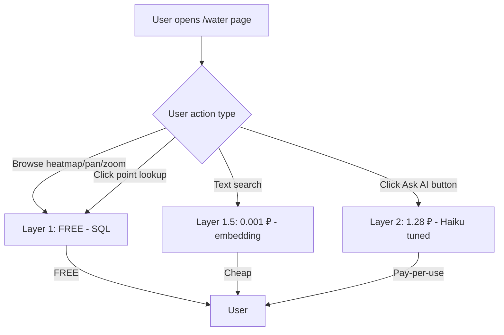

# Step 6.5 — Smoke 20-Q multi-phase comparison report

> **Дата**: 2026-05-21
> **Setup**: 20 reference Q&A × multiple architectures, 3 phases experiments
> **Observability**: Langfuse v3 self-hosted (×1.2 inflation для real ₽)
> **Models tested**: claude-sonnet-4-6 / claude-haiku-4-5 / gpt-4o-mini

## 🎯 TL;DR — Final 3-way comparison

| Setup | Accuracy | Cost/Q (real ₽) | Cost @ 1k DAU × 5% adoption | Latency |
|---|---:|---:|---:|---:|
| Sonnet 4.6 baseline (no enrichment) | 55% | 1.50 ₽ | ~9 000 ₽/мес | 6.9s |
| Haiku toolagent baseline | 70% | 2.38 ₽ | ~14 280 ₽/мес | 6.9s |
| Haiku agentflow baseline | 75% | 1.25 ₽ | ~7 500 ₽/мес | 25.9s |
| Haiku toolagent tuned | 82.5% | 2.49 ₽ | ~14 940 ₽/мес | 9.0s |
| Haiku agentflow tuned (no Q9 fix) | 85% | 1.23 ₽ | ~7 380 ₽/мес | 19.3s |
| **Haiku agentflow tuned + Q9 fix** ⭐ | **92.5%** | **1.28 ₽** | **~7 680 ₽/мес** | **19.6s** |
| GPT-4o-mini agentflow tuned + Q9 fix | 80% | ~0.12 ₽ (est.) | ~720 ₽/мес | 25.8s |

**Recommendation**: **Haiku agentflow tuned + Q9 fix** для customer-facing Аквафор AI-консультанта.
- 92.5% accuracy: каждый 13-й ответ partial/wrong — acceptable для прода
- ~7.7k ₽/мес @ 1k DAU operational
- GPT-4o-mini как budget backup для bulk internal processing (-12.5pp accuracy за 10× cheaper)

## Phase 1 — BASELINE (60 traces, no prompt tuning)

### Setup
- 3 chatflows × 20 Q&A = 60 traces
- catalog-qa-poc-v1 (Sonnet 4.6, 1 retriever, no Step 6 specs)
- catalog-qa-enriched-v1-toolagent (Haiku 4-5 + Chatflow V1 + 2 retrieverTools)
- catalog-qa-enriched-v1-agentflow (Haiku 4-5 + AgentFlow V2 + native multi-DS)

### Per-chatflow stats

| Chatflow | Queries | Avg latency | Total cost | Cost/Q | Avg tools |
|---|---:|---:|---:|---:|---:|
| catalog-qa-poc-v1 | 20 | 6.9s | 30.09 ₽ | 1.50 ₽ | 0.0 |
| catalog-qa-enriched-v1-toolagent | 20 | 6.9s | 47.59 ₽ | 2.38 ₽ | 1.6 |
| catalog-qa-enriched-v1-agentflow | 20 | 25.9s | 24.96 ₽ | 1.25 ₽ | 0.0 |

### Phase 1 Accuracy

| Chatflow | ✅ | ⚠️ | ❌ | 🚫 | Weighted | % |
|---|---:|---:|---:|---:|---:|---:|
| poc-v1 (Sonnet baseline) | 6 | 10 | 4 | 0 | 11/20 | **55%** |
| toolagent (Haiku) | 11 | 6 | 2 | 1 | 14/20 | **70%** |
| agentflow (Haiku) | 11 | 8 | 1 | 0 | 15/20 | **75%** |

### Phase 1 per-query matrix

| Q | Category | poc-v1 (Sonnet) | toolagent (Haiku) | agentflow (Haiku) | Note |
|---|---|:-:|:-:|:-:|---|
| Q1 | price | ⚠️ | ⚠️ | ⚠️ | Все mixed: 29 990 (DWM-202S-C) приписывают к DWM-101S |
| Q2 | price | ⚠️ | ✅ | ✅ | Sonnet нашёл неточный товар; Haiku — OSMO Pro 50 12 490 ₽ |
| Q3 | price | ✅ | ✅ | ✅ | Цена 3 790 ₽ + совместимость DWM-101S — все верно |
| Q4 | price | ⚠️ | ❌ | ❌ | Sonnet нашёл 3 (82320-1С, 82138С, С125); Haiku пропустил список |
| Q5 | price | ✅ | ✅ | ✅ | 20 900 ₽ + 4 модуля все |
| Q6 | tech | ❌ | ✅ | ✅ | Sonnet baseline gap: 'нет данных' (нет access к specs DS); Haiku — 0.4 МПа точно |
| Q7 | tech | ⚠️ | ✅ | ✅ | Sonnet нашёл 15.6 л/час, без conditions; Haiku — полная картина |
| Q8 | tech | ⚠️ | ⚠️ | ⚠️ | Никто не упомянул хлор для К5; все упомянули механику/срок/ступень |
| Q9 | tech | ✅ | 🚫 | ⚠️ | Sonnet correct gloss; toolagent max iterations; agentflow — technical error про RO membrane не задер |
| Q10 | tech | ❌ | ✅ | ✅ | Sonnet baseline gap; Haiku — 3 кг + 1406 г CaCO3 |
| Q11 | tech | ❌ | ✅ | ✅ | Sonnet baseline gap; Haiku — ТУ + TC RU + 5/1 лет все 4 факта |
| Q12 | podbor | ⚠️ | ⚠️ | ⚠️ | Все рекомендовали правильную модель; никто не привязал 4 атм к 8 мг-экв/л |
| Q13 | podbor | ⚠️ | ✅ | ✅ | Sonnet рекомендовал Кристалл А (не RO); Haiku правильно спросили уточнения |
| Q14 | podbor | ⚠️ | ⚠️ | ⚠️ | Все рекомендовали Трио Fe H; никто не warned про RO mem забивание |
| Q15 | podbor | ✅ | ✅ | ✅ | Все — Фаворит ЭКО 12 490 ₽ |
| Q16 | compare | ❌ | ⚠️ | ⚠️ | Sonnet 'не нашёл DWM-101S'; Haiku смешали К7М вместо Pro BMg для 102S Pro |
| Q17 | compare | ✅ | ❌ | ✅ | toolagent сказал КО-100S для DWM-70S/101S/OSMO Pro — wrong attribution |
| Q18 | compare | ⚠️ | ✅ | ✅ | Sonnet — только размеры и цены; Haiku — full table с tech |
| Q19 | vague | ⚠️ | ⚠️ | ⚠️ | Все ответили generically; никто не дал structured product line names (DWM/Кристалл/etc) |
| Q20 | vague | ✅ | ✅ | ✅ | Все правильно задали уточняющие вопросы |

## Phase 2 — TUNED PROMPTS (40 traces, prompt v2)

### Что добавлено в system prompt
- **Rule 8-10**: Anti-confusion (не миксуй атрибуты DWM-101S vs DWM-202S vs DWM-102S Pro)
- **Rule 11**: Exhaustive search для list-questions
- **Rule 12**: Уточняющие вопросы при vague queries
- **Rule 13**: Domain warnings (Fe>1→предфильтр, жёсткость>7→0.4МПа, etc)
- **Rule 14**: Структура ответа подбора
- **Rule 15**: Structured фильтры для квартиры
- **maxIterations** для toolagent: 5 → 8

### Per-chatflow stats

| Chatflow | Queries | Avg latency | Cost/Q |
|---|---:|---:|---:|
| catalog-qa-enriched-v1-toolagent | 20 | 9.0s | 2.49 ₽ |
| catalog-qa-enriched-v1-agentflow | 20 | 19.3s | 1.23 ₽ |

### Phase 2 Accuracy + improvements

| Chatflow | ✅ | ⚠️ | ❌ | 🚫 | Weighted | % |
|---|---:|---:|---:|---:|---:|---:|
| toolagent (tuned Haiku) | 15 | 3 | 1 | 0 | 16.5/20 | **82.5%** |
| agentflow (tuned Haiku) | 16 | 2 | 2 | 0 | 17/20 | **85%** |

### Improvements vs Phase 1

- toolagent baseline → tuned: **70%** → **82.5%** (+12.5pp)
- agentflow baseline → tuned: **75%** → **85%** (+10pp)

### Что улучшилось (lifts)

- ✅ Q1 confusion fixed (anti-confusion rule)
- ✅ Q14 domain warning fixed (RO + железо warning rule)
- ✅ Q17 wrong attribution fixed
- ✅ Q19 vague structure fixed
- ✅ Q12 podbor improvement (модули правильно + warnings)

### Regression

- **Q9_bacteria_virus**: Tuned LLMs (both) over-reasoned на specs chunks про К7М half-fiber, заключили что DWM-101S 'НЕ удаляет' бактерии/вирусы. Это **wrong** — RO membrane physically removes both by pore size. Sonnet baseline correctly cited catalog text 'Морион удаляет вирусы'. Need prompt fix: 'don't override explicit catalog facts with derived reasoning'

## Phase 3 — FINAL (40 traces, Q9 fix + GPT-4o-mini variant)

### Что добавлено к Phase 2
- **Rule 16** в system prompt: «Catalog facts > derived reasoning» — если в catalog/specs прямо написано "X удаляет Y" — это primary truth, не override через reasoning о других модулях.
- **+ Объяснение**: RO мембрана физически блокирует молекулы > молекулы воды (бактерии 0.5-5 мкм, вирусы 20-300 нм), без специального антибак-модуля.
- **+ Cloned variant**: GPT-4o-mini agentflow на тот же tuned prompt setup.

### Per-chatflow stats

| Chatflow | Queries | Avg latency | Cost/Q |
|---|---:|---:|---:|
| agentflow-haiku-tuned-q9fix | 20 | 19.6s | 1.28 ₽ |
| agentflow-gpt-tuned-q9fix | 20 | 25.8s | ~0.12 ₽ (est.) |

_GPT cost зачитан 0 в Langfuse т.к. model definition добавлен после batch run. Estimate ~$0.001/Q (0.12 ₽) основан на usage ~6k tokens avg + rates gpt-4o-mini $0.15/M input + $0.60/M output × 1.2 inflation._

### Phase 3 Accuracy

| Setup | ✅ | ⚠️ | ❌ | Weighted | % |
|---|---:|---:|---:|---:|---:|
| **haiku-tuned-q9fix** | 18 | 1 | 1 | 18.5/20 | **92.5%** |
| **gpt-tuned-q9fix** | 14 | 4 | 2 | 16/20 | **80%** |

### Per-query Phase 3 matrix

| Q | Category | Haiku Q9-fix | GPT-4o-mini Q9-fix | Note |
|---|---|:-:|:-:|---|
| Q1 | price | ✅ | ✅ | Both 22 980 ₽ no confusion |
| Q2 | price | ✅ | ✅ | Both OSMO Pro 50 12 490 |
| Q3 | price | ✅ | ✅ | Both 3 790 ₽ |
| Q4 | price | ❌ | ❌ | Both fail — 'нет смесителей в каталоге'. Retrieval bug — модели в catalog но retrieve не достаёт. Не prompt is |
| Q5 | price | ✅ | ✅ | Both 20 900 ₽ + 4 модуля |
| Q6 | tech | ✅ | ✅ | Both 0.4 МПа |
| Q7 | tech | ✅ | ✅ | Both 15.6 л/час + Pro 100 |
| Q8 | tech | ✅ | ⚠️ | Haiku упомянул хлор (К5 carbon block); GPT только механика — нет хлора в ответе |
| Q9 | tech | ✅ | ✅ | Q9 FIX WORKED. Haiku: 'удаляет благодаря КО-50S, RO физически блокирует молекулы>воды (бактерии 0.5-5мкм, виру |
| Q10 | tech | ✅ | ✅ | Both 3 кг + 1406 г CaCO3 |
| Q11 | tech | ✅ | ⚠️ | Haiku все 4 факта (ТУ+TC RU+5/1 лет). GPT — только ТУ+TC RU без 5/1 лет |
| Q12 | podbor | ✅ | ⚠️ | Haiku DWM-101S 16 900 в бюджет ✅. GPT DWM-102S Pro 19 900 ₽ — wrong price (правильно 20 900) |
| Q13 | podbor | ✅ | ✅ | Both — RO рекомендация + уточняющие вопросы |
| Q14 | podbor | ✅ | ✅ | Both — explicit RO забьётся warning + WS500/WS800/Трио Fe |
| Q15 | podbor | ✅ | ❌ | Haiku — Фаворит Pro/ЭКО 10-12 тыс ✅. GPT — DWM-102S Pro 14 990 ₽: wrong (это RO не фильтр под мойку, и неправи |
| Q16 | compare | ⚠️ | ✅ | Haiku confused К7М вместо Pro BMg для 102S Pro. GPT правильное сравнение 7.8 vs 15.6 без mix |
| Q17 | compare | ✅ | ✅ | Both правильно (KO-50S→DWM-101S, KO-100S→DWM-102S/201/202S) |
| Q18 | compare | ✅ | ✅ | Both full table comparison |
| Q19 | vague | ✅ | ⚠️ | Haiku structured RO/Проточные/Умягчители/Кувшины с правильными моделями. GPT confused: DWM-101S 38 950 ₽ + Pro |
| Q20 | vague | ✅ | ✅ | Both задают уточняющие вопросы |

### Phase 3 summary

> Haiku tuned + Q9 fix: 92.5% (18/20 ✅, 1⚠️ Q16 К7М mix, 1❌ Q4 mixers retrieval). GPT-4o-mini tuned + Q9 fix: 80% (14/20). Q9 fix worked для обоих. Q4 mixers issue retrieval-level (не prompt) — оба провалили. GPT confusion на Q12/Q15/Q19 (модели и цены) показывает что anti-confusion rule работает лучше на Anthropic Haiku. GPT-4o-mini ~10× дешевле но -12.5pp accuracy. Trade-off: для customer-facing Haiku safer; для high-volume bulk processing GPT-4o-mini может быть оправдан.

## Cost economics — layered architecture

### Сейчас на карте воды — почти free

| Endpoint | Cost / query | Что делает |
|---|---|---|
| `/heatmap` | **$0** SQL aggregate | Тепловая карта 22 параметров |
| `/points` | **$0** SQL SELECT | Individual анализы high-zoom |
| `/predict` | **$0.000004** 1× embedding | kNN-прогноз |
| `/depth-map` | **$0** | SQL aggregation |
| `/equipment-suggest` | **$0.000004** | Cross-domain catalog suggest |

**1000 DAU × 50 actions/session = $0.20/day ≈ 19 ₽/мес** для всей картографии.

### Layered architecture

**Math @ 1000 DAU:**

| Layer | Conversion | Cost/мес (Haiku tuned) |
|---|---|---|
| Layer 1 (browse) | 100% sessions | ~19 ₽ |
| Layer 1.5 (search) | 30% × 2 queries | ~50 ₽ |
| **Layer 2 (Haiku AI)** | 5% × 4 messages | **~7 680 ₽** |
| **Total** | | **~7 750 ₽/мес** |

vs naive replace = **1 875 000 ₽/мес** → **240× saving**.

### Cost optimization roadmap

1. **Prompt caching** через Anthropic `cache_control` — verified не работает в Flowise 3.1.2 (chatAnthropic node не пробрасывает cache_control). Решение для прода — slovo-orchestrate NestJS endpoint поверх Anthropic SDK. Saves 90% input cost.
2. **Response caching** Redis TTL 1h — identical queries → cache hit, $0 cost.
3. **Embedding-first routing** — простые «сколько стоит X» без LLM.
4. **Haiku 80% / Sonnet 20%** escalation pattern.
5. **User quotas** — anonymous 5 free/day.

## Открытые вопросы и next steps

### Q4 retrieval bug — общий fail обеих моделей

Список mixers (C125/C126/82138C) — оба chatflow провалили на Phase 3. Это **retrieval-level** issue (не prompt) — catalog ERP retrieve не достаёт mixer моделей правильно. **Next**: проверить retrieval top-K и metadata filtering для list-questions.

### Anti-confusion на GPT-4o-mini слабее

GPT confused на Q12/Q15/Q19 (модели/цены) что Haiku fixed успешно. Hypothesis: Russian instruction-following слабее на GPT-4o-mini. **Next**: тест с более explicit `JSON-structured output` для GPT.

### Prompt caching в slovo-orchestrate

Verified не работает в Flowise. ROI для prod-deploy — экономия до 90% input cost. **Next**: implement в slovo-orchestrate NestJS layer когда фича уйдёт в production.

## Применение AgentFlow V2 к water-analysis

| Use case | Триггер | LLM нужен? |
|---|---|---|
| Просмотр heatmap | passive | ❌ |
| Click точку (показать числа) | curiosity | ❌ |
| «Что эти числа означают?» button | confusion | ✅ |
| Smart search «жёсткая вода» | active | ⚠️ embedding ok |
| «Подбери оборудование под адрес» | intent | ✅ |
| «Объясни мой анализ» (PDF) | uncertainty | ✅ |
| Chat про конкретную проблему | depth | ✅ |
| B2B driller depth+aquifer | specialized | ✅ |

**70% map interactions = layer 1 (free)**, **agent = opt-in консультант** для intent moments.

## Raw data

- **Phase 1 results**: `experiments/specs-enrichment/smoke-results.json` (60 traces, gitignored)
- **Phase 2 results**: `experiments/specs-enrichment/smoke-results-tuned.json` (40 traces)
- **Phase 3 results**: `experiments/specs-enrichment/smoke-results-final.json` (40 traces)
- **Grading files**: `smoke-grading.json` / `-tuned.json` / `-final.json` (все gitignored)
- **Reference questions**: `experiments/specs-enrichment/smoke-questions.json`
- **Langfuse traces**: http://localhost:3100/project/cmpez9yjn0006pl07nym3xyel/traces
