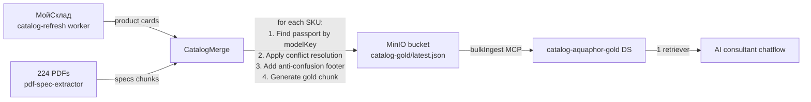

# Handoff для следующей сессии — AI-Консультант для PROSTOR

> **Создано**: 2026-05-21 после длинной сессии (Step 6.5 R&D)
> **Цель**: быстрый re-entry без перечитывания 50+ messages вчерашнего chat
> **Read first**: этот doc + `2026-05-21-summary-evening.md` (если есть time — также `2026-05-21-smoke-20q-baseline.md`)

---

## Quick re-entry (60 секунд context)

**Что строим**: AI-консультант для PROSTOR water page + catalog page (Аквафор-Pro). Pattern: AgentFlow V2 + multi-DS retrieve через Haiku 4-5.

**Где сейчас**:
- ✅ Infrastructure готова: 3 DS (catalog-aquaphor / catalog-aquaphor-specs / water-analysis-aquaphor), 4 chatflows (toolagent-haiku / agentflow-haiku / agentflow-gpt / judge), Langfuse v3 self-hosted, auto-grader.
- ✅ Prompt tuned до rules 1-27 (anti-confusion / domain warnings / anti-hallucination / multi-query / WS classification).
- ⚠️ **Real-world accuracy 50-55%** — **не production-ready** (требуется 80%+ для launch).
- 🎯 **Next direction**: **hybrid indexing** (build-time merge ERP+specs → single gold DS).

**Бюджет**: Anthropic ~$4.4 / OpenAI ~$8.9 остатки на R&D аккаунтах.

---

## Critical findings — что **НЕ** делать (anti-patterns)

### 1. Не trust cherry-picked reference sets
**Прецедент**: 20Q reference smoke показал 92.5% Haiku accuracy. На 30Q real-world — **52%**. Reference был **illusion** потому что все facts были pre-mapped в DS chunks.

**Правило**: для production claims — **только** real-world test set ≥50 queries с **edge cases** (vague / typos / multi-problem / colloquial).

### 2. Не trust свой собственный «verified» list без re-verify
**Прецедент**: я hardcoded в judge KNOWN_FACTS такие «истины»:
- ❌ «DWM-202S Pro не существует» — реально есть в specs PDF
- ❌ «DWM-202S-C only model in 202 series» — есть DWM-202S-C-LD за 38 950 ₽
- ❌ «WS500 single SKU 74 990 ₽» — есть K/0.35 за 94 980
- ❌ «WS1000 не существует» — есть за 104 990 ₽
- ❌ «DWM-101S base 22 980 ₽» — реально **16 900 ₽** (22 980 = bundle с C126)

Каждый «verified fact» в prompt — **обязательно** через `flowise_docstore_vectorstore_query` сначала.

### 3. Не jump к гипотезам в debug сессии
**Прецедент**: increase UTF-8 corruption hypothesis (proxy mangling) — был **wrong**. Реальная причина — bash `-d 'inline'` quoting (документировано в memory `feedback_utf8_curl_payload_via_file`). Перед утверждением root cause — **verify** через actual data (Langfuse traces, raw curl response).

### 4. Не делать prompt-tuning iterations infinitely
**Прецедент**: 5 rules добавили (23-27) — gain +2pp accuracy / -22% high-sev wrong claims. **Diminishing returns**. Дальше — architectural работа (DS merge / tool verification), не prompt.

### 5. Не выдавать «работает» без UTF-8 проверки
**Правило из CLAUDE.md**: любой curl с русским контентом → `--data-binary @relative-path` к file, **никогда** `-d "$VAR"` или `-d '{...inline}'`. Бытие на Windows Git Bash mangles cyrillic через CP1251.

---

## Today's session output (для git/commit reference)

Commits 2026-05-21 (вечер):
- `0214c4b` — Evening session analyses + DS merge findings
- `c61f197` — Smoke 20-Q baseline report (3-phase tuning + GPT A/B)
- `f3b2d5d` — Executive summary (pass-through pricing model)
- `7409686` — Executive summary refactor (operational focus)
- `e68edc3` — AI-консультант executive summary v1
- `14c19d9` — Smoke 20-Q baseline report initial (60 traces)
- `69a2800` — Langfuse v3 self-hosted full stack

**Artifacts**:
- `experiments/specs-enrichment/smoke-results-v2.json` — 60 traces real-world (iter2)
- `experiments/specs-enrichment/smoke-grading-v2-corrected.json` — auto-graded with corrected facts
- `experiments/specs-enrichment/poc-ds-merge/merged-chunks.json` — 13 моделей merged ERP+specs (PoC)
- `experiments/specs-enrichment/poc-judge/` — Sonnet judge chatflow factory
- `docs/management/ai-consultant-executive-summary.md` — для разговора с руководителем Аквафор
- `docs/experiments/specs-enrichment/2026-05-21-summary-evening.md` — full hands-on summary

---

## Real accuracy state (как ставить ожидания)

| Тип query | Current accuracy | Production threshold | Path к threshold |
|---|---|---|---|
| Простые price / срок службы | 70-80% | 90% | DS merge + tool verification |
| Tech specs (давление / производительность) | 60-70% | 85% | DS merge (eliminate inter-source conflicts) |
| Compatibility (модули / мембраны) | 50-60% | 90% | DS merge + structured metadata |
| Multi-product system design | 30-40% | 70% (с confidence handoff) | Tool verification + tier-based proposals |
| Edge cases (typos / vague) | 50% | 60% (acceptable if handoff) | Confidence threshold + manager escalation |

**Production launch threshold**: ~80% truthful **с** confidence-based handoff к менеджеру на edge cases.

---

## Direction forward — hybrid indexing

### Концепция (терминология)

Три названия одного pattern:
- **catalog-merge architecture** — наше project-specific
- **hybrid indexing** — industry term (используем в ADR)
- **knowledge fusion at ingest** — academic term

**Принцип**: build-time merge ERP + specs → **single enriched gold DS** для downstream retrieval. Conflict resolution baked in.

### Architecture sketch



### Conflict resolution policy

**Verified из аудита**:
- ERP (МойСклад) = **primary** для current модулей / цен (DWM-102S Pro modules = Pro 1/Pro 2/Pro 100/**Pro BMg**)
- Specs PDF = **secondary** для tech depth (давление / производительность / габариты / срок службы)
- Specs может содержать **outdated** info (DWM-102S Pro в разделе «Назначение» speаks о К7М — это устаревший passpоrt)
- При конфликте — **anti-confusion footer** в gold chunk explicit: «ERP catalog (current) указывает X. Specs PDF может содержать устаревшее Y — trust ERP.»

### Mapping ERP ↔ Specs

- **ERP product name** → normalize → kebab-case **modelKey**
- **Specs PDF metadata** содержит `modelKeys: ['dwm-102s-pro']` ready
- **Один PDF паспорт** иногда shared между моделями (DWM-202S Pro и DWM-202S-C-LD)
- **Edge cases**:
  - С125 / С126 / 82138С — есть в catalog, retrieve flaky по «смесители 2-в-1» (semantic miss). Нужен metadata category filter.
  - Бывают **2 SKU** на одну модель (DWM-102S Pro с краном 20 900 / без крана 19 900)

### Implementation tier-1 (MVP scope)

**Новый модуль**: `apps/worker/src/modules/catalog-merge/`

```typescript
// catalog-merge.service.ts (sketch)
@Cron('0 4 * * *')  // daily, после catalog-refresh
async function rebuildGoldDS() {
    const products = await catalogService.getAllSkus();      // 155
    const goldChunks = [];
    for (const product of products) {
        const specs = await specsService.findByModelKey(normalizeKey(product.sku));
        const goldChunk = mergeProductWithSpecs(product, specs, ConflictResolutionPolicy);
        goldChunks.push(goldChunk);
    }
    await flowiseClient.bulkIngest('catalog-aquaphor-gold', goldChunks);
}
```

**Existing 2 DS** (catalog-aquaphor + catalog-aquaphor-specs) **остаются**:
- Для debug / legacy chatflows
- Для specs-only queries (когда нужна **только** tech depth)
- Для ERP-only queries (когда нужна **только** цена)
- Deprecate когда gold proven в проде

### Effort estimate

5-7 дней для production-ready:
- 2 дня — merge worker + conflict resolution + unit tests
- 1 день — MinIO output format + bulkIngest integration
- 1 день — ADR-009 + migration plan
- 2 дня — smoke tests + accuracy measurement vs current 2 DS

---

## Open questions для Дима

1. **ADR-009 нужен сейчас или после MVP?** — стандарт slovo: ADR перед написанием кода. Кандидат: `docs/architecture/decisions/009-hybrid-indexing-gold-ds.md`.
2. **Production accuracy floor** — 70% / 80% / 85%? Это определяет когда **launch** vs continue iteration.
3. **MVP scope** — все 155 SKU сразу, или 10-20 popular models первым шагом?
4. **Existing 2 DS — deprecate или keep**? Keep для debug / multi-source queries — но cost больше.
5. **catalog-merge worker** — отдельный от catalog-refresh, или extension существующего?
6. **Confidence-based handoff к менеджеру** — где границы (low / medium / high), какой UX?

---

## Constraints to remember

### Technical
- **Tinyproxy** между РФ ↔ EU добавляет latency. `slovo-orchestrate` NestJS direct SDK = future для streaming UX.
- **Flowise 3.1.2 не поддерживает** `cache_control` для Anthropic — prompt caching через slovo-orchestrate.
- **UTF-8** в curl payload **только** через `--data-binary @relative-path` (memory `feedback_utf8_curl_payload_via_file`).
- **MCP `flowise-slovo`** disconnected сейчас — direct curl REST для всех Flowise operations.

### Business
- **Контракт vision-catalog 500к + 40к/мес** — не утверждён, **не** упоминать в новом executive summary (memory: contract removed).
- **Pricing AI-консультант**: pass-through по Anthropic+OpenAI invoice + Langfuse-отчёт (executive summary `ai-consultant-executive-summary.md`).
- **Frontend** — Пётр (prostor-app), backend slovo минорные tweaks для chat endpoints.
- **152-ФЗ**: PII клиентов в РФ. Production deploy через slovo-orchestrate в РФ + EU proxy для outbound к Anthropic/OpenAI.

### Team
- **Дима** = pair-programmer (slovo backend). Side-project формат, не full-time.
- **Пётр** = frontend prostor-app. UI работа.
- **Claude (мы)** = pair-programmer + executor.
- **Bilateral learning style** (memory `feedback_bilateral_learning_style`) — учим друг друга на real задачах.

---

## Quick start commands для new session

```bash
# Read context (3 минуты)
cd /c/Users/Diamond/Desktop/slovo
cat docs/experiments/specs-enrichment/NEXT-SESSION-HANDOFF.md  # этот doc
cat docs/experiments/specs-enrichment/2026-05-21-summary-evening.md
git log --oneline -10

# Verify infrastructure alive
source .env
curl -s --noproxy '*' "http://127.0.0.1:3130/api/v1/document-store/store" \
    -H "Authorization: Bearer $FLOWISE_API_KEY" | node -e "
const r = JSON.parse(require('fs').readFileSync(0,'utf-8'));
const stores = Array.isArray(r) ? r : (r.documentStores || r);
for (const ds of stores) console.log(ds.name, '—', ds.status, ds.totalChunks, 'chunks');
"

# Check Langfuse alive
curl -s --noproxy '*' "http://127.0.0.1:3100/api/public/health" | head -5

# Что NEW session должна решить — выбор направления:
#   A. ADR-009 hybrid indexing + sprint plan
#   B. Real-world test set expansion (200+ queries)
#   C. Tool-grounded verification design (POST /catalog/verify)
#   D. Production accuracy threshold definition
```

---

## Что **не** забыть из today's learnings

1. **Inter-source conflicts реальны** — Specs PDF self-contradicts (Pro BMg vs К7М в разделах одного и того же PDF). Hybrid indexing **не** silver bullet, нужна explicit conflict resolution policy.

2. **GPT-4o-mini 14× дешевле Haiku** ($0.0008 vs $0.013 per Q) при -12.5pp accuracy. Router pattern (Haiku сложное / GPT простое) может дать 50% cost saving при сохранении accuracy.

3. **Latency 20-30s — это dev numbers, не prod**. Прод через slovo-orchestrate + streaming SSE = perceived <3s.

4. **Auto-grader через Flowise judge chatflow** — pattern для **automated** continuous evaluation. Стоит реактивировать через Langfuse Evaluations когда proven workflow.

5. **Q4 mixers retrieval bug** — embedding semantic miss для list queries. Fix через:
   - Metadata filter `{ "category": "mixer" }` в gold DS chunks
   - FTS hybrid retrieval (postgres tsvector + pgvector RRF)
   - Multi-query strategy в prompt (но это band-aid)

---

## Финальная картина

**Сегодня доказали**: prompt-tuning floor ~52% на real-world. Дальше нужна architectural работа.

**Завтра/следующая сессия**:
- Если **архитектура** (ADR + worker module) — fresh session, длинная работа
- Если **small follow-up** — может в текущей сессии добить

**Цель к prod**: 80%+ accuracy + <3s perceived latency + cost cap + confidence-based handoff = launchable AI consultant.
