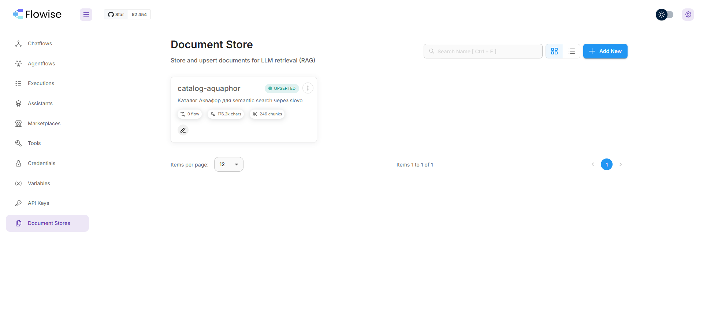
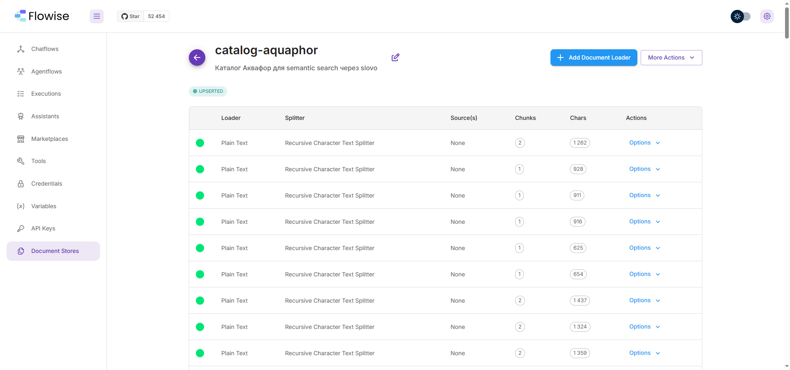
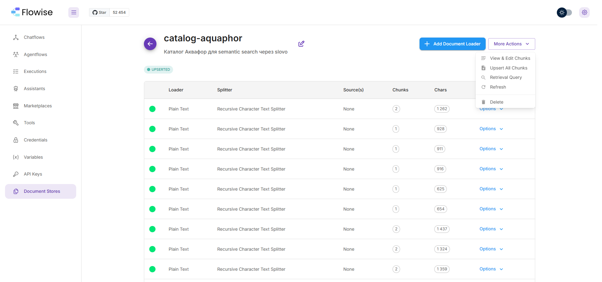
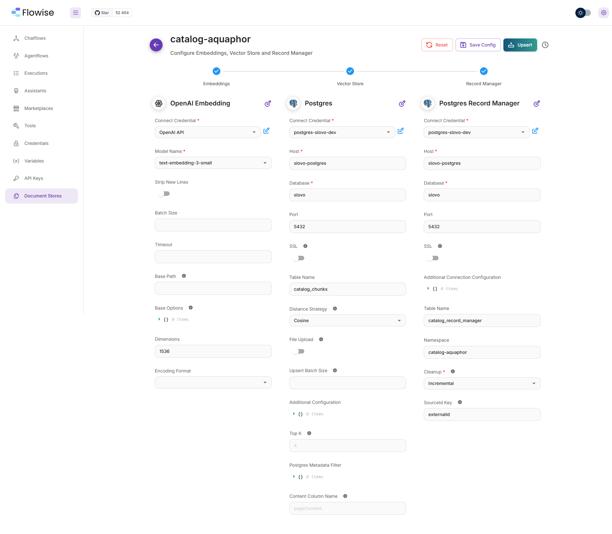
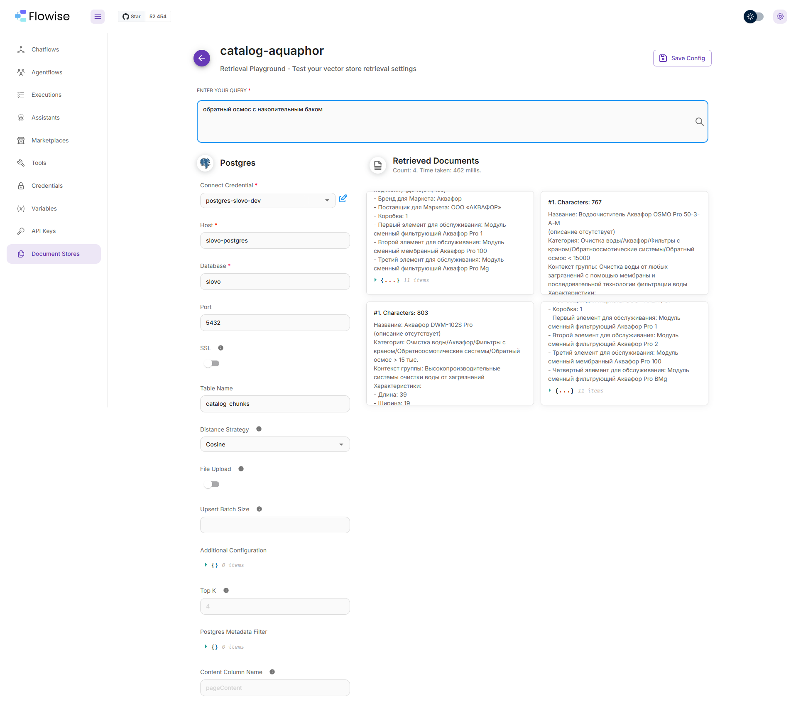
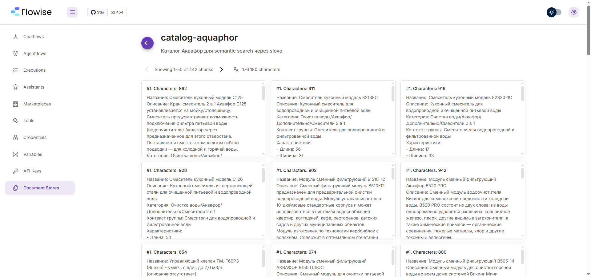
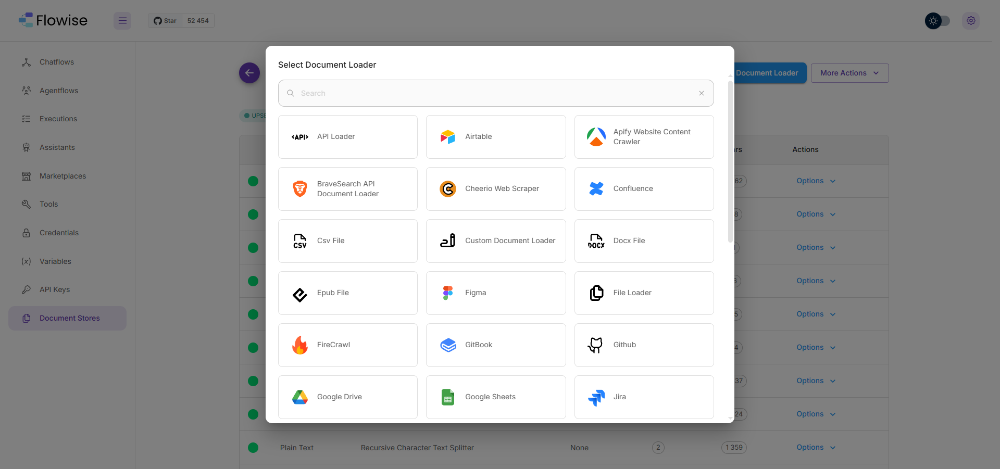
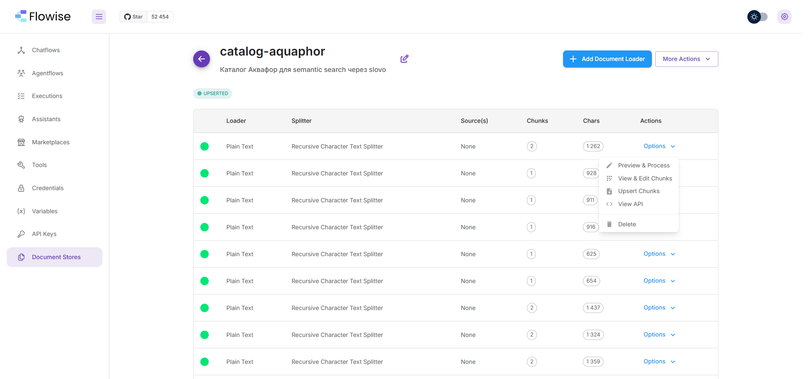
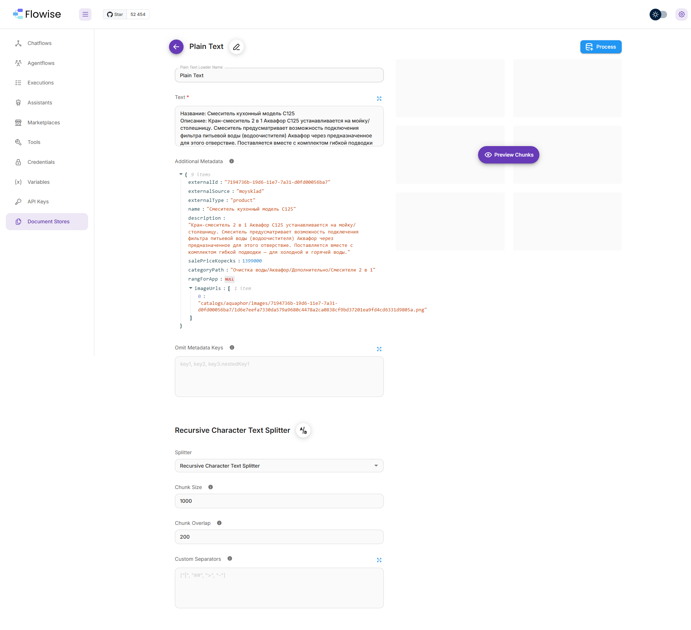

# Document Store catalog-aquaphor — визуальный референс

Серия скриншотов из Flowise UI 3.1.2 на 1 мая 2026 — финальная конфигурация
после PR9.5 RecordManager-based ingest.

Document Store ID: `aec6b741-8610-4f98-9f5c-bc829dc41a96`
Имя: `catalog-aquaphor`
Источник данных: `slovo-datasets/catalogs/aquaphor/latest.json` (155 items от
CRM Аквафор-Pro, обновляется на каждом cache-reset событии).

---

## Скриншоты

### 01 — Список Document Stores


Главный экран `/document-stores`. После чистки orphan'ов остался один
catalog-aquaphor. Карточка показывает:
- статус `UPSERTED` (последний upsert завершился без ошибок)
- 246 chunks (текущее количество векторов в pgvector)
- 176.2k characters суммарно
- 0 flow (Document Store не используется ни в одном Chatflow напрямую — slovo
  делает search через `/api/v1/document-store/vectorstore/query` REST-API)

### 02 — Overview store: список loader'ов


Внутри store. Каждая строка — отдельный Plain Text loader для одного товара
(один `externalId` → один loader). Видна сетка по splitter'у (Recursive
Character Text Splitter), per-loader chunks count (1-2) и chars (600-1500).

Все loader'ы созданы slovo `apps/worker/catalog-refresh` через REST API
(`POST /api/v1/document-store/upsert/<id>`). UI ничего ручного — только для
просмотра и debug.

### 03 — More Actions меню


Раскрытое More Actions:
- **View & Edit Chunks** — все 442 chunks как карточки (см. 06)
- **Upsert All Chunks** — конфиг embedding/vector store/recordManager (см. 04)
- **Retrieval Query** — playground для тестирования semantic search (см. 05)
- **Refresh** — reload всех loader'ов (мы НЕ используем — slovo делает
  per-item upsert через RecordManager skip-if-unchanged)
- **Delete** — снести store

### 04 — Upsert All Chunks: полный vector pipeline


**Главное место конфигурации.** Здесь живут embedding/vectorStore/recordManager —
их НЕТ на overview-странице, только за кликом More Actions → Upsert All Chunks.

**OpenAI Embedding** (левая колонка):
- Model: `text-embedding-3-small`
- Dimensions: 1536
- $0.02/1M tokens — копейки на 155 items

**Postgres** (vector store, средняя колонка):
- Host: `slovo-postgres` (Docker network), DB: `slovo`, port: 5432
- Table: `catalog_chunks` (HNSW index создан Flowise)
- Distance Strategy: Cosine

**Postgres Record Manager** (правая колонка) — **КЛЮЧ к PR9.5**:
- Table: `catalog_record_manager` (lifecycle state)
- Namespace: `catalog-aquaphor` (для multi-store изоляции в будущем)
- Cleanup: `Incremental` — при per-source upsert удаляет старые chunks этого
  externalId, не трогая остальные
- SourceId Key: `externalId` — поле metadata по которому RecordManager
  трекает changed/unchanged

Без Record Manager каждый refresh вычислял бы embedding для всех 155 items
заново (~1.9 ₽/день при 6 cron'ах × 155 items). С Record Manager:
unchanged → `numSkipped=1`, $0 (~0.6 ₽/мес).

### 05 — Retrieval Query: тест поиска вручную


Playground для вектор-поиска. Запрос «обратный осмос с накопительным баком»
→ 4 documents за 462ms:
- #1: "Аквафор OSMO Pro 50-3-А-М" (Очистка воды/Аквафор/Фильтры с краном/Обратный осмос < 15000)
- #1: "Аквафор DWM-102S Pro" (Высокопроизводительные системы)
- + 2 других
- Каждый result — preview с metadata (бренд, поставщик, картриджи)

Эта view — для ручного debug качества search'а. slovo dev делает то же
самое программно через `POST /api/v1/document-store/vectorstore/query`
(см. `apps/api/src/modules/catalog/search/text.service.ts`).

### 06 — View All Chunks: что в БД


Все 442 chunks как paginated карточки. Видны реальные данные:
- "Смеситель кухонный модель C125"
- "Модуль сменный фильтрующий В510-12"
- "Модуль сменный фильтрующий АКВАФОР В150 ПЛЮС"
- "Аквафор B520 PRO" (с описанием технологии)
- и т.д.

Каждая карточка — один chunk (после splitter): text + metadata. Можно
открыть и посмотреть raw содержимое или удалить отдельный chunk.

### 07 — Add Document Loader: какие источники доступны


Каталог loader'ов в Flowise 3.1.2 — 30+ источников: API, Airtable,
Confluence, CSV, Docx, Epub, FireCrawl, GitHub, Google Drive, Jira, и т.д.

Для каталога мы используем `Plain Text` (custom через REST API) — **CRM
feeder выгружает товары в `latest.json` в MinIO, slovo-worker читает и
делает per-item upsert** (см. ADR-007 amendment 2026-05-01).

### 08 — Per-loader Options


Per-loader действия:
- **Preview & Process** — конфиг конкретного loader'а (см. 09)
- View & Edit Chunks — chunks этого loader'а
- Upsert Chunks — повторный upsert (мы НЕ дёргаем — slovo сам через REST)
- View API — endpoint info
- Delete — удалить loader (используется в REMOVED-sweep slovo при удалении
  товара из feeder'а)

### 09 — Конкретный loader (Plain Text + metadata)


Loader для товара "Смеситель кухонный модель C125":

**Text** (для embedding):
```
Название: Смеситель кухонный модель C125
Описание: Кран-смеситель 2 в 1 Аквафор C125 устанавливается на мойку/
столешницу. Смеситель предусматривает возможность подключения
фильтра питьевой воды (водоочистителя) Аквафор через
предназначенное для этого отверстие. ...
```

**Additional Metadata** (whitelist полей которые feeder вкладывает per-item):
- `externalId: "71947d6b-19d6-11e7-7a31-d0fd00056ba7"` — uuid из MoySklad
- `externalSource: "moysklad"` — feeder source
- `externalType: "product"` — товар vs картридж vs услуга
- `name`, `description`, `salePriceKopecks`, `categoryPath`, `rangForApp`
- `imageUrls: ["catalogs/aquaphor/images/<uuid>/<sha1>.png"]` — S3 keys
  (presigned URL генерируется slovo при выдаче клиенту)

**Splitter**:
- Recursive Character Text Splitter
- Chunk Size: 1000, Chunk Overlap: 200

---

## Что не на скринах (потому что не используем UI)

- **Создание Document Store** — был создан вручную в Phase 0 (см. lab journal
  `docs/experiments/vision-catalog/2026-04-29-document-store-vector-pipeline.md`).
  Если бы пересоздавали — через MCP `flowise_docstore_full_setup` (атомарный
  5-step onboarding, см. ADR-008).
- **Upsert каталога** — slovo `apps/worker/catalog-refresh` дёргает REST
  каждые 4 часа. UI кнопкой "Upsert All Chunks" мы **не пользуемся** — это
  тригерит full re-upsert всех loader'ов с нуля, что ломает RecordManager
  optimization.

## Где смотреть код

- Worker pipeline: `apps/worker/src/modules/catalog-refresh/catalog-refresh.service.ts`
- Search backend: `apps/api/src/modules/catalog/search/text.service.ts`
- ADR: `docs/architecture/decisions/007-catalog-ingest-via-minio.md` (amendment 2026-05-01)
