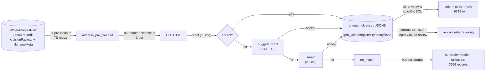

# Address resolution pipeline: pre-clean + Ahunter cleanse + AI verify

> Lab journal от 2026-05-05. После закрытия Этапа 1.A (15 504 records,
> см. `2026-05-04-stage-1a-extract-costs.md`) занялись отдельной задачей —
> привязать к каждой записи валидные lat/lon для тепловой карты и
> spatial-аналитики. Это не Этап 1.B normalization из плана
> (`docs/features/water-analysis.md`) — это отдельная phase «address
> resolution» поверх Этапа 1.A, нужная и для 1.B (parsing адреса в колонки),
> и для UX-кейса «клик на карте → предсказанные параметры воды».

## Контекст

Старый pipeline `04-geocode.ts` (две прогонки `/fetch/address` —
сырой адрес + dealerLocation fallback) дал ~60% записей с lat/lon.
Качество geocode варьировало: для «Москва, ул. X» матчилось хорошо,
для «СНТ Лесная даль, Обр.№2» получали fallback на dealer-город без
точности. Нужно было:

1. Снять «мусор» из адресов (телефонные префиксы, скобки, пометки
   «после фильтра», номера образцов) **до** Ahunter — чтобы платный
   API не тратил quota на bouncing мусор.
2. Перейти с `/fetch/address` (20 коп) на `/cleanse/address` (10 коп
   strict / 20 коп smart) — у `/cleanse` есть suggest-fallback и
   smart-search, чище качество.
3. Добавить AI-верификацию каждого результата — Ahunter возвращает
   `precision/recall` 100%/100% даже для семантически неверных
   совпадений (Малаховка→Малахово, Барыбино домодедовское→серпуховское).
4. Сохранить **полный JSONB cleanse-response** в БД для дальнейшей
   оптимизации — не дёргать API повторно если поменяется логика.

Цель — ≥95% записей с usable lat/lon при <5% wrong-match rate.

## Pipeline



## Этапы

### 1. Миграция `add_address_resolution_fields`

Добавлены 15 полей в `WaterAnalysisRaw` одной миграцией (через
`migrate diff` + ручной `psql apply` + `migrate resolve --applied` —
обходим Flowise drift workaround, см. memory
`feedback_prisma_drift_flowise_workaround`):

```prisma
// Step 1: TS pre-clean
addressPreCleaned       String?   @map("address_pre_cleaned") @db.VarChar(512)
addressPreCleanedAt     DateTime? @map("address_pre_cleaned_at")

// Step 2: Ahunter /cleanse/address (full JSONB для optimization later)
ahunterCleansed         Json?     @map("ahunter_cleansed")
ahunterCleansedAt       DateTime? @map("ahunter_cleansed_at")
ahunterCleansedTier     String?   @map("ahunter_cleansed_tier") @db.VarChar(20)
ahunterCleansedQuery    String?   @map("ahunter_cleansed_query") @db.VarChar(512)

// Денормализованные удобные поля
geoLat                  Float?    @map("geo_lat")
geoLon                  Float?    @map("geo_lon")
geoRegion               String?   @map("geo_region") @db.VarChar(64)
geoCity                 String?   @map("geo_city") @db.VarChar(64)
geoPretty               String?   @map("geo_pretty") @db.VarChar(512)
geoLevel                String?   @map("geo_level") @db.VarChar(16)

// AI verification
aiVerified              String?   @map("ai_verified") @db.VarChar(16)
aiVerifiedAt            DateTime? @map("ai_verified_at")
aiVerifiedNotes         String?   @map("ai_verified_notes") @db.VarChar(512)
```

Migration: `prisma/migrations/20260505175348_add_address_resolution_fields/`.

### 2. `04-pre-clean.ts` — TS-only pre-clean

Чистый regex pipeline без LLM:

- Phone-prefix strip: `89XXX...`, `+7...`, любые позиции (не только начало)
- Скобки и tail-noise: `(после фильтра)`, `Обр.№X`, `Скв.№X`, `скважина X м`,
  `родник`, `колодец`, `до фильтра`, `(грязная)`, `№N - дом`
- Common typos OCR-ошибок: `СНГ→СНТ`, `ДНТ→ДНП`
- Hyphen preservation через placeholder-токены `РНТМП` / `ХДЕФИС` —
  чтобы regex не съел `Наро-Фоминск` или `Машиностроитель-2`

**Результат:** 15 504 processed in ~18s, **2 132 (13.7%) became empty**
после clean — это записи где после strip остался только мусор-маркер.
Эти попадают в `tier=empty`, для них планируется dealer-median fallback.

### 3. `analyze-cleanse-sample.ts` — итерации v1→v5 на пилоте 200 random

| Версия | Стратегия | Match rate | Замечания |
|---|---|---:|---|
| **v1** | strict only (10 коп) | 64% | Много false negative для типографий |
| **v2** | + suggest fallback | 72% | suggest бесплатный, ловит `Малаховка→пгт Малаховка Люберцы` |
| **v3** | + smart-search (20 коп) | 79% | Smart над-исправляет: `Сертухов→Серпухов` ok, но `Сертухов→Клин` (другой город!) |
| **v4** | + dealer-city hard filter | 63% (over-rejected) | Слишком строгий — терял Серпухов когда dealer="ИП Иванов" без city |
| **v5** | dealer-region (МО↔МО) + bare-name dealer-city | **83.5%** |

Final v5 в production. Postfilter:

- **Region whitelist:** МО + соседние (Рязанская, Тульская, Тверская, Калужская,
  Владимирская, Ярославская, Смоленская). Smart-результат вне whitelist — reject.
- **Dealer-region match:** если dealer привязан к региону (Рязань → Рязанская обл.),
  reject если pretty не из этого региона.
- **Bare-name dealer-city check:** для одно-словных запросов (просто «Малаховка»)
  требуем dealer city в pretty — иначе reject (защита от amgибигвus matches).
- **Token-overlap ≥0.5:** жёсткий semantic-фильтр на случай когда Ahunter
  возвращает `precision=100% recall=100%` для chunk-mismatched results.

### 4. `05-ahunter-cleanse.ts` — three-tier на 15 504 records

Strict (10 коп) → Suggest+Strict (free + 10) → Smart (20 коп) с postfilter v5.

**SHA256 cache:** `data/.ahunter-cleanse-cache/<hash>.json` — повторный
запуск (например, если ловили rate limit или меняли логику postfilter)
не дёргает API заново для уже виденных query.

**Прогон:** **17m 30s wall clock** на 15 504 записей.

**Tier распределение:**

| Tier | Count | % cleansed |
|---|---:|---:|
| `strict` (matched 10 коп) | 11 551 | 96.7% |
| `smart` (matched 20 коп после fallback) | 235 | 2.0% |
| `suggest+strict` (free suggest + 10 коп strict) | 162 | 1.4% |
| **Итого matched** | **11 948** | **100%** |
| `no_match` (все три tier reject) | 1 424 | для dealer-median |
| `empty` (после pre-clean пусто) | 2 132 | для dealer-median |

**Стоимость API:**

- 11 551 strict × 10 коп ≈ 1 155 ₽
- 162 suggest (free) + 162 strict retry × 10 коп ≈ 16 ₽
- 235 smart × 20 коп ≈ 47 ₽
- ~1 500 reject через все tiers ≈ ~150 ₽
- **Итого ≈ 1 370 ₽** на geocoding 15 504 записей

### 5. `06-ai-verify.ts` — AI verification batch loop

Ahunter `precision/recall` не отражает **семантическую** точность.
Прецедент: для «Малаховка» Ahunter возвращает `precision=100% recall=100%`
с двумя совершенно разными нп — пгт Малаховка (Люберецкий р-н, ~55.65, 38.00)
и с Малахово (Раменский р-н, ~55.49, 38.24). 17 км разницы для тепловой
карты критично.

Workflow:
1. **`--auto-ok` mode:** SQL UPDATE для high-confidence — `tier='strict'
   AND precision≥90 AND recall≥80`. Помечает пометкой
   `'auto: strict + recall>=80 + precision>=90'`. **9 315 records auto-OK**.
2. **Default review mode:** export 200 unverified в JSONL → Claude в
   chat-сессии читает каждый record, выдаёт verdict ok/uncertain/wrong
   с notes-обоснованием → save в `.ai-verdicts-batchN.json`.
3. **`--apply <verdicts.json>`:** массовый UPDATE с verdict + notes.

**Manual review через 12 batch'ей:**

| Batch | Records | ok | uncertain | wrong | %ok |
|---:|---:|---:|---:|---:|---:|
| 1 | 72 | 33 | 25 | 14 | 45.8% |
| 2 | 200 | 85 | 85 | 30 | 42.5% |
| 3 | 200 | 109 | 52 | 39 | 54.5% |
| 4 | 200 | 92 | 52 | 56 | 46.0% |
| 5 | 200 | 97 | 53 | 50 | 48.5% |
| 6 | 200 | 112 | 45 | 43 | 56.0% |
| 7 | 200 | 110 | 59 | 31 | 55.0% |
| 8 | 200 | 115 | 47 | 38 | 57.5% |
| 9 | 200 | 113 | 42 | 45 | 56.5% |
| 10 | 200 | 122 | 51 | 27 | 61.0% |
| 11 | 200 | 102 | 59 | 39 | 51.0% |
| 12 | 263 | 143 | 63 | 57 | 54.4% |
| **Итого** | **2 633** | **1 333** | **633** | **469** | **50.6%** |

(Manual % ok ниже чем общий — это запись по которым auto-OK не дал
high-confidence, ожидаемо более сложные случаи.)

**Финал по всем 11 948 cleansed records:**

| Verdict | Count | % |
|---|---:|---:|
| ✅ ok | 10 846 | 90.8% |
| ⚠ uncertain | 633 | 5.3% |
| ❌ wrong | 469 | 3.9% |

Цель «<5% wrong» — **достигнута, 3.9%**. Цель «≥95% usable» —
требует ещё dealer-median на 3 556 no_match/empty (план #38).

## Антипаттерны Ahunter (что обнаружили на manual review)

Список найденных «гулливеров» — на завтрашний fix-up или хотя бы для
reject-фильтра в будущей версии:

1. **Phone-prefix как номер дома.** `8916141604 СНТ X` после неполного
   pre-clean → Ahunter воспринимает `8916141604` как номер дома.
   Pre-clean ловит большинство, но варианты с разделителями
   (`8916/161-04`, `89161604/04`) проскакивают. **Fix:** усилить regex.
2. **«Образец №X», «Обр.№X», «№X колодец», «№X скважина» → дом X.**
   Ahunter трактует «номер образца воды» как «номер дома». Pre-clean
   снимает явные `Обр.№X`, но не все варианты. **Fix:** более жёсткий
   regex на любую `№\d+` в конце.
3. **нп → улица того же корня (smart wrong).** Деревня Лермонтово →
   ул Лермонтова. Деревня Ясенево → ул Ясеневая. Пушкино → ул Пушкина
   Малаховка. Это smart-search «творчески» интерпретирует, когда не
   находит точного нп. **Fix:** в smart-tier reject если в pretty
   `level=Street` и query содержит явный type-marker деревни/посёлка.
4. **Регион потерян → fallback в МО.** «Тульская обл., СНТ X» теряет
   «Тульская обл.» при cleanse, fallback в pretty=Ступино. Region
   postfilter ловит часть случаев но не все (особенно когда suggest
   возвращает `обл Московская` без явного reject).
5. **Малаховка ≠ Малахово, Барыбино ≠ Барыбино.** Совпадающие или
   почти-совпадающие имена в разных районах. Pgt Малаховка (Люберцы)
   vs с Малахово (Раменское). Мкр Барыбино (Домодедово) vs д Барыбино
   (Серпуховский — деревня под Серпуховом). **Fix:** dealer-city
   prefer, если в pretty есть несколько кандидатов.
6. **Объекты-водоисточники как адреса.** `родник`, `колодец`, `скважина`,
   `водопровод`, `до фильтра` — это **тип образца**, не адрес. Ahunter
   героически находит «д Колодези», «пер Колодезный», «ул Родниковая»,
   «пер Водопроводный». Pre-clean ловит явные триггеры, но `родник`
   как самостоятельная строка проскакивает. **Fix:** whitelist слов
   которые делают записи `tier=empty` принудительно.
7. **Воскресенск (МО) → Воскресенские Ворота (Москва центр).** Suggest
   возвращает Москву как expansion. Region postfilter не помог потому
   что МО и Москва оба whitelisted. **Fix:** для bare-city query
   prefer dealer-region match.

## Insight: что сделало manual review терпимым по объёму

2 633 records через 12 batch'ей по ~10-15 минут review каждого = **~3 часа
total**. Это окупилось auto-OK для 9 315 high-confidence записей, иначе
было бы 5-6 часов. Структура `.ai-verify-batch.jsonl` (одна запись на
строку, всё что нужно для решения inline — orig, cleaned, query, pretty,
tier, level, lat, lon, dealer) позволяла принимать решение за 5-10 секунд
на запись.

Если будем повторять на новой вертикали (например, аэропорты, медучреждения)
— сразу отделить auto-OK SQL pre-pass от manual review, и думать про
структуру JSONL чтобы максимально снизить cognitive load на review.

## Final state на 2026-05-05 EOD

- **15 504** total raw records
- **11 948** cleansed (matched через Ahunter), все verified
- **3 556** no_match/empty — на dealer-median fallback завтра
- **Quality:** 90.8% точных совпадений, 3.9% wrong (цель <5% — выполнена)

## План на 2026-05-06

### Приоритет 1 — закрыть address resolution

**`07-dealer-median-fallback.ts`** (TaskList #38). Для 3 556 no_match/empty
записей вычислить координаты через медиану:

1. Группировать `ai_verified='ok'` records по `filenameMeta.dealerLocation`.
2. Для каждого dealer'а — медиана `geoLat`/`geoLon` из его ok-records.
3. Для no_match/empty записей того же dealer'а — записать median lat/lon
   с пометкой `geo_source='dealer_median'`.
4. Для dealer'ов где median невозможен (<3 ok-records, или вообще нет
   geocoded) — оставить null, попадает в #36 manual override.

**Цель:** довести до ≥95% records с usable lat/lon. Точность для
fallback хуже (~5-15 км radius dealer's territory), но для тепловой
карты по районам этого достаточно — основной use-case это «в каком
районе какие проблемы воды частые».

### Приоритет 2 — Этап 1.B normalization

Это **другой** Этап 1.B из исходного плана — параметры/единицы/PDK,
не address resolution. См. `docs/features/water-analysis.md` секция
«Этап 1.B — Normalization». TaskList #35:

- Param mapping (~50 канонических параметров через lookup из старого
  `water-analysis-parser/src/config/sanpin-norms.ts`)
- Unit conversion (°Ж / мг-экв/л / ммоль/л)
- Value parsing (`"<0.1"` → 0.05 + flag, `"не обнаружено"` → null)
- SourceType inference (Vision intakeType + filename hint → enum)
- PDK flagging (по СанПиН 1.2.3685-21)
- Address breakdown — у нас уже есть `geo_region/city/lat/lon` в
  `WaterAnalysisRaw` — derive в `WaterAnalysis` с PII-обезличиванием
- Хранить `normalizationVersion` для A/B пересчёта без потери истории

### Приоритет 3 — EDA

После dealer-median + normalization прогнать `99-eda.ts` обновлённый:

- Карта точек по level (Place/Street vs City/District/Region) —
  визуализация качества geocode по тепловой карте
- Распределение wrong/uncertain по dealer'ам — выявить top dealer'ов
  с системными проблемами (например, «Опт» dealer без точного adres'а)
- Distribution of `precision/recall` Ahunter vs наш AI verdict —
  калибровка для будущих pipelines

### Carry-over (не требует немедленного внимания)

- **#36 Manual address override** — top dealers без геоинфы (Опт,
  Промотдел, Сервис без ТЦ-адреса). Для каждого — manual lookup
  координат склада/офиса дилера.
- **uncertain (633) и wrong (469)** — пока оставляем как есть. Большинство
  wrong имеют точку с минимально полезной точностью (level=City/District) —
  для тепловой карты по районам сойдёт, для precise точки — нет.
  uncertain — отметить на UX «низкая точность» при отображении.
- **#18 Extract в `libs/water-blank-extraction`** (Variant C) — после
  стабилизации Этапа 1.B и Этапа 2 (embeddings).

## Артефакты

- **Migration:** `prisma/migrations/20260505175348_add_address_resolution_fields/`
- **Scripts:** `experiments/water-analysis-dataset/scripts/04-pre-clean.ts`,
  `05-ahunter-cleanse.ts`, `06-ai-verify.ts`, `analyze-cleanse-sample.ts`,
  `check-stats.ts`
- **Verdicts:** `experiments/water-analysis-dataset/data/.ai-verdicts-batch{1..12}.json`
  (gitignored — содержат orderNumber↔verdict mapping для repeatability;
  PII не содержат, но reasoning notes могут содержать косвенно
  идентифицирующую инфу через адрес)
- **Cache:** `experiments/water-analysis-dataset/data/.ahunter-cleanse-cache/<sha>.json`
  (gitignored — local API response cache)
