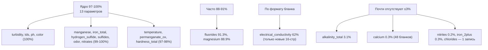

# Этап 1.B EDA — нормализованный датасет 15 504 бланков

**Дата:** 2026-05-06
**Источник:** `water_analysis` (15 504 derived from 15 504 raw, 100% coverage по таблице)
**Скрипт:** `experiments/water-analysis-dataset/scripts/05-normalize.ts`

## Сводка по 21 каноническому параметру

### Покрытие в датасете (% от 15 504 бланков)



### Статистика значений (только бланки где параметр измерен)

| Параметр | n | avg | min | median | p95 | max | ПДК СанПиН | ед. |
|---|---:|---:|---:|---:|---:|---:|---:|---|
| turbidity | 15 502 | 12.09 | 0 | 2.5 | 54.2 | 1522 | 2.6 ЕМФ | ЕМФ |
| tds | 15 501 | 370 | 2 | 346 | 639 | 2000 | 1000 | мг/л |
| ph | 15 501 | 7.08 | 3.2 | 7.1 | 7.8 | 12.2 | 6-9 | ед. |
| color | 15 500 | 38.6 | 0 | 12.1 | 158 | 1371 | 20 | град |
| manganese | 15 483 | 0.246 | 0 | 0.04 | 1.17 | 10.58 | 0.1 | мг/л |
| iron_total | 15 477 | 1.187 | 0 | 0.17 | 5.20 | 187 | 0.3 | мг/л |
| hardness_total | 15 037 | 7.09 | 0.1 | 7.47 | 11.62 | 96.3 | 7 | мг-экв/л |
| permanganate_ox | 15 168 | 2.03 | 0 | 2.0 | 4.0 | 30 | 5 | мг/л |
| nitrates | 15 350 | 4.40 | 0 | 2.3 | 16.7 | 80 | 45 | мг/л |
| fluorides | 14 150 | 0.87 | 0 | 0.7 | 2.2 | 5.3 | 1.5 | мг/л |
| magnesium | 13 776 | 42.4 | 0 | 45.0 | 70 | 5045* | 50 | мг/л |
| temperature | 15 208 | 21.0 | 5.8 | 21.4 | 25.4 | 32.3 | — | °C |
| odor | 15 391 | 1.62 | 0 | 2 | 3 | 53* | 2-3 балл | балл |
| electrical_cond | 9 611 | 649 | 0.8 | 604 | 1120 | 4000 | — | мкСм/см |

\* outliers — Vision OCR ошибки в отдельных значениях (max=5045 для magnesium и 53 для odor — единичные кейсы для recheck).

## Превышения ПДК (где параметр измерен)

| Параметр | Граница | Превышают | % | Интерпретация |
|---|---:|---:|---:|---|
| **hardness_total** | > 7 мг-экв/л | 7 858 | **52.3%** | Доминирующая проблема МО — нужны умягчители |
| **turbidity** | > 2.6 ЕМФ | 7 506 | **48.4%** | Механическая фильтрация / коагуляция |
| **iron_total** | > 0.3 мг/л | 6 444 | **41.6%** | Обезжелезиватели |
| **color** | > 20 град | 6 296 | **40.6%** | Часто коррелирует с органикой → активированный уголь |
| **manganese** | > 0.1 мг/л | 5 656 | **36.5%** | Безреагентные / реагентные системы |
| **permanganate_ox** | > 5 мг/л | 410 | 2.7% | Сильные органические загрязнения |

**Top-3 проблемы воды Московского региона по dataset Аквафор:**
1. **Жёсткость** (52.3% превышают 7 мг-экв/л) — типичная скважинная вода МО
2. **Мутность** (48.4%) — взвешенные частицы, железистые осадки
3. **Железо общее** (41.6% превышают 0.3 мг/л) — бактериальное / гумусовое + структурное

## По типу источника (для презентации руководителю Аквафор)

### Распределение бланков

| Тип источника | Бланков | % | Что значит |
|---|---:|---:|---|
| **Скважина** (well) | 10 277 | **66.3%** | Основной сегмент клиентов Аквафор |
| **Водопровод** (municipal) | 3 384 | 21.8% | Городские квартиры, частные дома с центральным |
| **Колодец** (well_dug) | 1 800 | 11.6% | Дача, верховодка |
| Родник (spring) | 17 | 0.1% | Малая выборка |
| Другое (other) | 26 | 0.2% | OCR-неудачи определения типа |

### Средние значения по ключевым параметрам

| Тип | Бланков | Мутность ЕМФ | Цветность град | pH | Жёсткость мг-экв/л | Железо мг/л | Марганец мг/л | TDS мг/л | Запах балл |
|---|---:|---:|---:|---:|---:|---:|---:|---:|---:|
| Скважина | 10 277 | **14.18** | **43.6** | 7.08 | **7.34** | **1.399** | **0.270** | 372 | 1.7 |
| Водопровод | 3 384 | 7.15 | 23.7 | 7.13 | 6.58 | 0.696 | 0.160 | 369 | 1.2 |
| Колодец | 1 800 | 9.44 | 37.6 | 6.96 | 6.61 | 0.845 | 0.270 | 364 | 1.7 |
| Родник | 17 | 10.39 | 21.5 | 7.36 | 6.38 | **0.256** | 0.193 | 315 | 1.3 |

> **Sanity-check**: ПДК turbidity = 2.6 ЕМФ, color = 20 град, hardness = 7 мг-экв/л, iron = 0.3 мг/л, Mn = 0.1 мг/л.
> **Avg по скважинам выше ПДК почти по всем параметрам** — это реальное состояние МО, не ошибка обработки.

### % бланков превышающих ПДК (СанПиН 1.2.3685-21)

| Тип | Бланков | Жёсткость >7 | Железо >0.3 | Марганец >0.1 | Мутность >2.6 | Цветность >20 |
|---|---:|---:|---:|---:|---:|---:|
| **Скважина** | 10 277 | **54.2%** | **50.1%** | **41.7%** | **54.9%** | **46.5%** |
| Водопровод | 3 384 | 48.5% | 25.0% | 23.7% | 28.7% | 22.9% |
| Колодец | 1 800 | 35.2% | 23.9% | 30.6% | 47.7% | 40.1% |
| Родник | 17 | 35.3% | 11.8% | 17.6% | 29.4% | 17.6% |

**Главный сигнал:** **половина скважинных бланков (50-55%)** имеют превышение по 5 ключевым параметрам — обоснование высокой востребованности фильтров.

## Честные оговорки про датасет

Чтобы не было разочарования при глубоком анализе:

1. **Магний — 88.9% coverage** (13 776 / 15 504). Старые шаблоны бланков 2020-2022 (~800 шт, 13-14 строк) **физически не содержали** Mg/Ca — это особенность лабораторного шаблона того периода, не потеря данных. В свежих 16-строчных бланках coverage **99.83%**. Из 994 «потерянных» магниев в 15-строчных бланках — Vision OCR пропустил строку (~6.5% датасета, restorable отдельным retry-проходом за ~$5).
2. **Кальций — 0.3% (48 бланков)**. Аквафор лаборатория не измеряет кальций в стандартном пакете. Для подбора умягчителя достаточно общей жёсткости, но Ca:Mg ratio (для индекса Лангелье) недоступен.
3. **Хлориды — 1 запись на 15 504**. Не входит в стандартный пакет Аквафор.
4. **Запах — 99.3% числовая интенсивность**, но 0.7% бланков (111) содержат буквенный код по ГОСТ 3351 («3ж» = «3 балла, жжёный/землистый») — character не парсится (backlog #52). Характер запаха важен для подбора угольного фильтра (землистый/жжёный/болотный = органика).
5. **Outliers**: единичные max-значения (magnesium 5045, odor 53, hardness 96) — Vision OCR-ошибки в отдельных бланках, попадают в paramFlags для review. Не влияют на медианы/p95.
6. **Тип «other» (26 бланков)** — Vision не определил тип источника, попадает в catch-all. Reviewer flag для ручной проверки.

## Глубина источников (для презентации руководителю Аквафор)

### Сводка по типам источника

| Тип | Бланков | С глубиной | Avg | Median | Max | p95 |
|---|---:|---:|---:|---:|---:|---:|
| Скважина | 7 884 | 7 884 | **49.1 м** | 47.0 м | 300 м | 96.8 м |
| Колодец | 742 | 742 | 8.4 м | 8.0 м | 39 м | 16.0 м |
| Водопровод | 8 | 8 | 79 м | 65 м | 160 м | 146 м |

### Корреляция глубина ↔ качество воды (только скважины)

| Диапазон глубин | Бланков | Fe avg, мг/л | Mn avg, мг/л | Жёсткость avg, мг-экв/л | Интерпретация |
|---|---:|---:|---:|---:|---|
| **< 25 м (верховодка)** | 1 393 | **2.55** | **0.583** | 7.27 | Самая грязная — бактериальное Fe, органика. Нужны полные системы |
| 25-50 м (промежуточная) | 2 724 | 1.36 | 0.275 | 7.55 | Типичная скважина МО |
| **50-100 м** | 3 406 | **1.16** | **0.194** | 7.34 | **Лучшее качество**, минимум Fe/Mn |
| 100-200 м (артезианская) | 354 | 1.65 | 0.236 | 7.66 | Чуть грязнее (минерализация) |
| > 200 м (глубокая артезианская) | 7 | 0.18 | 0.069 | **11.48** | Чистая по железу, очень жёсткая |

**Ключевые сигналы для алгоритма подбора:**
- Скважина < 25м → +угольный фильтр (органика) + обезжелезиватель + умягчитель
- Скважина 50-100м → стандартный обезжелезиватель + умягчитель
- Артезианская > 200м → акцент на умягчении (соли жёсткости доминируют)

## Региональное распределение

| Регион | Бланков | % |
|---|---:|---:|
| Московская область | 11 356 | 73.2% |
| Москва | 282 | 1.8% |
| Рязанская | 309 | 2.0% |
| Владимирская | 1 | 0.01% |
| Без региона (ahunter не нашёл) | 3 556 | 22.9% |

73% датасета — Подмосковье, что соответствует географии работы Аквафор. Записи без региона (23%) — кандидаты для #36 manual address override.

## Качество извлечения и нормализации

### Нормализационные метрики

```
Normalize-логика:
  ✓ 0 нормализационных дефектов на 25 random (независимый агент-аудитор)
  ✓ 0 HIGH_VALUE галлюцинаций
  ✓ 0 UNIT_MISMATCH (paramUnits не пишется при mismatch — флаг для review)
  ✓ 106 unit-тестов 100% pass
  ✓ 4 Vision OCR-confusion исправлены пост-процессингом без re-extraction:
      Mg/Mn position-based, Sulfides<1, Hardness recovery, удалены галлюцинации synonyms
```

### Vision-extraction метрики (отдельно от нормализации)

```
Magnesium coverage по форматам бланка:
  ✓ 16-строчные новые:    99.83% (7 127 / 7 139)
  ✓ 15-строчные новые:    86.8%  (6 548 / 7 542)  ← 994 бланка с реальной OCR loss
  ✓ 13-14-стр старые:     старый шаблон БЕЗ Mg/Ca в принципе (~800 бланков)
  → holistic vs PNG ground truth: 93%
  → реальные Vision losses: ~6.5% датасета (плановый Phase 2 retry, ~$5 cost)
```

### Распределение по num_params (структуре бланка)

| num_params | Бланков | Шаблон |
|---:|---:|---|
| 7-12 | 13 | Outliers / порча |
| **13** | 335 | Старый Аквафор 2020-2021 (без Mg/Ca) |
| **14** | 474 | Промежуточный |
| **15** | 7 542 | Новый без conductivity |
| **16** | 7 139 | Полный новый |
| 22 | 1 | Outlier 2024 |

**70% датасета — современный шаблон 15-16 строк** (последние 3 года).

## Известные ограничения и backlog

### Что осталось (не критично для подбора оборудования)

1. **Magnesium losses ~6.5%** (994 бланка с num_params=15) — Vision OCR пропустил строку.
   - Phase 2 retry стоимостью ~$5 закрывает (#50)
   - Текущее решение алгоритма подбора умягчителя через `hardness_total` не страдает
2. **Calcium почти не измеряется** (0.3%) — методически не входит в стандартный пакет Аквафор.
   - Для подбора умягчителя достаточно `hardness_total`
   - Ca:Mg ratio для индекса Лангелье — недоступен
3. **Хлориды — 1 запись на 15 504** — исключены из стандартного пакета.
4. **Запах** (111 бланков, 0.7%) — буквенные коды по ГОСТ 3351 не парсятся (#52).
   - Характер запаха важен для подбора угольного фильтра (землистый/жжёный/болотный = органика)

### Готовность для downstream

| Use case | Готовность | Параметры |
|---|---|---|
| Подбор умягчителя | ✅ полная | hardness_total (97%) |
| Обезжелезиватель | ✅ полная | iron_total (99.8%) |
| Активированный уголь по органике | ✅ полная | permanganate_oxidizability (97.8%), color (100%) |
| Активированный уголь по запаху | 🟡 частичная | odor числовой (99.3%), character не парсится |
| Обратный осмос (Ca:Mg ratio) | 🔴 нет | calcium (0.3%) |
| Нитратный фильтр | ✅ полная | nitrates (99%) |
| Радиальный поиск похожих анализов | ✅ полная | geo_point GiST, lat/lon в 97.6% |

## Следующие шаги по приоритету

1. **EDA закрыт** ✓ (этот документ)
2. Phase 2 retry для 994 бланков с потерянным Mg (#50, ~$5)
3. Парсинг запаха по ГОСТ 3351 (#52) — увеличит точность подбора угольного фильтра
4. Equipment matcher как первый downstream consumer (#53)
5. Embeddings + radial search в Этапе 2

## Артефакты

- Sanity-check скрипт: `experiments/water-analysis-dataset/scripts/sanity-check-normalize.ts`
- Sanity-report генератор: `experiments/water-analysis-dataset/scripts/sanity-report.ts`
- Visual sample: `experiments/water-analysis-dataset/data/sanity-report.md` (20 random подозрительных + PNG paths)
