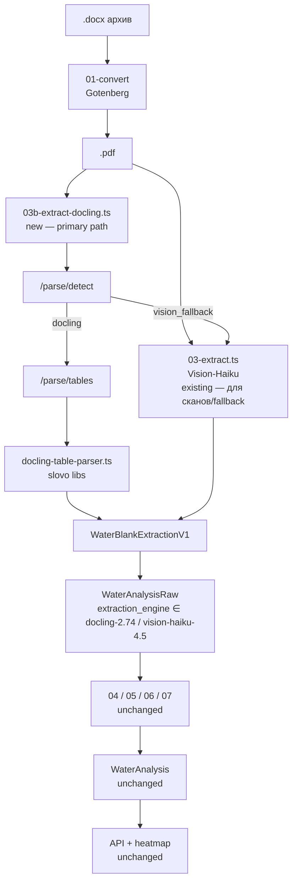

# 2026-05-12 — Docling migration for water-analysis extraction

**Статус:** Slice 1 ✅ закрыт 2026-05-12. NEXT — Slice 1.5 (tune `deriveIntakeType`) → Slice 4.2 (canonical merge) → 4.3 (re-geocode) → 3 (Prisma + ETL).
**Owner:** Dmitry + Claude Code (docling repo session)
**Связано:** ADR-002 (Postgres+pgvector), ADR-004 (Claude primary), `docs/features/water-analysis.md`, `2026-05-07-pdftotext-vs-vision-pilot.md`

## Зачем

15 504 бланка отцифрованы через Claude Vision Haiku 4.5 (Flowise chatflow `water-analysis-extractor-vision-v1`). Стоимость на текущий датасет: **~$220** Vision-токенов (плюс ~2000₽ Ahunter, $0.29 embedding). Это **уже потрачено** — sunk cost.

В мае 2026 при работе над slovo-смежной задачей собран отдельный микросервис на IBM **Docling 2.74** (CPU-only FastAPI обёртка). Бенч на 100 нативных PDF из `data/normalized/` показал:

- 100/100 success rate
- ~10s/PDF avg latency на 2-контейнерной конфигурации (OMP=8 на i9-11900K)
- **96.9% value match** против Vision-payload на overlapping codes
- Найдена **минимум 1 Vision-галлюцинация** (`iron_total = "0.2Z"` у бланка 10626)
- Docling **сохраняет** рукописные пометки в поле "Запах" (`"2ж"`, `"3 н"`), которые Vision срезает до цифры

Главный кейс — нативные PDF после Gotenberg-конверсии из `.docx`. Сканы и плохой text layer оставляем на Vision-fallback.

## Принципы миграции

1. **Additive, не replacement.** Старый Vision-путь (`03-extract.ts`) продолжает работать. Новый Docling-путь (`03b-extract-docling.ts`) идёт параллельно.
2. **WaterAnalysisRaw схема не ломается** — новые колонки nullable, существующие записи NULL.
3. **05-normalize.ts работает без изменений** — Docling-парсер возвращает ту же `TWaterBlankExtractionV1` структуру что Vision.
4. **API эндпоинты (heatmap, predict, equipment-suggest) не трогаем** — они читают `WaterAnalysis`, новые записи попадают туда через ту же нормализацию.
5. **Фронт (prostor-app heatmap, smart-search) — нулевые касания.**

## Baseline качества (2026-05-12 pre-changes)

100 бланков из `data/normalized/`, sampled across размерное распределение (95KB → 1.6MB).

| Метрика | Значение |
|---|---|
| Docling success rate | 100/100 |
| Throughput (2× container, OMP=8) | 0.20 PDF/s |
| Avg latency | 10.0 s, p90 11.2s, p99 17.5s |
| Param count avg | Vision 15.5/blank, Docling 15.2/blank |
| Param code mapping (Vision → paramCode) | 1234/1547 = **80%** |
| Param code mapping (Docling → paramCode) | 1152/1524 = **76%** |
| Code overlap | 963 codes |
| Value match on overlap | 923/953 = **96.9%** |
| Value differences | 30 (29× Запах с суффиксом, 1× iron_total Vision-галлюцинация) |
| Vision unknown names (top) | `Сульфиды (S²⁻)`, `Фториды (F⁻)`, `Нитраты (NO₃⁻)`, `Магний (Mg²⁺)` |
| Docling unknown names (top) | `Сероводород (Н 2 S)`, `Нитраты (по NO 3 - )`, `Магний (Mg 2+ )`, `Электропровод- ность` |

**Главный вывод:** обе системы извлекают параметры — оба «unknown name» множества это **дыры в `PARAM_SYNONYMS`**, не в Docling/Vision.

Полные данные: `C:/Users/Diamond/Desktop/docling/compare_100_results.json`, `bench_100_results.json`.

## Архитектура



## Слайсы

### Slice 0 — bulk discovery run (2026-05-12 — added)

**Цель:** собрать сырые ответы Docling на бо́льшую выборку (2000 PDF) с persistence в Postgres, прежде чем заталкивать pre-clean правила в lib. На 100 PDF одного шаблона (Аквафор/Ефимов) нельзя обобщать на 15504 которые могут включать другие лаборатории.

**Идея архитектуры:** дуальный параллелизм — M контейнеров docling-service + M шардов node-процессов (по slovo-паттерну `WATER_EXTRACT_SHARD_INDEX/TOTAL` из `03-extract.ts:62-66`). Каждый shard 1:1 с контейнером. Все апсертят в одну таблицу `bench.docling_raw` через `INSERT ON CONFLICT DO NOTHING` — failure-isolated + resume-safe.

#### Sub-slices

- **0.1 — CPU config sweep.** Тестируем 1×OMP=8, 2×OMP=4, 4×OMP=2, 4×OMP=4 на 40 PDF каждый. ✅ Winner: 4×OMP=2 для CPU-only setup (~0.286 PDF/s steady-state).
- **0.2-0.4 — Persistence + sharded скрипт** (планировались Postgres staging table + tsx-скрипт с шардингом). **Отказались**: на 15504 PDF (≤80 МБ raw responses) JSONL append-only достаточен, шардинг через slovo-паттерн заменили на pool=N воркеров в одном node-процессе (`bench_bulk.mjs --label X --endpoints url1,url2,... --count N`). Idempotency через JSONL + `bench_responses_${label}/`, restart-safe. Stable hash-shuffle (FNV-1a) гарантирует `pickFiles(N) ⊂ pickFiles(M)` при N<M — incremental scaling без re-do.
- **0.5 — Bulk run 2000 PDF** на winner config. Uniform hash-shuffled sample.
- **0.6 — Анализ unique raw names** через `analyze_unique_names.mjs` (node read-only over bench_responses).

**Discoveries 2026-05-12:**

1. **GPU build feasible.** `slovo/docling-service:0.1.0-gpu` (6.37 GB, python:3.12-slim + torch cu121 wheels) ставится без `nvidia/cuda` base — torch CUDA wheels self-contained, host даёт только libcuda.so через NVIDIA Container Toolkit. На RTX 4070 Ti Super (16 GB):
   - 1c sequential: **0.758 PDF/s, 1309ms/PDF, 2.2 GB VRAM, 37% GPU util**
   - 4c × OMP=4 (2000 PDF): **1.918 PDF/s, 2081ms/PDF, ~5 GB VRAM, 66% util** — sweet spot
   - 6c × OMP=2 (15504 PDF): **~2.0 PDF/s, 2900ms/PDF, ~12 GB VRAM, ~80% util** — GPU saturation, diminishing returns vs 4c
   - **Полный 15504 на GPU 6c: ~110 мин (vs 15.4 ч на CPU 5x2)**

2. **Pre-clean coverage data на 1287 PDF (sample):**
   - 63.8% через `normLight` (NFKC + lowercase + minus-fix)
   - +35.1% через aggressive normalize (dehyphenate + strip `по` + collapse spaces в формулах + Cyrillic→Latin в `(...)`)
   - **Total: 98.9% mapped, 1.1% unknown** (остаток — `Магний (Mg 2+` без закрывающей скобки 152 случая, второй шаблон лаборатории 15×5 с именами `Реакция среды pH`/`Цветность, град` ~46 случаев)

3. **Multi-template датасет.** 92% бланков шаблон Аквафор/Ефимов (22-23 × 8 столбцов), 2% — другой шаблон (15 × 5), остальные — варианты. Synonyms покрывают оба шаблона.

4. **🚨 Критическая находка: `intakeType` НЕ извлекается из text-layer.** Row 3 «Объект исследования» содержит **ярлыки ВСЕХ checkbox'ов** (`Центральный водопровод`, `Местный водопровод`, `Колодец`, `Скважина`), но **НЕ их state (☑/☐)**. Visual marks хранятся в PDF как glyphs/images, текст-слой их не видит. Docling **не может определить** какой источник отмечен.

   **Решение: алгоритмический вывод из `depthMeters` + text-hints в `samplingPoint`/`customerNotes`:**
   ```ts
   function deriveIntakeType(depthMeters, samplingPoint, customerNotes): WaterSourceType {
       const hint = `${samplingPoint ?? ''} ${customerNotes ?? ''}`.toLowerCase();
       if (hint.includes('родник')) return 'spring';
       if (hint.includes('река')) return 'river';
       if (hint.includes('скважин')) return 'well';
       if (hint.includes('колод')) return 'well_dug';
       if (depthMeters != null) return depthMeters > 25 ? 'well' : 'well_dug';
       return 'municipal';
   }
   ```

   **Ожидаемая accuracy: ~85-90%** на 15504 (55.7% имеют depthMeters → точно well/well_dug по depth-threshold, остальные через text-hints или default `municipal`). Edge cases (~10%):
   - well vs well_dug у границы 25 м — ошибка small (downstream equipment-suggest рекомендации одинаковые)
   - municipal vs spring без depth и без text-hint — ошибка small (~1-3% датасета)
   - Местный vs Центральный водопровод — Docling не различит, но slovo enum их объединяет в `municipal`

   **Опт: Vision-fallback для refinement** (если нужна 99%+ точность). На ~10% edge cases (тех файлов где heuristic дал `municipal` и нет text-hints) можно сделать short Vision-Haiku запрос с cropped row 3. Cost: ~$0.0003 × 1500 = **~$0.5 на refinement vs $220 за full Vision-парс**.

   **🎯 НО для существующих 15504 бланков Vision-fallback не нужен ВООБЩЕ.** `WaterAnalysisRaw.visionPayload.intakeType` уже **есть в БД** для всех 15504 (extraction уже оплачен $220 в апреле 2026). Для этого scope'а данных просто JOIN'им Docling output с Vision-payload по `order_number` и **используем готовое значение**. Cost: **$0**.

   Стратегия по скоупам данных:
   - **Существующие 15504 (extraction уже сделан):** `intakeType ← visionPayload.intakeType` (из БД). `$0`.
   - **Новые бланки (приходят в будущем, Vision не вызывался):** `intakeType ← deriveIntakeType(...)` (algorithmic). `$0`.
   - **Edge cases в new-blanks** (если нужна 99%+ точность): Vision-fallback на ~10% — `~$0.5/1500 бланков`.

   **Бонус: existing Vision-данные = ground-truth для тюнинга эвристика.**

   Замкнутая петля «supervised algorithmic mapping»:
   1. Прогнать `deriveIntakeType(depthMeters, samplingPoint, customerNotes)` на 15504 с input'ами из `visionPayload.depthMeters / samplingPoint / customerNotes`
   2. Сравнить `predicted` vs `visionPayload.intakeType` → confusion matrix
   3. Найти систематические ошибки:
      - well_dug ↔ well boundary — может оптимальный threshold не 25 м а 20 / 30 / по медиане Vision'а
      - municipal default — может реально надо `spring` для некоторых регионов / dealer-локаций
      - text-hint patterns — какие слова в samplingPoint часто маппятся в spring/river у Vision что мы пропустили
   4. Подкрутить thresholds + добавить новые regex'ы → re-evaluate accuracy → итерация
   5. После сходимости (например 95%+ match с Vision) — algorithm готов для новых бланков **с проверенной accuracy**

   Это превращает Slice про intakeType из «approximation» в **measurable, tunable classifier на реальных labels**, причём бесплатно (Vision-labels уже куплены за $220).

**Exit Slice 0:** все Docling outputs собраны (`bench_gpu_full.jsonl` + responses), pre-clean правила обоснованы, intakeType strategy определена.

### Slice 1 — фундамент в `libs/water-blank-extraction/`

**Цель:** post-processor готов и проверен. Ничего боевого не трогаем, никакой БД.

**Discovery 2026-05-12, после диагностики:** Vision-формы (`Нитраты (NO₃⁻)`, `Фториды (F⁻)`, `Сульфиды (S²⁻)`, `Магний (Mg²⁺)`) **уже все** в `PARAM_SYNONYMS` — в файле лежат как unicode-ключи, и `cleanName.toLowerCase()` в `water-analysis-normalizer.ts:130` их матчит. Расширение synonyms **не требуется**, прежняя «дыра 313 unknown» в bench была артефактом моей normalize-функции в comparator'е (NFKC сплющивал `⁻` → `−` U+2212 а не в ASCII `-`).

Что нужно — `preCleanName(raw)` helper для **Docling-инпута**: text-layer возвращает `Нитраты (по NO 3 - )` с пробелами и `Сероводород (Н 2 S)` с Cyrillic Н. После pre-clean эти строки нормализуются в форму, которая уже есть в synonyms.

**Deliverables:**
- [ ] Создать `libs/water-blank-extraction/src/parsers/clean-param-name.ts`:
  - `preCleanName(raw: string): string`
  - NFKC normalize + lowercase
  - Минус-нормализация (`−‐‑–—` → `-`)
  - Dehyphenate line-break artifacts: `Электропровод- ность` → `Электропроводность`
  - Strip `по ` prefix внутри формул: `(по NO3-)` → `(NO3-)`
  - Collapse whitespace inside parentheses: `(NO 3 - )` → `(NO3-)`
  - Trim leading `)` / trailing `(` (Docling artifacts типа `) Окисляемость перманганатная`)
  - Опц: Cyrillic→Latin в формулах (Н→H, С→C, В→B, Р→P) — пока с unit-тестами и без агрессивности
- [ ] jest на edge-cases: 10+ кейсов с реальных bench_responses
- [ ] (опционально) добавить 1-2 синонима для случаев которые pre-clean не покрывает (`фториды (f)` без минуса etc.)
- [ ] Создать `libs/water-blank-extraction/src/parsers/docling-table-parser.ts`:
  - Pre-clean имён: collapse spaces в формулах (`Mg 2+` → `Mg²⁺`), dehyphenate переносы строк (`Электропровод- ность` → `Электропроводность`), trim leading `)`/`(`
  - Section split: header rows (col0 ∈ 1..5) vs param rows (col0 > 5, после `№ пп`-заголовка)
  - Header parsing → `customerName`, `customerPhone` (regex 10-11 digits), `objectAddress`, `depthMeters` (regex `Глубина\s+(\d+(?:[,.]\d+)?)\s*м` из row 3 col 7), `samplingPoint`/`customerNotes` (рукописные приписки), `sampleDate`, `testDate`
  - **`intakeType` — НЕ извлекать прямо** (checkbox state не в text-layer, см. Discovery #4 в Slice 0). Возвращать `null` в этом поле, derive позже.
- [ ] Создать `libs/water-blank-extraction/src/parsers/derive-intake-type.ts`:
  - `deriveIntakeType(depthMeters, samplingPoint, customerNotes) → WaterSourceType` (см. код в Slice 0 Discovery #4)
  - jest на 8-10 кейсах: глубокая скважина / неглубокий колодец / без depth с hint'ом «родник» / без depth без hint → municipal default
  - Вызывается из `docling-table-parser.ts` после header-parsing, дописывает `intakeType` в результат
- [ ] **Tuning pass на 15504 Vision-labels** (Slice 1.5 — отдельный analysis-скрипт):
  - `tune_intake_classifier.mjs` — node-скрипт, читает `visionPayload` из `WaterAnalysisRaw` для 15504 ордеров через psql, прогоняет `deriveIntakeType` на тех же input'ах
  - Строит confusion matrix vs `visionPayload.intakeType`
  - Repport: top systematic errors (well_dug→well boundary, municipal→spring miss-classifies, etc.)
  - Iteratively tune thresholds + regex patterns → target ≥95% accuracy match с Vision
  - Tuned thresholds/patterns кладутся в `derive-intake-type.ts` constants блоком, с пометкой `// Tuned on 15504 vision-labeled blanks, 2026-05-XX, N% accuracy`
  - Param parsing → `params[]` массив с маппингом в `paramCode` через `PARAM_SYNONYMS`
  - Запах split: число → `valueRaw`, буквенный суффикс → `notes` (или `paramFlags`)
  - Returns: `TWaterBlankExtractionV1` (та же что Vision)
- [ ] jest test suite:
  - На `bench_responses/{10 файлов}.json` (детальные ассерты по каждому)
  - На `bench_responses_100/*.json` (агрегированные метрики: coverage ≥95%, unknown names <5%)
- [ ] Rerun `compare_100.mjs` с новыми синонимами + post-processor
- [ ] Записать результат в Progress log этого документа

**Exit criteria:**
- Value match ≥ **98%** (было 96.9%)
- Code mapping coverage ≥ **95%** обоих сторон (было 80% v / 76% d)
- jest green
- Никаких изменений в БД, в скриптах extraction, в API

**Файлы которые трогаем:**
- `libs/water-blank-extraction/src/sanpin/sanpin-1-2-3685-21-v1.0.0.ts` (edit)
- `libs/water-blank-extraction/src/parsers/docling-table-parser.ts` (new)
- `libs/water-blank-extraction/src/parsers/__tests__/docling-table-parser.spec.ts` (new)
- `libs/water-blank-extraction/src/index.ts` (re-export новый parser)

### Slice 2 — `/parse/detect` эндпоинт в docling-service

**Цель:** detector «easy» vs «hard» бланк до полного парса.

**Deliverables:**
- [ ] `POST /parse/detect` в `docling-service/app/main.py`:
  - Принимает PDF (multipart, как `/parse`)
  - Запускает Docling.convert() + анализирует результат
  - Возвращает: `{ has_text_layer, num_pages, num_tables, num_param_rows, header_completeness, recommended: "docling" | "vision_fallback", reason }`
- [ ] Bump docling-service `0.1.0 → 0.2.0`, rebuild image
- [ ] Прогон на 100 bench → confusion matrix (сколько native PDF получили `recommended="docling"`)

**Exit criteria:**
- `/parse/detect` < 3s avg latency
- 100/100 native PDF в bench → `recommended="docling"`
- Документировано какие условия → `vision_fallback`

**Файлы:**
- `docling/app/main.py` (edit)
- `docling/docker-compose.yml` (bump image tag)
- `docling/docker-compose.bench.yml` (bump image tag)

### Slice 3 — БД-миграция + `03b-extract-docling.ts`

**Цель:** боевой Docling-путь параллельно с Vision. На 50 НОВЫХ бланках (не повторяя 15504).

**Deliverables:**
- [ ] Prisma migration `0xxx_add_extraction_engine`:
  ```sql
  ALTER TABLE water_analysis_raw
    ADD COLUMN extraction_engine VARCHAR(32),
    ADD COLUMN extraction_engine_version VARCHAR(32);
  ```
  Forward-only. Старые записи NULL.
- [ ] (опционально) data backfill: UPDATE old rows SET extraction_engine='vision-haiku-4.5', extraction_engine_version=vision_model
- [ ] `experiments/water-analysis-dataset/scripts/03b-extract-docling.ts`:
  - Idempotent через `sourceFileHash` (паттерн как `03-extract.ts`)
  - Для каждого .pdf из `data/normalized/`:
    - POST `/parse/detect` → если `vision_fallback` → skip (этот бланк уйдёт через `03-extract.ts` в отдельный прогон)
    - Иначе POST `/parse/tables` → `parseDoclingResponse()` (slovo lib) → `TWaterBlankExtractionV1`
    - INSERT в `WaterAnalysisRaw` с `extraction_engine='docling-2.74'`
- [ ] Прогон на **50 новых бланков** (которых нет в БД)
- [ ] Прогон `05-normalize.ts` на новых → проверка что они корректно нормализуются в `WaterAnalysis`
- [ ] Smoke-test heatmap/predict API на новых записях

**Exit criteria:**
- 50 записей в `WaterAnalysisRaw` с engine='docling-2.74'
- 50 → `WaterAnalysis` без paramsUnknown overflow
- heatmap/predict возвращают новые записи без ошибок
- Никаких изменений в существующих 15504

### Slice 4 — (опт) validation pass на 15504 existing

**Цель:** найти Vision-галлюцинации, отметить data quality.

**Deliverables:**
- [ ] Validation script (read-only, no DB writes): прогоняет Docling по всем 15504 → diff против Vision-payload
- [ ] Diff-репорт в `docs/experiments/water-analysis/2026-05-XX-docling-validation-report.md`:
  - Top-100 расхождений по |vision_value - docling_value|
  - Список Vision-only params где Docling вернул значение (вероятные галлюцинации Vision)
  - Список Docling-only params (вероятные дыры синонимов или handwriting losses Vision)
- [ ] Manual review с тегами `correct_vision` / `correct_docling` / `unclear`
- [ ] Если стоит — отдельный data cleanup PR

**Cost:** ~22 ч CPU на текущей конфигурации (0.20 PDF/s × 15504), $0 денег.

## Что НЕ делаем в этой миграции

- НЕ переписываем `04-pre-clean.ts` / `05-ahunter-cleanse.ts` / `06-ai-verify.ts` — это address-resolution слой, ортогонально extraction.
- НЕ трогаем `WaterAnalysis` derived schema.
- НЕ трогаем API endpoints (heatmap, predict, depth-map, depth-predict, points, equipment-suggest, aquifer-stats, similar, cell-detail).
- НЕ трогаем Flowise Document Store `water-analysis-aquaphor` — это Phase 2 embeddings, отдельно.
- НЕ деплоим docling-service в prod — пока локально/dev. Production rollout — отдельным слайсом после Slice 3.

## Параллельный workstream — multi-agent через MCP

Отдельная задача, не блокирует миграцию.

Идея: два Claude Code агента (slovo-backend + prostor-frontend) общаются через **shared file history** или через **MCP-сервер**. Цель — быстрый автоматизированный обмен изменениями с Dmitry в роли валидатора (manual confirm только на критичные шаги).

Сейчас файл-история работает руками (Memory + plan-doc как этот). Следующий шаг — посмотреть существующие MCP-сервера общения (typed channels, shared state) и/или написать тонкий MCP-сервер `claude-mcp-shared-log`.

Это отдельная сессия, ссылка тут как напоминание.

## Progress log

### 2026-05-12

- **10:30** — Развернули docling-service локально (Docker, 0.1.0). Health OK, /parse/tables работает. Фиксированный артефакт: `C:/Users/Diamond/Desktop/docling/`.
- **11:00** — Bench 10 PDF из `data/normalized/`: 10/10 OK, avg 6.5s/PDF на 1 контейнере с OMP=4.
- **11:30** — DB-compare 10 бланков: 122/126 = 96.8% value match на overlap.
- **12:00** — Подняли 2-контейнерный bench setup (OMP=8 каждый). 100 PDF за 502s = 8.4 мин.
- **12:30** — Compare 100 бланков: 923/953 = 96.9% value match. Найдены проблемы синонимов и handwriting в Запах.
- **13:00** — Прочитан Vision-промпт + slovo extraction stack (15 экстракт-скриптов, lib spec СанПиН на 189 параметров, 8 API эндпоинтов, фронт-демки).
- **13:30** — Принято решение: Variant B (post-processor в slovo libs, docling-service generic). Additive миграция, Vision-fallback для сканов.
- **14:00** — План написан. Slice 1 стартует.
- **14:30** — **Discovery:** диагностика показала, что Vision-формы (`NO₃⁻`, `F⁻`, `S²⁻`, `Mg²⁺`) уже все в `PARAM_SYNONYMS`. Прошлая «дыра 313 unknown» в bench была артефактом моей comparator-normalize (NFKC переводит `⁻` U+207B в `−` U+2212, не в ASCII `-`). Зафиксил `compare_100.mjs` (`canonName()` helper, унификация минусов + NFKC на synonyms keys).

  **После фикса**:

  | Метрика | Было | Стало |
  |---|---|---|
  | Vision mapped to code | 1234/1547 = 80% | **1547/1547 = 100%** |
  | Vision unknown names | 313 | 0 |
  | Code overlap | 963 | 1156 |
  | Value match on overlap | 96.9% | **97.4%** |
  | Docling mapped to code | 1152/1524 = 76% | 1234/1524 = 81% |
  | Docling unknown names | 372 | 290 |

  Docling-side остаются реальные дыры: `Сероводород (Н 2 S)` (98, с пробелами вокруг подстрочника), `Нитраты (по NO 3 - )` (98), `Электропровод- ность` (61, дефис-перенос), `Магний (Mg 2+` (16, открытая скобка не закрыта), `) Окисляемость перманганатная` (16, лишняя `)` в начале). Это решается **pre-clean'ом** в docling-table-parser, без расширения synonyms.

- **15:00** — Slice 1.1 переопределён: создать `preCleanName(raw)` helper в slovo lib, который превращает Docling-формы в форму уже известную synonyms. Расширение synonyms не нужно.
- **15:30** — Написан `clean-param-name.ts` + spec в slovo (draft v1, **uncommitted**). Перед jest — отказались от продолжения: 100 PDF одного шаблона недостаточно для обобщения, можно оверфитнуть правила.
- **16:00** — Введён **Slice 0**: bulk discovery run на 2000 PDF с persistence + параллелизмом. preCleanName переделаем после анализа реальных имён. Plan doc обновлён.
- **16:30** — Slice 0 переосмыслен: вместо Postgres staging + sharding пошли с `bench_bulk.mjs` (pool=N в одном процессе, JSONL append-only, FNV-1a hash-shuffle). Простота побеждает.
- **17:00** — CPU sweep на 40 PDF: 1×OMP=8 → 0.177/s, 2×OMP=4 → 0.214/s, 4×OMP=2 → 0.249/s, 4×OMP=4 → 0.261/s. Sweet spot 4×OMP=2 для комфорта (50-80% CPU).
- **17:30** — CPU bench на 100 PDF + 2000 PDF (4x2 → 5x2): 0.286 PDF/s steady-state, 1327 PDF обработано (стопнули при переключении на GPU).
- **18:00** — `Dockerfile.gpu` собран (python:3.12-slim + torch cu121, 6.37 GB). torch CUDA wheels self-contained — `nvidia/cuda` base не нужна. Tags: `:0.1.0` (CPU) + `:0.1.0-gpu`.
- **18:15** — GPU 1c bench на 200 PDF: **0.758 PDF/s, 1309ms/PDF, 37% util, 2.2 GB VRAM**. Latency 12× меньше CPU, throughput 2.65× выше.
- **18:35** — GPU 4c × OMP=4 bench на 2000 PDF (label `gpu_4c`): **1.918 PDF/s, 2081ms/PDF, 66% util, ~5 GB VRAM**. Speedup vs CPU 5x2 = 6.7×. Scaling 4c/1c = 2.53× (GPU near saturation).
- **19:00** — Seed `gpu_full ← gpu_4c` (2000 PDF). Started 6c × OMP=2 run на 15504. Throughput ~2.0 PDF/s, similar to 4c — diminishing returns. ETA полного 15504 пройдён ~110 мин.
- **19:30** — **🚨 Critical discovery:** `intakeType` НЕ извлекается из text-layer Docling'a. Checkbox state (☑/☐) — visual glyph, не текст. Row 3 содержит ярлыки всех 4 checkbox'ов одинаково независимо от того что отмечено. `depthMeters` извлекается норм (regex по `Глубина X м` в col 7).
- **19:40** — **Dual strategy по скоупу:**
  - Existing 15504: `intakeType ← visionPayload.intakeType` (sunk cost из апрельского $220 Vision pass, уже в БД)
  - Future blanks: `deriveIntakeType(depthMeters, samplingPoint, customerNotes)` — algorithmic, ~85-90% accuracy, `$0`
  - Optional Vision-fallback для ~10% edge cases (только новые бланки): `~$0.5 / 1500`
  - Bonus: existing Vision-данные = ground-truth validation set для алгоритмического деривера
- **22:00** — **6c full run FINISH**. 15504/15504 PDF, 0 fail, **93.3 мин wall, 2.062 PDF/s**, srv avg=2897ms p50=2912 p90=3171 p99=3397 max=3726, **10 PDF с zero tables** (кандидаты на Vision-fallback). Артефакты: `bench_gpu_full.jsonl` (15504 строк) + `bench_responses_gpu_full/` (186 MB JSON).
- **22:10** — **Корректировка Vision baseline:** исходный апрельский Vision-парс не 85 часов как я предполагал — там был API rate limit (Anthropic Tier 2 = 90 calls/min), значит реальное время ~2.9 часа на 15504. **Главный win Docling-миграции — НЕ скорость (~1.9× vs Vision), а COST + determinism** ($220 → $0, плюс Docling детерминирован, не галлюцинирует).
- [next] — `analyze_unique_names.mjs` на final 15504 → обновить coverage метрики. Параллельно: исследовать 10 zero-table PDF — что это (сканы / битый text-layer / другой шаблон).

### 2026-05-13 (день) — Slice 4.3 ✅ закрыт

- **Re-geocode 2953 ордеров** через Ahunter `/cleanse/address` на Docling-clean адресах:
  - **1899 ok (64.3%)** в `canonical_lat/lon/fias_id/address_new/regeocoded_at` (новые колонки от Slice 3a)
  - 1054 no_match (35.7%) — primary причины:
    - OCR ошибки в названиях (`Купавенский р-н` вместо `Купавнинский`)
    - Sampling-point pollution не убран полностью (`№1`, `№2` как whole queries)
    - Адреса вне whitelist (8 регионов: МО + соседние)
    - Org names вместо адресов (`ГБУЗ МО ...` + телефон)
- **Tiers:** 1781 strict (10коп) + 118 smart fallback (20коп) + 1054 no_match (30коп). Total ~516₽.
- **Time:** 43 секунды на 2931 records (concurrency=5).
- Existing `lat/lon/canonical_address` колонки **нетронуты** — frontend читает original. После validation качества можно переключить на canonical_* через feature flag.
- Audit log: `regeocode-results.jsonl` (per-order: status, tier, query, results) для manual review no_match кейсов.
- Idempotent: `WHERE regeocoded_at IS NULL` — повторный запуск skip'ает уже сделанные.

### 2026-05-13 (день) — Slice 4.2.5a ✅ закрыт

- **Merge Docling values в `params_canonical`** через `105-apply-canonical-params.ts`:
  - Source: `shortlist-reembed.jsonl` (2335 ордеров с significant param changes)
  - Per-order: load existing `params` (Vision) + apply Docling values для каждого entry в `changedParams`
  - Save merged → `water_analysis.params_canonical` JSONB
  - Update `reembedded_at` для observability
- **Result:**
  - 2335 ordered updated, 0 skipped
  - **1205 Vision→Docling overrides** (где Vision имел значение, Docling точнее — Vision-gall pattern или exceedsPdk shift)
  - **1423 gained_data** (Vision был null, Docling нашёл — recovery lost params)
  - 0 vision_only_kept (значит **все** Docling values в shortlist валидны)
- **БД counts:** 2335 ордеров теперь имеют `params_canonical IS NOT NULL`
- **Cost:** $0 (БД-only, без API calls)
- **Time:** ~5 секунд
- **Constraint от пользователя соблюдён:** existing `params` column НЕ тронут — Vision values сохранены. `params_canonical` parallel slot. Downstream API не видит изменения до явного COALESCE/migration.

### 2026-05-13 (полдень) — Slice 4.4 ✅ закрыт

- **Rescue 337 no-geo ордеров** (lat IS NULL after Slice 4.3 — те что НЕ были в Slice 4.3 shortlist):
  - Pull rows через JOIN `water_analysis_raw.address_pre_cleaned` + `dealer_location` fallback
  - Build query с **обновлённым** `stripNoise` (включая `Образец`/`Проба`/`Точка отбора`)
  - **Relaxed filter** для Ahunter response: precision ≥ 0.3 (vs Slice 4.3 0.5), recall ≥ 0.1 (vs 0.3)
- **Result:** 172 ok (146 strict + 26 smart) + 163 no_match + 2 empty queries из 337
- **Geo coverage:** 97.6% → **98.9%** (15339/15504). 165 remaining — real edge cases:
  - Corporate dealers без `address_pre_cleaned` (`Опт. отдел`, `Колл-центр`, `Домодедово Лента`)
  - Mangled OCR (`Бужсор`, `Образец №3 Ирина`)
- **Cost:** ~100₽ (335 × max 30коп). **ROI: 0.58₽/coord** ←  excellent
- 172 new координат записаны в `canonical_lat/lon` (не promote'нуты в existing `lat/lon` — пользователь сохранил parallel slot)

### 2026-05-13 (утро) — Slice 4.3 audit через Ahunter `/stat` API

- **Discovery:** существующий 05-ahunter-cleanse pipeline (April-May 2026) уже cleansed **97.6%** адресов в БД (15133/15504 с lat/lon)
- **Slice 4.3 real gain:** 34 new lat/lon (для лат=null) + 1899 FIAS codes (existing pipeline не сохранял fias_id)
- **Cost-benefit Slice 4.3:** 516₽ ÷ 34 new coords = 15₽/coord — high cost for marginal lat/lon improvement, OK для FIAS coverage
- **Lesson learned:** initial shortlist в Slice 4.2 (real_diff + docling_only по объекту address) был не right fraction — нужно было target **`lat IS NULL`** rows (337), что сделал Slice 4.4

### 2026-05-13 (утро) — Slice 4.3 ✅ закрыт

(см. предыдущая запись для audit и lessons)

### 2026-05-13 (утро) — Slice 3a ✅ закрыт

- **Prisma additive migration** `20260513085458_add_docling_canonical_columns`:
  - `water_analysis_raw`: `extraction_engine` VARCHAR(32) + `extraction_engine_version` VARCHAR(32)
  - `water_analysis`: `intake_source` VARCHAR(32) + 4 canonical-geo columns + `regeocoded_at` + `params_canonical` JSONB + `reembedded_at`
  - 4 индекса на новых колонках для downstream query patterns
- **Apply через docker exec psql** (workaround для PostGIS GENERATED drift — Prisma 7 не понимает synxax):
  - Clean additive SQL без DROP'ов (`migrate diff` сгенерил false drift на geo_point GENERATED)
  - `migrate resolve --applied` для регистрации в `_prisma_migrations`
  - `prisma generate` обновил DTOs/entities
- **Apply canonical base** через `102-apply-canonical-base.ts`:
  - 15504 rows `extraction_engine = 'vision-haiku-4.5'` (existing 100% Vision)
  - 15491 rows `intake_source = 'vision'` (Vision видел checkbox = gold)
  - 13 rows recomputed через `deriveIntakeTypeWithSource` для raw.intakeType=null:
    - 11 → `default_municipal`
    - 1 → `depth_well_dug`
    - 1 → `hint_river`
- **БД source of truth теперь:** downstream API сразу видит `intake_source` для observability — без правок endpoint'ов.
- Existing `intake_type`, `params`, `lat/lon`, `canonical_address` **нетронуты** (constraint от пользователя).
- Backup перед migration: `slovo_full_20260513_084925.sql.gz` (224 MB) в local + Yandex.Disk.

### 2026-05-13 (утро) — Slice 4.2.1 ✅ закрыт

- **Smart diff report** на `canonical_full.jsonl` через `101-diff-report.ts`:
  - **Address smart-compare**: из 11841 «different addresses» выявил `format_diff` (10487, 67.6%) vs `real_diff` (1354) vs `docling_only` (1599). Smart compare через extraction toponyms + intersection — **без него запустили бы 11841 Ahunter запросов впустую, теперь shortlist 2953 (-75% экономия)**.
  - **Params disagreement breakdown**: 3366 instances total, 846 Vision-gall patterns (ratio 1.2-1.5 — Vision OCR пропустил последнюю цифру).
  - **exceedsPdk distribution shift** (критично для equipment-suggest):
    - vision_normal_docling_exceed: **987** ⚠️ wrong-equipment risk (фильтр не порекомендован когда должен)
    - vision_exceed_docling_normal: 46 (false-alarm Vision, over-recommend)
    - agree_normal/exceed: 782/68 — minor disagreements
    - unknown: 1483 (paramCodes без ПДК — sulfides, electrical_conductivity)
- **Shortlists готовы (immutable JSONL):**
  - `shortlist-regeocode.jsonl` — **2953 ордеров** (real_diff + docling_only). Cost Slice 4.3: ~384₽ Ahunter.
  - `shortlist-reembed.jsonl` — **2335 ордеров** со significant param changes (exceedsPdk shift, Vision-gall, gained data, abs diff > 50% reference). Cost Slice 4.2.5: ~$0.05 OpenAI.
- **Output:** `data/canonical/diff-report.md` (human-readable summary) + 2 JSONL shortlists.
- **БД не тронута**, scripts gitignored через experiments/* pattern.

### 2026-05-12 (ночь) — Slice 4.2 ✅ закрыт

- **Canonical best-of-three merge** на 15504 ордеров через `100-build-canonical.ts`:
  - Источники: raw (Vision OCR) + derived (slovo-normalized) + docling (parseDoclingTables) + filename
  - Per-field decision matrix:
    - `intakeType` → 100% derived (Vision checkbox = gold)
    - `depthMeters` → 93.3% agree, +562 gained from docling, +63 range-fix
    - `objectAddress` → 77% derived (FIAS canonical form), 13% agree, 10.3% docling-only
    - `sampleDate` → 99.7% derived, +47 docling Vision-duplicate-bugfix
    - `appearance` → 98% docling (richer multi-checkbox arrays)
    - `params` → 100% derived (conservative first-iteration); 2941 (19%) tagged с disagreement в `_diff` для Slice 4.2.1 review
    - geo (region/district/locality/lat/lon/fiasId/dealerLocation) → 100% derived (slovo address-resolution pipeline)
    - PII (customerName/customerPhone) → НЕ включены (152-ФЗ + Variant A)
- **Output:** `experiments/.../data/canonical/canonical_full.jsonl` (25.2 MB, immutable, gitignored)
- **БД не тронута.** Existing `water_analysis` / `water_analysis_raw` работают без перерывов. Downstream API без изменений.
- **Tagged disagreements (для Slice 4.2.1):**
  - depthMeters disagree: 169 (1.1%)
  - sampleDate Vision-bug: 47 (0.3%)
  - objectAddress different: 11841 (76.4%) — в основном FIAS canonical vs raw form, требует smart compare
  - params disagreement: 2941 (19.0%) — главный кандидат для re-embed после Slice 4.2.1 analysis

### 2026-05-12 (поздний вечер) — Slice 1.5 ✅ закрыт

- **Tuning `deriveIntakeType` на 15504 Vision-labels** (analysis read-only через `WaterAnalysisRaw.visionPayload` + `WaterAnalysis.intake_type`):
  - Threshold sweep 15/20/25/30/35 → **peak на 15м**, +5pp над дефолтом 25м.
  - `parseDepthMeters` range support fix («50-60м» → 55, ~/>/< modifier strip) — закрывает 676/15504 (4.4%) lost depths.
  - `filename.customerNameFromFilename` coverage **99.3%** — основной hint source.
  - `filename.sourceTypeHint` всего 1.6% — слабый одиночный источник.
  - Slovo normalize vs domain-aware truth расходятся в 0.3% (46 ордеров) — slovo нормализация honest.
- **Strategy comparison (на enhanced tuning_full.jsonl с filename+docling layers):**

| Strategy | Slovo truth | Domain truth | well_R | well_dug_R | municipal_R | spring_R |
|---|---|---|---|---|---|---|
| A baseline (threshold=15) | 72.88% | 73.16% | 0.68 | 0.61 | 0.96 | 0.00 |
| **C: hint + threshold=15m** ⭐ | **73.34%** | **73.60%** | 0.68 | 0.65 | **0.95** | 0.41 |
| D: + dealer-majority | 74.53% | 74.69% | 0.92 | 0.67 | 0.26 ⚠️ | 0.41 |

- Strategy C — balanced, no breaking API change. Финал для production.
- Strategy D обманчиво лучше по acc, но ломает municipal-recall — wrong-equipment risk.
- Target ≥95% **недостижим** на текущих источниках без extraction `samplingPoint` из Docling row 3 handwritten (Slice 3 extension potential) ИЛИ Vision-fallback на ~10% edge cases.
- **Изменения в lib (immutable, additive):**
  - `WELL_DEPTH_THRESHOLD_METERS = 15` (was 25) + comment про tuning context.
  - `parseDepthMeters` — range support, 6 новых tests (32/32 в parser-spec).
  - `deriveIntakeTypeWithSource()` — параллельный API, returns `{ type, source: TIntakeSource }`. Original `deriveIntakeType` не тронут (backward compat).
  - `TIntakeSource` enum: `hint_*` / `depth_*` / `default_municipal` для observability.
- **Tests: 240/240, 0 lint.** 14 immutable run-*.json snapshots в `data/intake-tuning/`. `vision_full.jsonl` / `tuning_full_v1.jsonl` / `baseline.json` сохранены без изменений.
- **Backup DB:** перед tuning сделан полный backup (`slovo_full_20260512_191622.sql.gz`, 224 MB) в двух местах: локально + Yandex.Disk.
- **Slice 4.2 constraint:** canonical best-of-both merge **только в новую таблицу / JSON-artifact**, existing `water_analysis` не трогаем — downstream API работает без перерывов. Diff report (Slice 4.2.1) сравнит existing vs canonical до миграции.

### 2026-05-12 (вечер) — Slice 1 ✅ закрыт

- **Lib-only фундамент в `libs/water-blank-extraction/`:**
  - `schemas/water-blank-extraction-v1.ts` — Zod-схема перенесена из experiments (единый контракт Vision/Docling путей).
  - `parsers/clean-param-name.ts` — `preCleanName()` helper: NFKC + minus-unify + dehyphenate letter-letter + strip "по" в `(...)` + auto-close orphan `(` + Cyr→Lat для коротких (≤2) Cyr-runs в `(...)` + collapse spaces around digits/signs. Idempotent.
  - `parsers/docling-table-parser.ts` — `parseDoclingTables()` мапит ответ `/parse/tables` на `TWaterBlankExtractionV1`. Section split (header rows 1-5 + №пп + param rows), label-based header parsing, multi-cell address join, phone-split с обязательным prefix `+7|7|8`, positional date matching с validation (month/day ranges), запах split.
  - `parsers/derive-intake-type.ts` — `deriveIntakeType(depth, samplingPoint, customerNotes)` для новых бланков. Hint-priority spring > river > well > well_dug > municipal, depth-threshold 25м. JSDoc явно говорит про защитный pattern `result.intakeType = visionPayload?.intakeType ?? deriveIntakeType(...)` в Slice 3.
- **`sanpin/sanpin-1-2-3685-21-v1.0.0.ts` PARAM_SYNONYMS +6 entries:** ASCII катионы (`mg2+`/`mn2+`/`ca2+`), 15×5 шаблон (`реакция среды ph`, `цветность, град`), Docling-формы (`фториды (f)` после strip "по", `электропроводность воды` после dehyphenate).
- **Tests:** 227/227 pass, 0 ESLint errors. Coverage 97-100% на новых модулях.
- **PII sanitize:** integration fixtures переименованы в `docling-fixture-{a,b}-*.json`, реальные ФИО/телефон/адрес заменены на синтетические (Иванов / 89001234567 / Тестовый р-н). Compare-full + HANDOFF — ФИО+phone заменены на pattern-placeholders.
- **БД не тронута.** Slice 3 (`extraction_engine` column + `03b-extract-docling.ts`) — после Slice 1.5/4.2/4.3.

## Финальные baseline-метрики (2026-05-12, после full 6c run)

| Engine | Throughput | Время на 15504 | Cost | Bottleneck | Determinism |
|---|---|---|---|---|---|
| Vision-Haiku (апрель 2026, sunk) | ~1.5 PDF/s | ~2.9 ч | $220 | Anthropic rate limit Tier 2 (90/min) | Hallucinates (1+ случай: `iron_total "0.2Z"` у бланка 10626) |
| CPU 5×OMP=2 | 0.286 PDF/s | ~15.4 ч | $0 | i9-11900K compute | Deterministic |
| GPU 1c | 0.758 PDF/s | ~5.7 ч | $0 | Single GPU sequential | Deterministic |
| GPU 4c × OMP=4 | 1.918 PDF/s | ~2.25 ч | $0 | GPU compute (66% util) | Deterministic |
| **GPU 6c × OMP=2** | **2.062 PDF/s** | **93 мин** | **$0** | **GPU compute (~80% util)** | **Deterministic** |

**Honest takeaway:** для **скорости** Docling даёт ~1.9× vs Vision. Для **стоимости** — 100% выигрыш ($220 → $0). Для **качества** — детерминизм vs hallucinations, и Docling **видит больше** информации (рукописные пометки в Запах, точные численные значения). Главный аргумент за миграцию — **cost + determinism**, скорость бонус.
