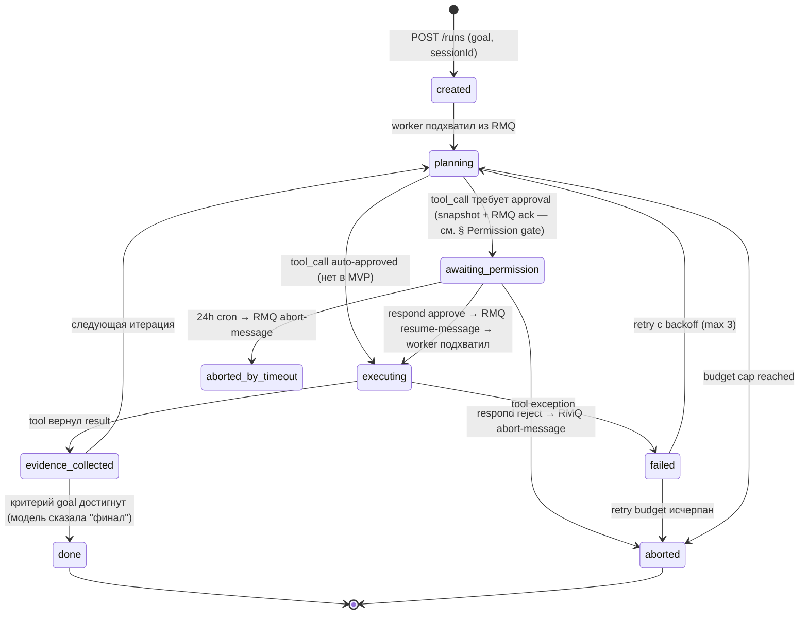
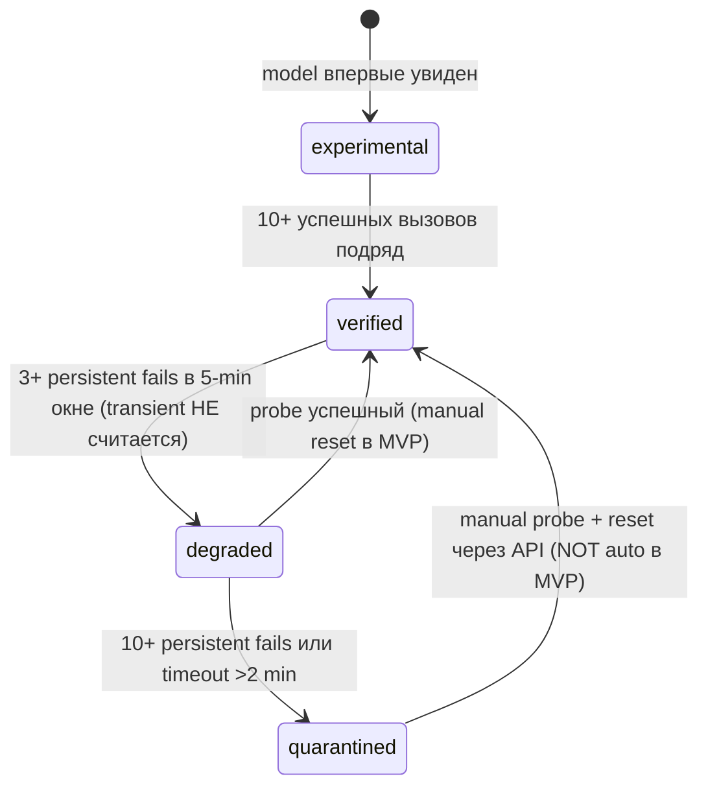
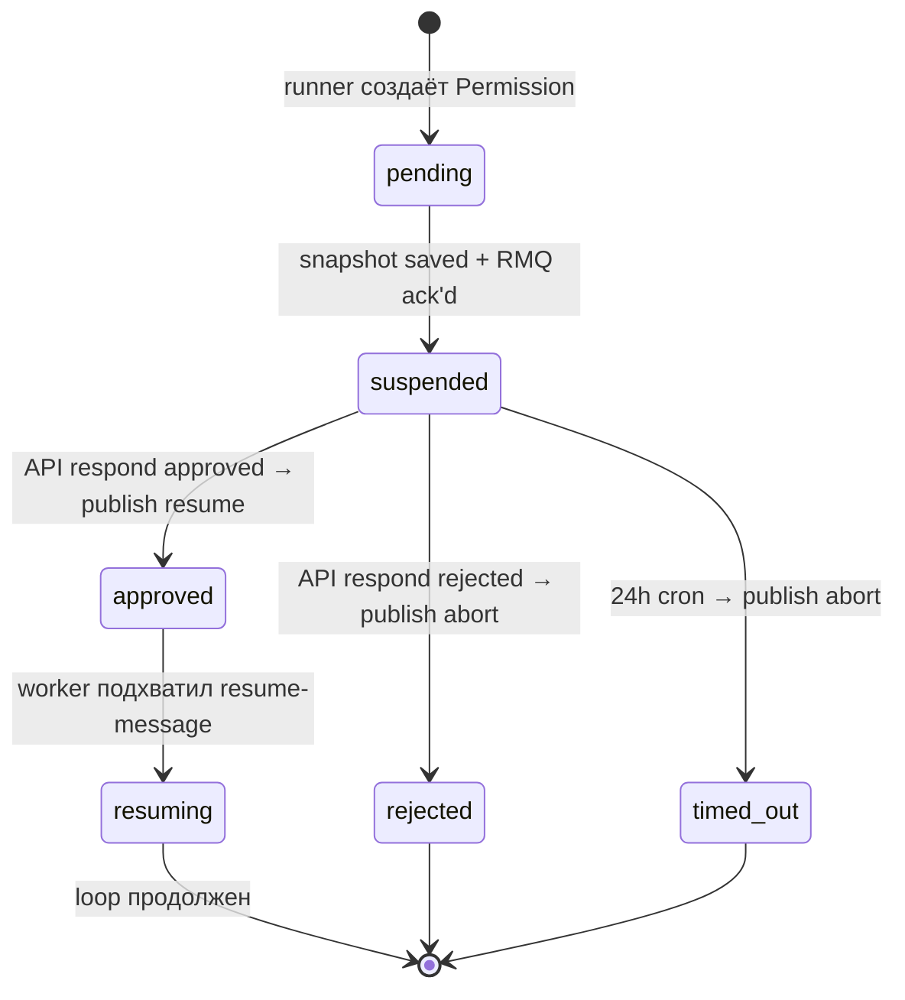

# Agentic core — vertical slice MVP

> **Статус:** 🟡 Plan mode — pending approval. Код **не** пишется до апрува.
>
> **Update 2026-07-09 (spike B0 → HYBRID v4):** проведён живой спайк OpenCode (v1.17.9, 5 test runs). Вывод — **не строить loop/adapters с нуля**, а adopt готовый runtime (loop / MCP bridge / multi-provider / permission gate / persistence / cost tracking) и строить только governance-слой поверх: dedup-by-event (A5), error classifier (A6), SSE proxy (A7), budget watchdog, Langfuse hook. Секции «Что строим» / Phase 2 (LLM adapters) / Phase 3 (loop core) ниже отражают **до-спайковый** план и пересматриваются в ADR-012. Lab journal: `experiments/agentic-core/opencode-spike-2026-06-22.md`.
>
> **Связанный ADR:** [`docs/architecture/decisions/011-agentic-core-runner-orchestration.md`](../architecture/decisions/011-agentic-core-runner-orchestration.md).
>
> **Дата:** 2026-06-19.
>
> **Триггер запуска:** approve этого spec. Триггер дальнейших ADR (-012 sub-agents, -013 multi-provider failover) — только при positive eval-гейте этого slice.

---

## Цель

Доказать end-to-end что agentic loop поверх существующего slovo стека работает: одна реальная цель проходит **goal → plan → 1 MCP-tool под permission-гейтом → evidence → snapshot** с SSE стримом, persistent runner, ModelHealth state machine, observability в Langfuse.

**Eval-гейт slice'а**: 7 пунктов из ADR-011 (§ Eval-гейт для MVP slice) — все одновременно.

**Гипотеза:** наш стек (RabbitMQ + Postgres + NestJS worker + MCP-сервер) даёт всё необходимое для production agentic runner. Конкретно: persistence через event sourcing в Postgres, координация worker resume через RMQ (suspend/resume на permission гейтах — см. § Permission gate), SSE push в браузер через LISTEN/NOTIFY, observability через Langfuse — без новых зависимостей.

**Что НЕ цель:**
- Sub-agents / параллельный exec — ADR-012
- Multi-provider failover на runtime — ADR-013
- Edge-runner — ADR-014
- Production-grade UX (UI / approval frontend) — отдельный фронтовой spec
- Замена существующих RAG-chatflows — agentic слой рядом, не вместо

---

## Boundary slice (что в MVP, что нет)

| В MVP | НЕ в MVP |
|---|---|
| 1 цель end-to-end | Catalog целей с router'ом |
| 1 MCP-tool под permission-гейтом | N tools параллельно |
| **Open primary — `qwen/qwen3` через OpenRouter** (OpenAI-compatible, pay-as-you-go, тинипрокси). **Open alternate — `moonshotai/kimi-k2`** (для A/B). **Frontier baseline / fallback — Anthropic `claude-haiku-4-5`** (cloud, native tool_calls, тот же тинипрокси). **Без локальных моделей.** | Multi-provider runtime routing / tier-based selection / локальные модели (Ollama / vLLM) / прямые SDK к каждому open-провайдеру |
| Permission блокирует ран до respond (sync) | Multiple concurrent permissions |
| Quarantine state в БД (manual probe для reset) | Auto-recovery cooldown timer |
| Snapshot на каждое событие (atomic, JSONB) | Differential / compressed snapshots |
| SSE через Postgres LISTEN/NOTIFY → Express SSE | WebSocket bidirectional |
| Resume по runId / resumedFromRunId | Cross-region replication |
| Budget cap per run (USD из Langfuse cost) | Budget pool / per-session quota |
| Unit tests на loop, quarantine, permission gate | E2E test suite (только smoke в финале) |
| Один permission action — `tool_invoke` | Permissions по типам: data_read / data_write / external_api |

---

## Что строим

| Артефакт | Расположение | Owner |
|---|---|---|
| Agentic schema | `prisma/schema/agentic.prisma` | slovo |
| Loop оркестратор | `libs/agentic/src/` | slovo |
| LLM провайдер контракт + OpenRouter (open Qwen3 primary + Kimi K2 alternate) + Anthropic Haiku (frontier baseline / fallback) adapters + **error classifier (transient vs persistent, A6)** + retry policy + partial stream guard | `libs/llm/src/` (расширяем существующий stub) | slovo |
| Runner module (RMQ consumer) | `apps/worker/src/modules/agentic-runner/` | slovo |
| API module (REST + SSE) | `apps/api/src/modules/agentic/` | slovo |
| Один MCP-tool под permission (выбор ниже) | reuse `apps/mcp-flowise/src/tools/` | slovo |
| Langfuse instrumentation | callback внутри `libs/agentic` | slovo |
| Smoke test runner (gate) | `experiments/agentic-core/run-mvp-goal.mjs` | slovo |
| Tests (loop / quarantine / permission gate) | `libs/agentic/src/**/*.spec.ts` + module tests | slovo |

---

## Что НЕ меняется

**Правило:** ничего из существующего не мутируем, всё новое стоит рядом.

- `apps/worker/src/modules/catalog-refresh/` — нетронут
- `apps/api/src/modules/{budget,catalog,knowledge,water-analysis}/` — нетронуты
- `apps/mcp-flowise/src/tools/` — нетронуты (читаем catalog tools, не правим их)
- `libs/llm/src/llm.module.ts` — расширяем (добавляем providers/exports), не переписываем
- Существующие Flowise chatflows / Document Stores — нетронуты
- Существующие ADR — не правим (включая retired ADR-010)
- Prisma schemas в `prisma/schema/*.prisma` (health, knowledge-base, water-analysis, main) — нетронуты

---

## Loop semantics



**Семантика событий** (все идут в `RunEvent`):

| Тип | Кто пишет | Что в payload |
|---|---|---|
| `plan` | runner (после LLM call) | `{ steps: [{action, rationale}], estimatedCost }` |
| `tool_call` | runner (**args финализированы и заpin'ены в snapshot перед exec**) | `{ toolCallSeq, toolName, args, requiresPermission: bool }` — `toolCallSeq` = `RunEvent.seq` этого события, используется для dedup при resume (A5) |
| `permission_request` | runner | `{ permissionId, toolName, args, riskLevel, toolCallSeq }` — `toolCallSeq` связывает с `tool_call` после approve |
| `permission_response` | API → runner через LISTEN/NOTIFY | `{ permissionId, approved: bool, respondedBy }` |
| `tool_result` | runner (после exec) | `{ toolCallSeq, toolName, output, durationMs, cost }` — `toolCallSeq` указывает на исходный `tool_call`, dedup-ключ |
| `evidence` | runner | `{ summary, supportsGoal: bool, source: 'tool_result' \| 'llm_synthesis' }` |
| `model_call` | runner (**ТОЛЬКО на полном завершении** LLM stream — partial stream discarded, A6) | `{ provider, model, inputTokens, outputTokens, latencyMs, langfuseTraceId }` |
| `error` | runner | `{ phase, message, errorClass: 'transient' \| 'persistent', recoverable: bool, retryCount, provider?, model? }` (см. A6 классификация) |
| `quarantine` | runner | `{ provider, model, reason, failCount }` |
| `done` | runner | `{ finalAnswer, totalCost, totalLatencyMs }` |
| `abort` | runner | `{ reason: 'budget' \| 'permission_reject' \| 'timeout' \| 'unrecoverable', detail }` |

**Snapshot strategy:**

После каждого `RunEvent` атомарно (одна транзакция):
1. INSERT RunEvent
2. UPDATE RunSnapshot SET state=$current_loop_state, seq=seq+1
3. NOTIFY run.<runId> (для SSE)

**Что лежит в `RunSnapshot.state` (важно для A5):**
- `currentPlan` — последний plan от LLM (steps).
- `accumulatedEvidence` — массив evidence summaries.
- `nextToolCall` — **полные args** запланированного следующего tool call **включая timestamps / generated names / UUIDs** (всё что LLM решила в момент plan'а). Args **пиннятся в snapshot** до момента invoke, **не регенерятся** на replan/resume.
- `lastSeq` — seq последнего применённого RunEvent (для SSE catch-up parity).

При resume:
1. SELECT RunSnapshot WHERE runId=$id ORDER BY seq DESC LIMIT 1.
2. Восстановить состояние loop из snapshot (currentPlan / accumulatedEvidence / nextToolCall args).
3. **Перед re-exec любого tool — дедуп по RunEvent (A5):** SELECT `RunEvent` WHERE runId=$id AND type='tool_result' AND payload->>'toolCallSeq'=$nextToolCallSeq. Если найден → tool уже выполнен → skip exec, продолжить loop с этого `tool_result`. Если нет → exec с **точными args из snapshot** (не re-plan).
4. Продолжить с того места (или next планировочного шага если был в `planning`).

---

## Prisma schema (`prisma/schema/agentic.prisma`)

```prisma
// Sessions: группировка ранов по пользователю / сессии чата
model AgentSession {
    id          String   @id @default(uuid()) @db.Uuid
    userId      String?  @db.Uuid              // null для anonymous / system
    title       String?
    createdAt   DateTime @default(now())
    updatedAt   DateTime @updatedAt

    runs        AgentRun[]

    @@index([userId, createdAt])
    @@map("agent_sessions")
}

model AgentRun {
    id                 String      @id @default(uuid()) @db.Uuid
    sessionId          String      @db.Uuid
    parentRunId        String?     @db.Uuid                  // для sub-agents (NOT IN MVP)
    resumedFromRunId   String?     @db.Uuid                  // ссылка на ран при resume

    goal               String      @db.Text                   // оригинальная цель
    status             RunStatus
    budgetSpentUsd     Decimal     @default(0) @db.Decimal(10, 6)
    budgetCapUsd       Decimal     @db.Decimal(10, 6)

    createdAt          DateTime    @default(now())
    startedAt          DateTime?
    finishedAt         DateTime?

    session            AgentSession  @relation(fields: [sessionId], references: [id])
    events             RunEvent[]
    snapshots          RunSnapshot[]
    permissions        Permission[]

    @@index([sessionId, createdAt])
    @@index([status, createdAt])
    @@map("agent_runs")
}

enum RunStatus {
    created
    planning
    awaiting_permission
    executing
    done
    failed
    aborted
    aborted_by_timeout
}

model RunEvent {
    id          BigInt    @id @default(autoincrement())
    runId       String    @db.Uuid
    seq         Int                                          // монотонный per run, для replay/SSE resume
    type        RunEventType
    payload     Json                                         // structured per type
    createdAt   DateTime  @default(now())

    run         AgentRun  @relation(fields: [runId], references: [id])

    @@unique([runId, seq])
    @@index([runId, createdAt])
    @@map("agent_run_events")
}

enum RunEventType {
    plan
    tool_call
    permission_request
    permission_response
    tool_result
    evidence
    model_call
    error
    quarantine
    done
    abort
}

model RunSnapshot {
    runId       String    @db.Uuid
    seq         Int                                          // мирорит RunEvent.seq последнего применённого
    state       Json                                         // runtime state runner: { currentPlan, accumulatedEvidence, toolContext, ... }
    createdAt   DateTime  @default(now())

    run         AgentRun  @relation(fields: [runId], references: [id])

    @@id([runId, seq])
    @@index([runId, createdAt])
    @@map("agent_run_snapshots")
}

model Permission {
    id          String         @id @default(uuid()) @db.Uuid
    runId       String         @db.Uuid
    action      String                                      // в MVP всегда "tool_invoke"
    toolName    String
    args        Json                                        // что хотим вызвать
    riskLevel   PermissionRiskLevel @default(medium)
    status      PermissionStatus    @default(pending)
    requestedAt DateTime       @default(now())
    respondedAt DateTime?
    respondedBy String?        @db.Uuid                     // userId
    reason      String?                                     // при reject

    run         AgentRun       @relation(fields: [runId], references: [id])

    @@index([runId, status])
    @@index([status, requestedAt])
    @@map("agent_permissions")
}

enum PermissionStatus {
    pending
    approved
    rejected
    timed_out
}

enum PermissionRiskLevel {
    low
    medium
    high
}

model ModelHealth {
    provider          String                                // "openrouter" | "anthropic" | "openai" | "poolside" | "xai" (без локальных в MVP)
    model             String                                // "qwen/qwen3" | "moonshotai/kimi-k2" | "claude-haiku-4-5" | ...
    tier              ModelTier
    verified          Boolean   @default(false)
    quarantinedAt     DateTime?
    quarantineReason  String?
    failCount         Int       @default(0)
    successCount      Int       @default(0)
    lastProbeAt       DateTime?
    updatedAt         DateTime  @updatedAt

    @@id([provider, model])
    @@index([quarantinedAt])
    @@map("agent_model_health")
}

enum ModelTier {
    frontier
    verified
    experimental
}
```

**Forward-only миграция** (ADR-005):
- `20260619xxxxxx_add_agentic_schema/migration.sql` — CREATE TABLE + индексы + enums.
- Backup БД до apply (CLAUDE.md правило).
- Rollback = новая `revert` миграция, не правка истории.

---

## Endpoints (`apps/api/src/modules/agentic/`)

### `POST /agent/sessions`
Создаёт `AgentSession`. Body: `{ title?: string, userId?: uuid }`. Response: `{ id, createdAt }`.

### `POST /agent/sessions/:sessionId/runs`
Стартует новый ран. Body: `{ goal: string, budgetCapUsd: number, resumedFromRunId?: uuid }`. Response: `{ runId, status: "created" }`.

Внутри:
1. INSERT `AgentRun` со status `created`.
2. Publish в RMQ exchange `agentic.runs` с payload `{ runId }`.
3. Возврат сразу (runner подхватит асинхронно).

### `GET /agent/runs/:runId/stream` — **SSE с resilient resume (A7)**

Подключение Server-Sent Events. EventSource в браузере **автоматически переподключается** при обрыве и шлёт last seen `id` в header `Last-Event-ID`. Сервер использует его для catch-up — это нативный SSE pattern (W3C spec), идеально ложится на наш `seq` в `RunEvent`.

**Сервер при подключении:**
1. Прочитать `Last-Event-ID` header (если есть). Парсить как `seq: number`. Если header отсутствует → `lastSeenSeq = 0` (новый клиент).
2. `SELECT RunEvent WHERE runId=$id AND seq > $lastSeenSeq ORDER BY seq` → отдать каждый event как SSE-frame с `id: <seq>` (catch-up для reconnect / late subscribers / после kill процесса API).
3. `LISTEN run.<runId>` (один shared listener в API процессе, fan-out в memory) → на NOTIFY читаем новый RunEvent (по `runId`+`seq` из NOTIFY payload) → форвардим клиенту с `id: <seq>`.
4. **Heartbeat:** каждые **15 секунд** при idle (нет новых events) сервер шлёт SSE comment-line `: ping\n\n`. Это:
   - Держит idle-SSE alive против прокси/DPI/CloudFlare (стандартные idle-timeouts 30-60s).
   - Comment lines (`: ...`) игнорируются клиентом по SSE spec — не триггерят `message` event, чисто keep-alive.
   - Если client gone (TCP RST на heartbeat) → сервер закрывает stream, освобождает listener slot.
5. Connection до `done` / `abort` / `aborted_*` event'а или client disconnect.

**Формат события (SSE):**
```
event: plan
id: 42                  // seq, клиент сохранит как Last-Event-ID
data: {"steps":[...]}

```

**Heartbeat-frame:**
```
: ping

```

**Что это даёт для РФ-среды (A7):**
- ✅ Браузер↔сервер обрыв (DPI / спящий ноут / переход с Wi-Fi на 4G) → EventSource авто-reconnect → `Last-Event-ID` header → сервер дофоварит missing events → ноль потери (events в БД лежат с `seq`).
- ✅ Idle 30+ мин (ран в `awaiting_permission` ждёт человека) → heartbeat каждые 15s держит коннект → не нужно re-subscribe после respond.
- ✅ Кластеризация: при restart API процесса все клиенты автоматически переподключатся с `Last-Event-ID` → дополучат то что прошло за downtime API → не нужны sticky sessions.

**Что НЕ покрываем в MVP** (post-MVP, если возникнет):
- Server-side `retry: <ms>` директива в SSE-frame для tuning интервала реконнекта (дефолт EventSource — 3s, нас устраивает).
- WebSocket bidirectional (для server→client push достаточно SSE, в обратную сторону мы используем REST `POST /respond`).

### `POST /agent/runs/:runId/permissions/:permissionId/respond`
Body: `{ approved: boolean, reason?: string }`.

Внутри:
1. UPDATE Permission SET status=$approved?"approved":"rejected", respondedAt=NOW(), respondedBy=$userId, reason=$reason WHERE id=$permissionId AND status='pending'.
2. INSERT RunEvent `permission_response`.
3. NOTIFY run.<runId>.
4. Worker подхватит из NOTIFY, продолжит loop.

### `POST /agent/runs/:runId/abort`
Принудительный abort. Body: `{ reason?: string }`. INSERT RunEvent `abort`, status → `aborted`.

### `GET /agent/runs/:runId`
Текущее состояние рана (status, budgetSpent, eventsCount, lastSnapshotSeq) + последние 10 событий. Для debug / UI dashboard.

---

## Provider tier / health state machine



В MVP slice:
- **Два provider'а, три модели** — OpenRouter (open primary + alternate) + Anthropic (frontier baseline / fallback). **Без локальных моделей.** Seed:
  - `('openrouter', 'qwen/qwen3', 'verified', true)` — open primary
  - `('openrouter', 'moonshotai/kimi-k2', 'verified', true)` — open alternate (для A/B eval)
  - `('anthropic', 'claude-haiku-4-5', 'verified', true)` — frontier baseline / fallback
- Runner перед каждым model_call SELECT'ит health, выбирает не-quarantined в порядке приоритета: open primary → open alternate → frontier.
- Cost от frontier вызовов аккумулируется в `AgentRun.budgetSpentUsd` (~$0.002 за вызов в MVP scale). Open-сторона дешевле frontier в ~10×.
- Reset через CLI или REST `POST /agent/model-health/:provider/:model/reset` (один endpoint, провайдер и модель в path).
- Failover **реальный** в MVP — open (OpenRouter) → frontier (Anthropic), оба через тот же тинипрокси. Доказывает пункт 4 eval-гейта.

### Классификация ошибок: transient vs persistent (A6, критично для РФ/DPI)

**Проблема:** РФ-среда + тинипрокси + OpenRouter → постоянные обрывы TLS / DPI-резеты / proxy-timeouts. Без классификации каждый такой обрыв инкрементирует `ModelHealth.failCount` → 3 обрыва за 5 мин = `qwen/qwen3 → degraded`, 10 → `quarantined`. Хорошая модель спуриозно карантинится, ран спуруриозно слетает на frontier и жжёт лишние $.

**Решение:** перед каждым инкрементом `failCount` adapter классифицирует ошибку. Только `persistent` ошибки влияют на ModelHealth. `transient` → retry того же провайдера с экспоненциальным backoff (2-3 попытки) внутри одного `model_call` цикла.

**Класс `transient` (retry the same provider, do NOT increment failCount):**
- TCP-уровень: `ECONNRESET`, `ECONNREFUSED`, `EHOSTUNREACH`, `ENETUNREACH`, `EPIPE`, `EAI_AGAIN`.
- TLS: `ECONNRESET during TLS handshake`, `unable to verify the first certificate`, `socket hang up`.
- HTTP-уровень: `502 Bad Gateway`, `503 Service Unavailable`, `504 Gateway Timeout`, `408 Request Timeout`, `429 Too Many Requests` (with backoff из `Retry-After` header).
- Прокси: `407 Proxy Authentication Required` если перехватчик случайный, `tinyproxy: upstream connection error`.
- Stream-уровень: соединение порвалось в середине streaming response (partial chunks received but not `[DONE]` marker) — см. ниже про partial stream discard.

**Класс `persistent` (INCREMENT failCount → quarantine/failover):**
- Auth: `401 Unauthorized`, `403 Forbidden` (key revoked / wrong account).
- Validation: `400 Bad Request` с явным content-issue (модель не поддерживает tool_use на этом формате).
- Provider-side error stable: `500 Internal Server Error` на 3+ попытках подряд (provider реально лежит).
- Quota: `402 Payment Required`, `429 Too Many Requests` с `Retry-After: >60s` (полное исчерпание квоты — failover дешевле ждать).
- Model-specific: `model not found / deprecated`, OpenRouter `routing failed for all backends`.

**Retry policy для transient:**
- Max attempts: **3** (initial + 2 retries).
- Backoff: exponential с jitter — `delay = (2^attempt × 1000ms) ± 25% random` (1s / 2s / 4s).
- На каждой попытке — **новый исходящий TCP/TLS connection** (не reuse killed socket).
- На 429 с `Retry-After` — используем header value вместо exponential.
- Если все 3 попытки transient → классифицируется как persistent (network постоянно лежит ≠ кратковременный обрыв) → failCount++ → state machine.

**Partial stream discard (критично):** если streaming response порвался в середине (получили часть chunks, но не `[DONE]` маркер) → `tool_call` / `model_call` event **НЕ пишется** в RunEvent. Без этого on resume runner подумал бы что вызов состоялся (есть event) и не перевызвал. Pattern: adapter buffer'ит response целиком → парсит → только при `complete=true` атомарно INSERT `model_call` + `tool_call` (если tool was called) → UPSERT RunSnapshot. Если streaming поломался — return partial-error → runner retry (через transient classification → fresh attempt с last snapshot).

**Что хранится в `error` event** (payload расширен):
```json
{
    "phase": "model_call" | "tool_call" | "plan",
    "message": "ECONNRESET",
    "errorClass": "transient" | "persistent",
    "retryCount": 2,
    "recoverable": true,
    "provider": "openrouter",
    "model": "qwen/qwen3"
}
```

**Симуляция фейла открытой стороны (для Eval-гейт п.4):** не network drop (это transient), а **persistent**: `OPENROUTER_API_KEY` отозван (`401`) ИЛИ модель `qwen/qwen3` deprecated (`404 model not found`) → ModelHealth `verified → degraded → quarantined` → next call слетает на alternate (`moonshotai/kimi-k2`) или frontier (`claude-haiku-4-5`).

---

## Permission gate state machine — **suspend/resume через RMQ** (A3)

**Принципиально:** worker **не держит RMQ-сообщение неacked'нутым** до respond. Это убивает дефолтный RabbitMQ `consumer_timeout` ≈ 30 мин (наш eval-гейт хочет до 24h) → канал закроется с `PRECONDITION_FAILED`, ран умрёт раньше респонда. Вместо этого: на гейте **acknowledge + snapshot + release consumer**, ран «спит» в БД. На respond — **publish resume-message**, любой свободный worker подхватит.



**Runner при создании permission_request (атомарно, одна транзакция):**
1. INSERT `Permission(status=pending)`.
2. INSERT RunEvent `permission_request`.
3. UPSERT RunSnapshot (state машины loop + accumulatedEvidence + currentPlan).
4. UPDATE AgentRun.status = `awaiting_permission`.
5. NOTIFY `run.<runId>` (для SSE подписчика в UI).
6. **`channel.ack(originalMessage)`** — RMQ-сообщение закрыто.
7. `return` из consumer handler — consumer свободен для следующих ранов.

**API при `POST /agent/runs/:runId/permissions/:permissionId/respond`:**
1. UPDATE Permission SET status='approved'|'rejected', respondedAt=NOW(), respondedBy=$userId.
2. INSERT RunEvent `permission_response`.
3. NOTIFY `run.<runId>` (SSE).
4. **Publish RMQ message в `agentic.runs` с payload `{ runId, resume: true }`** (approved) ИЛИ `{ runId, abort: 'permission_reject' }` (rejected).
5. Любой свободный worker подхватит — `SELECT RunSnapshot ORDER BY seq DESC LIMIT 1` → восстановит state → loop продолжается со следующего шага.

**Timeout 24h:**
- Cron в `apps/api` (раз в час): `SELECT * FROM agent_permissions WHERE status='pending' AND requestedAt < NOW() - INTERVAL '24h'`.
- UPDATE → `timed_out`.
- Publish RMQ `{ runId, abort: 'permission_timeout' }`. Worker подхватит → INSERT `abort` event → UPDATE AgentRun.status = `aborted_by_timeout`.

**Что это даёт:**
- ✅ Никаких 24h неacked-сообщений, никакого `consumer_timeout` риска.
- ✅ Worker'ы взаимозаменяемы — любой подхватит resume (горизонтальное масштабирование без sticky binding).
- ✅ Persistence через БД, не через RMQ-state. Worker рестарт во время `awaiting_permission` ничего не теряет.
- ✅ LISTEN/NOTIFY остаётся **только для SSE** push в браузер (push маленького `run.<runId>` payload), не для координации worker. Один shared listener в API процессе.

### Hard resume — идемпотентность mutating-tool через dedup-by-event (A5)

**Проблема:** RMQ redelivery после `kill -9` worker'а во время `executing` mid-tool. Без явной дедупликации tool может выполниться дважды (создаст два Document Store с разными именами — Flowise НЕ проверяет уникальность по name).

**Анти-паттерн (был в первой редакции A3 — ✗):** «`flowise_docstore_create` идемпотентен по имени → повторный вызов с тем же `storeName` вернёт 4xx». **Это неверно** — Flowise при повторном create с одинаковым name создаст **второй DS** с тем же display name и разным UUID. Полагаться на name-uniqueness нельзя для **никакого** mutating tool из `apps/mcp-flowise`.

**Pattern A5 (правильный, общий для всех mutating tools):**

1. **Pin args в snapshot до invoke.** Когда LLM сгенерировала plan со step `tool_call({name: 'flowise_docstore_create', args: {storeName: 'agentic-test-2026-06-20T14:32:01', ...}})` — args (включая timestamp `2026-06-20T14:32:01`, UUID и любые generated values) **сохраняются в `RunSnapshot.state.nextToolCall.args`** atomically с INSERT `tool_call` RunEvent. На resume args берутся **из snapshot**, не регенерятся через replan (LLM каждый раз даст новый timestamp → дубль).

2. **Dedup перед exec.** Перед каждым tool invoke runner делает `SELECT RunEvent WHERE runId=$id AND type='tool_result' AND payload->>'toolCallSeq' = $currentToolCallSeq`. Если найден — tool уже выполнен (predecessor worker успел invoke + INSERT result до kill, RMQ просто redeliver'ил message который оставался unacked) → **skip exec**, читаем cached output из `tool_result.payload.output` → продолжаем loop с этого `tool_result` (LLM получает output как если бы tool только что вернул).

3. **toolCallSeq как dedup-ключ.** `tool_call` RunEvent имеет `payload.toolCallSeq = RunEvent.seq` (self-reference). `tool_result` имеет `payload.toolCallSeq` указывающий на исходный `tool_call`. Это unique ключ per-run (`seq` монотонный per-run). Альтернативой был UUID idempotency-key в args, но `seq` проще — он уже есть в schema, не нужно генерить отдельный.

**Когда `tool_call` event пишется:** atomically c args pinned в snapshot, ДО invoke (не после). Это значит: на kill mid-exec остаётся `tool_call` без `tool_result` → на resume runner видит «tool был запущен но result неизвестен» → пробует exec ещё раз с **тем же args** (важно!), если tool вернёт успех → INSERT `tool_result` → продолжается loop. Если tool на самом деле уже отработал у предыдущего worker'а (например, Flowise создал DS) → exec вернёт «already exists» 4xx **либо** создаст дубль. **Для tools которые могут создать дубль** (а это default assumption) → перед exec adapter в `libs/agentic` поверх MCP делает «probe» — ищет existing resource по pinned args (для `docstore_create` — список stores с name=$storeName, если найден → reuse его id как output, INSERT `tool_result`). Для MVP — реализуем probe для одного tool (`flowise_docstore_create`), pattern общий.

---

## Phases

| # | Phase | Состав | Готовность |
|---|---|---|---|
| 0 | **Plan approval** | Этот документ + ADR-011 | Дима approve → переход на Phase 1 |
| 1 | **Schema + миграция** | `prisma/schema/agentic.prisma` + migration SQL + backup БД | `npm run prisma:migrate:dev` зелёный, tables есть |
| 2 | **`libs/llm` ILLMProvider + OpenRouter + Anthropic adapters + error classifier (A6)** | контракт + 2 adapter (OpenAI-compatible base для OpenRouter с `qwen/qwen3` + `moonshotai/kimi-k2`, Anthropic native API для Haiku 4-5) + **error classifier (transient vs persistent)** + transient retry (3× exp backoff) + **partial stream buffer** (event на полном завершении) + ModelHealth integration (только persistent инкрементит failCount) | unit: успешный вызов open-модели через OpenRouter+тинипрокси, успешный вызов Anthropic Haiku через тот же прокси, **3× ECONNRESET не инкрементит failCount** (transient), **401 Unauthorized инкрементит** (persistent), **partial stream discarded → один event на retry-успех** (не два), structured tool calls парсятся на обоих провайдерах (OpenAI `tool_calls` vs Anthropic `tool_use`) |
| 3 | **`libs/agentic` loop core** | event sourcing helpers, snapshot, state reduce | unit: loop из 3 событий собирается через replay |
| 4 | **`apps/worker/src/modules/agentic-runner/`** | RMQ consumer, loop runtime | integration: ран подхватывается из очереди, проходит до done на toy goal |
| 5 | **`apps/api/src/modules/agentic/` — REST + resilient SSE (A7)** | REST endpoints + SSE c **`Last-Event-ID` header support** (resume с `seq+1`) + **heartbeat `: ping` каждые 15s** + LISTEN/NOTIFY forwarder | integration: SSE стрим работает, события доставляются <500ms; **reconnect c `Last-Event-ID` дофоварит missing events** (kill API → restart → клиент видит все события без потерь); **heartbeat виден в `tcpdump`/Network tab каждые 15s** на idle ране |
| 6 | **Permission гейт end-to-end + A5 dedup** | runner → request → API respond → runner продолжает; **+ args pinning в snapshot + dedup-by-event + pre-invoke probe** для `flowise_docstore_create` | integration: ран висит → respond через REST → ран продолжается; **hard-resume test:** kill mid-tool → restart → `flowise_docstore_list` показывает **один** DS (не два) с pinned timestamp в имени |
| 7 | **Один MCP-tool под гейтом** | выбор tool из `apps/mcp-flowise/src/tools/` (см. Open Q ниже) | integration: ран зовёт tool через гейт, evidence записан |
| 8 | **Resume + quarantine** | kill -9 worker → restart → ран продолжается; симулируем OpenRouter недоступным → quarantine + failover на frontier | integration: resume работает, ModelHealth обновляется |
| 9 | **Smoke runner + A/B eval (A4)** | `experiments/agentic-core/run-mvp-goal.mjs` пуляет goal, читает SSE до `done`, проверяет evidence + `experiments/agentic-core/eval-ab.mjs` прогоняет ту же цель через 3 модели (qwen3 / kimi-k2 / haiku) и пишет таблицу в `eval-open-vs-frontier-<date>.md` | smoke зелёный, A/B таблица записана |
| 10 | **Eval-гейт review** | 8 пунктов из § Eval-гейт MVP (7 архитектурных + A4 open-vs-frontier) | все 8 ✓ → ADR-011 → ✅ Принято |

ETA на MVP: 5-7 дней (плотной работы). Не блокирует существующие фичи (новые модули рядом).

---

## Решения по Open Q из ADR-011

### Q1. MVP цель + tool

**Решение:** цель — «Создай Document Store в Flowise с именем `agentic-test-<timestamp>`, добавь 1 placeholder chunk, проверь что он retrievable».

Почему:
- **Реальная mutate-операция** — permission гейт имеет смысл (создаём ресурс в Flowise).
- **Используем MCP** — tool `flowise_docstore_create` уже есть в `apps/mcp-flowise/src/tools/docstore.ts`. Один tool как boundary slice требует.
- **Evidence легко проверяется** — после tool_result GET DS по id, проверяем существование.
- **Reversible** — после теста можно `flowise_docstore_delete`, не загрязняет state.
- **Visible в slovo** — Flowise UI покажет созданный DS, демо-friendly.

Tool под гейтом: `flowise_docstore_create` с `riskLevel: medium` (mutate, но изолированный resource).

### Q2. Provider стек для MVP — OpenRouter access-слой к open + Anthropic как frontier baseline

**Решение (A1):** access-слой к open-моделям — **OpenRouter** (унифицированный OpenAI-compatible gateway). **Open primary — `qwen/qwen3`** (large). **Open alternate — `moonshotai/kimi-k2`** (для A/B). **Frontier baseline / fallback — Anthropic `claude-haiku-4-5`** при quarantine OpenRouter. **Без локальных моделей.** Poolside — опц. отладочный convenience, **не** часть открытой стороны (laguna-m.1 — закрытая хостед-модель).

**Тезис формулируется как экономика, не сырая мощь.** Open + harness догоняет frontier на нашей цели при ~1/10 cost. Измеряем A/B в eval-гейте (§ Eval-гейт п.8), а не декларируем.

**Конкретика OpenRouter (open primary access-слой):**
- Base URL: `https://openrouter.ai/api/v1` (OpenAI-compatible)
- Primary open model: `qwen/qwen3` (large)
- Alternate open model: `moonshotai/kimi-k2`
- Auth: `OPENROUTER_API_KEY` (env var, pay-as-you-go, открытые модели — копейки)
- Через тот же тинипрокси что уже работает (РФ → EU)
- Доп. заголовки (best practice OpenRouter): `HTTP-Referer: https://slovo.dev` + `X-Title: slovo-agentic-core` (для аналитики OpenRouter)

**Конкретика Anthropic Haiku 4-5 (frontier baseline / fallback):**
- Endpoint: `https://api.anthropic.com/v1/messages` (Anthropic native API)
- Model: `claude-haiku-4-5` (canonical id `claude-haiku-4-5-20251001`)
- Credential в Flowise: `d5e595c0-e03e-4d9e-9fc1-1595bbc3ba99` (тип `anthropicApi`) — используется везде в slovo
- Через тот же тинипрокси (РФ → EU → Anthropic) — proven во всех slovo фичах
- Cost: ~$1/M input + $5/M output (×1.2 inflation для real ₽) — на MVP smoke ~$0.01-0.05 за ран

**Почему OpenRouter access-слой а не прямые SDK к каждому провайдеру:**
- ✅ **Один adapter** покрывает все open-модели (Qwen/Kimi/DeepSeek/Llama и др. — добавляем строкой config, без нового кода).
- ✅ **OpenAI-compatible** — adapter за час через `fetch` или openai SDK с base URL override. Тот же контракт что для будущих direct providers.
- ✅ **A/B легко** — поменять `qwen/qwen3` на `moonshotai/kimi-k2` = смена model string в config, не кода.
- ✅ **Routing fallbacks** доступны на стороне OpenRouter (если конкретный backend упал — они роутят на альтернативу). Внутри одного provider'а в нашей терминологии — не считается failover, ModelHealth tracking остаётся на нашем уровне.
- ✅ **Cost transparency** — OpenRouter дашборд показывает per-model spend; reconciliation с Langfuse.
- ✅ **Через тот же тинипрокси** который уже работает.

**Почему Anthropic Haiku как frontier baseline / fallback:**
- ✅ **Cloud-only path** — runner работает откуда угодно, не привязан к локальной GPU.
- ✅ **Native tool_calls structured** — Anthropic `tool_use` JSON-схема отлично документирована, работает out-of-box.
- ✅ **Proxy proven** — тот же тинипрокси что уже на slovo проде.
- ✅ **ADR-004 alignment** — Claude primary в slovo, baseline consistent с архитектурным курсом.
- ✅ **Дёшево** на MVP scale ($0.01-0.05 за ран) — budget cap easily.
- ✅ **Failover real, не mock** — реально слетаем на frontier при quarantine OpenRouter → доказательство § eval-гейта пункт 4 живое.

**ModelHealth seed для MVP:**
```sql
INSERT INTO agent_model_health (provider, model, tier, verified) VALUES
    ('openrouter', 'qwen/qwen3', 'verified', true),              -- open primary
    ('openrouter', 'moonshotai/kimi-k2', 'verified', true),       -- open alternate (для A/B)
    ('anthropic', 'claude-haiku-4-5', 'verified', true);          -- frontier baseline / fallback
```

**Поведение при failure:** Open call через OpenRouter (`qwen/qwen3`) fail → ModelHealth `verified` → `degraded` (3+ fails в 5-min окне) → `quarantined`. Runner перед next model_call SELECT'ит health → если open primary quarantined → пробует alternate (`moonshotai/kimi-k2`). Если и она quarantined → frontier fallback (`claude-haiku-4-5`). Cost аккумулируется в `AgentRun.budgetSpentUsd`. Recovery через `POST /agent/model-health/:provider/:model/reset` (manual для MVP, auto-cooldown — post-MVP).

**Что нужно ДО Phase 2:**
- Завести `OPENROUTER_API_KEY` в `.env` (pay-as-you-go, пополнение $5-10 — открытых моделей хватит надолго).
- Anthropic credential уже есть (`d5e595c0-...`).
- Poolside credential остаётся (`5d2eba13-...`) — опц. для отладки, не для тезиса.

### Q3. SSE через express vs fastify

**Решение:** уточнить — гляну `apps/api/src/main.ts` в Phase 1. Если express → используем встроенный `@nestjs/common` SSE через `@Sse()` декоратор. Если fastify → fastify-sse-v2 plugin.

### Q4. budgetSpent units

**Решение:** **USD** (Decimal 10,6). Берём cost из Langfuse generation после каждого model_call, конвертим. Token tracking опционально (для дебага, не для гейта).

Почему USD: Langfuse уже считает в USD (мы добавляли ×1.2 inflation models), unified с CSV billing reconciliation которые мы делали в ML Cup C.

### Q5. DLQ policy

**Решение:** failed run → DLQ для review (без auto-retry в MVP).

Почему: simpler, observable, человек видит pattern фейлов до автоматизации recovery.

---

## Тесты (что покрываем)

### Unit (`libs/agentic/src/**/*.spec.ts`)

- `eventReducer`: 5+ событий → правильное `RunStatus` + accumulated state.
- `snapshotApply`: snapshot + N последующих RunEvent → корректное state восстановление.
- `permissionGate`: state machine все переходы (pending → approved / rejected / timed_out).
- `modelHealthMachine`: переходы verified → degraded → quarantined + reset.
- `budgetTracker`: cap exceeded → abort event.

### Integration (`apps/worker/src/modules/agentic-runner/*.spec.ts`)

- Run подхватывается из RMQ, проходит plan → tool_call → permission_request → ждёт.
- Permission respond → loop продолжается до done.
- kill процесс между snapshots → restart продолжает с last snapshot.

### Integration (`apps/api/src/modules/agentic/*.spec.ts`)

- POST /runs создаёт AgentRun, publish в RMQ (mock).
- GET /runs/:id/stream возвращает events from DB + new from NOTIFY (timing assertion <500ms).
- POST /permissions/:id/respond валидирует руки → updates status → NOTIFY.

### Smoke (`experiments/agentic-core/run-mvp-goal.mjs`)

End-to-end на live OpenRouter (open primary) + Flowise:
1. POST /sessions → /runs с goal.
2. SSE subscribe.
3. Получили permission_request → POST respond approved.
4. Дождались done event → проверили `flowise_docstore_get` что DS реально создан.
5. Cleanup: `flowise_docstore_delete`.

### A/B Smoke (`experiments/agentic-core/eval-ab.mjs`) — A4

Те же 1-5 шаги, но запускаем 3 раза с разной `forceProvider` опцией (override health-выбора):
- Run A: force `openrouter/qwen/qwen3`
- Run B: force `openrouter/moonshotai/kimi-k2`
- Run C: force `anthropic/claude-haiku-4-5`

После каждого ран — `SELECT runId, totalCost, eventsCount, durationMs, status FROM agent_runs WHERE id=$id`. Сводим в Markdown-таблицу в `experiments/agentic-core/eval-open-vs-frontier-<date>.md` (см. § Eval-гейт п.8).

---

## Eval-гейт MVP (детали)

Все 7 пунктов из ADR-011 § Eval-гейт. Расширенные критерии:

1. **End-to-end ран на цели Q1** доходит до `done` event с evidence указывающим на созданный DS.
2. **Permission suspends ран корректно (A3):**
   - На permission_request — RunSnapshot создан + AgentRun.status = `awaiting_permission` + `RunEvent.type='permission_request'` записан + **RMQ-сообщение `ack`'нуто** (проверка через RabbitMQ management UI / `rabbitmqctl list_queues messages_unacknowledged` — счётчик не растёт).
   - Worker consumer **свободен** для других ранов (стартуем второй ран в этот момент — он проходит без задержки).
   - SELECT permission status показывает `pending`; никаких 30-минутных `consumer_timeout` warnings в логах RabbitMQ за весь период ожидания.
3. **Resume по respond + по kill (A3):**
   - **Soft resume:** ран в `awaiting_permission` (RMQ ack'd) → POST respond approved → API publish'нул RMQ resume-message → worker подхватил → SELECT RunSnapshot ORDER BY seq DESC LIMIT 1 → loop продолжен → доходит до done. **Latency assertion: <2 секунды между POST respond и первым новым RunEvent после `permission_response`.**
   - **Hard resume (A5 dedup-by-event):** ран в `executing` (mid-tool — после `tool_call` event записан, перед `tool_result`) → `kill -9` процесса worker → docker restart → новый worker подхватил RMQ-сообщение (RMQ redelivery) → восстановил state из RunSnapshot (включая `nextToolCall.args` pinned, в том числе timestamp в storeName) → SELECT RunEvent WHERE type='tool_result' AND payload.toolCallSeq=$current → решение по dedup. Loop продолжается → доходит до done. **Hard assertion:** `flowise_docstore_list` после ран'а возвращает **ровно один** DS с именем `agentic-test-<frozen-timestamp>` (`count == 1`, НЕ два) — это доказывает что pin+dedup сработали (если бы re-plan'ил → второй timestamp → дубль; если бы не было probe — был бы дубль с тем же name).
4. **Quarantine + failover — с разделением transient vs persistent (A6):**
   - **Sub-assertion 4a (transient НЕ квантинит):** симулируем 3 подряд `ECONNRESET` / `502 Bad Gateway` на запрос к `qwen/qwen3` через тинипрокси (например, временно прибиваем upstream connection к OpenRouter в тинипрокси на 30 сек) → adapter делает 3 retry того же провайдера с backoff (1s/2s/4s + jitter) → ModelHealth `failCount` **НЕ изменился**, model остался `verified` → один из retry прошёл → `model_call` event записан как **один** (partial streams discarded). Никакого спуриозного `quarantine` event.
   - **Sub-assertion 4b (persistent → quarantine + failover):** симулируем persistent фейл: `OPENROUTER_API_KEY` отозван (401) или модель помечена deprecated (404 model not found) → 3 подряд persistent fails → ModelHealth для `qwen/qwen3` → `degraded` → `quarantined` → next call в том же ране слетает на `moonshotai/kimi-k2` (alternate) или `claude-haiku-4-5` (frontier fallback), `error` event'ы все с `errorClass='persistent'`, evidence содержит `provider_failover` причину.
   - **Sub-assertion 4c (partial stream discard):** искусственно рвём connection mid-stream от OpenRouter (TCP RST после получения первых N chunks но до `[DONE]` маркера) → adapter buffer'ит → видит incomplete → возвращает transient-error → retry → второй call успешен → итог: **один** `model_call` event в RunEvent log (не два, не дубль). На resume runner видит этот один event и не делает re-call.
5. **SSE — latency + resilience (A7):**
   - **Latency:** tool_call event → клиент видит <500ms (NOTIFY pipeline assertion).
   - **Resume по `Last-Event-ID`:** EventSource подписан на ран, мы делаем `docker restart slovo-api` → клиент авто-реконнект → шлёт `Last-Event-ID: 42` → сервер возвращает RunEvent WHERE seq>42 → нулевая потеря событий.
   - **Heartbeat:** ран в `awaiting_permission` без новых RunEvent ≥30 секунд → в Network DevTools видны `: ping` frames каждые 15s → коннект жив.
6. **Langfuse**: trace generated per model_call, totalCost matches budgetSpentUsd в AgentRun (±2%).
7. **Tests**: все unit + integration зелёные, coverage ≥80% для `libs/agentic`.
8. **Open vs Frontier A/B на одной цели (A4) — тест тезиса, не вера:**
   - Прогнать **одну и ту же** MVP цель (Q1: создать Document Store через permission гейт) **три раза в одинаковом harness**:
     1. Open primary: `openrouter/qwen/qwen3` only (отключить fallback).
     2. Open alternate: `openrouter/moonshotai/kimi-k2` only.
     3. Frontier baseline: `anthropic/claude-haiku-4-5` only.
   - Каждый прогон — отдельный AgentRun, одинаковый goal, budgetCapUsd=$1.
   - Записать в `experiments/agentic-core/eval-open-vs-frontier-<date>.md` таблицу:

     | Run | Provider/Model | Reached `done`? | Steps to done | Total cost (USD, Langfuse) | Wall-clock (s) | tool_calls structured? | Notes |
     |---|---|---|---|---|---|---|---|
     | A | openrouter/qwen/qwen3 | ✅/❌ | N | $X | T | ✅/❌ | ... |
     | B | openrouter/moonshotai/kimi-k2 | ✅/❌ | N | $X | T | ✅/❌ | ... |
     | C | anthropic/claude-haiku-4-5 | ✅/❌ | N | $X | T | ✅/❌ | ... |
   - **Тезис «open + harness догоняет frontier при ~1/10 cost» подтверждён** если: ≥1 open модель достигла `done` ✅ И её cost ≤ 1/5 от cost frontier на той же цели.
   - **Тезис опровергнут** если обе open модели проваливают structured tool_calls или нуждаются в >2× шагов. Это **валидный результат** — фиксируем в выводах ADR-011 как findings, frontier временно становится primary, следующий ADR (-013) переоткрывает вопрос open-side с альтернативами (DeepSeek / другие OpenRouter модели).
   - Eval-таблица + reproducible script (`experiments/agentic-core/eval-ab.mjs`) — артефакт slice'а, не optional.

Если 5-7 пройдены, а 1-4 имеют bug → fix в рамках slice (не retire).
Если 1-4 fail на архитектурном уровне (e.g. suspend/resume race condition при RMQ redelivery, snapshot reduce некорректен) → retired ADR-011, новый ADR с уроками. Как ADR-010.
Если 8 показывает «open не дотягивает» — slice **не retire**'ится (архитектура работает), но тезис в Phase 2+ пересматривается на основе measured данных, не declared.

---

## Что отдаём на выходе slice

- ✅ Working agentic runner для одной MVP цели
- ✅ Reusable `libs/agentic` для следующих ADR (-012 sub-agents, etc.)
- ✅ ILLMProvider contract + OpenRouter adapter (open models через OpenAI-compatible base) + Anthropic adapter (frontier, native API)
- ✅ Permission flow REST + SSE worked end-to-end
- ✅ Snapshot/resume proved
- ✅ Quarantine state machine proved
- ✅ Langfuse instrumentation pattern
- ✅ Test patterns для следующих agentic features
- ✅ ADR-011 → ✅ Принято или 🔴 Retired по evidence

---

## Risks + mitigations

| Риск | Mitigation |
|---|---|
| LISTEN/NOTIFY connection limit (~8000 на коннект) | Один shared listener в API процессе, fan-out в memory broker. Для MVP с single user — не проблема. |
| Postgres LISTEN payload limit (~8KB) | Передаём только runId + seq в NOTIFY, клиент SELECT'ит RunEvent сам. Уже спроектировано так. |
| RunSnapshot разрастается | GC старых snapshots cron в worker (keep last N=10 + checkpoints каждые 100 события). NOT в MVP (когда станет проблемой). |
| OpenRouter rate-limit на конкретной open-модели (`qwen/qwen3` capacity issue, 429 c `Retry-After: >60s`) | Классифицируется как persistent (A6) → ModelHealth auto-quarantine конкретной модели → next call на `moonshotai/kimi-k2` (тот же OpenRouter, alternate). Если и она quarantined → frontier fallback на Anthropic Haiku 4-5. Доказательство pattern'а — § 4 eval-гейта (sub-assertion 4b). |
| **РФ-среда: DPI/прокси режут TLS на каждом 10-м запросе (постоянная фоновая нестабильность)** | A6: error classifier помечает `ECONNRESET`/`502`/`504`/`timeout` как **transient** → adapter retry того же провайдера 3× с exp backoff (1s/2s/4s+jitter), `failCount` НЕ инкрементится → ModelHealth остаётся `verified`. Eval-гейт п.4a проверяет именно это (3× transient НЕ квантинит). Без этого хорошая open-модель спуриозно карантинится через 30 мин работы в РФ-стенде. |
| **Partial stream — connection обрывается mid-response, runner не понимает что событие частичное** | A6: adapter buffer'ит response целиком до `[DONE]` (или Anthropic `message_stop`); incomplete → return transient-error без записи `model_call`/`tool_call` event → clean retry с last snapshot. Eval-гейт п.4c assertion: один model_call event на retry-успех, не два. |
| Open-модели через OpenRouter не отдают structured tool_calls на нашем prompt'е | Phase 2 smoke (1 час): прогнать tool-calling request через `qwen/qwen3` и `moonshotai/kimi-k2`, проверить структуру ответа (`tool_calls[]` OpenAI-формата). Если одна модель не выдаёт structured tool_calls — оставляем альтернативу + frontier. Если **обе** open провалили — фиксируем как findings в eval-гейте (A4: «open пока не дотягивает на этой задаче»), primary временно = Haiku. Это **тоже валидный результат измерения тезиса**, не блокер. |
| Полностью cloud путь — runner зависит от тинипрокси и intern доступа | Mitigated by design — slovo уже работает так же (vision-catalog, catalog-ai-consultant, water-analysis — все через cloud LLM). Это не новая зависимость. |
| Anthropic balance исчерпается при долгих failover periods | Budget cap per run (`budgetCapUsd` $1 default для MVP smoke) → abort до overrun. Monitor через Langfuse. OpenRouter pay-as-you-go даёт second budget surface (отдельный credit balance), но он копеечный. |
| OpenRouter `OPENROUTER_API_KEY` не заведён до Phase 2 | Prereq записан явно в Q2 секции; завести до старта Phase 2 (пополнить $5-10, открытых моделей хватит надолго). |
| Tool name collision в `apps/mcp-flowise` | Один tool в MVP — нет коллизий. На многих — отдельный namespace в config. |
| Permission timeout 24h → orphan runs в `awaiting_permission` | После A3 (suspend/resume) zombie consumer'ов нет (RMQ ack'd). Cron в `apps/api` раз в час: SELECT permissions WHERE status='pending' AND requestedAt < NOW()-INTERVAL '24h' → UPDATE timed_out → publish RMQ abort-message → worker INSERT abort event. |
| RMQ redelivery после `kill -9` worker во время mid-tool вызовет дубль tool execution (особенно опасно для mutating tools) | **A5 dedup-by-event pattern (НЕ полагаемся на name-uniqueness):** (1) args (incl. timestamps, UUIDs) пиннятся в `RunSnapshot.state.nextToolCall.args` atomically с `tool_call` event ДО invoke — НЕ регенерятся replan'ом на resume; (2) перед каждым tool invoke runner SELECT'ит RunEvent WHERE type='tool_result' AND payload.toolCallSeq=$current → если найден → skip exec, читаем cached output; (3) для MVP цели `flowise_docstore_create` — pre-invoke probe (list stores by name → reuse id если найден) поверх MCP. Анти-паттерн «idempotent by name» **отвергнут** (Flowise не гарантирует уникальность). Eval-гейт п.3 hard-resume assertion проверяет именно `count(DS named 'agentic-test-...') == 1` после kill+redelivery. |
| Tool из `mcp-flowise` имеет другие semantics чем agentic нуждается | Слой adapter в `libs/agentic` (типизированный wrapper) — изолируем interface drift. |

---

## Open questions для review (Дима decides)

1. **MVP цель** утверждена («создать тестовый Document Store» — см. Q1 решение)?
2. ~~Ollama qwen3~~ → ~~Poolside primary~~ → **Решено (A1)**: OpenRouter (open primary `qwen/qwen3` + alternate `moonshotai/kimi-k2`) + Anthropic Haiku 4-5 (frontier baseline / fallback), cloud-only path.
3. **budgetCapUsd defaults**: $1 на ран хватит для MVP smoke (open ~копейки + до $0.05 на Haiku failover)?
4. **userId в `AgentSession`/`Permission`** — берём из dev-only-header-auth guard (как сейчас в slovo) или MVP вообще без auth (любой пользователь)?
5. **GC snapshots** — оставляем на post-MVP или мини-cron в Phase 8?

---

## North-star: agent factory

> Направление, не spec. Здесь — «куда это растёт», конкретика — отдельными ADR по мере проб.

Vertical-slice MVP выше доказывает один honest agentic-run под governance. Долгосрочная цель поверх него — **фабрика агентов**: инструмент, который по расписанной задаче сам подбирает стек (LLM-провайдер, набор MCP-серверов, skills), собирает под неё агента и гонит его в **self-validation loop** (goal → plan → execute → проверка результата → правка → повтор), пока не пройдёт eval-гейт. Стек — не чёрный ящик: подобранная конфигурация видима и правится вручную.

**На чём стоит.** Фабрика — не новый рантайм, а слой поверх agentic-core governance (dedup / error-classifier / SSE / budget-watchdog / Langfuse) и adopted-loop (см. HYBRID-направление в § Update). Governance — фундамент: без permission-гейтов, budget-cap и observability авто-подбор стека небезопасен. Фабрика добавляет сверху **stack-selection** (по типу задачи → провайдер + tools + skills) и **self-eval** (агент сам судит свой результат по заранее заданному гейту, а не человек на каждом шаге).

**Почему это тезис, а не product-plan.** Мета-агенты со стек-селекцией — активное направление индустрии; ценность не в идее, а в исполнении на реальном governance + measured eval-гейтах. Открытый вопрос (нерешён): **как дёшево пощупать** — нужен один обратимый end-to-end спайк (задача → авто-стек → self-validate на реальной slovo-цели), а не большой план вперёд. Порядок: сначала закрыть agentic-core MVP + ADR-012 (adopt vs build), потом спайк фабрики.

**Что НЕ входит (сейчас).** Автономный agent без human-gate на mutating actions · авто-деплой сгенерированного кода в прод без ревью · маркетплейс агентов / no-code конструктор · замена pair-programming (фабрика ускоряет петлю, не убирает разработчика из контура).

---

## Связанные docs

- [`docs/architecture/decisions/011-agentic-core-runner-orchestration.md`](../architecture/decisions/011-agentic-core-runner-orchestration.md) — ADR этого spec'а
- [`docs/architecture/decisions/003-rabbitmq-vs-bullmq.md`](../architecture/decisions/003-rabbitmq-vs-bullmq.md) — основа persistent queue
- [`docs/architecture/decisions/008-flowise-mcp.md`](../architecture/decisions/008-flowise-mcp.md) — каталог tools который runner будет дёргать
- [`docs/features/llm-batch-data-preprocess.md`](./llm-batch-data-preprocess.md) — pattern для future batch agentic feature
