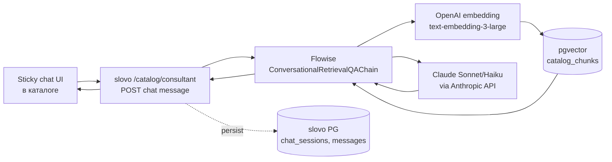

# AI-консультант по каталогу — план (stub)

> **Статус:** план-stub, реализация **не начата**, ждёт триггера.
>
> **Дата фиксации:** 2026-05-19.
>
> **Триггер запуска:** Phase 1.5 backend closure (`smart-search-phase-1-5-backend.md`) + начато заполнение карточек по Slice 6 ERP guide (`erp-product-card-guidelines.md` v1.7+) — без правильных карточек AI-консультант ограничен теми же gaps что PoC показал (см. ниже).
>
> **Документ зафиксирован чтобы не потерять идею** после PoC от 2026-05-19. Phase 1.5 в работе — этот документ намеренно отделён, чтобы не размывать фокус текущей фазы.

---

## Цель

Превратить `catalog-aquaphor` Document Store + smart-search retrieval из **поискового индекса** (top-K карточек) в **AI-консультанта 24/7** на странице каталога PROSTOR. Клиент в режиме покупки ведёт диалог с AI который:

- читает карточки и формулирует **рекомендацию** с конкретными моделями,
- задаёт **уточняющие вопросы** про use case (квартира / дом, бюджет, тип воды),
- объясняет технологии (**education mode** — что такое обратный осмос, ультрафильтрация),
- собирает **комплекты** (предфильтр + основной + расходники),
- честно говорит «не знаю / уточните у специалиста» когда retrieval не дал релевантного — **никогда не выдумывает**.

## Почему сейчас фиксируем

PoC от 2026-05-19 (`docs/experiments/knowledge-base-poc/2026-05-19-catalog-qa-baseline.md`) показал что **переход «умный поиск → умный консультант» уже технически работает** — 7/7 reference Q&A через `catalog-qa-poc-v1` chatflow прошли с цитированием конкретных моделей. Это **не новый проект**, а **второй UX поверх той же RAG-инфры** что smart-search.

Без явной фиксации идея потеряется в backlog между Phase 1.5 (correctness) и Phase 2 (voice / multi-turn) — а это **отдельный product UX** который заслуживает своего roadmap-slot.

## Позиционирование

**Не замена менеджеру**, а **первая линия 24/7 + квалификация лида:**

- AI закрывает 70% **типовых** вопросов (как работает X, что подходит для Y воды, в чём разница A/B).
- Сложные / B2B / спорные → AI **передаёт менеджеру** с пред-историей диалога (через handoff button). Менеджер получает **квалифицированный лид** с готовым контекстом.

## UX-решение (зафиксировано 2026-05-19)

- **Sticky button** в углу страницы каталога (где, конкретный позиционный layout — Pet на фронте).
- Не на главной (преждевременно), не на карте PROSTOR (там другой UX — анализ воды), не везде (размывает фокус).
- При клике — overlay chat-panel со state «начать диалог» либо continued session.

## Технический baseline

PoC закрыт — chain работает. Архитектура:

Переиспользует:

- ✅ `catalog-aquaphor` Document Store (155 products, 682 chunks, OpenAI 3072-dim) — общий с smart-search.
- ✅ Conversational Retrieval QA Chain pattern из PoC `catalog-qa-poc-v1`.
- ✅ Vision-augmenter / category enum / dedupe / bundled services / price-in-content — **все улучшения Phase 1.5 retrieval автоматически делают консультанта точнее**, не отдельная работа.

Новое:

- Backend: `apps/api/src/modules/catalog/consultant/` — REST endpoint, persistence chat-sessions, handoff webhook к CRM.
- Frontend (prostor-claude): `features/catalog-ai-consultant/` — sticky button + chat panel + context-pass (current viewed products / search history).
- DB: `prisma/schema/catalog-consultant.prisma` (или внутри будущей `auth.prisma`) — `ConsultantSession`, `ConsultantMessage`, fk `userId` (nullable до multi-tenant).

## Open questions (к моменту реализации)

1. **Anonymous vs authenticated UX** — если есть `userId` + история анализа воды по адресу, AI стартует с контекстом «у вас жёсткость 12». Если anonymous — graceful entry-flow с 3-4 ключевыми вопросами вместо опросника. **Решение:** зависит от состояния multi-tenant модуля.
2. **Persistence chat-history** — Buffer Memory в PoC stateless (random sessionId). В проде нужна table `consultant_messages` + retention policy (90 дней?). Прямой кандидат на multi-tenant backend.
3. **Handoff к менеджеру** — кнопка в чате «передать менеджеру» → последние 4-5 сообщений + найденные товары уходят в CRM как заметка с тегом «AI handoff». Это **главная** product-фича для бизнеса — снимает 70% типовых, усиливает оставшиеся 30%.
4. **Model selection** — Sonnet 4.6 ($3/M input + $15/M output) vs Haiku 4.5 (~5-7x дешевле). PoC прогнан на Sonnet 4.6 (качество reference). В проде на массовом трафике — Haiku 4.5 как primary, fallback на Sonnet на сложных edge cases (комплект, сравнение 3+ моделей, math на жёсткости). Decision gate — A/B на 20 reference Q&A после реализации.
5. **Стоимость в проде** — 100 клиентов × 5 запросов/мес ≈ 150 ₽/мес на Sonnet, 1000 клиентов ≈ 1 500 ₽/мес. С Haiku-primary — в 5x раз дешевле. Не критичная статья.
6. **Streaming UI** — ConversationalRetrievalQAChain Flowise streaming поддерживает (`streaming: true` на ChatAnthropic). Sticky chat-panel должен показывать stream-tокен-по-токену для UX «AI печатает».
7. **Rate limiting** — 1 запрос / 5 секунд на IP / user. Защита от bot abuse. Anonymous пользователь — 20 запросов / день (далее предложить логин).

## Зависимости

| Зависимость | Статус | Блокирует |
|---|---|---|
| Phase 1.5 Slice 5 (bundled services) | high priority после PoC | критичный Q5 «картриджи DWM-101S» сценарий |
| Phase 1.5 Slice 7 (price в pageContent) | NEW added 2026-05-19 | бюджетный подбор в чате |
| Phase 1.5 Slice 6 (ERP guide заполнение) | план готов, ждёт менеджеров | semantic precision на 17 параметрах |
| Multi-tenant backend (#6 в Roadmap) | план готов, не начат | persistent chat history + authenticated context |
| Frontend Sticky chat UI | план Phase 1.5 closure | UX контейнер |

Без Phase 1.5 closure — консультант будет работать на тех же 2 gap'ах (Q5/Q6) что показал PoC. Поэтому **сначала Phase 1.5, потом этот документ из stub'a в active plan**.

## Что НЕ делаем здесь (намеренно)

- ❌ Multi-turn voice (микрофон → STT → ответ → TTS) — Phase 2 voice.
- ❌ AI-консультант на карте PROSTOR — другой UX (там вода, не покупка).
- ❌ AI-консультант на главной — преждевременно в воронке.
- ❌ Замена менеджера / прямые продажи в чате (добавление в корзину, оформление заказа) — handoff к менеджеру / в каталог. AI оставляет последний шаг человеку.
- ❌ Generic «помощь по сайту» / навигация — это NLP-маркетинг, не наш scope. Каталог = единственный domain.

## Trigger checklist

Документ переходит из «stub» в «active plan» когда:

- [ ] Phase 1.5 backend closure (Slice 1-7 закрыты или явно отложены).
- [ ] Slice 6 — менеджеры заполнили ≥30 карточек по ERP guide (минимальная критическая масса для Q&A).
- [ ] Multi-tenant backend стартовал или ясный план persistence chat history.
- [ ] Решение по UX-mockup sticky-чата (Pet / claude design).

При выполнении ≥3 из 4 — открывается `feature/catalog-ai-consultant` branch + детальный plan-doc вместо этого stub.

---

## Связанные документы

- `docs/experiments/knowledge-base-poc/2026-05-19-catalog-qa-baseline.md` — PoC закрыт, 7 reference Q&A на текущих 155 карточках, **proof что переход технически работает**.
- `docs/features/smart-search-phase-1-5-backend.md` — текущая Phase 1.5, retrieval улучшения которые автоматически идут в консультант.
- `docs/management/erp-product-card-guidelines.md` v1.7 — секция «Доказательство концепции» с цитатами AI, motivation для заполнения карточек.
- `docs/features/smart-search-integration.md` — Phase 1 smart-search (закрыт), общая RAG-инфра консультанта.
