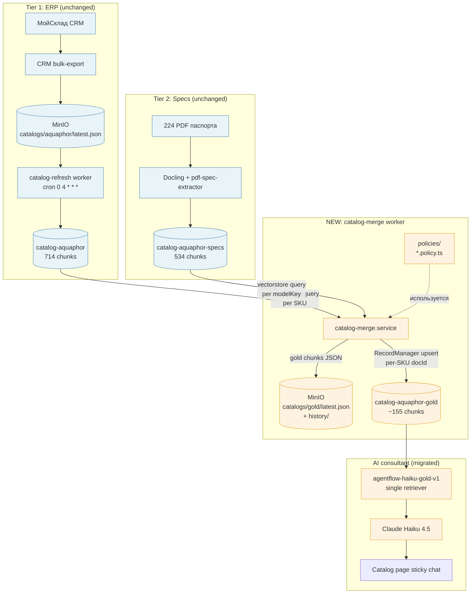

# Catalog merge → gold Document Store — план

> **Статус:** план **pending Phase 0 proof point**. Phase 0 запускается сразу (1-2 дня). Phase 1+ — только при положительном результате Phase 0.
>
> **Дата фиксации:** 2026-05-21.
>
> **Триггер Phase 0:** approve этого плана. Триггер Phase 1+: accuracy lift ≥ 10pp на Phase 0 measurement.
>
> **Контекст:** Step 6.5 R&D (2026-05-20…21) показал что multi-DS retrieve floor ~52% accuracy на real-world. Гипотеза этого плана — что **inter-source conflict resolution** = главный bottleneck. Гипотеза **не доказана** — Step 6.5 не локализовал корень (см. ADR-010 секция Status). До commitment в 5-7 дневный sprint — Phase 0 proof point на 13 моделях из existing PoC (manual merge) → temp gold DS → smoke vs baseline. Дёшево, бытро, измеряет accuracy lift до infra build.
>
> Полный rationale: ADR-010 + `docs/experiments/specs-enrichment/2026-05-21-summary-evening.md` + `NEXT-SESSION-HANDOFF.md`.

---

## Цель

**Phase 0 цель:** доказать или опровергнуть гипотезу что merge ERP+specs в single gold DS даёт accuracy lift. **Gate criterion**: ≥ 10pp accuracy lift на 30Q real-world vs baseline 2-DS.

**Phase 1+ цель (только при положительном Phase 0):** production infrastructure для full catalog merge.

После Phase 1-4 выполняются три критерия одновременно:

1. **Single-retriever AI consultant** — chatflow дёргает только `catalog-aquaphor-gold` DS, никакого multi-DS склеивания.
2. **≥ +15pp accuracy lift** на закреплённом real-world 30Q test set (target 67-70% baseline после prompt-tuning остаётся в силе).
3. **−50% high-severity wrong claims** (fabrication / outdated specs / wrong compatibility) на том же test set.

Critical non-goal: **launchable AI consultant** — не задача этого плана. Production accuracy floor (70%/80%/85%) определяется отдельно. Этот план даёт infrastructure + accuracy proof point.

## Что строим

| Артефакт | Расположение | Owner |
|---|---|---|
| Conflict-resolution policies (TypeScript pure functions) | `apps/worker/src/modules/catalog-merge/policies/` | slovo |
| Merge engine (для каждого SKU собирает gold chunk) | `apps/worker/src/modules/catalog-merge/catalog-merge.service.ts` | slovo |
| Worker cron (после catalog-refresh) | `apps/worker/src/modules/catalog-merge/catalog-merge.module.ts` | slovo |
| MinIO bucket layout | `catalogs/gold/latest.json` + `history/<ts>.json` | slovo |
| Gold Document Store | Flowise `catalog-aquaphor-gold` (создаётся через MCP) | slovo |
| AI consultant chatflow migration | Существующий agentflow-haiku клонируется в `agentflow-haiku-gold-v1` | slovo |
| Smoke test runner | `experiments/specs-enrichment/smoke-gold.mjs` (30Q real-world set) | slovo |

## Immutability принцип

**Правило слова: ничего из существующего не мутируем, всё новое.** Все артефакты этого плана создаются как новые сущности рядом с существующими. Это даёт чистый rollback (`git revert` + delete новых ресурсов = state до старта) и snapshot existing state для retro-анализа.

## Что НЕ меняется

- `apps/worker/src/modules/catalog-refresh/` — нетронут.
- `catalog-aquaphor` DS (ERP) — нетронут, продолжает обновляться daily.
- `catalog-aquaphor-specs` DS (specs PDF) — нетронут, продолжает обновляться по своему scheduler.
- `pdf-spec-extractor` агент + docling pipeline — нетронуты.
- Существующие chatflows (`agentflow-haiku` / `agentflow-gpt` / `toolagent-haiku` / judge) — остаются live, не правим их promptValues / nodes. Side-by-side smoke сравнивает с ними gold chatflow.
- Существующие skripts в `experiments/specs-enrichment/` (`batch-smoke-v2.mjs` и др.) — нетронуты. Для gold smoke создаётся новый файл.
- `apps/api/src/modules/catalog/` — endpoint shapes не меняются. AI consultant интегрируется через тот же Flowise prediction endpoint.

## Архитектура



## Conflict-resolution policies — design

### Policy interface

```typescript
// apps/worker/src/modules/catalog-merge/policies/t-conflict-policy.ts
export type TConflictPolicy = {
    id: string;                              // 'outdated-pro-modules' / 'led-error-codes' / ...
    appliesTo: (ctx: TMergeContext) => boolean;
    apply: (ctx: TMergeContext) => TPolicyResult;
};

export type TMergeContext = {
    sku: string;
    modelKey: string;
    erpChunk: TErpChunk | null;     // null если ERP не нашёл
    specsChunks: TSpecsChunk[];     // 0..N PDF chunks для этого modelKey
};

export type TPolicyResult = {
    footerAdditions: string[];      // строки добавляются в '## Anti-confusion' секцию
    textPatches: Record<string, string>; // переопределение полей (e.g. 'modules' → 'Pro 1 / Pro 2 / Pro 100 / Pro BMg')
    conflictId: string;             // для metadata.conflictsResolved
};
```

### Initial policy set (по итогам Step 6.5 анализа)

| ID | Применима к | Что делает |
|---|---|---|
| `outdated-pro-modules` | `sku.startsWith('DWM-102S Pro')` или `sku.startsWith('DWM-202S Pro')` | Footer: «Specs PDF раздел "Назначение" может упоминать К7М — устаревший snapshot. Trust ERP: модули Pro 1 / Pro 2 / Pro 100 / Pro BMg». Patch `modules` поля. |
| `ws-classification` | `sku.startsWith('WS')` | Footer: «Тип = умягчитель (Na+ ионообмен). НЕ обезжелезиватель. Удаляет жёсткость Ca²⁺/Mg²⁺. Для Fe>1 мг/л — Трио Fe H / Fe 112/250 / Fe 112/508». |
| `dwm-101s-bundle-math` | `sku === 'DWM-101S'` | Footer: «Базовая цена 16 900 ₽ (без смесителя). Bundles: + С126 = 30 890 ₽, + 82138С = 29 890 ₽. Модули: К5/К2/КО-50S/К7М (мембрана КО-50S, 50 GPD)». |
| `no-led-errors-pro` | `sku.startsWith('DWM-102S Pro')` | Footer: «LED Err1/Err2 indicators **отсутствуют** у DWM-102S Pro (есть у DWM-202S-C-LD). Не fabricate коды ошибок». |
| `no-pro-h-product` | always | Footer (только при request resolution): «"Pro H" не существует как SKU. Производитель: Pro 1 / Pro 2 / Pro 100 / Pro BMg + RO системы Pro 50 / Pro 100». |
| `salt-consumption-realism` | `sku.match(/WS\d{3,4}/)` | Footer: «Расход соли зависит от жёсткости воды и потребления. Не вычислять "300 кг/год" без указания исходных параметров — это fabrication». |
| `specs-tech-fields-only` | `specsChunks.length > 0` | Patch: вырезать из specs chunks разделы «Назначение» / «Маркетинговое описание» (там устаревшие моду

ли). Оставить tech depth: производительность, давление, габариты, срок службы, схема установки. |

Policies — pure functions, **lazy load via filesystem scan** в `catalog-merge.module.ts` (auto-discovery, не явный registry). Каждая policy + spec обязательны (test-coverage gate).

### Anti-confusion footer rendering

При merge:
1. Прогнать все policies через `appliesTo(ctx)` → собрать applicable.
2. Применить `apply(ctx)` для каждой → собрать `footerAdditions[]` и `textPatches{}`.
3. Если `footerAdditions.length > 0` — добавить секцию `## Внутренние пометки (anti-confusion)` в конец chunk.
4. `metadata.conflictsResolved` = массив applied `conflictId`.

## Phases

### Phase 0 — Proof point на existing PoC (1-2 дня) — GATE

**Цель:** доказать что **gold DS approach** даёт accuracy lift на real-world test set, **до** commitment в полную инфру. Использует existing artifact `experiments/specs-enrichment/poc-ds-merge/merged-chunks.json` (13 моделей собраны Step 6.5).

**Принцип:** measurement **исключает** variable «качество merge approach» — chunks собраны вручную / PoC скриптом, не через production-ready TS policies или LLM-агента. Если accuracy lift нет даже на manual merge — proof что корень problem'ы не в conflict resolution.

**Slices:**

- Slice 0.1 — Поднять **temporary gold DS** `catalog-aquaphor-gold-poc` (новый отдельный store, не trogaем existing). Config: postgres vectorstore (отдельная таблица `catalog_aquaphor_gold_poc_chunks`), OpenAI text-embedding-3-large, splitter chunk_size=4096 (1 chunk на SKU), без RecordManager (PoC scope). Создаётся через `mcp__flowise-slovo__flowise_docstore_full_setup` или direct REST.
- Slice 0.2 — Залить existing `merged-chunks.json` (13 моделей) в gold-poc DS через `flowise_docstore_vectorstore_insert` (или `docstore_upsert`). Smoke `vectorstoreQuery` на каждый из 13 SKU — убедиться что chunks retrievable и metadata пришла целиком.
- Slice 0.3 — **Новый** chatflow `agentflow-haiku-gold-poc-v1` (создаётся отдельно, существующие chatflows не правим). Конфиг: single retriever на gold-poc DS, тот же ChatAnthropic Haiku 4.5, тот же system prompt что в существующем `agentflow-haiku` (без изменений — это сравнение **архитектуры**, не prompt'а; prompt tuning отдельная переменная). Через MCP `flowise_chatflow_create` или clone.
- Slice 0.4 — **Подкорректировать** real-world 30Q test set до **subset 13 моделей** (запросы где answer касается **только** этих 13 SKU — иначе сравнение нечестное, gold-poc DS не знает про остальные ~140 SKU). Если subset < 15Q — расширить дополнительными queries на эти модели. Артефакт: `experiments/specs-enrichment/test-set-13-models.jsonl`.
- Slice 0.5 — **Новый** smoke runner `experiments/specs-enrichment/smoke-gold-poc.mjs` (не override существующий `batch-smoke-v2.mjs`). Принимает `--baseline-chatflow` + `--candidate-chatflow` + `--queries`, выдаёт comparison JSON + delta report. Запуск: baseline = `agentflow-haiku` (текущий 2-DS), candidate = `agentflow-haiku-gold-poc-v1`. Auto-graded через existing Sonnet 4.6 judge chatflow (с corrected KNOWN_FACTS).
- Slice 0.6 — **Report** `docs/experiments/specs-enrichment/2026-MM-DD-phase-0-gold-poc.md` с findings: accuracy delta / high-sev wrong claims delta / per-query breakdown / decision recommendation.

**Gate criteria (Phase 1 unlocks only if all true):**

| Метрика | Threshold |
|---|---|
| Accuracy lift vs baseline | ≥ +10pp |
| High-sev wrong claims | не выросли |
| Per-query inspection | manual check 5 random Q — gold ответы не subtly хуже |
| Token cost | не вырос в > 1.5× (sanity check) |

**Outcomes:**

- **Положительный** → status ADR-010 переходит в ✅ Принято, продолжаем Phase 1. Approach selection (TS / LLM / hybrid) — отдельное решение в Phase 1.0 на основе Phase 0 опыта + cost/maintenance trade-off.
- **Отрицательный** → ADR-010 retired. Создаём новый ADR на гипотезу (1) retrieval semantic miss / (3) system prompt / (4) исходные данные.
- **Inconclusive (<5pp lift)** → расширить test set до 30Q (если subset на 13 моделях был меньше), повторный запуск. Если всё ещё inconclusive — pivot на гибрид: gold DS + FTS hybrid retrieval как один пакет.

### Phase 1.0 — Approach selection (0.5 дня, начинается только после положительного Phase 0)

Решение между TS policies / LLM-agent merge / гибрид (см. ADR-010 Альтернативы D-text / F / G). Критерии выбора:

- **TS policies** — если Phase 0 опыт показывает что conflicts manageable через 5-10 hardcoded patterns. Лучший audit / determinism / cost.
- **LLM-agent merge** — если в Phase 0 manual merge выявил много long-tail conflicts которые сложно описать как pattern. Cost концерн — Sonnet 4.6 weekly = $50/мес, daily неприемлемо.
- **Гибрид (TS skeleton + LLM footer для drift)** — наиболее вероятный default. Best of both.

Артефакт решения: amendment к ADR-010 с обоснованием выбора. После — продолжение Phase 1 ниже в выбранном подходе.

### Phase 1 — Foundation (2 дня, после Phase 0 + Phase 1.0)

**Цель:** merge engine + 3 critical policies + 13 моделей PoC reproduction в проде-стиле коде.

**Slices:**

- Slice 1.1 — `apps/worker/src/modules/catalog-merge/` модуль scaffolding (module + service + constants + DTO types). Reuse pattern catalog-refresh (DI, FlowiseClient, StorageService, Redis lock).
- Slice 1.2 — `policies/` директория + 3 starter policies: `outdated-pro-modules`, `ws-classification`, `dwm-101s-bundle-math`. Auto-discovery via `import.meta.glob`-equivalent (Node 24 fs scan + dynamic `import()`).
- Slice 1.3 — `catalog-merge.service.ts::buildGoldChunk(sku, erpChunk, specsChunks, policies)` pure function + comprehensive unit tests (happy / edge / no specs / multi-policy clash).
- Slice 1.4 — `catalog-merge.service.ts::run()` orchestration: fetch ERP DS, fetch specs DS, iterate SKUs, apply policies, emit JSON.
- Slice 1.5 — gold DS provisioning: create `catalog-aquaphor-gold` через `mcp__flowise-slovo__flowise_docstore_full_setup` (loader + splitter + embedding text-embedding-3-large + postgres vectorstore + RecordManager). Document storeId в `.env` как `FLOWISE_GOLD_STORE_ID`.

**Acceptance:**
- `npm test -- catalog-merge` — 100% LOC coverage merge service + policies.
- Manual run `node apps/worker/scripts/catalog-merge-dry-run.mjs` — выход 13 моделей gold chunks JSON, по structure совпадает с PoC `experiments/specs-enrichment/poc-ds-merge/merged-chunks.json`.
- ESLint + Prisma + TS — clean.

### Phase 2 — Full catalog coverage + bulk upsert (1 день)

**Slices:**

- Slice 2.1 — расширить SKU mapping с PoC 13 моделей до полного списка из ERP catalog (~155 SKU). Извлекать canonical SKU + modelKey из ERP chunks metadata (`metadata.sku` / `metadata.name` → normalize → modelKey). Запасной mapper для модели где specs нет — gold chunk only ERP-side с `metadata.hasSpecs=false`.
- Slice 2.2 — MinIO output: `catalogs/gold/latest.json` (current snapshot) + `history/<ISO-ts>.json` (audit). По pattern catalog-refresh (S3 Object Versioning + metadata `contenthash`).
- Slice 2.3 — bulk upsert в `catalog-aquaphor-gold` через `flowise_docstore_upsert` или per-SKU `POST /document-store/upsert/<id>` (вариант с RecordManager как в catalog-refresh, см. ADR-007 дополнение 2026-05-01). REMOVED-sweep для SKU исчезнувших из ERP.
- Slice 2.4 — Redis loader-mapping `slovo:catalog-merge:loaders` (mirror catalog-refresh pattern). Per-SKU docId stable across runs.

**Acceptance:**
- `node apps/worker/scripts/catalog-merge-dry-run.mjs --full` — 155 gold chunks в JSON + MinIO.
- После `node apps/worker/scripts/catalog-merge-upsert.mjs` — gold DS в Flowise UI показывает 155 loaders, `total_chunks ≈ 155-310` (chunk_size 4096 → 1 chunk на SKU в подавляющем большинстве).
- Re-run `catalog-merge-upsert.mjs` второй раз: `numAdded=0`, `numSkipped=155` (RecordManager skip-if-unchanged работает).

### Phase 3 — Cron + production runtime (1 день)

**Slices:**

- Slice 3.1 — `@Cron('30 4 * * *')` в `catalog-merge.module.ts`, после catalog-refresh (0 4). Redis lock CALL_KEY = `slovo:catalog-merge:lock`. Lua-CAS release (mirror catalog-refresh).
- Slice 3.2 — Idempotency check: если ни ERP DS, ни specs DS не менялись с last run (compare hash через DS metadata) → skip. Иначе → full rebuild. Phase 5 hardening — sha256 на (erp_latest + specs_latest) hashes.
- Slice 3.3 — Failure modes: ERP fetch fail → use last known good (from previous gold MinIO snapshot); specs fetch fail → same. Worker не упадёт целиком — log + Telegram alert + continue с available data. Alerting wiring через существующий `TelegramAlertService` (vision-catalog уже использует).
- Slice 3.4 — Observability: Langfuse trace для каждого merge run (`name=catalog-merge`, `input=<numSkus>`, `output=<numUpserted>+<numSkipped>+<numFailed>+<numConflictsResolved>`). Reuse Langfuse client из catalog-refresh.

**Acceptance:**
- API + worker compose up локально, через 30 сек после catalog-refresh завершения видим catalog-merge run в Langfuse traces.
- Симуляция failure (МойСклад off, MinIO ERP `latest.json` корраптнут) → worker логирует error + Telegram message + завершается gracefully, gold DS остаётся в last good state.

### Phase 4 — Новый AI consultant chatflow + smoke (1-2 дня)

**Slices:**

- Slice 4.1 — **Создать новый** chatflow `agentflow-haiku-gold-v1` (через `mcp__flowise-slovo__flowise_chatflow_create` с собранным flowData через `@slovo/flowise-flowdata`, либо clone-then-strip через `flowise_chatflow_clone`). Конфиг: single retriever на `catalog-aquaphor-gold`, ChatAnthropic Haiku 4.5, BufferMemory. Существующие chatflows не трогаем.
- Slice 4.2 — Retrieve K = 3 (стартовое значение). Gold: K=3 даёт ~3 chunks × ~2000 tokens = 6000 tokens — комфортно для Haiku 4.5. Phase 4.4 smoke измеряет recall — если падает, поднимаем K=5 в новой ревизии chatflow (v1.1), не правим v1.
- Slice 4.3 — **System prompt** — стартует **тот же** что в существующем `agentflow-haiku` (на этом этапе сравнение архитектуры, не prompt'а). После Phase 4.4 baseline measurement и анализа per-query failures — отдельный итеративный sprint на оптимизацию prompt'а под gold semantics. Решение «rewrite from scratch vs incremental tweak» откладывается до данных: Phase 0 опыт + Phase 4.4 failure analysis покажут которые из rules 23-27 стали redundant (footers их заменили) и которые остались полезны.
- Slice 4.4 — Side-by-side smoke через **новый** runner `experiments/specs-enrichment/smoke-gold-full.mjs` (отдельный от Phase 0 `smoke-gold-poc.mjs` — full 155 SKU coverage). Запускаем `agentflow-haiku` (baseline 2-DS) vs `agentflow-haiku-gold-v1` (candidate single-DS) на полном 30Q real-world set. Auto-graded через existing Sonnet 4.6 judge.
- Slice 4.5 — **Если** Phase 4.4 показывает accuracy lift но subset queries регрессируют (specific failures из rules 23-27 territory) → отдельный prompt-tuning sprint **поверх** gold chatflow (не trogaem v1, создаём `agentflow-haiku-gold-v2` с tuned prompt). Иначе skip.

**Acceptance:**
- Smoke runner показывает gold chatflow на 30Q real-world с **+15pp accuracy** vs текущий 2-DS baseline.
- High-sev wrong claims **−50%** (auto-graded через судью Sonnet 4.6).
- Latency не выросла на >20% (single retrieve = меньше parallel calls, expected ~stable или faster).

### Phase 5 — Hardening + monitoring (1-2 дня)

**Slices:**

- Slice 5.1 — Расширить test set с 30Q до 60-80Q включая edge cases (typos / vague / multi-problem / colloquial). Артефакт: `experiments/specs-enrichment/test-set-real-world-v2.jsonl`. Sources: реальные вопросы из chat-history (если такие будут), Q&A с aquaphor-pro.store, customer support tickets если доступны.
- Slice 5.2 — Auto-grader через Flowise judge — reuse existing setup из Step 6.5, но с corrected KNOWN_FACTS (ADR-amendment story: «не trust свой verified list без re-verify»). Запуск cron weekly на gold chatflow + Telegram digest accuracy trend.
- Slice 5.3 — `metadata.conflictsResolved` analytics: дашборд (или просто weekly SQL query в Langfuse Postgres) — сколько раз каждая policy applied, есть ли SKU где no policy applied но retrieval всё ещё teh wrong → новая policy кандидат.
- Slice 5.4 — Documentation: ADR-010 status → ✅ Принято + amendment с фактическими metrics. `apps/worker/src/modules/catalog-merge/README.md` operational guide. Memory `project_catalog_merge_in_prod.md`.

**Acceptance:**
- Weekly auto-grader cron live в Flowise.
- ADR-010 status updated.

### Phase 6 — Deprecation existing 2 DS (optional, через 4 недели prod)

**Trigger:** sustained ≥10pp accuracy lift на ≥100 real-world queries + no rollback events за 4 недели.

**Slices:**

- Slice 6.1 — Декомиссировать `agentflow-haiku` / `agentflow-gpt` / `toolagent-haiku` (старые chatflows). Снапшот flowData в `experiments/specs-enrichment/legacy-flows-snapshot-<ts>.json` для archival.
- Slice 6.2 — `catalog-aquaphor` и `catalog-aquaphor-specs` DS остаются как **internal debug sources**: документировать в README что они **не consumer-facing**. Запретить новые consumer chatflows на них через code-review checklist (ADR-008 amendment).
- Slice 6.3 — ADR-010 amendment с deprecation date + retention policy.

## Metrics

| Метрика | Baseline (2 DS) | Phase 4 target | Production launch threshold |
|---|---:|---:|---:|
| Real-world 30Q accuracy | 52% | ≥67% | TBD (отдельный документ) |
| High-sev wrong claims / 30Q | ~7-8 | ≤4 | ≤2 |
| Avg latency per Q | ~22s (dev, через tinyproxy) | ≤22s | <8s (production, через slovo-orchestrate streaming) |
| Cost per Q | $0.013 (Haiku) | $0.013-0.018 (более chunk content, тот же K) | optimization сценарий — отдельно |
| Conflicts applied per merge run | n/a | logged (нет target) | trend monitoring |

## Risks

| Risk | Likelihood | Impact | Mitigation |
|---|---|---|---|
| Merge worker crash в проде → gold DS stale | M | M | MinIO `history/` snapshot, alert, graceful degradation (last-good gold остаётся retrievable) |
| Policy regression — patch ломает корректный chunk | M | H | Unit-test обязателен, на every SKU где policy applied тест-case с before/after. CI gate. |
| Re-embed cost spike при rebuild policies | L | M | RecordManager `metadata.sourceDigest` change → re-embed. При массовом policy update — ожидаем full re-embed (~$0.02 за 155 chunks). Не критично. |
| Existing chatflows ломаются от изменений в ERP/specs DS | L | L | Не меняем ERP/specs DS — только читаем. |
| Single chunk на SKU слишком большой для retrieve recall | M | M | Phase 4 smoke измеряет recall. Fallback — splitter с chunk_size=2048 / overlap=256 (chunk per major section). |
| Conflict policies не covered весь long-tail wrong claims | H | L (incremental fix) | Phase 5.3 analytics дашборд + monthly review cycle. Policy backlog как ticket-driven workflow. |

## Что НЕ делаем (в scope этого плана)

- ❌ **Confidence-based handoff к менеджеру** (escalation UX) — отдельная фича. Backend hook (`/chat` response include confidence + suggested action) можно добавить orthogonal'но.
- ❌ **FTS hybrid retrieval** (postgres tsvector + pgvector RRF) — отложено до measurement retrieval recall на gold DS (см. ADR-010 Open Q #4).
- ❌ **Tool-grounded verification** (`POST /catalog/verify` endpoint) — может быть additive после gold DS, но не блокирует launch. Open Q отдельно.
- ❌ **Multi-tenant** gold DS — single tenant сейчас, расширение по pattern `catalog-aquaphor-gold-<tenant>` если потребуется.
- ❌ **Production accuracy floor** — определяется отдельным документом до launch.
- ❌ **Streaming UX через slovo-orchestrate** — performance бюджет, не accuracy. Отдельная инициатива.

## Open questions

1. **Auto-discovery policies vs explicit registry.** Default — auto-discovery через filesystem scan. Если CI gate станет flaky или policy load slow — переход на explicit `policies/index.ts` registry.
2. **chunk_size для gold DS.** Default 4096 (1 chunk = 1 SKU). Если retrieve recall падает — split per section с overlap. Решается в Phase 4 smoke.
3. **Policy version + rollback.** Per-policy `version` field в metadata? Сейчас — нет, KISS. Если policy regression — rollback через `git revert` + force re-build gold DS.
4. **Re-build full vs incremental on policy change.** Сейчас — full re-build при изменении любого policy (через `sourceDigest = sha256(policiesHash + erpHash + specsHash)`). Простой, может быть expensive если policies меняются часто. Phase 5 — если ≥5 policy updates в неделю, оптимизируем через per-SKU policy diff.
5. **Embedding cost при policy change.** $0.13/M × 155 chunks × ~2000 tokens = $0.04 за rebuild. Bounded.
6. **chatflow name conventions.** `agentflow-haiku-gold-v1` следует ADR-008 nameing? Check `docs/guides/flowise-naming.md`.

## Effort estimate

- **Phase 0 (GATE): 1-2 дня** — proof point на existing PoC chunks. Дёшево, может закрыть весь sprint если accuracy lift нет.
- Phase 1.0: 0.5 дня — approach selection (TS / LLM / hybrid)
- Phase 1: 2 дня
- Phase 2: 1 день
- Phase 3: 1 день
- Phase 4: 1-2 дня
- Phase 5: 1-2 дня
- Phase 6: 0.5 дня (через 4 недели prod)

**Total to Phase 5 close: 7-9 рабочих дней** (включая Phase 0 + selection). Side-project ритм — растягивается на 2-3 недели календарных. **Phase 0 — bounded риск**: 1-2 дня скажут стоит ли вообще идти дальше.

## Quick start — Phase 0 only (1-2 дня)

```bash
# 1. Создать temp gold DS catalog-aquaphor-gold-poc (Slice 0.1)
# Config — postgres vectorstore + OpenAI text-embedding-3-large + splitter 4096,
# отдельная таблица catalog_aquaphor_gold_poc_chunks. Через MCP:
# mcp__flowise-slovo__flowise_docstore_full_setup с этим config'ом.

# 2. Залить existing PoC chunks (Slice 0.2)
# merged-chunks.json уже есть от Step 6.5, 13 моделей готовы:
ls experiments/specs-enrichment/poc-ds-merge/merged-chunks.json
# Через mcp__flowise-slovo__flowise_docstore_vectorstore_insert.

# 3. Создать новый chatflow agentflow-haiku-gold-poc-v1 (Slice 0.3)
# Clone agentflow-haiku → replace retriever на gold-poc DS.
# Существующий agentflow-haiku не трогаем.

# 4. Подкорректировать test set до 13 моделей (Slice 0.4)
# Из smoke-results-v2.json filter queries про эти SKU. Расширить если < 15Q.
node experiments/specs-enrichment/build-test-set-13-models.mjs  # NEW скрипт

# 5. Smoke (Slice 0.5)
node experiments/specs-enrichment/smoke-gold-poc.mjs \  # NEW runner
    --baseline-chatflow agentflow-haiku \
    --candidate-chatflow agentflow-haiku-gold-poc-v1 \
    --queries test-set-13-models.jsonl \
    --out phase-0-results.json

# 6. Report + decision (Slice 0.6)
# Если accuracy lift ≥ 10pp → продолжаем Phase 1+ ниже.
# Если нет → ADR-010 retired, pivot на retrieval/prompt/source-data.
```

## Quick start — Phase 1+ (только при положительном Phase 0)

```bash
# 1. Approach selection (Phase 1.0)
# Решение TS / LLM / hybrid на основе Phase 0 опыта.
# Amendment к ADR-010 с обоснованием.

# 2. Создать модуль (Phase 1.1)
mkdir -p apps/worker/src/modules/catalog-merge/{policies}
# scaffold module/service/constants по pattern catalog-refresh.

# 3. Production gold DS (отличный от Phase 0 PoC DS)
# catalog-aquaphor-gold (production storeId, своя таблица catalog_aquaphor_gold_chunks).
# Phase 0 DS (catalog-aquaphor-gold-poc) можно дропать после selection.

# 4. Полный merge run + smoke (Phase 2-4)
node apps/worker/scripts/catalog-merge-dry-run.mjs --full
node experiments/specs-enrichment/smoke-gold-full.mjs \
    --baseline-chatflow agentflow-haiku \
    --candidate-chatflow agentflow-haiku-gold-v1 \
    --queries test-set-real-world-v1.jsonl
```
