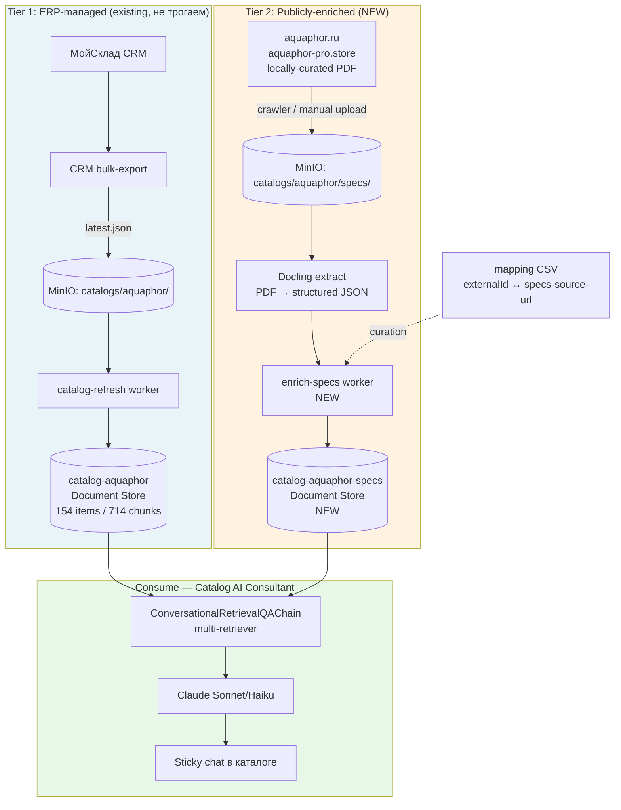
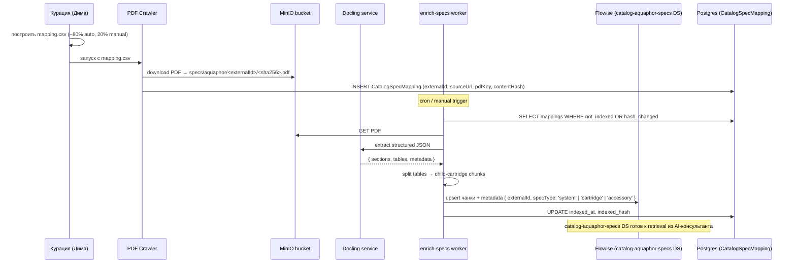

# Каталог: PDF-обогащение из официальных источников — план

> **Статус:** план, реализация **не начата**.
>
> **Дата фиксации:** 2026-05-20.
>
> **Триггер запуска:** немедленно после согласования источника парсинга (`aquaphor.ru` vs `aquaphor-pro.store` vs локальная коллекция PDF). Не блокирует другие фичи.
>
> **Контекст обсуждения:** разговор 2026-05-20 после закрытия Slice 2 + Slice 7 (productCategory + цена в content). Slice 6 ERP guide зависит от менеджеров заполняющих карточки → не происходит. Catalog-ai-consultant заблокирован тем же триггером. Решение: обогащать AI-каталог **автоматически из публичных источников** не трогая ERP-pipeline.

---

## Цель

Создать **второй слой knowledge** для catalog-ai-consultant: техспеки оборудования Аквафор (производительность, химия очистки, давление, габариты, совместимость, сертификаты, гарантия) извлечённые из **официальных PDF паспортов** и публикаций производителя. Слой работает **параллельно с ERP-managed `catalog-aquaphor`** (МойСклад → bulk-ingest), не зависит от заполнения карточек менеджерами.

После реализации AI-консультант отвечает богато на:

- «Какая производительность у DWM-101S?» → 7,8 л/час из spec sheet.
- «Какие загрязнения убирает Pro 100?» → cmsг хлора / тяжёлые металлы / нитраты / органика, из паспорта.
- «Какое давление воды нужно для OSMO Pro 50?» → 0,9-7 атм, из install guide.
- «На какой системе картридж К5 работает?» → совместимость из cross-reference таблицы.

## Почему сейчас

**Проблема:** Менеджеры не заполняют карточки в МойСкладе с детализацией нужной AI (Slice 6 ERP guide v1.7 написан, но менеджеры **не вовлечены** в процесс — это организационная блокировка, не техническая).

**Решение:** AI не должен ждать менеджеров. Производитель **уже опубликовал** всё что нужно — PDF паспорта на aquaphor.ru, технические таблицы в HTML-карточках aquaphor-pro.store (магазин разработчика slovo). Источник — open public.

**Окно:** Pipeline Docling уже работает (15 504 водных бланка обработано). Перенос на PDF паспорта — copy-paste архитектуры, минимальный новый код.

## Позиционирование

**Не замена ERP-каталога**, а **отдельный technical knowledge layer**:

| Слой | Источник | Чем обновляется | Tie-breaker |
|---|---|---|---|
| `catalog-aquaphor` (Tier 1) | МойСклад → `latest.json` → catalog-refresh worker | Менеджер CRM | **Wins** для цены, названия, наличия, услуг, расходников |
| `catalog-aquaphor-specs` (Tier 2) | Публичные источники → docling → отдельный feeder | Скрипт обогащения (manual trigger / weekly cron) | **Wins** для техспек, химии, габаритов, гарантии, схем подключения |

Catalog-AI-consultant chain получает context из **обоих DS** через multi-retriever:

```
User: «Какая производительность DWM-101S Морион при холодной воде?»
  ↓
Retrieve top-K из catalog-aquaphor (ERP)
  + Retrieve top-K из catalog-aquaphor-specs (PDF)
  ↓
LLM видит обе картинки → отвечает richly
```

## Архитектура



**Что НЕ меняется в существующем pipeline:**

- `apps/worker/src/modules/catalog-refresh/` — нетронут.
- `catalog-aquaphor` Document Store — нетронут.
- `t-bulk-ingest-payload.ts` zod schema — нетронут.
- CRM выгрузка `latest.json` — нетронута.
- Vision-augmenter — нетронут.

**Что добавляется:**

- `infrastructure/specs-enrichment/` (NEW) — Puppeteer crawler / fetch-script для PDF.
- `prisma/schema/catalog-specs.prisma` (NEW) — `CatalogSpecMapping` table (externalId ↔ specsSourceUrl ↔ docHash).
- `apps/worker/src/modules/specs-enrichment/` (NEW) — feeder MinIO → docling → Document Store.
- `catalog-aquaphor-specs` Document Store (NEW, через MCP).
- Catalog-AI-consultant chain (когда дойдём) — multi-retriever конфиг.

## Источники данных и стратегия по группам

154 товара каталога делятся на **4 группы** с разными источниками:

### Группа 1 — Системы фильтрации (~30 товаров: RO, проточные, магистральные)

**Покрытие через PDF паспорта:** ~90%.

**Примеры:**

- DWM-101S / DWM-102S / DWM-202S / DWM-312S — у Аквафора есть **Spec Sheet PDF** + **Installation Guide PDF** + **User Manual PDF**.
- OSMO Pro 50 / Pro 100 — аналогично.
- Кристалл Classic / H / Solo / Sol — Spec Sheet PDF.
- Викинг Миди / Гросс — Spec Sheet PDF корпуса + таблица совместимых картриджей.
- Фаворит / Трио — Spec Sheet PDF.

**Источник:** `aquaphor.ru/catalog/<product-slug>/` → ссылки на PDF в карточке (обычно секция «Документы» / «Скачать»).

**Качество данных:** **высокое** — производитель указывает производительность, давление, температуру, размеры, мембрану, сертификаты.

### Группа 2 — Картриджи / Сменные модули (~86 товаров: К5, К2, КО-50S, B515-*, Pro 1/2/100, KH и т.п.)

**Покрытие через отдельный PDF:** ~15%.

**Проблема:** У большинства картриджей **нет отдельного PDF паспорта** — они продаются как «расходник к системе X».

**Решение — child-records pattern:** При обработке PDF родительской системы извлекать **таблицу совместимых картриджей с их спеками**:

```text
Из паспорта DWM-101S:

| Ступень | Картридж | Ресурс | Производительность | Удаление |
|---------|----------|--------|--------------------|----|
| 1       | К5       | 8 000 л / 6 мес | 1,5 л/мин | Активный хлор, органика |
| 2       | К2       | 4 000 л / 6 мес | 1,5 л/мин | Жёсткость (Na-обмен) |
| 3       | КО-50S   | 25 000 л / 24 мес | 0,15 л/мин | Мембрана (нитраты, ТМ, бактерии) |
| 4       | К7М      | 8 000 л / 12 мес | 1,5 л/мин | Минерализация |
```

Каждая строка → отдельный chunk в `catalog-aquaphor-specs` с metadata `{ parentSystem: 'DWM-101S', cartridge: 'К5', ... }`.

**Bonus:** «совместимость» приходит автоматически — картридж К5 будет иметь parent-link на DWM-101S/DWM-102S/Кристалл и т.д. (через объединение таблиц из нескольких систем).

### Группа 3 — Аксессуары (~16 товаров: смесители C125/C126, краны, насосы подкачки, клапаны защиты)

**Покрытие через PDF:** ~30%.

**Источник:** Web-карточки `aquaphor-pro.store` (магазин разработчика slovo) — у него есть таблица технических характеристик в HTML-карточке.

**Парсинг:** Простой HTML scrape (cheerio / Puppeteer) → table-extract → structured JSON. Юридически чисто потому что это **собственный магазин разработчика**.

### Группа 4 — Прочее («комплекты», «доп.услуги», legacy SKU, B2B-pricing) (~22 товара)

**Покрытие:** **низкое (~10%)**, и не критично — это типы товаров, на которые AI всё равно отвечает «спросите менеджера» (custom комплекты, B2B-цены, спец.условия).

**Решение:** **Не enrich** — AI fallback prompt уже это покрывает (Slice 6 plan).

### Итог покрытия

| Группа | Кол-во | Автомат-покрытие | Метод |
|---|---|---|---|
| Системы | ~30 | ~90% (27) | PDF от aquaphor.ru |
| Картриджи | ~86 | ~85% (~73) | Извлечение из parent-системы PDF |
| Аксессуары | ~16 | ~70% (~11) | HTML карточки aquaphor-pro.store |
| Прочее | ~22 | ~0% | Fallback prompt «спросите менеджера» |
| **Total** | **~154** | **~78% (~120)** | |

20-22% (~30-34 товара) либо требуют ручной курации, либо «честный fallback» в prompt'е.

## Mapping problem

МойСклад `externalId` (UUID) ↔ aquaphor.ru URL (slug) — **нет автоматического линка**. Нужна таблица курации.

### Структура CSV (стартовый формат)

```csv
externalId,name,sourceType,sourceUrl,confidence,notes
d2c43c8c-cc04-11e5-7a69-93a700294a00,Аквафор DWM-101S,aquaphor.ru,https://aquaphor.ru/catalog/dwm-101s,high,
1eae8d50-0d4e-11eb-0a80-0156000c940a,Водоочиститель Аквафор OSMO Pro-100-3-А-М,aquaphor.ru,https://aquaphor.ru/catalog/osmo-pro-100,high,
7194736b-19d6-11e7-7a31-d0fd00056ba7,Смеситель кухонный модель С125,aquaphor-pro.store,https://aquaphor-pro.store/smesitel-c125,medium,SKU C125 — двойная подача
...
```

### Стратегия наполнения CSV

1. **Auto-guess scripts** (~80% покрытия за минуту) — script берёт name из `latest.json`, извлекает model code regex'ом (DWM-101S, OSMO Pro 100, Кристалл H), генерирует predicted URL `aquaphor.ru/catalog/<slug>` через шаблоны slug'ификации.
2. **Auto-verify** (~30 сек на товар) — fetch HEAD на predicted URL, ставит `confidence: high` если 200 OK, `low` если 404.
3. **Manual curation** (~1-2 часа суммарно для ~30 missing) — низкоconfidence записи проходим глазами, правим slug руками. Записываем в `confidence: manual`.
4. **Bundle / комплект** — оставляем `sourceUrl: null, notes: "bundle SKU, не имеет отдельной странички"` для fallback.

### Хранение

CSV → `infrastructure/specs-enrichment/mapping.csv` (gitignored или нет — открытый вопрос). По мере scale — переезд в `CatalogSpecMapping` таблицу Prisma (см. ниже).

## Pipeline (concrete steps)



## Фазы (incremental)

### Phase 0 — Inventory & feasibility (1 день)

**Deliverable:** `infrastructure/specs-enrichment/inventory.md` отчёт.

1. Выгрузить из MinIO `latest.json` все 154 товара с именами.
2. Script-генератор `mapping.csv` (auto-guess slugs).
3. HEAD-fetch 154 URL → confidence distribution.
4. Ручная инспекция топ-30 (системы) — реально ли PDF на странице.
5. Pilot-download 5 PDF (разные категории) → размер / OCR-quality / структура таблиц.

**Gate:** Если ≥70% systems имеет PDF + ≥1 cartridge table извлекается чисто docling'ом → продолжаем. Если <50% — pivot на aquaphor-pro.store / manual upload.

### Phase 1 — Pilot end-to-end (2-3 дня)

**Deliverable:** Smoke chat AI с enrichment context'ом для 10 моделей.

1. Создать `infrastructure/specs-enrichment/` workspace (`@slovo/specs-enrichment`):
   - `crawl-pdfs.ts` — fetch PDF из mapping.csv → MinIO.
   - `extract-specs.ts` — Docling → structured JSON.
   - `split-cartridges.ts` — table-to-chunks pattern (parent + children).
2. Создать `catalog-aquaphor-specs` Document Store через MCP (`flowise_docstore_create`).
3. Enrich 10 моделей (3 RO + 3 проточные + 2 предфильтра + 2 аксессуара).
4. Создать experimental chain `catalog-qa-enriched-v1` с multi-retriever (`catalog-aquaphor` + `catalog-aquaphor-specs`).
5. Прогнать 20 reference Q&A → сравнить с baseline `catalog-qa-poc-v1` (без enrichment).

**Gate:** Если +30% улучшение в reference Q&A → scale. Если <10% → пересматриваем content-quality (chunks слишком короткие / нерелевантные).

### Phase 2 — Scale 154 (3-5 дней)

**Deliverable:** Полный enrichment ~120 товаров + Prisma table + cron.

1. Расширить crawl на 154 товара (предполагаемые fail на ~30).
2. Manual curation остаточных через CSV review.
3. Создать `prisma/schema/catalog-specs.prisma` → `CatalogSpecMapping` table, миграция через **migrate diff** workaround (Flowise tables не мешают).
4. `enrich-specs.service.ts` (NestJS worker) — cron weekly + manual `npm run specs:enrich:once`.
5. Hash-based skip-if-unchanged (как catalog-refresh).
6. Flowise multi-retriever конфиг в Chatflow `catalog-qa-enriched-v1` → переименовать в `catalog-qa-v2`.

**Gate:** AI baseline Q&A ≥18/20 (vs 14/20 baseline без enrichment).

### Phase 3 — Production hardening (1-2 дня)

1. Robots.txt compliance check.
2. Rate-limit crawler (1 req/sec).
3. Robust HTML diff alert (если структура aquaphor-pro.store ломается).
4. Cost-cap (Docling Workers = $0 локально, но MinIO storage растёт).
5. Backup MinIO `specs/aquaphor/` в Yandex.Disk.
6. CLAUDE.md update с Tier 1 / Tier 2 разделением.
7. ADR-009 (или ADR-010) — «Двухслойный каталог: ERP + публичный enrichment».

## Метрики (что мерим)

| Метрика | Baseline (текущее) | Target | Как мерим |
|---|---|---|---|
| Reference Q&A score | 14/20 (PoC 2026-05-19) | ≥18/20 | Re-run `catalog-qa-baseline.md` 20-Q после enrichment |
| Coverage товаров | 0% specs | ≥75% (115/154) | `SELECT COUNT WHERE indexed_at IS NOT NULL` |
| Latency single-shot | ~10 сек (Sonnet 4.6 + retrieval) | ≤12 сек (multi-retriever добавит ~500ms) | Flowise prediction logs |
| Cost enrichment | $0 | ≤$1.0 единоразово + $0.10/неделя | Docling = local, OpenAI embed only |

## Риски

1. **Anti-bot на aquaphor.ru** — крупный сайт. Mitigation: rate-limit 1 req/sec + User-Agent transparent + respect robots.txt. **Уровень: средний.**
2. **Структура aquaphor-pro.store HTML меняется** — наш магазин, можем согласовать contract. Mitigation: alert при HTML diff > N%. **Уровень: низкий.**
3. **Дубли товаров (DWM-101S в МойСкладе vs DWM-101S Морион в aquaphor.ru)** — splitting on names не perfect. Mitigation: manual curation на 5-10% edge cases. **Уровень: низкий.**
4. **Юридический риск** — public PDF паспорта производителя для internal retrieval AI assistant — fair use (RU GK ст. 1280). НЕ публикация. Mitigation: явная пометка в metadata `{ source: 'aquaphor.ru', license: 'manufacturer public spec' }`. **Уровень: низкий**, но желательна **сверка с юристом** Аквафора если будет coммерческое использование (vision-catalog продаётся как SaaS).
5. **Docling fail на complex PDF (multi-column, scanned image PDF)** — Docling работает на text-based. Mitigation: fallback на Vision-Haiku augmentation как для water-blanks. **Уровень: средний.**
6. **Хеш-дрейф цены/спек между ERP и enriched** — например, в МойСкладе цена 16 900, в aquaphor.ru 17 900. Mitigation: tie-breaker rule (ERP > specs для price/availability), документировать в ADR. **Уровень: средний.**

## Что НЕ делаем (out of scope)

- ❌ Не парсим конкурентов (Гейзер, Барьер) — focus на Аквафор.
- ❌ Не делаем UI для управления mapping CSV — это разово курируем руками. Прода админка не нужна.
- ❌ Не интегрируем enrichment в bulk-ingest pipeline CRM — это **отдельный** pipeline, изоморф но независимый.
- ❌ Не делаем real-time crawler (event-driven) — weekly cron хватает, PDF меняются раз в год.
- ❌ Не извлекаем картинки из PDF (схемы подключения, фото) — Phase 1 только text. Картинки можно добавить позже (vision-augmenter pattern).

## Open questions

1. **Источник #1:** `aquaphor.ru` (производитель, official) vs `aquaphor-pro.store` (магазин разработчика, юридически чище) vs **локальная коллекция PDF** (от поставщика, если есть). Best: **гибрид** — aquaphor.ru для systems (богаче PDF), aquaphor-pro.store для аксессуаров. Локальные PDF — bonus если уже есть на диске.

2. **Mapping table в Prisma vs CSV-only:** На Phase 1 — CSV в git OK. На Phase 2 — Prisma table нужна для hash-skip / indexed_at. Решение: переход через migration в начале Phase 2.

3. **Multi-retriever в Flowise:** Conversational Retrieval QA Chain поддерживает `retriever` только один. Решение: **два retrieve-step параллельно** в Custom Tool Chain ИЛИ MergeDocs pattern. Прецедент в Flowise есть — нужно verify.

4. **gitignore mapping.csv или нет?** Содержит публичные URL → не secret. Решение: **в git** для версионирования курации (history кто когда что правил).

5. **Card-vs-PDF приоритет:** Если у системы есть и HTML-карточка (более актуальные данные) и PDF (более структурированные данные) — что приоритет? Решение: **PDF wins** (более authoritative).

6. **Cleanup при удалении товара из МойСклада:** Если менеджер удаляет SKU в МойСкладе → catalog-refresh REMOVED-sweep сносит loader из `catalog-aquaphor`. Должен ли enrichment worker тоже снести соответствующий chunk из `catalog-aquaphor-specs`? Решение: **да**, через REMOVED-events feed (или периодический cleanup-sweep по orphaned mappings).

7. **Multi-tenant вопрос:** Когда появится `userId` — этот knowledge layer **shared** (один Аквафор-каталог для всех), не per-tenant. Никаких изменений schema не нужно.

## Связь с другими фичами

- **Catalog-AI-consultant** (`catalog-ai-consultant.md`): этот документ предоставляет **knowledge layer**, AI-консультант — **UX layer** поверх него. Запуск независимый, но enrichment is precondition for serious AI consultant.
- **Slice 6 ERP guide** (`erp-product-card-guidelines.md`): становится **soft** требованием (nice-to-have) вместо hard precondition. Если менеджер заполнит карточку — она дополнит specs (ERP wins для price). Если нет — specs покрывает.
- **Smart-search Phase 2** (`smart-search-integration.md`): retrieval начинает видеть specs → smart-search возвращает более релевантные карточки на запросы типа «фильтр для жёсткой воды 12 мг-экв/л».
- **Vision-catalog Phase 3** (`vision-catalog-search.md`): vision-augmenter добавлял описание картинок к ERP-карточке. Этот pipeline добавляет text-based specs **дополнительно**. Не конфликт, дополнение.
- **Water-analysis** (`water-analysis.md`): прямая аналогия — там Docling + Vision-fallback на 15 504 PDF бланков. Архитектура переносится 1-к-1.

---

## Сценарии старта (выбор перед началом)

После согласования источника (см. Open Q1) — два варианта запуска:

### Вариант A — Дима в новой сессии сам делает Phase 0 inventory

**Pro:**

- Дима лучше знает специфику моделей Аквафор (какие SKU реально продаются, edge cases).
- У него может быть локальная коллекция PDF от поставщика → пропускает crawl-step.
- Лучше судит по `aquaphor-pro.store` vs `aquaphor.ru` priority.

**Что делает Дима в новой сессии:**

1. Открывает этот документ.
2. Запускает `script/specs-enrichment-inventory.ts` (нужно написать, см. ниже).
3. Глазами проходит 30 верхних товаров (системы) → правит `mapping.csv` manual entries.
4. Скачивает 5 PDF разных категорий → загружает в `experiments/specs-enrichment/sample-pdfs/`.
5. Прогоняет docling на 5 → проверяет качество.
6. Возвращается с findings + GO/NO-GO решение для Phase 1.

### Вариант B — Claude в этой сессии делает Phase 0 (next 1-2 hours)

**Pro:**

- Контекст обсуждения свежий, я могу сразу написать inventory script.
- Не теряем time на handoff между сессиями.
- При проблемах Дима сразу видит блокеры и принимает решение.

**Что делает Claude:**

1. Пишет `infrastructure/specs-enrichment/inventory.ts` — script вытащит 154 товара из latest.json + auto-guess slug + HEAD fetch на aquaphor.ru.
2. Генерирует `mapping.csv` (versioned in git).
3. Pilot-download 5 PDF (DWM-101S, OSMO Pro 100, Кристалл H, Викинг Миди, Смеситель C125).
4. Прогоняет docling на 5 → анализирует output.
5. Создаёт report `docs/experiments/specs-enrichment/2026-05-20-feasibility.md` с findings.
6. Возвращается с GO/NO-GO.

**Гибрид (мой совет):**

Вариант B для technical feasibility (Claude быстрее), Дима делает manual review результата + решает priority источников до Phase 1.

---

## Артефакты после Phase 0

После завершения Phase 0 ожидается:

- ✅ `infrastructure/specs-enrichment/inventory.ts` (script) + `mapping.csv` (auto-generated).
- ✅ `experiments/specs-enrichment/sample-pdfs/` (5 PDF).
- ✅ `docs/experiments/specs-enrichment/2026-05-20-feasibility.md` (отчёт): доля URLs 200 OK, размер PDF, docling-quality, % таблиц извлечённых корректно, mapping coverage breakdown.
- ✅ Решение GO/NO-GO для Phase 1.
- ✅ Refined список открытых вопросов перед Phase 1.

## Acceptance

Phase 0 completed если:

- [ ] mapping.csv покрывает все 154 товара (с полем `confidence: high|low|manual|none`).
- [ ] ≥ 5 sample PDF скачаны и прогнаны через docling.
- [ ] Feasibility report с answer на вопрос «реально ли получить ≥75% покрытия автоматически».
- [ ] Decision GO/NO-GO для Phase 1 зафиксирован в feasibility report.
