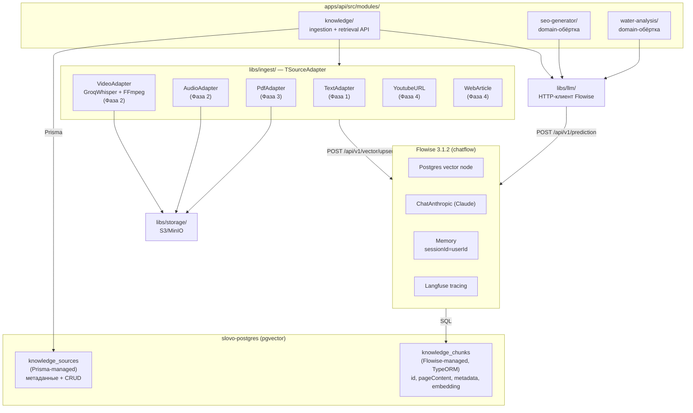

# Knowledge Base — план разработки

> **Автор:** Дмитрий Ляпин
> **Дата:** 2026-04-22
> **Статус:** Черновик, готов к обсуждению
> **Цель документа:** зафиксировать видение knowledge base как **core-capability slovo**, разбить на фазы, выделить открытые вопросы для ответа до старта кода.

---

## 1. Что мы строим (одной фразой)

**Knowledge Base — первая и основная фича slovo.** Пользователь грузит сюда свои источники (видео-вебинары, заметки, методички), задаёт по ним вопросы, получает ответы с цитатами. Аналог NotebookLM, но self-hosted + API-first.

**Одновременно это и core capability платформы.** Те же самые ingestion + chunking + embeddings + retrieval будут reuse'иться всеми будущими domain-фичами (seo-generator, water-analysis) — они станут тонкими обёртками, которые подмешивают retrieval к своему промпту.

Два назначения — один слой. "Feature + platform" в одном лице, как Firebase Auth.

---

## 2. Почему это нужно (продуктовая логика)

### Две аудитории

**Как фича — для конечного пользователя:**

- Загружает свои обучающие материалы (вебинар эксперта, методичку, заметки).
- Задаёт по ним вопросы: *"что делать если показатели воды такие-то?"* — AI отвечает в терминах загруженного контента, а не из общих знаний Claude.
- Использует как "второй мозг" по узкой теме, которую сам же и накормил.

**Как core capability — для будущих domain-фич:**

- SEO-генератор WB → методология эксперта (через этот же knowledge base)
- Water-analysis → методология лаборатории (через этот же knowledge base)
- Notes-RAG — прямо **это и есть** knowledge base для персональных заметок

Каждая domain-фича становится **тонкой обёрткой**: свой промпт + системные правила + retrieval из общего knowledge base + вызов Claude. Без общего слоя каждая фича переизобретала бы ingestion + chunking + embeddings + retrieval заново.

### Ключевой инсайт

Методология/материалы у пользователя живут в разных форматах: **вебинары, интервью, PDF-методички, текстовые промпты, обучающие видео, ссылки на статьи**. Knowledge base должен быть **полиморфным по источникам с первого дня** — видео через транскрибацию, текст напрямую, PDF через парсер.

Транскрибация — **не отдельная фича**, а **один из адаптеров ingestion**. Для экспертного промпта, который приходит текстом, транскрипт не нужен. Для 2-часового вебинара — нужна. Архитектура должна поддерживать оба случая.

---

## 3. Архитектура



**Разделение ответственности:**

| Слой | Ответственность |
|---|---|
| `libs/storage/` | Хранение blob'ов (видео, аудио, PDF) в S3/MinIO |
| `libs/ingest/` | **Экстракция текста** из разных источников (адаптеры), а также **транскрибация** как internal-сервис для video/audio адаптеров |
| `libs/knowledge/` | **Chunking + embeddings + retrieval.** Унифицированный pipeline для любого source-type |
| `libs/llm/` | Абстракция LLM-провайдеров (Claude primary, OpenAI/Ollama при необходимости) |
| `apps/api/src/modules/knowledge/` | REST API для ingestion и search |
| `apps/api/src/modules/<feature>/` | Domain-фича — собирает retrieval + свой промпт + LLM |

---

## 4. Модель данных (Prisma)

Файл: `prisma/schema/knowledge-base.prisma`

```prisma
model KnowledgeSource {
    id           String                @id @default(dbgenerated("gen_random_uuid()")) @db.Uuid
    userId       String?               @db.Uuid  // NULL пока auth нет — phase-gated
    sourceType   KnowledgeSourceType
    status       KnowledgeSourceStatus @default(pending)
    progress     Int                   @default(0)  // 0..100 для async (видео)
    title        String?               @db.VarChar(256)
    // Полиморфные поля:
    storageKey   String?               // ключ в S3/MinIO для video/audio/pdf
    sourceUrl    String?               // для URL-адаптеров (youtube/article)
    rawText      String?               @db.Text  // для TEXT адаптера — вход как есть
    extractedText String?              @db.Text  // унифицированный результат после адаптера
    metadata     Json?                 // свободная дополнительная информация
    error        String?               @db.Text
    // chunks НЕ relation — они в отдельной Flowise-managed таблице knowledge_chunks,
    // связь через metadata.source_id (app-level, без DB FK). См. ADR-006.
    createdAt    DateTime              @default(now()) @map("created_at")
    updatedAt    DateTime              @updatedAt @map("updated_at")
    startedAt    DateTime?             @map("started_at")
    completedAt  DateTime?             @map("completed_at")

    @@index([userId, createdAt])
    @@index([status, createdAt])
    @@map("knowledge_sources")
}

// ВАЖНО (2026-04-23 — обновлено после эксперимента C):
// Таблица knowledge_chunks НЕ моделируется в Prisma.
// Её создаёт и управляет Flowise Postgres vector store node (TypeORM driver).
//
// Схема Flowise (фиксированная):
//   CREATE TABLE knowledge_chunks (
//     id uuid DEFAULT gen_random_uuid() PRIMARY KEY,
//     "pageContent" text,
//     metadata jsonb,
//     embedding vector
//   );
//
// В metadata кладём:
//   - source_id  — связь с knowledge_sources (app-level FK)
//   - user_id    — для multi-tenant pgMetadataFilter
//   - position   — порядковый номер chunk внутри source
//   - chunk_specific (timestamps для видео, страницы для PDF)
//
// HNSW индекс — отдельная Prisma миграция --create-only после первого upsert.
// Multi-tenant isolation — pgMetadataFilter в Flowise retriever: {"user_id": "..."}.
// Cleanup при удалении source — NestJS-хук делает DELETE chunks по metadata.source_id.
//
// См. полный дизайн в ADR-006, раздел «Дизайн таблиц», и
// docs/guides/flowise-vs-nestjs.md раздел «C. Postgres vector store».

enum KnowledgeSourceType {
    text       // TEXT — прямой ввод, без экстракции
    video      // VIDEO — файл, через Whisper
    audio      // AUDIO — файл, через Whisper
    pdf        // PDF — через pdf-parse/unstructured
    docx       // DOCX
    youtube    // URL на YouTube
    article    // HTTP URL на web article

    @@map("knowledge_source_type")
}

enum KnowledgeSourceStatus {
    pending    // создан, ждёт обработки
    processing // идёт ingestion/embedding
    ready      // готов к retrieval
    failed     // ошибка, см. error

    @@map("knowledge_source_status")
}
```

**HNSW индекс** на `embedding` добавляется вручной миграцией через `migrate dev --create-only` (Prisma не умеет декларативные vector-индексы). См. ADR-005, раздел "Ручная правка migration.sql".

---

## 5. План по фазам

### Фаза 1 — Text-only knowledge base (MVP) (~1.5 недели вечеров)

**Задачи:**

- [ ] Prisma модели `KnowledgeSource` + `KnowledgeChunk`, миграция + HNSW index
- [ ] `libs/storage/` — S3 абстракция (в MVP с MinIO-driver). Пустой placeholder если в phase 1 файлов нет, но лучше сразу — пригодится в Фазе 2
- [ ] `libs/ingest/` с `TSourceAdapter` + `TextSourceAdapter` (вход: plain text → выход: text + metadata)
- [ ] `libs/knowledge/` с:
    - `TEmbedder` + `OpenAiEmbedder` (реальный вызов OpenAI text-embedding-3-small)
    - `TextChunker` (sentence-based, 500 tokens max, overlap 50)
    - `PgVectorRetriever` (top-K через `$queryRaw` + `<=>` оператор)
- [ ] `apps/api/src/modules/knowledge/`:
    - `POST /knowledge/sources` (sourceType=text, body содержит text+title+metadata) → chunk → embed → save → вернуть 201 с id
    - `GET /knowledge/sources/:id` — статус + preview
    - `GET /knowledge/sources` — список пользователя
    - `POST /knowledge/search` (body: query + topK + sourceIds?) → embed query → retrieval
- [ ] MinIO в `docker-compose.infra.yml` (даже если MVP без файлов — заложить слой)
- [ ] ENV: `S3_ENDPOINT`, `S3_ACCESS_KEY`, `S3_SECRET_KEY`, `S3_BUCKET`, `OPENAI_API_KEY`, `EMBEDDING_MODEL`, `EMBEDDING_DIMENSIONS`
- [ ] Unit + integration тесты (chunker, embedder-moc, retriever с реальной БД или testcontainers)

**Самостоятельная ценность:** разработчик может вручную загружать тексты (экспертные промпты, методички в plain text) и делать search по ним. Фундамент для всех будущих domain-фич.

### Фаза 2 — Video/Audio адаптеры (~2 недели)

**Задачи:**

- [ ] `apps/worker/src/modules/knowledge-ingestion/` — RMQ consumer для async source-types
- [ ] `libs/ingest/adapters/video/`:
    - `VideoSourceAdapter` — выгружает из S3, вызывает FFmpeg для audio extraction, chunking на 20 мин, вызывает `GroqWhisperService`
- [ ] `libs/ingest/adapters/audio/` — аналогично для audio-файлов, без FFmpeg-шага
- [ ] `libs/ingest/transcription/groq-whisper.service.ts`:
    - retry + model fallback (`whisper-large-v3-turbo` → `whisper-large-v3` на 429) — **портируется 1:1** из `video-transcriber/transcribe.js`
    - Структурированный вывод с segments/timestamps
- [ ] `libs/ingest/utils/ffmpeg.util.ts` — обёртка над `spawn('ffmpeg')`, streaming, не `execSync`
- [ ] Multipart upload endpoint: `POST /knowledge/sources` с `sourceType=video` → грузит в S3 → публикует сообщение в RMQ → возвращает 202 Accepted с id
- [ ] Progress updates: worker обновляет `progress` и `status` в БД, клиент поллит `GET /:id` или подключается по SSE
- [ ] Direct S3 presigned URL для больших файлов (>50MB) — опционально в MVP
- [ ] Тесты: worker integration с мок-Groq, e2e с мок-pipeline

**Самостоятельная ценность:** можно закидывать вебинары/обучающие видео как источник знаний для фичей.

### Фаза 3 — Первая domain-фича-пример (~1 неделя)

Простая showcase-фича, которая демонстрирует как использовать `knowledge-base` + `libs/llm/`. Кандидаты:

- **`notes-rag`** — простой Q&A эндпоинт: `POST /ask` (query + sourceId) → retrieval top-K → Claude отвечает с цитатами
- **`water-analysis`** light — сравнение результата анализа воды с методологией (если есть готовая методичка загруженная в knowledge base)
- **`video-to-artifact`** ⭐ *(идея 2026-04-23)* — auto-generate Word/UML/Markdown из видео на основе контекста. См. Phase 2.5 backlog ниже.

Выбирается после Phase 2 когда будет готова транскрибация.

### Phase 2.5 backlog: `video-to-artifact` — auto-document generation ⭐

**Идея** *(2026-04-23, от разработчика)*: пользователь грузит видео → получает **автоматически сгенерированный артефакт** в формате, подходящем под контекст видео.

**Pipeline:**

```
Video upload → Whisper transcription (Phase 2 уже готова)
  ↓
Claude Haiku classifier (structured output):
  {
    type: "tutorial" | "lecture" | "architecture" | "interview" | "mixed",
    topics: [...],
    suggested_formats: ["docx", "mermaid", "markdown", "article"]
  }
  ↓
Claude Sonnet generator (выбранный формат):
  • "tutorial"     → Word-конспект (npm `docx`, программная генерация)
  • "architecture" → Mermaid UML-диаграммы в `.md` с описанием
  • "lecture"      → Markdown-статья со структурой
  • "interview"    → Transcript с тайм-кодами (speaker diarization — позже)
  ↓
Artifact в S3/MinIO + preview в UI:
  • .docx         → `docx-preview` (render в canvas)
  • Mermaid `.md` → `mermaid.js` (render в SVG на клиенте)
  • Markdown     → `rehype` render
  ↓
Q&A поверх артефакта (knowledge-base под капотом):
  retrieval из chunks того же источника → Claude с цитатами
```

**Модели данных (расширение `KnowledgeSource`):**

```prisma
model KnowledgeArtifact {
    id         String              @id @default(dbgenerated("gen_random_uuid()")) @db.Uuid
    sourceId   String              @db.Uuid
    source     KnowledgeSource     @relation(fields: [sourceId], references: [id], onDelete: Cascade)
    type       ArtifactType
    storageKey String              // S3 ключ
    status     ArtifactStatus      @default(pending)
    metadata   Json?               // title, suggested_format, длительность генерации, cost
    createdAt  DateTime            @default(now()) @map("created_at")
    @@index([sourceId, type])
    @@map("knowledge_artifacts")
}

enum ArtifactType       { docx mermaid markdown transcript summary }
enum ArtifactStatus     { pending generating ready failed }
```

**Зависимости:**

- Сервер: `docx` (программная генерация), опционально `@mermaid-js/mermaid-cli` для pre-render SVG
- Клиент: `mermaid.js`, `docx-preview`, `rehype-stringify` + `remark-gfm`

**Уникальность (честно):** похожие куски есть в Descript / Otter / Tldv / Fireflies / Gemini Deep Research. Но **конкретная связка «auto-classify → suggest format → inline preview + Q&A поверх»** в одном бесшовном UI — свежая эргономика, продаваемый demo-кейс для SaaS.

**Объём работы:** ~2 недели вечерних (после того как Phase 1 + Phase 2 готовы) — classifier prompt + 3 generator'а + preview в UI + API.

**Не делаем в Phase 2.5:**
- Speaker diarization (отдельная фича, ресурсо-ёмкая)
- Translation
- Full-blown article editor на стороне юзера (max — download + view)
- A/B перегенерация форматов (сначала только один формат на артефакт)

Детальный план — отдельным документом `docs/features/video-to-artifact.md` когда Phase 2 почти закончена (по образцу этого knowledge-base.md).

### Фаза 4+ — остальные адаптеры

- PDF / DOCX через `pdf-parse` / `mammoth` / `unstructured.io`
- YouTube URL через `youtube-dl-exec` → audio → Whisper
- Web article через `cheerio` + `@mozilla/readability`

По мере потребности.

---

## 6. Выбор инструментов

### Embeddings

- **По умолчанию:** OpenAI `text-embedding-3-small` (1536 dims). Цена `$0.02` за 1M токенов.
- **Альтернатива для русского multilingual:** Cohere `embed-multilingual-v3.0` (1024 dims). Лучше на русском, дороже.
- `EMBEDDING_MODEL` + `EMBEDDING_DIMENSIONS` уже в `env.schema.ts`. При смене модели — новая миграция с `vector(N)`.

### Транскрибация

- **Groq Whisper** (`whisper-large-v3-turbo` + `whisper-large-v3` как fallback). Бесплатный план: 20 req/min, 2000 req/day, ~7200 сек/час на модель.
- Retry/fallback логика — 1:1 из `video-transcriber/transcribe.js`.
- Альтернатива при scale: OpenAI Whisper API (стабильнее, но дороже) или self-hosted `faster-whisper` на GPU.

### Storage

- **Dev:** MinIO в `docker-compose.infra.yml`.
- **Prod:** любой S3-совместимый (AWS S3, DigitalOcean Spaces, Cloudflare R2, Backblaze B2). `S3_ENDPOINT` конфигурируем.
- SDK: `@aws-sdk/client-s3` — он самый production-ready для Node.

### Chunking

- **MVP:** sentence-based с token limit (500) и overlap (50). Библиотека: `llamaindex-js` chunker или самописный (5 часов работы).
- **Phase 2:** semantic chunking (embed соседние chunks и мержить похожие). Возможно позже.

### Роль Flowise (актуализировано 2026-04-30)

**Решение:** Flowise = LLM runtime + RAG-orchestration. NestJS = ingestion + business logic. Управление Flowise — через `apps/mcp-flowise/` (66 typed tools, см. ADR-008).

**История пересмотров:**

- **2026-04-22 (первая версия):** "Flowise = prompt playground, NestJS = runtime". Аргумент — отсутствие Claude/Whisper/long-running в Flowise, плюс ограничения `overrideConfig.promptValues` в 2.x.
- **2026-04-22 вечер (пересмотр):** Flowise 3.x умеет ChatAnthropic + Claude credentials + AgentFlow V2 + Custom MCP. Перешли на "Flowise = LLM runtime, NestJS = бизнес-слой". Транскрибация остаётся в `apps/worker` через Groq Whisper (Flowise не умеет аудио из коробки).
- **2026-04-30 (Phase 0.5 закрыта):** добавлен `apps/mcp-flowise/` с 66 tools — программное управление Flowise через MCP вместо UI. `libs/flowise-flowdata/` — типизированный builder для chatflow programmatic creation. ADR-008 фиксирует выбор и план extract в Pelmenya/* + npm/Smithery publish.

**Что используем для knowledge-base из MCP-арсенала:**

| Use case | Tool / lib |
|---|---|
| Создание Document Store под новый knowledge-set | `flowise_docstore_create` + `flowise_docstore_full_setup` (атомарный 5-step) |
| Refresh embeddings (новые источники добавлены через `apps/api/sources/upload`) | `flowise_docstore_refresh` |
| Q&A endpoint slovo `apps/api/notes-rag/query` | `flowise_docstore_query` (без LLM, ~300ms) ИЛИ `flowise_prediction_run` (через QA Chain если нужен генерируемый ответ) |
| Программно создать новый специализированный chatflow (например, Q&A с другим Splitter под медицинские источники) | `libs/flowise-flowdata/` builder + `flowise_chatflow_create` |
| Vision + transcription pipelines (audio → Whisper → text → embed) | `apps/worker` нативно делает Whisper → текст в `s3-source`, далее `flowise_docstore_upsert` или native S3 File Loader |

**Что остаётся в slovo runtime (не Flowise):**

- **Ingestion адаптеры** (`apps/worker`) — Groq Whisper для аудио/видео, Puppeteer для web, PDF parsing — всё что Flowise не умеет нативно или умеет неудобно.
- **Auth, JWT, multi-tenant, billing** — slovo бизнес-слой, к Flowise не имеет отношения.
- **Pre-processing** — нормализация текста, удаление PII перед embedding'ом, EXIF strip — на стороне slovo до отправки в Flowise.

**Что НЕ делаем:**

- ❌ Не дублируем embedding/retrieval на slovo-стороне через `$queryRaw` к pgvector — `flowise_docstore_query` делает это лучше и быстрее (vector store config + indexing управляется Flowise).
- ❌ Не используем `libs/llm/` напрямую для Q&A когда есть Conversational Retrieval QA Chain в Flowise.
- ❌ Не пишем curl-обёртки к Flowise REST в slovo коде — все вызовы через `apps/mcp-flowise/` либо напрямую (в slovo TS-коде через `import` если понадобится) или через MCP transport (Claude → MCP → Flowise).

### pgvector индексы

- **MVP:** HNSW с `vector_cosine_ops` (cosine similarity). Параметры: `m = 16, ef_construction = 64` — дефолты.
- Альтернатива: IVFFlat — для >>10M векторов, но требует tuning `lists`.

---

## 7. Метрики

Собираем с первого дня:

### Technical

- **Retrieval recall@10** — на синтетическом тест-сете (50-100 пар query/expected-chunk)
- **Embedding latency** — p50/p95 для одного чанка и для batch
- **Transcription latency** — p95 для 10-минутного видео
- **Token cost per source** — средняя стоимость ingestion (embeddings + Whisper)
- **pgvector search latency** — p95 при разных размерах таблицы (1k / 100k / 1M chunks)

### Business / Product

- **Количество sources по типам** — какой адаптер используется чаще
- **Retrieval hit rate** — сколько raiscivalются фактически используются domain-фичами (не только подняли top-K, а в финальный ответ попали)
- **Failed sources %** — сколько ingestion падает (плохие PDF, недоступные URLs, сломанные видео)

---

## 8. Риски

### Качество embeddings на русском

**Риск:** `text-embedding-3-small` — англоязычно-ориентирована, русский может давать хуже recall.

**Митигация:**
- Тест-сет из 50 русскоязычных query + expected chunk пар, замерить recall.
- Если recall <70% — переключиться на Cohere multilingual (дороже в 5x, но одна миграция).
- Сохранить `embedder` за интерфейсом — замена прозрачная.

### Размер видео и стоимость транскрибации

**Риск:** 2-часовой вебинар = ~120 min audio = 6 chunks по 20 мин = 6 API-вызовов Groq. Бесплатный план ограничивает 7200 sec/hour на модель — укладываемся, но edge case.

**Митигация:**
- Rate limit на endpoint `POST /knowledge/sources` для video-типа (1 на пользователя в час в MVP).
- Предупреждение клиента о длительности обработки перед upload.
- При превышении лимитов — отложенная обработка в очереди (RMQ естественно это даёт).

### Prisma не умеет vector индексы декларативно

**Риск:** при первом `migrate dev` нет HNSW индекса — поиск медленный с ростом данных.

**Митигация:**
- Миграция через `--create-only` с ручным `CREATE INDEX ... USING hnsw`.
- Описано в `ADR-005 → Ручная правка migration.sql`, ревьюеры это знают.

### Стоимость хранилища (S3) на масштабе

**Риск:** сырые видео-файлы большие, 100 вебинаров по 500MB = 50GB. AWS S3 ~$1.15/month за 50GB — терпимо.

**Митигация:**
- После успешного transcription — **опционально** удалять видео-блоб из S3 (оставлять только extractedText в БД). Конфигурируется через env `KEEP_RAW_BLOBS_AFTER_INGEST=false`.
- Lifecycle rule в S3: cold storage через 30 дней.

### Drift embeddings при смене модели

**Риск:** обновили `text-embedding-3-small` → она на тех же текстах даёт другие вектора → старые chunks "отстают" от новых query.

**Митигация:**
- Pin модель в env (`EMBEDDING_MODEL=text-embedding-3-small-v1`), обновление — осознанное.
- Если меняем модель — ре-embed всех source. Фоновая джоба, батчами.

### Зависимость от Groq API

**Риск:** Groq — сторонний провайдер, SLA unknown, могут поменять лимиты.

**Митигация:**
- Абстракция `TTranscriptionProvider` — замена на OpenAI Whisper или self-hosted faster-whisper прозрачная.
- Документирован rate limit + backoff.

---

## 9. Что мы НЕ делаем (MVP)

- ❌ Speaker diarization (кто что сказал) — phase 4+, если понадобится
- ❌ Translation (перевод транскриптов) — не ценность для slovo сейчас
- ❌ Custom embedding models — используем готовые API
- ❌ Full-text search поверх chunks — pgvector similarity достаточно
- ❌ Hybrid search (vector + BM25) — phase 3+, если recall недостаточный
- ❌ Auto-summarization source → короткое описание — можно позже, сейчас title ручной
- ❌ UI фронт — это API-only слой, UI будет отдельным модулем платформы
- ❌ Streaming ingestion — принимаем файл целиком, не chunk-by-chunk upload

---

## 10. Открытые вопросы

### Продуктовые

1. **Multi-tenant vs single-user в MVP** — Phase 1 закладываем `userId?` в модель, но auth нет. Принять: в MVP все sources глобальные (userId = null), когда появится auth — миграция добавит привязку? Или сразу сделать фейковый `userId` из env?
2. **Лимиты на MVP** — размер одного source (100KB для text? 1GB для video?), количество sources на пользователя, rate limit на embed/search?
3. **Кто владеет метаданными** — нужна ли обязательная схема metadata для каждого source type, или это свободный JSON?

### Технические

4. **Chunker — самописный или llamaindex-js** — llamaindex-js тянет 20+ зависимостей, overkill для простого sentence splitter. Склоняюсь к самописному (~100 строк). ОК?
5. **Direct S3 upload через presigned URL vs multipart через API** — для видео >100MB multipart через Nest/Express съест RAM. Лучше presigned URL, клиент грузит напрямую в S3, потом дёргает `POST /knowledge/sources` с `storageKey`. Делаем сразу или в phase 2?
6. **RMQ queue naming и contracts** — одна очередь `knowledge-ingestion` с полиморфным payload (`{sourceId, sourceType}`) или отдельные очереди на каждый тип? MVP: одна очередь.
7. **Embedding batching** — батчить chunks в один API-запрос (OpenAI принимает до 2048 inputs за раз). Экономит 90% latency. Делаем в MVP или позже?
8. **Unicode/эмодзи в тексте** — Whisper часто выдаёт текст с эмодзи в промежуточных markers. Обрезать? Сохранять? — предлагаю сохранять, это context-bearing.

### Инфраструктурные

9. **MinIO: в infra compose или отдельный compose?** — я за infra.yml (проще старт).
10. **Бэкапы S3 blobs + БД перед миграциями** — уже заложено в `tech-debt.md` п.12 для БД, но S3 тоже требует стратегии. Обсудим перед prod.

---

## 11. Следующие шаги (завтра)

1. **Перечитать этот документ на свежую голову,** ответить на 10 открытых вопросов.
2. Набросать **ADR-006** — закрепить решение "knowledge base = core capability, polymorphic ingestion" официально.
3. После: Phase 1 стартует с PR1 — `prisma/schema/knowledge-base.prisma` + миграция + MinIO в compose.

Все оценки — **честные диапазоны**, не дедлайны. Принцип: затык >1 день → переосмысляем подход, а не накидываем часы.
