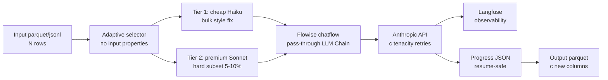

# LLM Batch Data Preprocessing Pattern

> **Дата создания**: 2026-05-29
> **Источник**: ML Cup C task — preprocessing 9000 школьных Q&A для LoRA Qwen3-4B
> **Status**: Production-tested pattern для reuse в slovo + ML-задачах

## 🎯 Когда применять этот pattern

Когда нужно **batch process** большой dataset (1k-100k rows) через LLM:
- **Knowledge distillation** — sжать ответы для tight context window обучаемой модели
- **Style transfer** — унифицировать форматирование (markdown → plain, multilingual → ru-only)
- **Data augmentation** — переписать примеры в разных стилях
- **Synthetic labels** — генерация эталонных ответов для LoRA fine-tune
- **Filtering / categorization** — классификация большого корпуса через LLM
- **Translation** — массовый перевод корпуса

**НЕ применять** для:
- Real-time inference (используй streaming endpoint)
- < 100 rows (overkill инфра, simple curl лучше)
- Highly accurate factual extraction (нужен structured output + verification)

---

## 🏗️ Architecture overview



**Key components:**
1. **Python script** (`process.py`) — async batch processor, retries, checkpointing
2. **Flowise chatflow** — LLM endpoint abstraction (model swap easy)
3. **Docker** — self-contained pipeline, replays on any machine
4. **Langfuse** — automatic cost / latency / token observability

---

## 📋 Implementation pattern (5 шагов)

### Step 1: Flowise chatflow setup

**Use LLM Chain template** (NOT AgentFlow V2 — overhead для simple batch):

```typescript
// Минимальный chatflow: PromptTemplate → LLMChain → ChatAnthropic
// Template = "{input}" (pass-through, all logic в Python)

const FLOWISE_TEMPLATE = '{input}';

const config = {
    model: 'claude-haiku-4-5',   // cheap baseline
    temperature: 0.3,             // slight diversity for phrasing
    streaming: false,             // batch jobs не нужен stream
    max_tokens: 800,              // safety ceiling
};
```

**Why pass-through `{input}`**: Python script builds **full prompt** per row (adaptive). Если Flowise template **тоже** содержит rules — будут **дублироваться**.

**См. пример builder**: `experiments/haiku-compress/build-flowdata.mjs`

### Step 2: Adaptive prompt builder (Python)

**3-tier strategy** based on input length:

```python
def build_adaptive_prompt(query, answer, answer_chars):
    if answer_chars < THRESHOLD_SHORT:
        # Short — return as-is (no compression cost wasted)
        return f"Answer ниже короче {THRESHOLD_SHORT} chars — верни БЕЗ ИЗМЕНЕНИЙ.\n{answer}"
    
    elif answer_chars <= THRESHOLD_MEDIUM:
        # Standard compress
        return f"Сожми до {TARGET_LEN} chars: ...{answer}"
    
    elif answer_chars <= THRESHOLD_LONG:
        # Aggressive — explicit hard cap
        return f"Длинный input ({answer_chars}c). MAX {HARD_CAP} chars. ...{answer}"
    
    else:
        # Ultra-long — keep core only
        return f"ОЧЕНЬ длинный. Извлеки СУТЬ в {ULTRA_TARGET} chars. ...{answer}"
```

**Why adaptive**:
- Short inputs — wasted Haiku call if compress (uniform target). Return as-is.
- Medium — standard pattern works.
- Long — need explicit «aggressive» language чтобы Haiku не undershoot.
- Ultra-long — different mindset (extract vs compress).

### Step 3: Two-pass safety mechanism

После первого call — **validate output length**. Если >SECOND_PASS_TRIGGER → re-call с tighter prompt:

```python
text = await call_flowise(prompt1)

if len(text) > SECOND_PASS_TRIGGER:  # e.g. 700c
    prompt2 = f"Previous output {len(text)}c too long. Compress to {TARGET}c: {text}"
    text2 = await call_flowise(prompt2)
    if 20 <= len(text2) <= len(text):
        text = text2  # take shorter
```

**Typical 2-pass rate**: 10-20% (depends на input distribution). Cost overhead acceptable for quality safety.

### Step 4: Resume-safe checkpoint (progress.json)

**Critical** для длинных batches:

```python
def save_progress(progress: dict):
    tmp = Path(PROGRESS_JSON).with_suffix('.tmp')
    tmp.write_text(json.dumps({str(k): v for k, v in progress.items()}, ensure_ascii=False))
    tmp.replace(PROGRESS_JSON)  # atomic rename

# Save every CHECKPOINT_EVERY rows (e.g. 50)
if completed % CHECKPOINT_EVERY == 0:
    save_progress(progress)
```

**On startup**:
```python
done = set(load_progress().keys())
todo = [(idx, row) for idx, row in df.iterrows() if idx not in done]
```

→ kill batch посредине → restart продолжит с last checkpoint.

### Step 5: Retry с tenacity

```python
@retry(
    stop=stop_after_attempt(MAX_RETRIES),
    wait=wait_exponential_jitter(initial=1, max=30, jitter=2),
    retry=retry_if_exception_type((
        httpx.ConnectError,
        httpx.ReadTimeout,
        httpx.RemoteProtocolError,
        FlowiseHTTPError,  # 429 / 5xx
    )),
    before_sleep=before_sleep_log(log, logging.WARNING),
)
async def call_flowise(client, prompt):
    response = await client.post(...)
    if response.status_code >= 400:
        raise FlowiseHTTPError(response.status_code, response.text)
    return response.json()['text']
```

**Handles**:
- Network drops (Дима's connection dropped multiple times — 0 errors due to backoff)
- Anthropic 429 rate limits (auto retry with exponential delay)
- 5xx server errors

**Fallback** после 5 неуспешных retries:
```python
except Exception as e:
    return idx, original_answer, f"error_{type(e).__name__}", latency
```
→ never lose row, just flag for post-process.

---

## 🎓 Active Learning Loop pattern

**Premium quality on hardest subset** — pyramid распределение:

```
       ▲
      🥇 200 Sonnet-gold (expensive, perfect)
     ▬▬▬▬▬▬▬▬
    9000 Haiku-compressed (cheap, decent)
   ▬▬▬▬▬▬▬▬▬▬▬▬
```

**Why this works for LoRA training**:
- **Format/style** learns from broad Haiku layer (volume gives consistency)
- **Difficult reasoning** learns from Sonnet hard examples (depth gives accuracy)
- **80/20 rule**: 20% hard queries generate 80% of model errors

**Hard subset selection** (heuristic без real failure data):

```python
# Tier 1 hardness markers
longest_100 = df.nlargest(100, 'input_length')  # known hard to compress

# Tier 2 keyword detection
math_keywords = ['уравнение', 'решите', 'вычислите', 'докажите', '\\frac', 'sin|cos']
math_pool = df[df['query'].str.contains('|'.join(math_keywords), regex=True)]
math_50 = math_pool.nlargest(50, 'input_length')

literature_keywords = ['эссе', 'образ', 'анализ', 'автор', 'произведение']
lit_50 = df[df['query'].str.contains('|'.join(literature_keywords), regex=True)]

hard_set = pd.concat([longest_100, math_50, lit_50])  # 200 total
```

**Cost economics**:
- 200 Sonnet @ ~$0.008/call = ~$1.70
- vs 200 Haiku @ ~$0.002/call = $0.40

**6× more expensive but**:
- Targeted на known-hard queries
- Sonnet preserves more specific facts (verified — 10 movie titles vs Haiku's 2)
- ROI: +3-7 баллов в downstream metrics

---

## ⚡ Cost / latency optimization

### OTPM (output tokens per minute) — **real bottleneck**, не RPM

**Common misconception**: maximize parallel based on RPM. **WRONG** — OTPM нижне.

**Anthropic Tier limits** (актуально 2026-05):

| Tier | RPM | ITPM | **OTPM** ← bottleneck |
|---|---|---|---|
| 1 (default $5) | 50 | 50k | **10k** |
| 2 ($40 + 7d) | 1000 | 100k | **20k** |
| 3 ($200 + 14d) | 2000 | 200k | **40k** |
| 4 ($400 + 21d) | 4000 | 400k | **80k** |

**Formula для max sustainable parallel**:

```
tokens_per_worker_per_min = (avg_output_tokens × 60) / avg_latency_sec
max_parallel = (OTPM × 0.7 safety) / tokens_per_worker_per_min
```

**Example Haiku Tier 3**:
- Avg output: 150 tokens
- Avg latency: 2.7s
- tokens/worker/min = 150 × 60 / 2.7 = **3333**
- Max parallel = 40k × 0.7 / 3333 = **8-10 workers**

**Lesson prev batch**: parallel=5 на Tier 3 = только 42% OTPM utilization → могли x2 быстрее.

**Workflow**:
1. Check current tier через Anthropic dashboard
2. Run pilot 50 rows на parallel=5 → measure real latency + output tokens
3. Calculate OTPM utilization
4. Adaptive ramp up при clean (no 429)
5. Target 60-70% OTPM utilization (safety margin для burst)

### Cost projection formula

```python
# Per-call cost (raw API)
input_tokens = (prompt_chars + answer_chars) / 4
output_tokens = expected_output_chars / 4

haiku_cost = input_tokens / 1_000_000 * 1.00 + output_tokens / 1_000_000 * 5.00
sonnet_cost = input_tokens / 1_000_000 * 3.00 + output_tokens / 1_000_000 * 15.00

# Add 2-pass overhead
effective_calls = 1 + 0.2 * SECOND_PASS_RATE  # ~16% typical

# Total
total = effective_calls * num_rows * per_call_cost

# С 1.2 inflation (USD → real ₽ через bank fees)
real_rubles = total * 95 * 1.2
```

---

## 📁 Reusable artifacts

Templates что можно прямо скопировать:

```
slovo/experiments/haiku-compress/
├── build-flowdata.mjs           # Generate Flowise chatflow для batch jobs
├── build-sonnet-flowdata.mjs    # Clone + swap to Sonnet variant
└── package.json

slovo/.../C_school_llm/haiku_compress/  # ← пример applied
├── process.py                   # Main async batch processor
├── process_sonnet.py            # Sonnet variant (reuse via inheritance)
├── select_hard_queries.py       # Heuristic AL selection
├── Dockerfile                   # Self-contained Python 3.11 + deps
├── docker-compose.yml           # Multi-service (haiku/sonnet/select)
└── HANDOFF_FOR_ML_SESSION.md   # Handoff template для downstream session
```

**Скопируй + adapt**:
1. Update `INPUT_PARQUET` / `OUTPUT_PARQUET` paths
2. Adjust thresholds (`TARGET_LEN`, `THRESHOLD_SHORT`, `SECOND_PASS_TRIGGER`)
3. Rewrite `build_adaptive_prompt()` для конкретной задачи
4. Configure parallel based на Tier OTPM calc

---

## 🚨 Critical lessons / gotchas

### 1. UTF-8 в curl payload — file only, never inline (Windows Git Bash)

```bash
# ❌ ЛОМАЕТ кириллицу через CP1251:
curl -d '{"question":"Сколько стоит?"}' url

# ✅ Правильно:
echo '{"question":"..."}' > payload.json
curl --data-binary @payload.json url
```

См. memory `feedback_utf8_curl_payload_via_file.md`.

### 2. tenacity decorators игнорируют sync errors

`@retry` декоратор сработает **только** на listed exceptions. Если custom exception не в `retry_if_exception_type` → fails fast без retry.

### 3. Pandas index = row index (not iterable position)

```python
# WRONG — assumes 0-N continuous index
for idx in range(len(df)):
    row = df.iloc[idx]  # positional

# CORRECT — preserve original parquet index for join
for idx, row in df.iterrows():
    # idx may be 0, 1, 2, ... or any int (e.g. after filter)
    progress[idx] = ...
```

### 4. Docker volume paths на Windows Git Bash

```bash
# WRONG — Git Bash mangles paths
docker run -v "$PWD:/work"

# CORRECT — full Windows path with forward slashes
MSYS_NO_PATHCONV=1 docker run -v "C:/Users/Diamond/Desktop/...:/work"
```

### 5. Status flag aggressiveness

Не делай `if len(output) < 20: fallback` — это **too aggressive** для legit short answers (`956`, `13`).

Better:
```python
if len(output) < 5 or output.strip() in ('', 'ERROR', 'null'):
    fallback_to_original = True
```

---

## 🎯 Quality gates checklist

После batch — verify:

```python
import pandas as pd
df = pd.read_parquet(OUTPUT)

# 1. Coverage
assert df['status'].value_counts().get('ok', 0) > 0.95 * len(df), 'low ok rate'

# 2. Length distribution
print(df['output_chars'].describe())
# Expected: avg in target range, p99 < HARD_CEILING, max << 2× target

# 3. Compression ratio sanity
ratio = df['input_chars'] / df['output_chars'].clip(lower=1)
print(ratio.describe())
# Expected: median 1.5-3× для compression jobs

# 4. Language consistency (если multilingual input)
import re
for _, row in df.sample(100).iterrows():
    if re.search(r'[а-яёА-ЯЁ]', row['query']):
        assert re.search(r'[а-яёА-ЯЁ]', row['output']), f'lang mismatch row {row.name}'

# 5. Markdown balance (если sensitive)
for _, row in df.sample(100).iterrows():
    assert row['output'].count('**') % 2 == 0, f'unbalanced bold row {row.name}'
    assert row['output'].count('$') % 2 == 0, f'unbalanced LaTeX row {row.name}'
```

---

## 📊 Real-world numbers (ML Cup C — 2026-05-26)

**Dataset**: 9000 школьных Q&A для LoRA Qwen3-4B fine-tune.

**Phase 1 — Haiku bulk compress**:
- 9000 rows × adaptive prompt
- parallel=5 (conservative, могли 10)
- 84 минут wall time
- 0 errors
- avg output 425c (target 400-500 ✅)
- max 1133c (HARD_CEILING 1500 — never breached)
- Cost: ~$10 USD

**Phase 2 — Sonnet Active Learning**:
- 200 hardest queries (selected via heuristics)
- parallel=2 (Sonnet OTPM half of Haiku)
- 7.3 минут wall time
- avg output 414c (tighter than Haiku — Sonnet smarter)
- Cost: $1.70 USD

**Total preprocess**: ~$12 USD, 91 минут wall time, 9200 enriched training examples ready.

---

## 🔗 Related memory entries

- [`feedback_anthropic_otpm_bottleneck.md`](../../../.claude/projects/.../memory/feedback_anthropic_otpm_bottleneck.md) — OTPM формула
- [`feedback_utf8_curl_payload_via_file.md`](../../../.claude/projects/.../memory/feedback_utf8_curl_payload_via_file.md) — UTF-8 правило
- [`feedback_bilateral_learning_style.md`](../../../.claude/projects/.../memory/feedback_bilateral_learning_style.md) — collaboration pattern

## 🔗 Related CLAUDE.md sections

- `slovo/CLAUDE.md` — «Anthropic batch jobs — OTPM bottleneck»
- `C_school_llm/CLAUDE.md` — «Anthropic API batch jobs — OTPM bottleneck (для preprocess pipeline)»

---

## TL;DR — когда захочешь сделать batch preprocess

1. **Pilot 5-50 rows** через простой curl → understand input/output distribution
2. **Create Flowise chatflow** (LLM Chain + ChatAnthropic, template = `{input}`)
3. **Build process.py** — adaptive prompt + 2-pass + checkpoint + tenacity retry
4. **Dockerize** для reproducibility
5. **Run pilot 50** → measure real latency / output / errors
6. **Calc parallel** by OTPM formula (target 60-70% tier limit)
7. **Run full batch** → resume-safe, monitor via Langfuse
8. **Quality gates** → validate output distribution + structure
9. **Active Learning** (если есть hard subset): premium pass через Sonnet на 5-10% rows
10. **Handoff doc** для downstream session (LoRA training / другой pipeline)

Время на implementation: **первый раз ~4 часов** (мы сделали в 2.5 ч), **next time ~30 минут** (copy + adapt).
