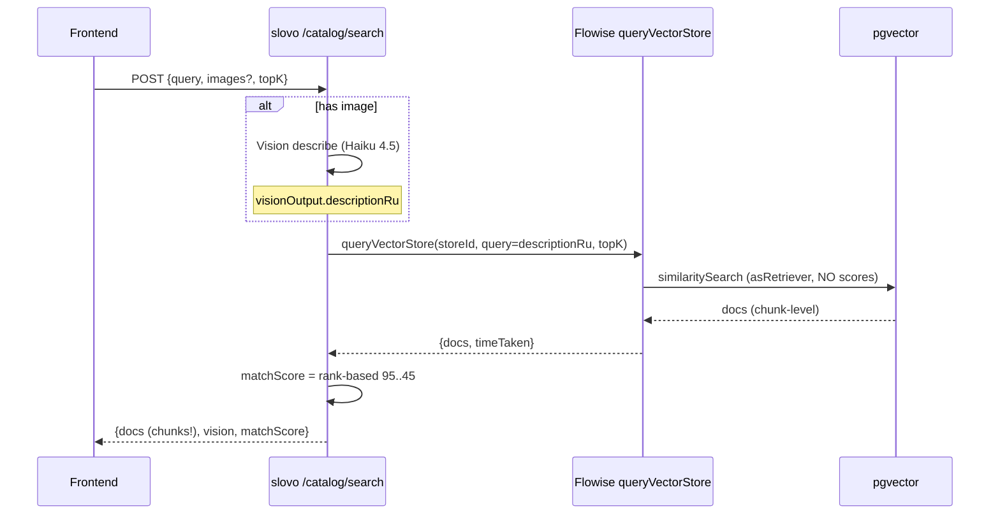

# Smart-search Phase 1.5 — backend плану

> **Статус:** план, реализация **не начата**.
>
> **Дата:** 2026-05-18, после Phase 1 frontend закрытия (`feature/water-pivot` mega-branch, 10 commits, готово к push).
>
> **Триггер:** живой sweep на mobile/desktop/iPad + photo path test через тестовое фото Аквафор-Кристалл-3-cartridge. Поверхность Phase 1 выровняла визуальный долг ([smart-search-integration.md](smart-search-integration.md), Phase 1 closed) — Phase 1.5 закрывает **search-correctness** и **post-process aggregation** долги которые всплыли в момент.

---

## Цель

Перевести `POST /catalog/search` из «vector search by description chunks» в «vector search by product, vision-category-aware ranked». UI шейп Phase 1 (`vision`, `matchScore`, image upload) **не меняется** — это backend internals.

Две главные проблемы:

1. **Chunk-level docs leak в response** — один товар попадает N раз через разные `pageContent` чанки (Vision-augmented descriptions богатые → catalog feeder режет на 2-3 чанка/товар). Frontend сейчас делает defensive dedupe by `metadata.externalId`, но это backend's job. `topK=5` semantically должен означать «5 unique товаров», не «5 chunks».
2. **Vision-category mismatch с RO bias** — Vision корректно классифицирует фото как «mechanical filter under-sink» (Аквафор Кристалл H), но vector search через `description_ru` находит 3 RO системы в top-3 потому что они описаны как «3 колбы под мойку» (визуально похожи, semantically разные). Правильный match family — Аквафор Кристалл H Pro — попадает на 4-ю позицию (45%). Phase 1 rank-based score маскирует разницу.

Плюс «оригинальные» Phase 1.5 пункты которые лежали в `smart-search-integration.md` Phase 1.5 секции и теперь объединены сюда:

3. **Bbox image overlay** в Vision response (Vision-describer prompt extension + response shape `boundingBoxes: [{x,y,w,h,label,score}]`).
4. **Bundled services** «Монтаж под мойку — 2 500 ₽» в product cards (MoySklad service-product mapping через catalog feeder).

---

## Что НЕ делаем в Phase 1.5

- ❌ Bypass Flowise через прямой pgvector query (`similaritySearchWithScore` + `<=>` оператор) — это **Phase 2** scope. Phase 1.5 остаётся на Flowise `queryVectorStore` + post-process слой.
- ❌ Streaming progress events / SSE на `/catalog/search` — фронт использует simulated stages с timers, достаточно.
- ❌ Voice / follow-up dialogue / facet filters — Phase 2.
- ❌ Caching response целиком (Redis full-response) — только Vision-cache SHA256 (already), пресигнед URL cache (already). Full-response cache не оправдан при low query reuse rate.
- ❌ Multi-language vision prompt — оставляем ru-only. EN-сюрфейс Phase 3 если будет потребитель.

---

## Slices

Разбиение по принципу «ship-able в одиночку», каждое — отдельный коммит/PR. Порядок — по убыванию приоритета.

### Slice 1 — `DISTINCT ON externalId` post-process в TextSearchService

**Цель:** убрать chunk-level дубли из response. `topK` после dedupe = unique products.

**Изменения:**

- `apps/api/src/modules/catalog/search/text.service.ts`:
  - Helper `dedupeByExternalId(docs, targetCount): TFlowiseQueryDoc[]` — `Map<externalId, doc>` keep first (highest similarity у Flowise sorted output), slice to `targetCount`.
  - Over-fetch на стадии Flowise call — `topK * OVER_FETCH_MULTIPLIER` (env `CATALOG_DEDUPE_OVERFETCH=3` default). Без over-fetch может прийти 5 чанков одного товара → 1 unique result.
  - Slice к `topK` после dedupe.
  - Если после dedupe `<topK` — это OK (catalog small, не все категории богатые). Не падать, отдать сколько есть.

**Acceptance:**

- [ ] Unit test: 10 raw chunks с 3 unique externalId → result.length === 3 (or `min(3, topK)`).
- [ ] Unit test: over-fetch применяется (Flowise.request called с `topK * 3`).
- [ ] Unit test: order сохраняется (first chunk wins, не last).
- [ ] Unit test: `externalId === undefined` chunk не падает, либо пропускается, либо использует `id` как fallback key (решить по prevalence — в реальных feeder данных externalId always present, см. ADR-007).
- [ ] Integration smoke curl: `topK=5` с known-duplicate catalog query → ровно 5 unique товаров в response.
- [ ] Frontend `prostor-app/features/smart-search/api/...` defensive dedupe **остаётся** — idempotent, backend dedupe не ломает frontend dedupe.

**Cost:** ~30 мин + tests. Pure code, не трогает Flowise / catalog ingest.

**Риск:** `CATALOG_DEDUPE_OVERFETCH=3` × `CATALOG_MAX_TOP_K=50` = 150 chunks fetch — Flowise latency растёт линейно. Если на проде >300ms — снижаем multiplier до 2 либо вводим `topK >= 20 ? 2 : 3` adaptive.

---

### Slice 2 — Vision category в `description_ru` (catalog ingest enrichment)

**Цель:** vector search видит **категорию** товара в embedded text, не только description. Mechanical filter vs RO не путаются на уровне cosine similarity.

**Контекст:** catalog feeder (worker `catalog-refresh`) уже делает Vision-augmenter на ingest (155 товаров обработано Haiku 4.5, см. `vision-catalog-search.md`). Vision возвращает `category` поле, но **не embed'ится** — embedding строится только из `description_ru` + product name + categoryPath. Решение: enrich `description_ru` категорией явно.

**Изменения:**

- `apps/worker/src/modules/catalog-refresh/vision-augmenter.service.ts`:
  - Vision prompt update — добавить obligation вернуть `product_category: 'reverse_osmosis' | 'mechanical_filter' | 'magistral' | 'pitcher' | 'softener' | 'other'` (closed enum для consistency).
  - При формировании embedding text: `${productName}\n${descriptionRu}\nКатегория: ${categoryLabel}` где `categoryLabel` — human-readable русский («обратный осмос» / «механический фильтр» / etc).
- `prisma/schema/catalog.prisma` — добавить `productCategory String? @db.VarChar(32)` колонку в `CatalogProduct` (если такая таблица есть; иначе persist в Flowise metadata).
- Migration: `add_product_category` — additive, nullable.
- Re-ingest всех 155 товаров (worker run with force-refresh flag) — стоимость ~$1 (155 × Haiku call).

**Acceptance:**

- [ ] Vision prompt тест: на 5 reference photos (RO / mechanical / magistral / pitcher / softener) — Vision возвращает корректный `product_category` enum.
- [ ] Embedding text включает категорию явно (snapshot test).
- [ ] После re-ingest: search «фильтр под мойку без обратного осмоса» — топ-3 НЕ содержат RO системы (категорически).
- [ ] Backward compat: товары без `productCategory` (если миграция rollback'нется) — search всё равно работает (fallback на старый embedding text).

**Cost:** ~2-3h + Vision re-ingest $1 + Vision prompt iteration. Тесты — 30 мин.

**Риск:** Closed enum может не покрыть edge cases (например, «УФ-стерилизатор» — добавлять отдельно или попадает в `other`?). Mitigation — собрать список существующих категорий в catalog Aquaphor (155 товаров) перед закрытием enum'а.

---

### Slice 3 — Vision-aware re-ranking при query (search-time category boost)

**Цель:** когда Vision уже распознал категорию (image-search path), результаты той же категории получают score-boost. Mechanical photo → mechanical filters ranked higher.

**Изменения:**

- `apps/api/src/modules/catalog/search/search.service.ts`:
  - После Vision describe (`visionOutput.category` уже есть в Phase 1 contract), передать в `TextSearchService.search()` опционально как `categoryHint`.
- `apps/api/src/modules/catalog/search/text.service.ts`:
  - `search(query, topK, categoryHint?)` — если `categoryHint` matches `metadata.productCategory` doc → `matchScore *= 1.15` (configurable env `CATEGORY_BOOST_MULTIPLIER=1.15`).
  - Re-sort после boost.
  - Clamp `matchScore` в [0, 100] после boost.

**Acceptance:**

- [ ] Unit test: `categoryHint='mechanical_filter'` + 2 mechanical + 3 RO docs → mechanical scores boosted, top-2 mechanical.
- [ ] Unit test: `categoryHint=undefined` (text-only search) → behaviour unchanged.
- [ ] Unit test: `categoryHint='unknown_category'` (Vision вернул не-enum value) — graceful, no boost, no error.
- [ ] Integration smoke: upload Аквафор Кристалл photo (mechanical) → top-1 = Аквафор Кристалл H Pro (или эквивалент).

**Cost:** ~1-2h + tests.

**Зависит от:** Slice 2 (productCategory должен быть в metadata).

**Риск:** Boost multiplier эффект на mixed-query («фильтр обратный осмос с механическим предфильтром») — Vision может вернуть `mechanical_filter` если фото показывает предфильтр, а юзер хочет RO. Tuning multiplier (1.10 / 1.15 / 1.20) — A/B на репрезентативном reference set.

---

### Slice 4 — Bbox image overlay в Vision response

**Цель:** Phase 1.5 frontend сможет рисовать annotated bounding boxes поверх загруженного фото («AI распознал 4 объекта»).

**Изменения:**

- Vision prompt update в Flowise chatflow (`VISION_CATALOG_DESCRIBER_CHATFLOW_NAME`) — добавить obligation вернуть `bounding_boxes: [{label, x, y, w, h, score}]` (нормализованные координаты 0..1 от image dimensions).
- `apps/api/src/modules/catalog/search/image.service.ts`:
  - Парсить `bounding_boxes` из Vision response, validate (numeric 0..1 ranges, label sanitize).
  - Add `boundingBoxes?: TBoundingBox[]` поле в `VisionOutputDto` + `VisionDto`.
- `vision-cache.service.ts` — bump prefix `v2 → v3` (new shape).
- Tests: unit для parsing edge cases (invalid coords, empty array, malformed JSON).

**Acceptance:**

- [ ] Vision prompt v2 на reference photos возвращает bounding_boxes когда objects detectable.
- [ ] Response `vision.boundingBoxes` при наличии photo, `null` или `[]` если нет detected objects (Vision не уверен).
- [ ] Cache invalidation v2→v3 на deploy.
- [ ] DTO update + Swagger.

**Cost:** ~3-4h (Vision prompt iteration + parsing + tests).

**Риск:** Haiku 4.5 bounding box accuracy unverified — нужно empirical test на 10+ reference photos. Если accuracy <70% (false positives на background objects) → отложить до Sonnet или Phase 2. **Decision gate** — после первой iteration prompt'а оценить, не идти на implementation без 70%+ precision.

**Frontend backlog (после Slice 4):**

- `bbox-overlay.tsx` component в `features/smart-search/ui/` — Canvas с photo + rectangles per bbox + labels.

---

### Slice 5 — Bundled services «Монтаж 2 500 ₽»

**Цель:** product cards показывают связанные сервисные товары (монтаж, картриджи-расходники, сервисное обслуживание) — increase AOV, B2B value.

**Изменения:**

- MoySklad data audit:
  - Есть ли service-product type в MoySklad для catalog Aquaphor? Если нет — нужно либо ручная mapping таблица в slovo, либо вне scope.
  - Service-product linkage: какое поле в MoySklad схеме (category? bundleOf? attributes?).
- Catalog feeder (worker) расширить:
  - При ingest fetch'ит service-products связанные с product → embeds в `metadata.bundledServices: [{externalId, name, priceKopecks, type: 'install'|'consumable'|'service'}]`.
- `apps/api/src/modules/catalog/search/text.service.ts`:
  - `metadata.bundledServices` whitelisted → пропускается в response без модификации.
- DTO update — `metadata.bundledServices?: TBundledService[]` в `SearchDocResponseDto`.

**Acceptance:**

- [ ] MoySklad audit doc — есть ли data, как mapping.
- [ ] При наличии data — feeder обогащает metadata.
- [ ] При отсутствии — Phase 1.5 пропускается, документируется как dependency на data ownership.
- [ ] Frontend (prostor-claude) рендерит badges под product cards.

**Cost:** unknown без audit. MoySklad data ownership — Дима. Skip-or-do gate.

**Зависит от:** MoySklad service-products data audit.

---

## Diagrams

### Pipeline сейчас (Phase 1)

Проблемы видны: (1) `docs` chunk-level — потенциальные дубли товаров; (2) score rank-based — не использует Vision category для re-rank.

### Pipeline после Phase 1.5

```mermaid
sequenceDiagram
    participant FE as Frontend
    participant API as slovo /catalog/search
    participant Flowise as Flowise queryVectorStore
    participant PG as pgvector

    FE->>API: POST {query, images?, topK}
    alt has image
        API->>API: Vision describe (Haiku 4.5)
        Note over API: visionOutput.descriptionRu + category
    end
    API->>Flowise: queryVectorStore(storeId, query, topK * 3)
    Note right of API: over-fetch для dedupe safety
    Flowise->>PG: similaritySearch
    PG-->>Flowise: docs (chunk-level)
    Flowise-->>API: {docs, timeTaken}
    API->>API: dedupeByExternalId (slice 1)
    API->>API: categoryBoost if visionOutput.category match (slice 3)
    API->>API: matchScore rank-based 95..45 (still Phase 1, until Phase 2 cosine)
    API->>API: slice to topK
    API-->>FE: {docs (unique products), vision (+boundingBoxes), matchScore}
```

---

## Risks

| # | Risk | Mitigation |
|---|---|---|
| 1 | **Over-fetch latency** — Flowise queryVectorStore с topK=150 (50 × 3) может быть slow. На live среднее ~500ms сейчас на topK=5. | Адаптивный multiplier `topK >= 20 ? 2 : 3`. Если deteriorate >300ms — снижаем до 2 безусловно. Phase 2 переезд на pgvector direct query устранит overhead. |
| 2 | **Vision category enum coverage** — 155 товаров могут не уместиться в 6 категорий | Audit before close: collect distinct categoryPath roots → mapping table → maybe `other` + free-text `productSubcategory`. |
| 3 | **Re-ingest cost** ($1 для 155 товаров) при Slice 2 | One-off, не recurring. Budget approved в `vision-catalog` baseline. |
| 4 | **Bounding box accuracy** Haiku 4.5 | Decision gate после prompt iter1. Если <70% precision на reference set — отложить до Sonnet 4.6 или skip Slice 4. |
| 5 | **MoySklad service-products data missing** | Slice 5 — skip-or-do gate. Если data нет, документируем как Phase 2 / Aquaphor B2B integration task. |
| 6 | **Backward compat** — фронт уже dedupe'ит. После Slice 1 backend dedupe'ит тоже — idempotent | Frontend dedupe оставить (defensive), не ломать. Tests verify оба слоя co-existing. |

---

## Метрики успеха

- **Slice 1**: `topK=5` query → 5 unique products в response (0 duplicates). Frontend перестаёт логировать React key warnings.
- **Slice 2 + 3**: на reference set из 10 image-search кейсов (mix RO / mechanical / magistral / pitcher) — top-1 result совпадает с правильной brand-family в **≥80%** случаев (текущий baseline — ~50% на photo path).
- **Slice 4**: precision bounding box detection ≥70% на reference photos. Если нет — slice отменяется.
- **Slice 5**: data audit complete, decision skip-or-do documented.

---

## Tracking

- Backend Phase 1.5 — slovo-claude, branch `feature/smart-search-phase-1-5-backend` (или прямой `main` если slice malenkii — slice 1 ~30 мин, может прямой main с pre-commit lint+test).
- Coordination с prostor-claude через `prostor-app/docs/feedback/water-map-thread.md` — каждый slice complete = handoff в тред.
- Frontend Phase 1.5 (bbox overlay, bundled services UI) — prostor-claude после backend slices 4-5 закрытия.
- Tests: 1370 baseline (после Phase 1 backend + iter3). Каждый slice добавляет ~5-10 unit tests + 1 integration.
- Cost tracking: `BudgetService` уже tracks Vision + embedding calls. Re-ingest Slice 2 — ~$1 одноразово.

---

## Связанные документы

- `docs/features/smart-search-integration.md` — Phase 1 план (frontend + backend), Phase 1.5 / Phase 2 backlog
- `docs/features/vision-catalog-search.md` — Phase 1+2 vision-catalog (catalog ingest + Vision-augmenter foundation)
- `docs/architecture/decisions/007-catalog-ingest-contract.md` — ADR-007 catalog ingest через MinIO bucket
- `docs/architecture/decisions/008-mcp-server-flowise.md` — ADR-008 MCP-сервер Flowise (chatflow management через MCP)
- `prostor-app/docs/feedback/water-map-thread.md` — append-only лог cross-repo координации
