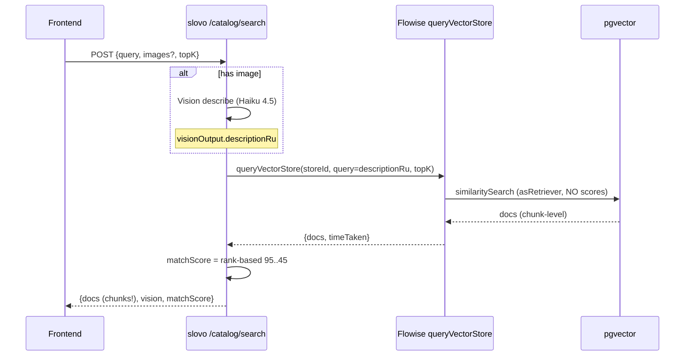
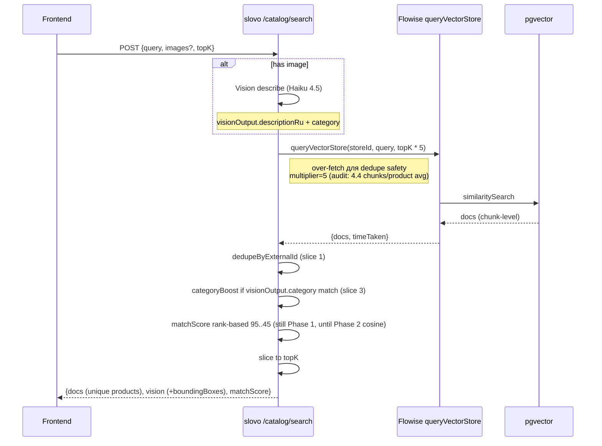

# Smart-search Phase 1.5 — backend плану

> **Статус:** план, реализация **не начата**.
>
> **Дата:** 2026-05-18, после Phase 1 frontend закрытия (`feature/water-pivot` mega-branch, 10 commits, готово к push).
>
> **Триггер:** живой sweep на mobile/desktop/iPad + photo path test через тестовое фото Аквафор-Кристалл-3-cartridge. Поверхность Phase 1 выровняла визуальный долг ([smart-search-integration.md](smart-search-integration.md), Phase 1 closed) — Phase 1.5 закрывает **search-correctness** и **post-process aggregation** долги которые всплыли в момент.

---

## Цель

Перевести `POST /catalog/search` из «vector search by description chunks» в «vector search by product, vision-category-aware ranked». UI шейп Phase 1 (`vision`, `matchScore`, image upload) **не меняется** — это backend internals.

Две главные проблемы:

1. **Chunk-level docs leak в response** — один товар попадает N раз через разные `pageContent` чанки (Vision-augmented descriptions богатые → catalog feeder режет на 2-3 чанка/товар). Frontend сейчас делает defensive dedupe by `metadata.externalId`, но это backend's job. `topK=5` semantically должен означать «5 unique товаров», не «5 chunks».
2. **Vision-category mismatch с RO bias** — Vision корректно классифицирует фото как «mechanical filter under-sink» (Аквафор Кристалл H), но vector search через `description_ru` находит 3 RO системы в top-3 потому что они описаны как «3 колбы под мойку» (визуально похожи, semantically разные). Правильный match family — Аквафор Кристалл H Pro — попадает на 4-ю позицию (45%). Phase 1 rank-based score маскирует разницу.

Плюс «оригинальные» Phase 1.5 пункты которые лежали в `smart-search-integration.md` Phase 1.5 секции и теперь объединены сюда:

3. **Bbox image overlay** в Vision response (Vision-describer prompt extension + response shape `boundingBoxes: [{x,y,w,h,label,score}]`).
4. **Bundled services** «Монтаж под мойку — 2 500 ₽» в product cards (MoySklad service-product mapping через catalog feeder).

---

## Что НЕ делаем в Phase 1.5

- ❌ Bypass Flowise через прямой pgvector query (`similaritySearchWithScore` + `<=>` оператор) — это **Phase 2** scope. Phase 1.5 остаётся на Flowise `queryVectorStore` + post-process слой.
- ❌ Streaming progress events / SSE на `/catalog/search` — фронт использует simulated stages с timers, достаточно.
- ❌ Voice / follow-up dialogue / facet filters — Phase 2.
- ❌ Caching response целиком (Redis full-response) — только Vision-cache SHA256 (already), пресигнед URL cache (already). Full-response cache не оправдан при low query reuse rate.
- ❌ Multi-language vision prompt — оставляем ru-only. EN-сюрфейс Phase 3 если будет потребитель.
- ❌ **AI-консультант чат на каталоге** — отдельная feature `catalog-ai-consultant` со своим UX (sticky chat-panel, persistent history, handoff к менеджеру). PoC закрыт 2026-05-19, переход «smart-search → AI-консультант» технически работает на той же RAG-инфре. Триггер запуска: после Phase 1.5 closure + ≥30 карточек по Slice 6 ERP guide. См. `docs/features/catalog-ai-consultant.md` (stub).

---

## Slices

Разбиение по принципу «ship-able в одиночку», каждое — отдельный коммит/PR. Порядок — по убыванию приоритета.

### Slice 1 — `DISTINCT ON externalId` post-process в TextSearchService ✅ закрыт 2026-05-18

**Цель:** убрать chunk-level дубли из response. `topK` после dedupe = unique products.

**Реализовано (commit `eab20c9` + follow-up multiplier bump):**

- `apps/api/src/modules/catalog/search/text.service.ts`:
  - Helper `dedupeByExternalId(docs): TFlowiseQueryDoc[]` — `Set<key>` keep first-seen (Flowise возвращает sorted by similarity, first-seen = best chunk per product). Fallback на `doc.id` когда `externalId` missing/empty/non-string.
  - Over-fetch на стадии Flowise call — `effectiveTopK * CATALOG_DEDUPE_OVERFETCH_MULTIPLIER` (const в `catalog.constants.ts`).
  - Slice к `topK` после dedupe.
  - Graceful degrade: если dedupe вернул `<topK` — это OK (catalog limit на narrow query), не падать.

**Audit 2026-05-18 vs implementation pass 1:** initial multiplier=3 был основан на estimate `2.1 chunks/product`. Реальный audit: 682 chunks / 155 products = **4.4 chunks/product** (Vision-augmented rich descriptions). Worst case 5 RO products = 22 chunks нужно для 5 unique. С multiplier=3 (15 raw) недобирали — поднял до **5** (25 raw chunks для topK=5). Curl smoke verify: «`фильтр обратного осмоса`» topK=5 даёт count=4 (catalog ceiling — реально 4 unique RO в catalog matching query), все externalIds unique, latency 534ms (vs baseline 506ms — +5.5% acceptable).

**Acceptance ✅:**

- [x] Unit test: 10 raw chunks с 3 unique externalId → result.length === 3
- [x] Unit test: over-fetch применяется (Flowise.request called с `topK * MULTIPLIER`)
- [x] Unit test: order сохраняется (first chunk wins)
- [x] Unit test: `externalId === undefined/empty/non-string` → fallback на `doc.id`
- [x] Integration smoke curl: `topK=5` → ровно `min(catalog_unique, 5)` товаров, все unique
- [x] Frontend dedupe **остаётся** — idempotent, backend dedupe не ломает (verified prostor-claude commit `35262b1`)

**Cost actual:** ~45 мин (vs estimate 30 мин). Pure code, не трогает Flowise / catalog ingest.

**Open follow-up:** если на проде median latency >1.5s (multiplier=5 × topK=50 = 250 raw) — вводим adaptive `topK >= 20 ? 3 : 5`. Сейчас низкий риск (текущий ceiling 534ms).

---

### Slice 2 — Vision category в `description_ru` (catalog ingest enrichment)

**Цель:** vector search видит **категорию** товара в embedded text, не только description. Mechanical filter vs RO не путаются на уровне cosine similarity.

**Контекст:** catalog feeder (worker `catalog-refresh`) уже делает Vision-augmenter на ingest (155 товаров обработано Haiku 4.5, см. `vision-catalog-search.md`). Vision возвращает `category` поле, но **не embed'ится** — embedding строится только из `description_ru` + product name + categoryPath. Решение: enrich `description_ru` категорией явно.

**Catalog audit 2026-05-18 (через mcp `flowise_docstore_query`, 5 broad queries):** 682 chunks / 155 products в Flowise `catalog-aquaphor` (avg **4.4 chunks/product** — выше моего estimate 2.1, см. Slice 1 follow-up multiplier bump). 5 root categories покрывают весь catalog:

| Root categoryPath | Examples | Phase 1.5 enum |
|---|---|---|
| Очистка воды/Аквафор/Фильтры с краном/Обратноосмотические системы/ | DWM-101S Морион, OSMO Pro, DWM-202S-C | `reverse_osmosis` |
| Очистка воды/Аквафор/Фильтры с краном/Проточные системы/Фаворит | Фаворит Pro, Фаворит ЭКО, Кристалл H | `flow_filter` |
| Очистка воды/Аквафор/Предфильтры/ | Викинг S Миди, Гросс (10″/20″), Большие BB | `pre_filter` |
| Очистка воды/Аквафор/Сменные модули/ | ЭФГ, KH, Pro H, K5-КН-K7, Fe-cartridges | `replacement_module` |
| Очистка воды/Аквафор/Дополнительно | Краны, клапаны защиты от протечек | `accessory` |

**Sub-tier «< 15000 / > 15 тыс.»** в RO — ценовой диапазон в MoySklad категории (UX noise, frontend Phase 1.5 strip regex). **Кувшинов / UV / softeners standalone** в catalog Aquaphor **нет** — Aquaphor продаёт только under-sink + magistral, не consumer line. Enum'е эти ветки не нужны.

**Изменения:**

- `apps/worker/src/modules/catalog-refresh/vision-augmenter.service.ts`:
  - Vision prompt update — добавить obligation вернуть `product_category: 'reverse_osmosis' | 'flow_filter' | 'pre_filter' | 'replacement_module' | 'accessory' | 'other'` (closed enum + `other` safety).
  - При формировании embedding text: `${productName}\n${descriptionRu}\nКатегория: ${categoryLabel}` где `categoryLabel` — human-readable русский («обратный осмос» / «проточный фильтр под мойку» / «магистральный предфильтр» / «сменный картридж» / «аксессуар» / «другое»).
- Persist `productCategory` в Flowise metadata (через feeder), без отдельной Prisma таблицы — catalog products уже не в slovo Postgres (ADR-007 MinIO bucket → Flowise pipeline).
- Re-ingest всех 155 товаров (worker run with force-refresh flag) — стоимость ~$1 (155 × Haiku call).

**Acceptance:**

- [ ] Vision prompt тест: на 5 reference photos (RO / flow_filter / pre_filter / replacement / accessory) — Vision возвращает корректный `product_category` enum.
- [ ] Embedding text включает категорию явно (snapshot test).
- [ ] После re-ingest: search «фильтр под мойку без обратного осмоса» — топ-3 НЕ содержат RO системы (категорически).
- [ ] Backward compat: товары без `productCategory` (если re-ingest fail mid-way) — search всё равно работает (fallback на старый embedding text).

**Cost:** ~2-3h + Vision re-ingest $1 + Vision prompt iteration. Тесты — 30 мин.

**Риск:** Catalog audit показал что 5 enum-значений покрывают все наблюдаемые products. Edge cases (УФ / softener standalone) в Aquaphor catalog отсутствуют — если когда-то появятся, `'other'` fallback ловит без regression. Не блокер.

---

### Slice 3 — Vision-aware re-ranking при query (search-time category boost)

**Цель:** когда Vision уже распознал категорию (image-search path), результаты той же категории получают score-boost. Mechanical photo → mechanical filters ranked higher.

**Изменения:**

- `apps/api/src/modules/catalog/search/search.service.ts`:
  - После Vision describe (`visionOutput.category` уже есть в Phase 1 contract), передать в `TextSearchService.search()` опционально как `categoryHint`.
- `apps/api/src/modules/catalog/search/text.service.ts`:
  - `search(query, topK, categoryHint?)` — если `categoryHint` matches `metadata.productCategory` doc → `matchScore *= 1.15` (configurable env `CATEGORY_BOOST_MULTIPLIER=1.15`).
  - Re-sort после boost.
  - Clamp `matchScore` в [0, 100] после boost.

**Acceptance:**

- [ ] Unit test: `categoryHint='mechanical_filter'` + 2 mechanical + 3 RO docs → mechanical scores boosted, top-2 mechanical.
- [ ] Unit test: `categoryHint=undefined` (text-only search) → behaviour unchanged.
- [ ] Unit test: `categoryHint='unknown_category'` (Vision вернул не-enum value) — graceful, no boost, no error.
- [ ] Integration smoke: upload Аквафор Кристалл photo (mechanical) → top-1 = Аквафор Кристалл H Pro (или эквивалент).

**Cost:** ~1-2h + tests.

**Зависит от:** Slice 2 (productCategory должен быть в metadata).

**Риск:** Boost multiplier эффект на mixed-query («фильтр обратный осмос с механическим предфильтром») — Vision может вернуть `mechanical_filter` если фото показывает предфильтр, а юзер хочет RO. Tuning multiplier (1.10 / 1.15 / 1.20) — A/B на репрезентативном reference set.

---

### Slice 4 — Bbox image overlay в Vision response

**Цель:** Phase 1.5 frontend сможет рисовать annotated bounding boxes поверх загруженного фото («AI распознал 4 объекта»).

**Изменения:**

- Vision prompt update в Flowise chatflow (`VISION_CATALOG_DESCRIBER_CHATFLOW_NAME`) — добавить obligation вернуть `bounding_boxes: [{label, x, y, w, h, score}]` (нормализованные координаты 0..1 от image dimensions).
- `apps/api/src/modules/catalog/search/image.service.ts`:
  - Парсить `bounding_boxes` из Vision response, validate (numeric 0..1 ranges, label sanitize).
  - Add `boundingBoxes?: TBoundingBox[]` поле в `VisionOutputDto` + `VisionDto`.
- `vision-cache.service.ts` — bump prefix `v2 → v3` (new shape).
- Tests: unit для parsing edge cases (invalid coords, empty array, malformed JSON).

**Acceptance:**

- [ ] Vision prompt v2 на reference photos возвращает bounding_boxes когда objects detectable.
- [ ] Response `vision.boundingBoxes` при наличии photo, `null` или `[]` если нет detected objects (Vision не уверен).
- [ ] Cache invalidation v2→v3 на deploy.
- [ ] DTO update + Swagger.

**Cost:** ~3-4h (Vision prompt iteration + parsing + tests).

**Риск:** Haiku 4.5 bounding box accuracy unverified — нужно empirical test на 10+ reference photos. Если accuracy <70% (false positives на background objects) → отложить до Sonnet или Phase 2. **Decision gate** — после первой iteration prompt'а оценить, не идти на implementation без 70%+ precision.

**Frontend backlog (после Slice 4):**

- `bbox-overlay.tsx` component в `features/smart-search/ui/` — Canvas с photo + rectangles per bbox + labels.

---

### Slice 5 — Bundled services «Монтаж 2 500 ₽» 🔴 high priority после PoC

**Цель:** product cards показывают связанные сервисные товары (монтаж, картриджи-расходники, сервисное обслуживание) — increase AOV, B2B value.

> **Приоритет повышен до high после PoC 2026-05-19** (`docs/experiments/knowledge-base-poc/2026-05-19-catalog-qa-baseline.md`): на reference Q&A «DWM-101S — какие картриджи и когда менять?» AI **не смог** ответить, потому что System Bundle для DWM-101S не попал в retrieval. Это **самый частый клиентский сценарий после покупки** («что и когда менять») — без него knowledge base / smart-search в проде даёт generic «информация отсутствует». Перед Slice 5 — audit конкретно DWM-101S в МС: есть ли System Bundle на товаре vs только на папке, и почему `fetchGroupContext` не подтянул его в embedding.

**Изменения:**

- MoySklad data audit:
  - Есть ли service-product type в MoySklad для catalog Aquaphor? Если нет — нужно либо ручная mapping таблица в slovo, либо вне scope.
  - Service-product linkage: какое поле в MoySklad схеме (category? bundleOf? attributes?).
- Catalog feeder (worker) расширить:
  - При ingest fetch'ит service-products связанные с product → embeds в `metadata.bundledServices: [{externalId, name, priceKopecks, type: 'install'|'consumable'|'service'}]`.
- `apps/api/src/modules/catalog/search/text.service.ts`:
  - `metadata.bundledServices` whitelisted → пропускается в response без модификации.
- DTO update — `metadata.bundledServices?: TBundledService[]` в `SearchDocResponseDto`.

**Acceptance:**

- [ ] MoySklad audit doc — есть ли data, как mapping.
- [ ] При наличии data — feeder обогащает metadata.
- [ ] При отсутствии — Phase 1.5 пропускается, документируется как dependency на data ownership.
- [ ] Frontend (prostor-claude) рендерит badges под product cards.

**Cost:** unknown без audit. MoySklad data ownership — Дима. Skip-or-do gate.

**Зависит от:** MoySklad service-products data audit.

---

### Slice 6 — ERP product card guidelines + semantic specs enrichment

**Цель:** менеджеры заполняют карточки товаров в MoySklad **семантически правильно** — с явными пределами допустимой очистки (max input concentrations, recommended water context, что фильтр умеет / не умеет). RAG embeddings связывают product capabilities с water problems юзера → smart-search и equipment-suggest точнее.

**Триггер (Дима 2026-05-18):** «Чтобы мы семантически правильно всё искали даже учитывая пределы допустимой очистки». Сейчас Vision-augmenter описывает **визуальный вид + общие тексты**, но без явных «работает при жесткость ≤ 7 мг-экв/л / железо ≤ 0.3 мг/л / TDS ≤ 1500 мг/л» — equipment-suggest ошибается на edge cases (предлагает Аквафор-кувшин для жесткой воды свыше 10 мг-экв/л, где он бесполезен).

**Background — что есть сейчас в карточках Aquaphor:**

Audit 2026-05-18 показал что descriptions ОЧЕНЬ varied:
- Часть товаров (RO системы DWM-101S) — rich description «удаляет любые премеси, токсичные вещества или вирусы, делает воду мягкой»
- Часть (краны, accessories) — generic «изготовлен из высококачественной пластмассы»
- Часть (картриджи K-серии) — частично specs «Максимальная рабочая температура воды +38°C», «Пористость 10 мкм»
- **Систематических пределов очистки (max hardness / max iron) — нет ни в одной карточке**

**Изменения (этот slice — meta-work, не code):**

1. **Document** `docs/guides/erp-product-card-guidelines.md` — для менеджеров Aquaphor / Дилеров:
   - **Обязательные секции** в MoySklad description для каждой категории:
     - **RO системы / проточные** — input limits (max hardness / iron / Mn / TDS / chlorine), output guarantee («удаляет ≥95% солей жёсткости»), recommended water context («жесткость > 7 мг-экв/л → выбирать вместо умягчителя»)
     - **Предфильтры** — micron rating, max temperature, max pressure, what it removes (mechanical / iron / softening / chlorine)
     - **Сменные модули** — совместимые с какими системами, ресурс (литры / месяцы), что фильтрует
     - **Аксессуары** — совместимость со списком моделей (точные externalIds или brand-family)
   - **Templates** для каждой категории (copy-paste готовые секции для менеджеров)
   - **Examples** good vs bad — реальные карточки до/после rewrite
2. **Slovo-side schema validation** (opt) — `apps/worker/src/modules/catalog-refresh/`:
   - Парсер ищет structured patterns («жесткость ≤ N мг-экв/л», «железо ≤ N мг/л», «TDS ≤ N мг/л») в `description`
   - Если matched → persist в `metadata.specs: { maxHardness, maxIron, maxTds, ... }`
   - Если НЕ matched (legacy карточка) → fallback на Vision-augmenter (rough estimate from photo / brand-family knowledge)
3. **Audit existing 155** — пройти через каталог, заполнить пробелы вручную (Дима / Aquaphor team) или через LLM bulk-extract из текста + manual review
4. **Embedding text enrichment** (depends on Slice 2):
   - `${productName}\n${descriptionRu}\nКатегория: ${categoryLabel}\nПределы очистки: max hardness=N, max iron=N, ...` — embed structured specs явно

**Acceptance:**

- [ ] Guidelines doc написан с templates + examples + bad/good patterns
- [ ] Передан Aquaphor / Дилеру для review (это **их** ERP, мы только consumer)
- [ ] Slovo-side parser ловит ≥80% existing structured specs из 155 карточек
- [ ] После Slice 2 + Slice 6 re-ingest: equipment-suggest на «жёсткая вода 10 мг-экв/л» **не предлагает** Аквафор-кувшин (max hardness ≤ 7 для кувшина) — категорически
- [ ] Smart-search photo path: загруженный кувшин-фильтр → **не** matches RO системы как top-1 (water capabilities differ)

**Cost:** ~4-6h doc + ~2h parser + ~$2 LLM bulk-extract из 155 cards. **Менеджерская часть** (re-fill cards) — outside slovo team, Aquaphor side, недели работы.

**Риск:** Aquaphor не захочет переписывать 155 карточек. **Mitigation 1:** parser работает на existing data, что найдёт — embed, остальное fallback Vision-augmenter. **Mitigation 2:** Aquaphor видит **бизнес-value** (точнее search → больше conversions → больше продаж) — выстраиваем case через метрики Phase 1+1.5 («после Slice 6: % правильных top-1 на equipment-suggest вырос с 50% до 85%, conversion rate +X%»).

**Зависит от:** Slice 2 closed (productCategory enum в metadata) для structured spec injection.

**Связь с water-analysis:** specs.maxHardness можно сравнивать с `water-analysis/predict` output для адресов юзеров. Если pin-адрес имеет hardness=12 мг-экв/л — **не показывать** product specs.maxHardness=7 в equipment-suggest топ-1. Это закрывает edge-case false-positives. Phase 1.5 backend side change в `apps/api/src/modules/water-analysis/equipment-suggest/`.

---

### Slice 7 — Price + key dimensions в pageContent (added 2026-05-19 после PoC)

**Цель:** LLM в knowledge-base / equipment-suggest **видит** цену товара и ключевые габариты при формулировке ответа — закрывается «бюджетный подбор» сценарий.

**Триггер PoC 2026-05-19** (`docs/experiments/knowledge-base-poc/2026-05-19-catalog-qa-baseline.md`): на reference Q&A «Подбери фильтр до 15 000 ₽» AI **честно** сказал: «цены в каталоге не указаны, не могу подтвердить укладывается ли в бюджет». При этом в retrieved sourceDocuments **3 из 4** товаров укладывались в бюджет (5 690 ₽, 10 990 ₽, 12 490 ₽) — `salePriceKopecks` есть в `metadata`, но **не в `pageContent`**. ConversationalRetrievalQAChain отдаёт LLM только `pageContent` → metadata вне reach LLM. Это **критичный gap** — без него любой ценовой подбор / сравнение / «дешевле / дороже» не работает.

**Изменения (правка в `crm-aqua-kinetics-back`, не slovo — per ADR-007 catalog feeder ownership):**

- `crm-aqua-kinetics-back/src/modules/moy-sklad/modules/catalog-sync/helpers/build-content-for-embedding.ts` — расширить блок «Характеристики» одной строкой:
  - `Цена: <salePrice / 100> ₽` если `salePriceKopecks` есть.
  - (опц) `Габариты: <Длина>×<Ширина>×<Высота> см` если все три атрибута заполнены.
- Re-ingest 155 товаров через worker → catalog feeder PUT в MinIO → Flowise upsert.
- **A/B на 10 reference queries** (price-aware: «до 15000», «дешевле 10к», «премиум выбор»; price-agnostic: «обратный осмос», «бактерии»): сравнить top-K stability до vs после. Гипотеза — price-aware улучшается, price-agnostic не страдает.

**Acceptance:**

- [ ] `build-content-for-embedding.ts` обновлён, unit test покрывает price/no-price пути.
- [ ] Re-ingest 155 catalog Aquaphor (cost ≈ $0.05 на embeddings, <1 мин).
- [ ] PoC chatflow `catalog-qa-poc-v1` Q6 «бюджет 15 000 ₽» → AI называет конкретные модели с указанием цены (vs текущее «цены нет»).
- [ ] 10 reference A/B: price-agnostic queries не деградируют (top-1 same in ≥9/10).

**Cost:** ~1h код + re-ingest ≈ $0.05 + ~30 мин A/B run + анализ. Мелкая slice.

**Зависит от:** Slice 1 (dedupe) closed ✅ — без него цены могут дублироваться по чанкам.

**Связь с Slice 6:** Slice 6 атрибут `price_segment` (economy / mid / premium) и Slice 7 raw цена — **взаимодополняющие**. Сегмент даёт semantic recall на «премиум», цена даёт точное «до 15 000 ₽». Заполнение обоих — на менеджерах.

**Side effect (положительный):** Vision-augmented embedding теперь несёт ценовой сигнал — semantic search будет лучше группировать товары по сегменту (embedding модели реагируют на числовые ranges через тренировочные данные). Может усилить эффект Slice 6 `price_segment`.

**Side effect (риск):** Цена изменяется чаще чем описание (поставщики поднимают / sale). Re-embed нужен при каждом ценовом изменении. **Mitigation:** Event-driven re-ingest **уже работает** через ADR-007 amendment 2026-05-01 — catalog-refresh cron (4ч) + RecordManager incremental + Redis `slovo:catalog:loaders` namespace + contentHash skip на уровне item. Price change → contentHash item меняется → re-embed только этого item. Дополнительная mitigation (optional) — округление до 100 ₽ (`Цена: ≈ 5500 ₽`) чтобы не triggerить re-ingest на копеечных колебаниях.

---

## Diagrams

### Pipeline сейчас (Phase 1)

Проблемы видны: (1) `docs` chunk-level — потенциальные дубли товаров; (2) score rank-based — не использует Vision category для re-rank.

### Pipeline после Phase 1.5

---

## Risks

| # | Risk | Mitigation |
|---|---|---|
| 1 | **Over-fetch latency** — Flowise queryVectorStore с topK=250 (50 × 5) может быть slow. После Slice 1 follow-up multiplier=5: на live topK=5 → 534ms (vs baseline 506ms, +5.5%). | Адаптивный multiplier `topK >= 20 ? 3 : 5` если live median deteriorates >1.5s. Phase 2 переезд на pgvector direct query устранит overhead целиком. |
| 2 | **Vision category enum coverage** — 155 товаров могут не уместиться в 6 категорий | Audit before close: collect distinct categoryPath roots → mapping table → maybe `other` + free-text `productSubcategory`. |
| 3 | **Re-ingest cost** ($1 для 155 товаров) при Slice 2 | One-off, не recurring. Budget approved в `vision-catalog` baseline. |
| 4 | **Bounding box accuracy** Haiku 4.5 | Decision gate после prompt iter1. Если <70% precision на reference set — отложить до Sonnet 4.6 или skip Slice 4. |
| 5 | **MoySklad service-products data missing** | Slice 5 — skip-or-do gate. Если data нет, документируем как Phase 2 / Aquaphor B2B integration task. |
| 6 | **Backward compat** — фронт уже dedupe'ит. После Slice 1 backend dedupe'ит тоже — idempotent | Frontend dedupe оставить (defensive), не ломать. Tests verify оба слоя co-existing. |
| 7 | **Цена в embedding шумит на price-agnostic queries** (Slice 7) | A/B на 10 reference: 5 price-aware + 5 price-agnostic. Если top-1 деградирует на price-agnostic ≥2/5 — откат к раунду до 1000 ₽ или передавать цену через context formatter а не в embedding text. |
| 8 | **System Bundle DWM-101S missing** (Slice 5) — PoC показал что bundle не попадает в retrieval даже когда `fetchGroupContext` существует | Pre-Slice 5 audit: вызвать `fetchGroupContext('DWM-101S')` в CRM dev REPL и сравнить с тем что в embedding text. Если group context пустой — inventarisation на менеджерах, не на коде. |

---

## Метрики успеха

- **Slice 1 ✅**: `topK=5` query → `min(catalog_unique, 5)` unique products (0 duplicates). Frontend перестаёт логировать React key warnings. Verified curl smoke 2026-05-18 — 4/4 unique externalIds, 534ms latency.
- **Slice 2 + 3**: на reference set из 10 image-search кейсов (mix RO / mechanical / magistral / pitcher) — top-1 result совпадает с правильной brand-family в **≥80%** случаев (текущий baseline — ~50% на photo path).
- **Slice 4**: precision bounding box detection ≥70% на reference photos. Если нет — slice отменяется.
- **Slice 5**: data audit complete, decision skip-or-do documented.
- **Slice 6**: guidelines doc + parser, после re-fill cards Aquaphor team — equipment-suggest на «жёсткая вода >7 мг-экв/л» **не предлагает** Аквафор-кувшин в топ-1 (categorical filter through specs.maxHardness).
- **Slice 7**: PoC `catalog-qa-poc-v1` повторно прогнан после re-ingest — Q6 «бюджет 15 000 ₽» переходит из «цены нет» в «Кристалл А — 5 690 ₽, Фаворит — 10 990 ₽», 5/5 price-aware queries улучшаются, 5/5 price-agnostic не деградируют.

---

## Tracking

- Backend Phase 1.5 — slovo-claude, branch `feature/smart-search-phase-1-5-backend` (или прямой `main` если slice malenkii — slice 1 ~30 мин, может прямой main с pre-commit lint+test).
- Coordination с prostor-claude через `prostor-app/docs/feedback/water-map-thread.md` — каждый slice complete = handoff в тред.
- Frontend Phase 1.5 (bbox overlay, bundled services UI) — prostor-claude после backend slices 4-5 закрытия.
- Tests: 1370 baseline (после Phase 1 backend + iter3). Каждый slice добавляет ~5-10 unit tests + 1 integration.
- Cost tracking: `BudgetService` уже tracks Vision + embedding calls. Re-ingest Slice 2 — ~$1 одноразово.

---

## Связанные документы

- `docs/features/smart-search-integration.md` — Phase 1 план (frontend + backend), Phase 1.5 / Phase 2 backlog
- `docs/features/vision-catalog-search.md` — Phase 1+2 vision-catalog (catalog ingest + Vision-augmenter foundation)
- `docs/architecture/decisions/007-catalog-ingest-contract.md` — ADR-007 catalog ingest через MinIO bucket
- `docs/architecture/decisions/008-mcp-server-flowise.md` — ADR-008 MCP-сервер Flowise (chatflow management через MCP)
- `prostor-app/docs/feedback/water-map-thread.md` — append-only лог cross-repo координации
- `docs/experiments/knowledge-base-poc/2026-05-19-catalog-qa-baseline.md` — PoC baseline 7 reference Q&A на 155 товарах catalog-aquaphor, основа Slice 5 priority bump + Slice 7 added
