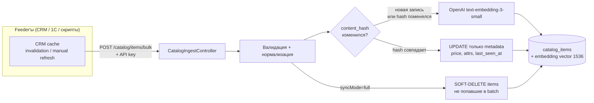
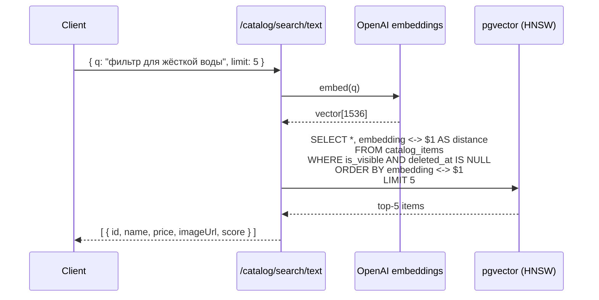
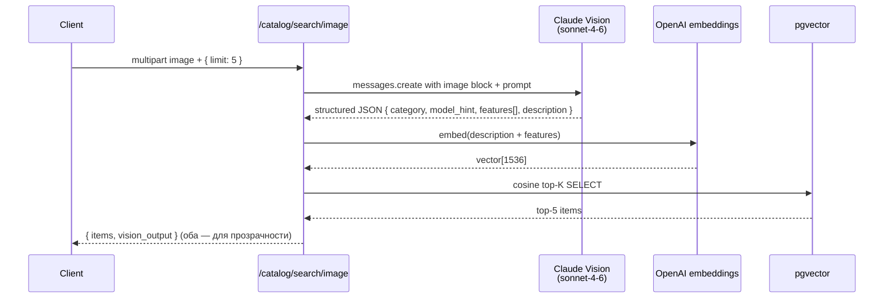

# Vision Catalog Search

> **Статус:** 🟡 черновик / Phase 1 — Flowise эксперименты
> **Связи:** [knowledge-base.md](knowledge-base.md), [ADR-006](../architecture/decisions/006-knowledge-base-as-first-feature.md), [ADR-004 Claude primary](../architecture/decisions/004-claude-as-primary-llm.md)

Фича: **поиск товара/услуги в каталоге Аквафор-Pro по фото или тексту**. Встраивается в CRM дилера — клиент прислал фото сломанного узла, дилер за пару секунд видит подходящую замену из 500 товаров MoySklad.

---

## Что строим

Гибридный поиск по каталогу:
- **text query** `"фильтр для жёсткой воды"` → embedding → pgvector cosine top-K
- **image query** фото узла → Claude Vision → структурированное описание → embedding → тот же pgvector top-K

Каталог наполняется **push-модели** от внешних систем (CRM, 1С, ручной импорт): slovo получает events `/catalog/items/bulk` и апсертит. Сам slovo **не знает** что такое MoySklad — это generic RAG-слой над каталогом.

---

## Зачем

1. **Замена вручную-листания каталога.** Дилер находит нужное за секунды, не минуты.
2. **SME-ассистент для новых инженеров.** `"всё про обезжелезиватели, диапазон цен"` — smart-filtering вместо иерархии папок.
3. **Vision для клиентских кейсов.** Клиент прислал WhatsApp фото — не надо просить «опишите модель», AI определяет сам.
4. **Фундамент для water-analysis.** Когда AI рекомендует «нужен обратный осмос» — из каталога сразу тянется конкретный SKU с ценой.

---

## Pipeline

### Ingestion (push от внешних feeder'ов через bulk API)



**Детали:**
- **Push, не pull.** slovo не знает про MoySklad API / MOY_SKLAD_API_KEY. Feeder (CRM Aqua Kinetika сейчас, 1С или другой завтра) выкачивает данные из источника истины, нормализует в generic schema, шлёт в slovo. Добавить второго tenant'а = написать ещё одного feeder'а, slovo не трогается.
- **Два режима sync:**
  - `syncMode: "partial"` — feeder шлёт только изменённые items (при invalidation конкретного ключа Redis). Быстро, без soft-delete GC.
  - `syncMode: "full"` — feeder шлёт весь каталог (полный сброс кеша / manual refresh в админке). slovo чистит отсутствующие через `last_seen_at < sync_start`.
- `content_hash = SHA-256(name + description)` — маркер изменения _текстовых_ полей (того что идёт в embedding). Изменение цены или атрибутов **не** триггерит пересчёт embedding — экономит 90% OpenAI-вызовов при типичном паттерне.
- `last_seen_at` каждого присутствующего в batch item'а обновляется. При `syncMode=full` — всё что не попало в batch с `last_seen_at < sync_start` помечается `deleted_at = NOW()`. Soft-delete, не жёсткое удаление: дилер может искать снятый с продажи товар.
- **Аутентификация:** `Authorization: Bearer <SLOVO_INGEST_API_KEY>` — machine-to-machine, отдельный API key в env обеих сторон. `@UseGuards(ApiKeyGuard)` на endpoint. Не JWT — для service-to-service не нужен.
- **Rate limiting:** отдельный throttle на `/catalog/items/bulk` (например 10 batch/min — batch может содержать до 500 items).
- **Идемпотентность:** `@@unique([externalSource, externalId])` гарантирует идемпотентный upsert. Повторный batch с теми же данными = no-op (hash не меняется).

### Query — text



### Query — image (hybrid)



**Почему "hybrid":** Vision даёт текст → embedding от текста → поиск по каталогу embedding'ов. Не сравниваем image embedding напрямую с текст embedding — это разные семантические пространства (CLIP решает эту проблему, но не нужен при 500 товарах — text bridge проще).

---

## Схема данных

```prisma
model CatalogItem {
    id                 String    @id @default(dbgenerated("gen_random_uuid()")) @db.Uuid

    // External identity — slovo не знает про MoySklad специфично.
    // externalSource = 'moysklad' | '1c' | 'manual' | любой другой feeder.
    // externalId — id в источнике истины (moyskladId для MoySklad).
    externalSource     String    @map("external_source") @db.VarChar(64)
    externalId         String    @map("external_id")     @db.VarChar(256)
    externalType       String    @map("external_type")   @db.VarChar(32)   // product | service | bundle
    externalUpdatedAt  DateTime  @map("external_updated_at")

    name               String    @db.VarChar(512)
    description        String?   @db.Text
    attributes         Json?                                       // raw attributes from feeder
    salePriceKopecks   Int?      @map("sale_price_kopecks")       // в копейках, без float
    categoryPath       String?   @map("category_path")
    imageUrl           String?   @map("image_url")
    isVisible          Boolean   @default(true) @map("is_visible")

    // Delta-sync маркеры
    contentHash        String    @map("content_hash") @db.Char(64) // SHA-256(name + description)
    lastSeenAt         DateTime  @default(now()) @map("last_seen_at")
    deletedAt          DateTime? @map("deleted_at")

    createdAt          DateTime  @default(now()) @map("created_at")
    updatedAt          DateTime  @updatedAt @map("updated_at")

    // Колонка embedding vector(1536) добавляется отдельной миграцией
    // (Prisma не поддерживает pgvector типы декларативно, см. ADR-005).
    // + HNSW-индекс с vector_cosine_ops.

    @@unique([externalSource, externalId])
    @@index([isVisible, deletedAt])
    @@index([lastSeenAt])
    @@index([externalUpdatedAt])
    @@map("catalog_items")
}
```

**Ключевые решения:**
- `externalSource + externalId` — composite unique key, multi-source ready. `moysklad:abc-123` и `1c:def-456` одновременно живут в одной таблице.
- Отдельная таблица, не `knowledge_sources` — разные домены (user uploads vs org catalog), разные lifecycle (ad-hoc vs push-sync), разная авторизация (user-scoped vs read-all + ingest-key-protected).
- `externalType` не enum, а string — расширяется через код feeder'а без миграций БД (завтра добавим `sparepart`, `manual`, etc.).

### Контракт bulk ingest API

```typescript
POST /catalog/items/bulk
Authorization: Bearer <SLOVO_INGEST_API_KEY>
Content-Type: application/json

{
  syncMode: "partial" | "full",
  items: [
    {
      externalId: "a0b1c2d3-...",           // id у feeder'а (moyskladId для CRM)
      externalSource: "moysklad",            // дискриминатор источника
      externalType: "product",               // product | service | bundle | ...
      externalUpdatedAt: "2026-04-24T07:00:00Z",
      name: "Аквафор DWM-101S",
      description: "Фильтр обратного осмоса с минерализатором",
      attributes: { weight: "12кг", rang: 5 },
      salePriceKopecks: 4500000,             // 45,000.00 ₽
      categoryPath: "Фильтры / Обратный осмос",
      imageUrl: "https://...",
      isVisible: true
    }
  ]
}

Response:
{
  received: 25,
  created: 3,
  updated_metadata_only: 18,   // hash совпал, embedding не пересчитан
  re_embedded: 4,              // hash поменялся или новая запись
  soft_deleted: 2,             // при syncMode=full
  errors: []
}
```

---

## Фазы реализации

| PR | Скоуп | Новая технология |
|---|---|---|
| **Phase 0 (сейчас)** | Flowise chatflow "Vision Describer" — экспериментируем с промптами и форматом structured output. Финальный промпт уходит в `libs/llm/prompts/vision-catalog.ts`. | Claude Vision в Flowise UI |
| **PR5** | `libs/llm/` — тонкая обёртка над `@anthropic-ai/sdk` с vision-методом + `POST /vision/describe` endpoint. Multer upload, base64 encode, Claude sonnet-4-6. Без каталога пока — просто "image → JSON". | Anthropic SDK, multipart upload |
| **PR6** | `CatalogItem` модель + миграция + `CatalogIngestService` + `POST /catalog/items/bulk` push endpoint с `ApiKeyGuard`. Partial/full sync modes, content-hash delta, soft-delete через last_seen_at. Embeddings **пока не считаем**. slovo не зависит от MoySklad API. | ApiKey auth, idempotent bulk upsert |
| **PR7** | `ALTER TABLE ADD COLUMN embedding vector(1536)` + HNSW индекс миграцией. Интеграция с OpenAI embeddings API. `/catalog/search/text` endpoint. Embedding пересчитывается в PR6-флоу только если content-hash поменялся. | pgvector HNSW, OpenAI embeddings |
| **PR8** | `/catalog/search/image` — полный hybrid pipeline из PR5-7 склеен. Swagger примеры с реальными фото. | End-to-end e2e |
| **Вне slovo** | CRM Aqua Kinetika side — cache invalidation hook → POST /catalog/items/bulk. Это отдельный PR в `crm-aqua-kinetics-back`, к slovo не относится. | CRM → slovo integration |

---

## Phase 0 — что делаем сейчас в Flowise

**Цель:** подобрать промпт для Vision который даёт стабильный structured JSON для поиска по каталогу.

### Chatflow "Vision Describer" в Flowise

Ноды:
- **ChatAnthropic** — `claude-sonnet-4-6`, поддержка image input через messages
- **Prompt Template** — инструкция "опиши в JSON"
- **Structured Output Parser** (или свой JSON prompt)

### Какой структуры JSON хотим

```json
{
  "category": "обратный осмос",
  "model_hint": "Aquaphor DWM-101S",
  "brand": "Аквафор",
  "features": ["5-ступенчатая очистка", "обратный осмос", "минерализатор"],
  "condition": "внешне исправен",
  "description_ru": "Бытовой фильтр обратного осмоса Аквафор DWM-101S. Пять ступеней очистки с минерализатором. Под мойкой, накопительный бак."
}
```

`description_ru` — это то, что пойдёт в embedding. Остальные поля — для фильтрации / отображения.

### Что проверяем в Flowise (чек-лист)

- [ ] Claude Sonnet видит загруженное изображение
- [ ] Возвращает **валидный JSON** без markdown-обёрток (` ```json `)
- [ ] Русский язык в полях выдерживается
- [ ] На мутных/плохих фото отвечает `{ "category": null, "confidence": "low" }` а не галлюцинирует
- [ ] На не-фильтре (пёс, котёнок) честно говорит `null`
- [ ] Стабильность — одну и ту же картинку прогнать 3 раза, сравнить output

### Тестовый набор фото

Собрать 10-15 фото:
- Исправные фильтры Аквафор (разные модели)
- Сломанные узлы (картридж, мембрана, трубка)
- Коробки/упаковка
- Бланк анализа воды (edge case — AI должен сказать "это не оборудование")
- Случайные фото (кот, чашка кофе) — AI должен вернуть null

Результаты сложить в `docs/experiments/vision-catalog-${date}/` с JSON outputs — чтобы было что сравнивать между итерациями промптов.

---

## Что НЕ делаем в Phase 0

- ❌ Не пишем NestJS endpoint (прототипируем промпт в UI, не коде)
- ❌ Не импортируем каталог (прототипируем на 3-5 известных моделях вручную вписанных в промпт)
- ❌ Не считаем embeddings (только формируем текст который пойдёт в embedding позже)
- ❌ Не думаем про prod-деплой / cost optimization

Финал Phase 0 — **один JSON-файл с промптом который работает** + репорт "на 15 фото работает N/15 корректно". Этот промпт идёт в PR5.

---

## Открытые вопросы

1. **Кто тренирует промпт — ты или я?** Я могу сгенерить 3-4 варианта промпта, ты протестируешь на реальных фото. Или наоборот — ты пишешь, я даю обратную связь.
2. **Структура JSON output** — окей такая, или что-то добавить/убрать? Возможно `price_hint` (ориентировочная цена) если Claude узнаёт модель?
3. **Fallback если Vision не уверен.** Возвращать `confidence: 'low'` и запрашивать текст у пользователя? Или сразу искать по тому что распознали?
4. **Cost budget.** $0.003 за image в Sonnet. 100 запросов в день = $0.30. OK или целимся в Haiku ($0.001/img) ценой качества?

---

## Связи с другими фичами

- **knowledge-base** — те же принципы embedding + pgvector, но для другой сущности (user uploads). Catalog — отдельная модель.
- **water-analysis** (будет позже) — после распознавания параметров из бланка, рекомендует оборудование **через catalog search** — реюз пайплайна.
- **sme-cloning (video-to-artifact)** — аналогично, но vision для видео-кадров.
