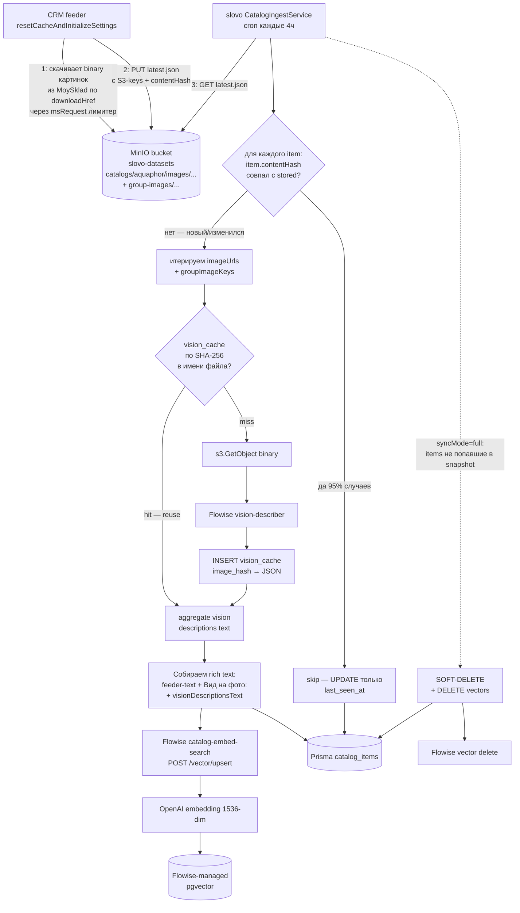
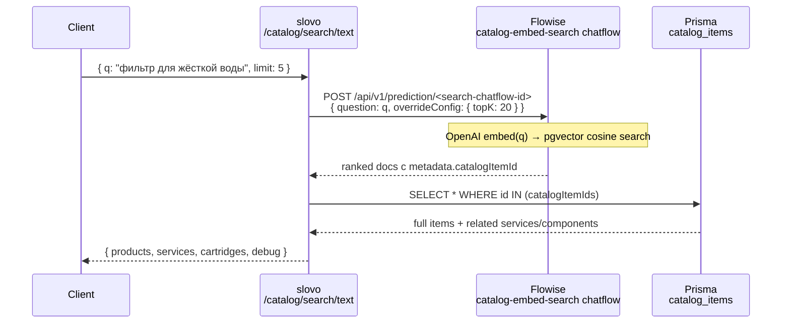
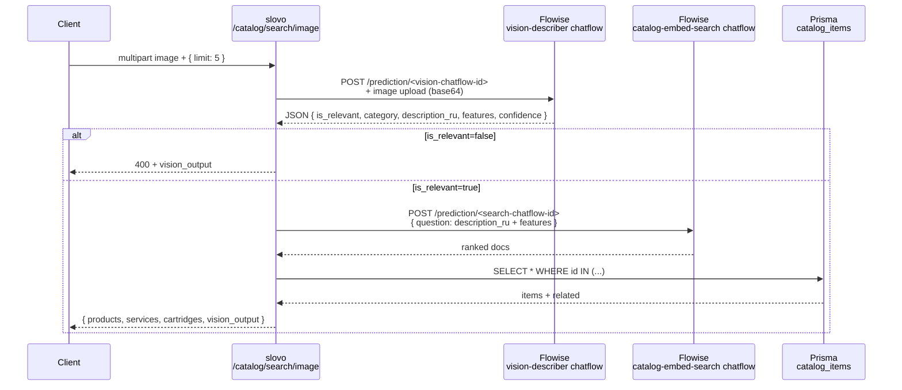
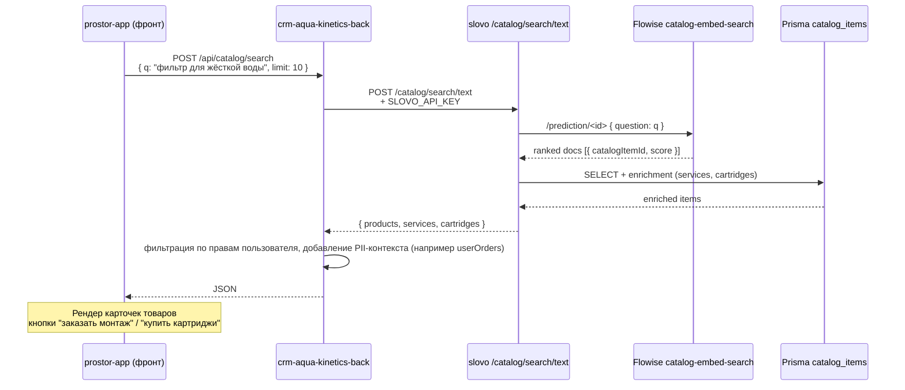
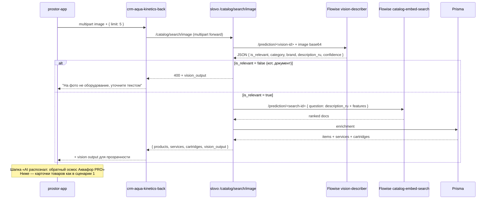
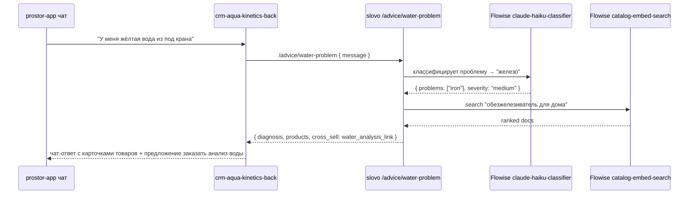

# Vision Catalog Search

> **Статус:** 🟡 черновик / Phase 1 — Flowise эксперименты
> **Связи:** [knowledge-base.md](knowledge-base.md), [ADR-007 catalog ingest contract](../architecture/decisions/007-catalog-ingest-via-minio.md), [ADR-006](../architecture/decisions/006-knowledge-base-as-first-feature.md), [ADR-004 Claude primary](../architecture/decisions/004-claude-as-primary-llm.md)

Фича: **поиск товара/услуги в каталоге Аквафор-Pro по фото или тексту**. Встраивается в `crm-aqua-kinetics` (собственный продукт разработчика) — пользователь CRM (менеджер / инженер) присылает фото сломанного узла, за пару секунд видит подходящую замену из каталога ~500 товаров MoySklad.

---

## Что строим

Гибридный поиск по каталогу:
- **text query** `"фильтр для жёсткой воды"` → embedding → pgvector cosine top-K
- **image query** фото узла → Claude Vision → структурированное описание → embedding → тот же pgvector top-K

Каталог наполняется через **file-based pull**: внешние feeder'ы (CRM, 1С, ручной импорт) кладут snapshot в shared MinIO bucket `slovo-datasets`, slovo по cron читает и апсертит. Контракт описан в **ADR-007**. Сам slovo **не знает** что такое MoySklad — это generic RAG-слой над каталогом.

---

## Зачем

1. **Замена вручную-листания каталога.** Пользователь CRM находит нужное за секунды, не минуты.
2. **SME-ассистент для новых сотрудников.** `"всё про обезжелезиватели, диапазон цен"` — smart-filtering вместо иерархии папок.
3. **Vision для клиентских кейсов.** Клиент прислал WhatsApp фото — не надо просить «опишите модель», AI определяет сам.
4. **Фундамент для water-analysis.** Когда AI рекомендует «нужен обратный осмос» — из каталога сразу тянется конкретный SKU с ценой.

---

## Архитектурные решения

### Развёртывание

**slovo — standalone сервис.** Отдельный репо, отдельный Docker deploy. **HTTP API наружу — только query endpoints** (`/catalog/search/text`, `/catalog/search/image`). Ingest идёт через **shared MinIO bucket** `slovo-datasets` по контракту ADR-007 — feeder пишет, slovo cron читает. `crm-aqua-kinetics-back` — первый feeder.

**Долгосрочный путь (когда усложнится):** выделить pure logic в `slovo/libs/catalog/` + публиковать как `@slovo/catalog` в private npm registry. Domain-фичи получат выбор — HTTP search или прямой импорт lib. Сейчас YAGNI.

### Embedding — через Flowise, не напрямую OpenAI

По решению в `memory/project_flowise_runtime_decision.md` (2026-04-22): **Flowise — LLM runtime, slovo — тонкий HTTP клиент**. slovo-api НЕ вызывает OpenAI SDK напрямую.

**Причины этого решения:**
- Flowise на Linux Alpine — корректный TLS fingerprint (OpenAI не блокирует, в отличие от Windows node.js)
- Credentials OpenAI/Anthropic живут в одном месте — Flowise Credentials UI
- Flowise умеет multi-provider (OpenAI / Anthropic / Cohere / Ollama) — переключение без изменения slovo-кода
- В prod это split-архитектуре (152-ФЗ): slovo-api в РФ, Flowise в EU zone
- Observability через Langfuse уже встроена во Flowise
- Streaming и prompt caching — фичи Flowise из коробки

**Embedding provider:** `OpenAI text-embedding-3-small` 1536 dim — настраивается **в Flowise-ноде**, slovo про это не знает. Переключить в будущем на Cohere / Ollama — меняем ноду во Flowise UI, slovo не трогаем.

### Rich context сборка — в два шага

**Часть 1 — feeder шлёт "сырой" текст:**

`crm-aqua-kinetics-back` собирает текстовую часть (без картинок) из MoySklad структуры:
- CRM знает про System Bundle, `parseServiceRefs`, `parseComponentRefs`, `GroupService.getGroupBundle`
- slovo остаётся generic — не парсит чужие custom-attributes
- Новый feeder (1С в будущем) сам решает как собирать rich text

Что включает feeder в `contentForEmbedding` (text-part):
```
Товар: ${product.name}
${product.description ? 'Описание: ' + product.description : '(описание отсутствует)'}
Категория: ${group.pathName}
Контекст группы: ${systemBundle?.description ?? ''}
${relevant_attributes.map(a => a.name + ': ' + a.value).join('\n')}
Услуги для этого товара: ${relatedServicesNames.join(', ')}
Расходники (картриджи): ${relatedCartridgesNames.join(', ')}
```

**Описание часто отсутствует** в MoySklad (менеджеры не всегда его заполняют) — поэтому vision-extraction картинок становится главным источником семантики для embedding.

**Часть 2 — slovo обогащает через vision описания картинок:**

Feeder шлёт `imageUrls: string[]` (S3-ключи в shared bucket `slovo-datasets`, **не URL'ы первоисточника**) и `groupImageKeys: string[]` (картинки группы из служебного Bundle MoySklad — общие для всех товаров одной категории, для vision-обогащения контекстом). slovo:

1. Сравнивает `item.contentHash` (приходит от feeder'а — детерминированный sha256 над всеми полями влияющими на embedding и Vision, **включая отсортированные S3-ключи картинок**) с сохранённым в Prisma. Совпал → skip всё (ни Vision, ни embedding).
2. Не совпал → итерирует `imageUrls + groupImageKeys`, для каждого ключа:
   - Извлекает SHA-256 binary из имени файла (`<sha>.jpg`).
   - Lookup в `vision_cache` Prisma таблице по этому hash. Hit → reuse JSON-описание.
   - Miss → читает binary из MinIO (`s3.GetObject(slovo-datasets, key)`), кодирует в base64, шлёт в Flowise `vision-describer`, кладёт результат в `vision_cache`. Cache живёт глобально — переиспользуется между товарами одной группы (картинка группы — типичный кейс), между cron-синками, между ребилдами Flowise vector store.
3. Aggregating descriptions → `visionDescriptionsText`.
4. Вставляет в финальный embedding-text блок `Вид на фото: ${visionDescriptionsText}`.

Итоговый rich text → slovo отправляет в Flowise upsert → OpenAI embeddings + Postgres Vector Store.

**Двухуровневый дедуп — главная экономия Vision/embedding cost:**

- **Item-level:** `contentHash` совпал → 0 LLM-вызовов. На повторных синках не меняющихся товаров (>95% типичный кейс) — экономим всё.
- **Image-level:** SHA-256 binary в S3-ключе → `vision_cache` ключевая дедупликация. Уже на первом seed картинка группы (одна на ~8 товаров) обрабатывается **один раз**. Реальные цифры с первого snapshot CRM (155 товаров): 305 уникальных product images + 19 unique group images = **324 Vision-вызова** вместо ~465 наивных.

### Изображения — что где хранится

| Артефакт | Где живёт | Кто пишет / читает |
|---|---|---|
| Бинарные файлы картинок | **MinIO bucket `slovo-datasets`** (shared с CRM) под `catalogs/aquaphor/images/<productId>/<sha256>.<ext>` и `catalogs/aquaphor/group-images/<bundleId>/<sha256>.<ext>` | feeder (CRM) скачивает из MoySklad и заливает; slovo читает binary через свой S3-клиент (без MoySklad-токена) |
| `imageUrls: string[]` | Prisma `catalog_items.image_urls` JSONB | S3-ключи (НЕ URL'ы), приходят от feeder'а в snapshot |
| `groupImageKeys: string[]` | Prisma `catalog_items.group_image_keys` JSONB | S3-ключи картинок группы — общие на всю категорию |
| `vision_cache` | Prisma таблица `vision_cache` (key = image SHA-256, value = JSON-описание) | slovo пишет при первом Vision-pass, переиспользует между товарами/синками |
| `visionDescriptionsText` | Prisma `catalog_items.vision_descriptions_text` TEXT | aggregate описаний всех картинок item'а (product + group) для embedding + диагностики |
| Embedding vector | Flowise-managed таблица в той же БД | semantic search |

**Почему shared bucket, а не `slovo` качает картинки сам:** binary картинки в MoySklad защищены auth-токеном; держать MoySklad-credentials в slovo нарушило бы границу "slovo не знает что такое MoySklad" (ADR-006 / generic catalog feeder pattern). Feeder (CRM) уже имеет токен и кладёт binary в bucket с content-hash в имени файла — это даёт slovo ровно одно требование: S3-доступ к bucket'у. Полное обоснование контракта в **ADR-007**.

**Требование к feeder'у — strip EXIF перед `s3.PutObject`.** Картинки MoySklad могут содержать EXIF GPS-координаты съёмки склада/офиса (PII). При split-deployment по 152-ФЗ binary улетает из РФ-зоны (MinIO в РФ) в EU LLM gateway (Flowise/Anthropic Vision) — без EXIF strip это нарушение трансграничной передачи. Feeder (CRM) обязан перед `PutObject` прогонять binary через `sharp().rotate().toBuffer()` (sharp по дефолту удаляет EXIF при ре-энкоде) или явный `piexif.remove`. См. **memory `project_fz152_compliance.md`**.

### Services: единая таблица, не отдельная

`CatalogItem` с discriminator `type: 'product' | 'service' | 'bundle' | 'cartridge'`. Все — в одной pgvector таблице.
- Услуги ищутся текстом (`"монтаж обратного осмоса"`) — embedding pipeline тот же
- Image search фильтрует `WHERE type IN ('product', 'cartridge')`, услуги исключаются
- Связи через ID list в JSONB `attributes` (MVP) — не нормализуем таблицы связей пока не понадобится reverse lookup

### Игнорируем кривые категории MoySklad как primary signal

MoySklad `ProductFolder.pathName` — **не таксономия**, а исторически сложенная иерархия менеджеров. Используем только как **дополнительный сигнал** в rich text для embedding. Основной matching — через semantic similarity по description/attributes/group-context, не через filter WHERE category=X.

Если Vision вернул `category: "обратный осмос"` — используем для **ranking boost** при совпадении, но не для жёсткого фильтра.

---

## Flowise chatflows (Phase 0 — создаём в UI)

**Нужно два chatflow:**

1. **`vision-catalog-describer-v1`** (уже готов в Phase 0, 2026-04-24) — фото → JSON описание товара через Claude Vision. Используется в image search pipeline как первый шаг.

2. **`catalog-embed-search`** (создать в Phase 0 следующим шагом) — для товарного каталога:
   - **OpenAI Embeddings** нода — `text-embedding-3-small`, 1536 dim, credentials из Flowise
   - **Postgres Vector Store** нода — подключение к той же slovo БД (`slovo-postgres:5432`), Flowise сам создаст таблицу `langchain_pg_embedding` или подобную
   - **Custom JSON Loader** / **Document Store** — для приёма items через upsert API
   - **Retriever-only output** (без LLM ноды) — чтобы prediction API возвращал ranked docs, не generated answer

**Flowise API endpoints** (у каждого chatflow свой ID):
- Upsert: `POST /api/v1/vector/upsert/<catalog-embed-search-id>` — JSON body с текстами
- Search: `POST /api/v1/prediction/<catalog-embed-search-id>` — text query → ranked docs с metadata

**Credentials в Flowise:**
- `anthropic-dev` (уже есть) — для Vision chatflow
- `openai-dev` (создать) — для Embeddings ноды

---

## Pipeline

### Ingestion (push от внешних feeder'ов через bulk API)



**Детали:**
- **Pull, не push.** Feeder (CRM) кладёт snapshot JSON в shared MinIO bucket `slovo-datasets/catalogs/aquaphor/latest.json` + history-копии. slovo читает по cron (каждые 4ч), сравнивает с прошлым state. Преимущество перед HTTP push: feeder не зависит от availability slovo, history-папка даёт audit + rollback, добавление нового feeder'а (1С, manual) = ещё одна префикс-папка в bucket'е без изменений slovo.
- **slovo не знает про MoySklad API / MOY_SKLAD_API_KEY.** CRM с уже готовой интеграцией MoySklad выкачивает binary картинок в bucket с content-hash в имени файла + собирает text-data в JSON. slovo читает только S3 + получает чистый generic snapshot.
- **Два режима sync:**
  - `syncMode: "partial"` — snapshot содержит только изменённые items (при targeted invalidation). Без soft-delete GC.
  - `syncMode: "full"` — snapshot содержит весь каталог. slovo по absence-from-snapshot soft-delete'ит отсутствующие через `last_seen_at < sync_start`.
- **`contentHash` приходит от feeder'а готовый** — детерминированный sha256 над `name + description + categoryPath + groupDescription + sorted(attributes) + sorted(services) + sorted(components) + sorted(imageKeys) + sorted(groupImageKeys)`. slovo не вычисляет его сам — просто сравнивает. Изменение цены / `rangForApp` не входит в hash → не триггерит re-embed (только UPDATE метаданных). Замена картинки → её SHA-256 в S3-ключе меняется → `imageKeys` меняется → contentHash меняется → re-vision (только новых картинок благодаря `vision_cache`) + re-embed.
- `last_seen_at` каждого присутствующего в snapshot item'а обновляется. При `syncMode=full` — всё что не попало в payload с `last_seen_at < sync_start` помечается `deleted_at = NOW()`. Soft-delete, не жёсткое удаление: дилер может искать снятый с продажи товар. **Cleanup векторов:** при re-embed item'а slovo дополнительно делает `flowiseClient.deleteVectorsByMetadata({ catalogItemId })` чтобы старые chunks не загрязняли retrieval. При soft-delete — то же самое.
- **Аутентификация:** S3 IAM-ключи в env обеих сторон. Feeder имеет write-доступ к `catalogs/<own-feeder>/*`, slovo — readonly ко всему `catalogs/*` префиксу. JWT/ApiKey-guard'ы не нужны — нет HTTP ingress для ingest.
- **Rate limiting:** естественный — slovo сам решает как часто читать (cron каждые 4ч), feeder сам решает как часто писать (по cache-reset событиям). Защита от runaway-feeder'а — на стороне MinIO IAM по PUT operations.
- **Идемпотентность:** `@@unique([externalSource, externalId])` гарантирует идемпотентный upsert. Повторный snapshot с теми же contentHash — no-op (skip каждого item'а на первой же проверке).
- **Atomicity при чтении.** В bucket'е включён S3 Object Versioning. slovo при `GetObject(latest.json)` использует `If-Match: <etag>` — если между HEAD и GET feeder перезаписал файл, GET вернёт 412 Precondition Failed → slovo ретрит итерацию с новым etag (TOCTOU защита).

### Query — text



### Query — image (hybrid vision→text→embedding)



**Почему "hybrid" через текстовый мост:** Vision → текст → embedding → поиск по каталогу embedding'ов. Не сравниваем image-embedding напрямую с text-embedding (разные семантические пространства). CLIP мог бы решить это напрямую, но не нужен при 500 товарах — text bridge проще и использует ту же embedding-модель что для text search.

**Почему Flowise делает два шага (embed + search) в одном prediction call:** Chatflow содержит OpenAI Embeddings + Postgres Vector Store + Retriever ноды связанные последовательно. Slovo шлёт query, Flowise всё внутри обрабатывает и возвращает готовый ranked список. Slovo остаётся **тонким клиентом** — один HTTP вызов на search, одна миграция для CatalogItem.

### Hybrid ranking (в slovo, после Flowise retrieve)

Flowise Retriever возвращает docs ranked только по **vector cosine similarity**. Дополнительный re-ranking (rang_for_app, category boost) делает **slovo** на стороне /catalog/search/* endpoint:

1. Flowise → top-20 docs by pure vector similarity
2. slovo JOIN с Prisma `catalog_items` по `metadata.catalogItemId` → достаёт `rangForApp`, `categoryPath`, `relatedServiceIds`, `relatedComponentIds`
3. slovo пересчитывает score:

```
final_score = 0.7 × vector_similarity_normalized   // от Flowise
            + 0.2 × rang_boost                      // coalesce(rangForApp, 0) / max_rang
            + 0.1 × category_boost                  // 0.1 если Vision.category совпадает с categoryPath substring
```

4. slovo → top-5/limit из пересорченного списка
5. slovo enrichment (related services/cartridges) → response клиенту

Веса 0.7 / 0.2 / 0.1 — начальные. Тюним по реальному UX. Все вычисления простые (JS map/sort на массиве 20 элементов) — не нужен SQL, не нужен pgvector напрямую в slovo.

### Enrichment payload — что отдаём клиенту

```json
{
  "products": [
    {
      "id": "...",
      "externalId": "moysklad-uuid",
      "name": "Аквафор DWM-101S",
      "description": "...",
      "salePriceKopecks": 4500000,
      "imageUrl": "...",
      "categoryPath": "Фильтры/Обратный осмос",
      "score": 0.87,
      "score_breakdown": {
        "vector": 0.82,
        "rang": 0.8,
        "category": 1.0
      }
    }
  ],
  "services_suggested": [
    {
      "id": "...",
      "name": "Монтаж фильтра под мойкой",
      "rateOfHours": 2,
      "source_product_ids": ["product-uuid-1"],   // из какого товара подтянули
      "salePriceKopecks": 500000
    }
  ],
  "cartridges_compatible": [
    {
      "id": "...",
      "name": "K1-07 префильтр",
      "salePriceKopecks": 70000,
      "lifespan_months": 6,
      "source_product_ids": ["product-uuid-1"]
    }
  ],
  "vision_output": { ... },                 // при image search — для прозрачности
  "debug": {
    "query_text": "...",                   // для text search или description_ru из vision
    "embedding_provider": "openai:text-embedding-3-small"
  }
}
```

Клиент получает **всё нужное за один запрос** — не ходит дополнительно за услугами и картриджами. Пользовательский UX: товар, сразу под ним кнопки "заказать монтаж" / "нужны картриджи".

---

## Схема данных

```prisma
model CatalogItem {
    id                 String    @id @default(dbgenerated("gen_random_uuid()")) @db.Uuid

    // External identity — slovo не знает про MoySklad специфично.
    // externalSource = 'moysklad' | '1c' | 'manual' | любой другой feeder.
    // externalId — id в источнике истины (moyskladId для MoySklad).
    externalSource     String    @map("external_source") @db.VarChar(64)
    externalId         String    @map("external_id")     @db.VarChar(256)
    externalType       String    @map("external_type")   @db.VarChar(32)   // product | service | bundle | cartridge
    externalUpdatedAt  DateTime  @map("external_updated_at")

    // Базовые поля для отображения / фильтрации
    name               String    @db.VarChar(512)
    description        String?   @db.Text
    salePriceKopecks   Int?      @map("sale_price_kopecks")
    categoryPath       String?   @map("category_path")
    isVisible          Boolean   @default(true) @map("is_visible")
    rangForApp         Int?      @map("rang_for_app")  // ручной приоритет из MoySklad для ranking boost

    // Картинки — S3-ключи в shared bucket `slovo-datasets`, формат
    //   "catalogs/<feeder>/images/<externalId>/<sha256>.<ext>".
    // Binary живёт в MinIO, читается через s3.GetObject. SHA-256 содержимого
    // в имени файла → vision_cache lookup keyed по этому hash.
    imageUrls              Json?   @map("image_urls")                 // S3-keys string[]
    // Картинки группы — общий контекст для всех товаров одной категории
    // (служебный Bundle MoySklad). Те же S3-ключи в group-images/ префиксе.
    groupImageKeys         Json?   @map("group_image_keys")           // S3-keys string[]
    visionDescriptionsText String? @map("vision_descriptions_text") @db.Text  // aggregate описаний product+group картинок после vision-describer

    // Rich content для embedding — собирается в slovo как:
    //   feeder.contentForEmbedding + "Вид на фото: " + visionDescriptionsText
    // Хранится для re-embed при смене модели или изменении rich text формата.
    contentForEmbedding String   @map("content_for_embedding") @db.Text

    // Связи (ID list в JSONB) — для enrichment при search:
    //   { relatedServiceIds: ["..."], relatedComponentIds: ["..."] }
    // MVP без нормализации. Когда понадобится reverse-lookup ("какие товары
    // совместимы с этим картриджем") — выделим catalog_item_components table.
    attributes         Json?                                       // raw feeder attrs + relatedServiceIds + relatedComponentIds

    // Delta-sync маркеры
    // contentHash приходит ГОТОВЫЙ от feeder'а (поле item.contentHash в bulk
    // payload) — sha256 над всеми полями влияющими на embedding и Vision,
    // включая отсортированные image-keys (которые сами хранят hash binary).
    // slovo НЕ вычисляет hash сам — только сравнивает с stored.
    contentHash        String    @map("content_hash") @db.Char(64)
    lastSeenAt         DateTime  @default(now()) @map("last_seen_at")
    deletedAt          DateTime? @map("deleted_at")

    createdAt          DateTime  @default(now()) @map("created_at")
    updatedAt          DateTime  @updatedAt @map("updated_at")

    // Embedding vector(1536) НЕ в этой таблице — живёт во Flowise-managed
    // таблице (обычно langchain_pg_embedding), с metadata.catalogItemId как
    // app-level FK. То же разделение что в ADR-006 для knowledge_chunks.
    // slovo про embeddings не знает, форвардит всё в Flowise.

    @@unique([externalSource, externalId])
    @@index([isVisible, deletedAt])
    @@index([externalType, isVisible, deletedAt])  // для image-search (фильтр по type)
    @@index([lastSeenAt])
    @@index([externalUpdatedAt])
    @@map("catalog_items")
}

// Кэш Vision-описаний картинок keyed по SHA-256 binary. Hash берётся
// прямо из имени S3-файла (`<sha>.jpg`) — отдельно не вычисляется. Cache
// глобальный: одна и та же картинка группы переиспользуется на ~8 товаров,
// + переживает повторные cron-синки и ребилды Flowise vector store.
model VisionCache {
    imageHash    String   @id @map("image_hash") @db.Char(64)
    description  Json     // структурированный output vision-describer chatflow
    model        String   @db.VarChar(64)   // claude-sonnet-4-6 — для cache invalidation при смене модели
    createdAt    DateTime @default(now()) @map("created_at")

    @@map("vision_cache")
}
```

**Ключевые решения:**
- `externalSource + externalId` — composite unique key, multi-source ready. `moysklad:abc-123` и `1c:def-456` одновременно живут в одной таблице.
- Отдельная таблица, не `knowledge_sources` — разные домены (user uploads vs org catalog), разные lifecycle (ad-hoc vs push-sync), разная авторизация (user-scoped vs read-all + ingest-key-protected).
- `externalType` не enum, а string — расширяется через код feeder'а без миграций БД (завтра добавим `sparepart`, `manual`, etc.).
- `vision_cache.imageHash` PK (без auto-id) — hash содержимого _и есть_ естественный ключ. `INSERT … ON CONFLICT DO NOTHING` для concurrent writes. При смене Vision-модели создаём новый cache row с тем же image_hash и новой `model` — старые остаются для аудита.

### Контракт bulk ingest — file-based через MinIO

> **Изменено vs ADR-черновика:** контракт перешёл с HTTP push (`POST /catalog/items/bulk`) на **file-based pull**. Feeder кладёт snapshot в MinIO bucket `slovo-datasets/catalogs/<feeder>/latest.json` + history-копии, slovo читает по cron. Источник истины — самый новый файл с прошитым `syncedAt` ISO-timestamp в payload.

**Snapshot path в MinIO:**
- `slovo-datasets/catalogs/aquaphor/latest.json` — текущий полный/инкрементальный snapshot
- `slovo-datasets/catalogs/aquaphor/history/2026-04-27T12-27-50-168Z.json` — audit + rollback
- `slovo-datasets/catalogs/aquaphor/images/<productId>/<sha256>.<ext>` — binary картинок товаров
- `slovo-datasets/catalogs/aquaphor/group-images/<bundleId>/<sha256>.<ext>` — binary картинок групп

**Структура `latest.json` (TypeScript):**

```typescript
type TBulkIngestPayload = {
    syncMode: 'full' | 'partial';
    sourceSystem: 'moysklad' | '1c' | 'manual';
    syncedAt: string;                         // ISO timestamp
    items: TBulkIngestItem[];
};

type TBulkIngestItem = {
    externalId: string;                       // id у feeder'а (moyskladId для CRM)
    externalSource: 'moysklad' | '1c' | 'manual';
    externalType: 'product' | 'service' | 'cartridge' | 'bundle';
    externalUpdatedAt: string;                // ISO

    name: string;
    description?: string | null;
    salePriceKopecks?: number | null;         // 4500000 = 45,000.00 ₽
    categoryPath?: string | null;             // "Очистка воды/Обратный осмос"
    isVisible: boolean;
    rangForApp?: number | null;               // приоритет менеджера для ranking boost

    /** S3-ключи в slovo-datasets, НЕ URL'ы. Slovo читает binary через s3.GetObject. */
    imageUrls: string[];                      // ["catalogs/aquaphor/images/<id>/<sha>.jpg", ...]

    /** S3-ключи картинок группы (служебный Bundle MoySklad) — общие для всех товаров категории. */
    groupImageKeys: string[];                 // ["catalogs/aquaphor/group-images/<bundleId>/<sha>.jpg", ...]

    /** Услуги группы из servisного Bundle, разделённые по pathName услуги. Все товары группы делят общий список. */
    relatedServices: Array<{
        id: string;
        name: string;
        kind: 'installation' | 'maintenance' | 'other';
    }>;

    /** Расходники (картриджи) per-product, из атрибутов "Первый-Пятый элемент для обслуживания". */
    relatedComponents: Array<{ id: string; name: string }>;

    /**
     * Rich text для embedding — feeder собрал из:
     *   name + description + categoryPath + group.systemBundle.description +
     *   attributes + relatedServices (по категориям) + relatedComponents.
     * slovo дополнит блок "Вид на фото" из vision-cache.
     */
    contentForEmbedding: string;

    /**
     * Детерминированный sha256 над всеми полями влияющими на embedding и Vision
     * (name + description + categoryPath + groupDescription + sorted(attributes) +
     * sorted(services) + sorted(components) + sorted(imageKeys) + sorted(groupImageKeys)).
     * НЕ участвуют: salePriceKopecks, rangForApp, externalUpdatedAt — эти поля
     * меняют только метаданные и не требуют re-embed.
     * S3-ключи уже включают sha256 binary в имени — замена картинки автоматически
     * меняет contentHash → re-vision только новых картинок.
     */
    contentHash: string;

    /** Произвольные feeder-специфичные атрибуты для UI / будущих фильтров. */
    attributes?: Record<string, unknown>;
};
```

**S3 Object metadata в `latest.json`** (для быстрой проверки delta без чтения тела):
- `contenthash`: sha256 всего payload-а — slovo может HEAD без GET, и если совпало — пропустить cron-итерацию полностью.
- `syncedat`: дублирует поле в payload.
- `itemscount`: сколько items.
- `sourcesystem`: `moysklad` / `1c` / etc.

**Логика slovo-cron'а:**

```
1. HeadObject(latest.json) → metadata.contenthash
2. Если совпал с прошлым lastSeenSnapshotHash → skip всю итерацию ($0 LLM)
3. Иначе GetObject(latest.json), JSON.parse → payload
4. forEach item: упомянутый delta-flow с per-item contentHash и vision_cache
5. UPDATE last_seen_at на все items в payload
6. Если syncMode=full → SOFT-DELETE items где last_seen_at < sync_start
```

**Что было в HTTP-push варианте, но устарело:**
- `Authorization: Bearer <SLOVO_INGEST_API_KEY>` → теперь S3 IAM credentials (slovo читает с readonly key, feeder пишет с full-access key — два разных IAM-юзера в MinIO)
- `Response { received, created, updated_metadata_only, ... }` → теперь slovo логирует эти числа в свой Langfuse / pino, feeder про них не знает (слабая связность)
- Rate limiting на endpoint → теперь rate естественный: slovo сам решает как часто читать (cron каждые 4ч), feeder сам решает как часто писать (по cache-reset событиям)

### Что за `contentHash` и когда пересчитывается embedding

`contentHash` — детерминированный sha256, который **feeder вычисляет и кладёт в snapshot готовым**. Slovo не считает hash сам, только сравнивает с stored. Реализация в `crm-aqua-kinetics-back/src/modules/moy-sklad/modules/catalog-sync/helpers/compute-item-content-hash.ts` — рекурсивно сортирует ключи объектов в JSON.stringify (replacer), сортирует массивы по id, потом sha256.

**Что входит в hash:**

```
sha256(stableStringify({
    name,
    description,
    categoryPath,
    groupDescription,
    attributes,                          // sorted keys
    relatedServices: sorted by id,
    relatedComponents: sorted by id,
    imageKeys: sorted,                   // sha256 binary в каждом ключе
    groupImageKeys: sorted,
}))
```

**Что НЕ входит** (меняется часто, не влияет на RAG): `salePriceKopecks`, `rangForApp`, `externalUpdatedAt`, `isVisible`. Изменение цены или приоритета менеджера → UPDATE метаданных без re-embed.

**Impact:**
- MoySklad обновил только цену → hash тот же → 0 LLM-вызовов.
- Менеджер поправил описание товара / группы → hash меняется → re-embed.
- Менеджер заменил картинку в MoySklad → её sha256 в S3-ключе меняется → `imageKeys` массив меняется → hash меняется → re-vision этой одной картинки (остальные из `vision_cache`) + re-embed.
- Менеджер добавил новую услугу в группу → hash меняется у **всех** товаров группы (кооректно, услуги шли в embedding) → re-embed всей группы. Это не перебор: услуги влияют на матчинг "монтаж обратного осмоса" → конкретные SKU.

**Image-level vision cache отдельно от item-level contentHash:** даже если item.contentHash меняется, картинки которые остались те же (одна из 3-х заменилась — две прежние) обрабатываются Vision'ом **0 раз** благодаря `vision_cache` keyed по sha256 в имени файла.

---

## UX сценарии для фронта

Три основных сценария использования со стороны `prostor-app` / `crm-aqua-kinetics-front`. Все идут через `crm-aqua-kinetics-back` (он proxy'ит запросы к slovo и обогащает PII-специфичной логикой если нужно).

### Сценарий 1 — поиск товаров/услуг текстом

**Экран:** поисковая строка в prostor-app, пользователь (менеджер / инженер / клиент) пишет query на естественном языке.



**Что видит пользователь:**
- Карточка товара: картинка + название + цена + краткое описание
- Рядом badges: «монтаж 2,500 ₽», «сменные картриджи от 700 ₽» (из enrichment)
- Кнопка «В заказ» (добавляет товар + выбранные услуги/расходники)
- Badge AI-score (опционально для дебага менеджера)

### Сценарий 2 — поиск по фото

**Экран:** кнопка «📷 Подобрать по фото», клиент прислал фото в WhatsApp / Telegram, менеджер загружает в prostor-app.



**Что видит пользователь:**
- В шапке результата: badge «AI распознал: {category}, бренд {brand}, уверенность {confidence}»
- Кнопка «Уточнить» (открывает text search с предзаполненным описанием)
- Список карточек товаров (тот же UX что в сценарии 1)

### Сценарий 3 — ассистент по проблемам с водой (будущее, post-PR8)

**Экран:** чат-бот в prostor-app — клиент описывает проблему естественным языком.



Это уже **агентский flow**, появится в PR после PR8 когда будет готова catalog-search база.

### Response DTO — что получает фронт

```typescript
// GET-like ответ на все сценарии поиска
type CatalogSearchResponse = {
    products: Array<{
        id: string                   // slovo CatalogItem.id
        externalId: string            // MoySklad uuid — для cross-reference с CRM
        name: string
        description: string | null
        imageUrls: string[]           // 0..N, фронт показывает первую или слайдер
        salePriceKopecks: number | null
        categoryPath: string | null
        score: number                 // final_score из hybrid ranking
        scoreBreakdown?: {            // только в dev для отладки
            vector: number
            rang: number
            category: number
        }
    }>
    services: Array<{
        id: string
        name: string
        rateOfHours: number | null
        salePriceKopecks: number | null
        sourceProductIds: string[]    // из каких товаров подтянули (для UI группировки)
    }>
    cartridges: Array<{
        id: string
        name: string
        salePriceKopecks: number | null
        lifespanMonths: number | null
        sourceProductIds: string[]
    }>
    visionOutput?: {                  // только для image search
        isRelevant: boolean
        category: string | null
        brand: string | null
        description: string
        confidence: 'high' | 'medium' | 'low'
    }
    debug?: {                         // только в dev
        queryText: string
        embeddingProvider: string
    }
}
```

Фронт получает **всё нужное одним запросом** — больше не делает запросы за услугами или картриджами. Всё уже enrichment'ом подтянуто.

---

## Фазы реализации

| PR | Скоуп | Новая технология |
|---|---|---|
| **Phase 0 (✅ частично)** | В Flowise UI: (a) `vision-catalog-describer-v1` готов — валидирован на 6 тестах (PR1-3 сегодня); (b) **следующий шаг** — создать `catalog-embed-search` chatflow с OpenAI Embeddings + Postgres Vector Store + Retriever; (c) upsert + search на 3-5 тестовых товарах. | Flowise Postgres Vector Store, OpenAI Embeddings нода |
| **PR5** | `libs/llm/` — **тонкий HTTP-клиент `FlowiseClient`** к локальному Flowise API. Методы: `predictVision(imageBase64)`, `upsertCatalog(items)`, `searchCatalog(query, topK)`. Внутри — httpClient с retry + logging. NO Anthropic SDK, NO OpenAI SDK в slovo! | Thin HTTP client pattern |
| **PR6** | `CatalogItem` + `VisionCache` Prisma-модели (type discriminator product/service/cartridge/bundle, vision_cache keyed по image sha256) + миграции. **`CatalogSyncService` живёт в `apps/worker`, не в `apps/api`** — long-running task (≥minutes per snapshot) не должен жить в request-path; per ADR-001 modular monolith границы + ADR-003 RMQ для async-задач. Триггер: RMQ message `catalog.sync` каждые 4ч (через `apps/worker` scheduler — `@nestjs/schedule` или RMQ delayed-message). Логика: `s3.HeadObject(latest.json)` → metadata.contenthash совпал? skip. Иначе `GetObject` (с `If-Match` etag — TOCTOU), forEach item — сравнение contentHash, soft-delete через last_seen_at, vision-pipeline (`s3.GetObject(imageKey)` → base64 → `flowiseClient.predictVision()` → INSERT vision_cache → aggregate → `flowiseClient.upsertCatalog()`). При re-embed item'а — `flowiseClient.deleteVectorsByMetadata({ catalogItemId })` для cleanup stale chunks. | S3 SDK (уже есть `libs/storage`), RMQ scheduler в worker, vision_cache |
| **PR7** | `/catalog/search/text` endpoint. slovo → `flowiseClient.searchCatalog(query, topK=20)` → Flowise возвращает ranked docs → slovo JOIN с Prisma по catalogItemId → hybrid re-rank (rang + category) → enrichment (related services/cartridges) → response. | Thin orchestration |
| **PR8** | `/catalog/search/image` — multipart image → `flowiseClient.predictVision(image)` → description → `flowiseClient.searchCatalog(description)` → тот же flow что PR7. Handling `is_relevant=false` → 400 с vision_output. Swagger + e2e с реальными фото. | End-to-end composition |
| **Вне slovo (✅ готово 2026-04-27)** | Feeder side — в `crm-aqua-kinetics-back/src/modules/moy-sklad/modules/catalog-sync/`: `CatalogSyncService.exportSnapshotToS3()` собирает 155 items, скачивает binary картинок из MoySklad в MinIO с sha256 в имени файла (idempotent через HeadObject), вычисляет per-item contentHash, кладёт `latest.json` + history-копию. Триггерится из `MoySkladService.resetCacheAndInitializeSettings()` — best-effort, fail-fast при недоступности S3 не валит cache-reset. | Commits 148194f, da99f92 в CRM |

---

## Phase 0 — что делаем сейчас в Flowise

**Цель:** подобрать промпт для Vision который даёт стабильный structured JSON для поиска по каталогу.

### Chatflow "Vision Describer" в Flowise

Ноды:
- **ChatAnthropic** — `claude-sonnet-4-6`, поддержка image input через messages
- **Prompt Template** — инструкция "опиши в JSON"
- **Structured Output Parser** (или свой JSON prompt)

### Какой структуры JSON хотим

```json
{
  "category": "обратный осмос",
  "model_hint": "Aquaphor DWM-101S",
  "brand": "Аквафор",
  "features": ["5-ступенчатая очистка", "обратный осмос", "минерализатор"],
  "condition": "внешне исправен",
  "description_ru": "Бытовой фильтр обратного осмоса Аквафор DWM-101S. Пять ступеней очистки с минерализатором. Под мойкой, накопительный бак."
}
```

`description_ru` — это то, что пойдёт в embedding. Остальные поля — для фильтрации / отображения.

### Что проверяем в Flowise (чек-лист)

- [ ] Claude Sonnet видит загруженное изображение
- [ ] Возвращает **валидный JSON** без markdown-обёрток (` ```json `)
- [ ] Русский язык в полях выдерживается
- [ ] На мутных/плохих фото отвечает `{ "category": null, "confidence": "low" }` а не галлюцинирует
- [ ] На не-фильтре (пёс, котёнок) честно говорит `null`
- [ ] Стабильность — одну и ту же картинку прогнать 3 раза, сравнить output

### Тестовый набор фото

Собрать 10-15 фото:
- Исправные фильтры Аквафор (разные модели)
- Сломанные узлы (картридж, мембрана, трубка)
- Коробки/упаковка
- Бланк анализа воды (edge case — AI должен сказать "это не оборудование")
- Случайные фото (кот, чашка кофе) — AI должен вернуть null

Результаты сложить в `docs/experiments/vision-catalog-${date}/` с JSON outputs — чтобы было что сравнивать между итерациями промптов.

---

## Что НЕ делаем в Phase 0

- ❌ Не пишем NestJS endpoint (прототипируем промпт в UI, не коде)
- ❌ Не импортируем каталог (прототипируем на 3-5 известных моделях вручную вписанных в промпт)
- ❌ Не считаем embeddings (только формируем текст который пойдёт в embedding позже)
- ❌ Не думаем про prod-деплой / cost optimization

Финал Phase 0 — **один JSON-файл с промптом который работает** + репорт "на 15 фото работает N/15 корректно". Этот промпт идёт в PR5.

---

## Стоимость — две разные категории

Важно различать два класса costs которые работают по разной логике.

### 1. Ingest cost (катaлог) — разово + инкрементально

Embedding каталога делается **один раз** при первом full sync, далее обновляется **только для изменившихся товаров** (по imagesHash + contentHash). Это «холодный» индекс который не пересчитывается при поисковых запросах.

| Операция | Единица | Цена | Частота | Итого |
|---|---|---|---|---|
| **Первый full ingest** 500 товаров с 3 картинками в среднем | 1500 Vision-пассов + 500 embedding | Vision $0.003 × 1500 + Embed $0.0000004 × 500 | разово | **~$4.50** |
| **Incremental update** (5-10 товаров поменяли описания/картинки в день) | vision только для новых картинок + embedding | ~$0.01-0.05/день | ежедневно | **$0.30-1.50/мес** |

### 2. Query cost (runtime) — на каждый запрос пользователя

**Каждый** user query (текст или картинка) превращается в embedding **в момент запроса** — это runtime cost, а не разовый. **Сам поиск в pgvector — БЕСПЛАТЕН** (cosine similarity = обычный SQL без LLM).

| Операция | Что считается на каждый запрос | Цена/запрос | Latency |
|---|---|---|---|
| **Text search** | 1 OpenAI embedding (~20 tokens query) | **~$0.0000004** | ~200ms |
| **Image search** | 1 Claude Vision (~$0.003) + 1 OpenAI embedding (~$0.0000004) | **~$0.003** | ~3-5s (Vision доминирует) |
| **Cosine search в pgvector** | 0 LLM-вызовов, обычный SQL | **$0** | ~10-30ms |

#### Реальные цифры месячно (наш масштаб):

| Сценарий | Запросов/день | Cost/мес |
|---|---|---|
| 100 text-search/день | 100 | **$0.001** |
| 50 image-search/день | 50 | **$4.50** |
| ИТОГО | | **~$4.50/мес** на queries |

#### Что важно для понимания

- **Каждый user query — отдельный embedding pass.** Если 100 пользователей одну и ту же фотку грузят по очереди — это 100 Vision-вызовов (если без кэша query-стороны).
- **Сам поиск (top-K cosine)** — это математика над уже сохранёнными векторами, **не LLM-вызов**. 1000 одновременных searches в pgvector — это просто 1000 SQL-запросов с использованием HNSW-индекса, миллисекунды.
- **Каталог** между запросами **не пересчитывается** — индекс холодный, query — горячий.

### Итого месячно при текущем масштабе

| Категория | Сумма |
|---|---|
| Первый ingest (разово при старте) | $4.50 |
| Инкрементальный ingest | $0.30-1.50/мес |
| Text searches (100/день) | $0.001/мес |
| Image searches (50/день) | $4.50/мес |
| **ИТОГО в месяц** | **~$5-10/мес** |

На пет-масштабе **не повод для беспокойства**. Серьёзная оптимизация cost-side понадобится только при росте на порядок (5K товаров, 1000+ image searches/день).

---

## Стратегии оптимизации query cost (на будущее)

Когда масштаб вырастет — есть три рельсы для снижения runtime cost.

### Стратегия 1 — кэширование результатов поиска по hash query

Если **одинаковая** картинка / текст приходит повторно — отдаём кэшированный top-K:

```
client → slovo /catalog/search/image
    → SHA-256(image bytes)
    → Redis lookup [hash → top-K results]
    → если есть в кэше → возврат за 5ms, $0
    → если нет → vision + embedding + search → ответ + cache на 24ч
```

**Польза:** в B2B-сценариях (менеджер пересылает другому менеджеру типовое фото) — повторные запросы 0$.
**Стоимость реализации:** 30-50 строк в slovo + Redis (уже есть в стеке).
**Когда выгодно:** когда видим что > 20% запросов повторяющиеся.
**Не оптимизирует:** уникальные картинки клиентов (которые в реальности будут доминировать).

### Стратегия 2 — Ollama embeddings локально

Заменить OpenAI text-embedding-3-small на локальную `bge-m3` или `multilingual-e5-large` через Ollama (доступен в инфре `water-analysis-parser` стека на RTX 4070 Ti).

| | OpenAI small | Ollama bge-m3 |
|---|---|---|
| Embed cost | $0.0000004/query | **$0** |
| Latency | ~200ms (через сеть) | ~50ms (локально) |
| Качество RU | хорошо | хорошо |
| Нагрузка | 0% (cloud) | GPU 16GB утилизируется |

**Замена в Flowise:** одна нода в UI, slovo не трогаем. Качество практически идентично на RU/EN.
**Когда выгодно:** объём text searches > 10K/день, или нужна низкая latency, или privacy.

### Стратегия 3 — CLIP вместо Claude Vision для image search

**True image-to-image search** через мультимодальную модель CLIP / SigLIP — embed-ит картинку и текст в одно векторное пространство:

```
картинка пользователя → CLIP image embedding (1 шаг, $0)
                     ↓
                pgvector cosine с CLIP image embeddings товаров
```

**Trade-offs:**
- Cost: **$0 при локальном CLIP** (Ollama или transformers на GPU)
- Latency: ~100ms вместо 3-5s для Claude Vision
- Качество: **хуже** распознаёт конкретный бренд / модель / надписи на упаковке (CLIP — общий matcher, не специалист в водоочистке)
- При ingest каталога надо считать **дополнительные** CLIP image embeddings к товарам — две колонки vector в БД (text + clip_image)

**Когда выгодно:** image searches > 1000/день, и качество "общая визуальная похожесть" приемлемо для UX (или его дополняет точный бренд из CRM-каталога через other signals).

### Hybrid pgvector + PostgreSQL FTS — для лексической точности

Параллельно с semantic search можно делать **lexical match** через PostgreSQL `tsvector`:

```sql
WHERE to_tsvector('russian', name || ' ' || description) @@ websearch_to_tsquery('russian', $1)
```

**Польза:** точный поиск по бренду / артикулу / номеру модели (`"Аквафор PRO V500"` — embedding может промахнуться, FTS — нет).
**Cost:** $0 (это обычный SQL с GIN индексом).
**Реализация:** в slovo через raw query, объединяем с pgvector top-K через reciprocal rank fusion.
**Когда выгодно:** когда semantic-only начнёт промахиваться на artikul-like запросах. Это **штатное** дополнение к pgvector в любых serious search системах.

### Когда что включать

```
Этап 0 — текущий план (PR5-PR8)
  → OpenAI embeddings + Claude Vision + pgvector
  → cost: $5-10/мес

Этап 1 — рост до 10K+ text searches/день
  → добавить Redis кэш по hash query
  → опционально переключить text-embed на Ollama
  → cost остаётся в районе $5-15/мес даже при росте 10x

Этап 2 — рост до 1K+ image searches/день
  → добавить Redis кэш + посмотреть % повторов
  → если повторов много (>30%) — кэша достаточно
  → если уникальные картинки доминируют → CLIP параллельно с Vision (дешёвый CLIP-pass для top-50, далее опционально Vision для top-10 когда нужны brand/model)

Этап 3 — много lexical queries (артикулы, бренды)
  → добавить FTS hybrid в pgvector search
  → 0 incremental cost
```

Не делаем эти оптимизации **превентивно** — реактивно по метрикам реального usage.

---

## Открытые вопросы

1. **Flowise Vector Store под капотом.** Какую таблицу Flowise создаст в slovo БД? `langchain_pg_embedding` стандарт для LangChain's PGVector. Проверить на Phase 0 → зафиксировать в docs. Удаление старых embeddings при re-embed — Flowise сам? Или нужно вручную через raw SQL?
2. **Retriever-only chatflow без LLM.** Возможно в Flowise 3.1.2 retriever нода не даёт output без LLM ноды. Проверить в UI на Phase 0; если нельзя — использовать lightweight LLM (Haiku) только как passthrough для output formatting.
3. **Промпт v2 после Phase 0.** По результатам 6 тестов в Phase 0 промпт v1 хорош на 4/6 (2 проблемы с closed enum brand/category). Решение: open fields + post-processing canonicalization в slovo перед записью в БД.
4. **Cost budget.** Claude Vision $0.003/image + OpenAI embedding $0.003 / 500 товаров. 100 image searches в день = $0.30 + $0.0004. Копейки.
5. **Веса hybrid ranking (0.7 / 0.2 / 0.1)** — тюнить по UX. Возможна UI с кнопкой "сдвинуть приоритет в сторону популярных" (увеличить rang weight).
6. **Category canonicalization.** Как маппить Vision `category: "обратный осмос"` → MoySklad `categoryPath: "Фильтры/Обратный осмос/..."`? Lookup table с синонимами в slovo. 20-30 категорий — маленькая константа.
7. **VisionCache GC.** За год накопится 10-100k записей при ребрендах/удалениях товаров (запись ~200-500 байт JSON-описание). Нужен ли cron-vacuum по `lastUsedAt < NOW() - 6 months`, или достаточно «никогда не чистим»? Решить после первого года в проде. См. ADR-007 open question 1.
8. **Bucket layout per environment.** В prod нужен отдельный bucket `slovo-datasets-prod` или префикс `<env>/catalogs/...`? Решить когда дойдём до prod-deploy. См. ADR-007 open question 2.

---

## Связи с другими фичами

- **knowledge-base** — те же принципы embedding + pgvector, но для другой сущности (user uploads). Catalog — отдельная модель.
- **water-analysis** (будет позже) — после распознавания параметров из бланка, рекомендует оборудование **через catalog search** — реюз пайплайна.
- **sme-cloning (video-to-artifact)** — аналогично, но vision для видео-кадров.
