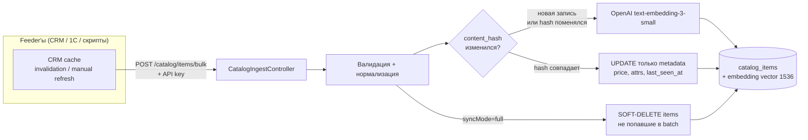
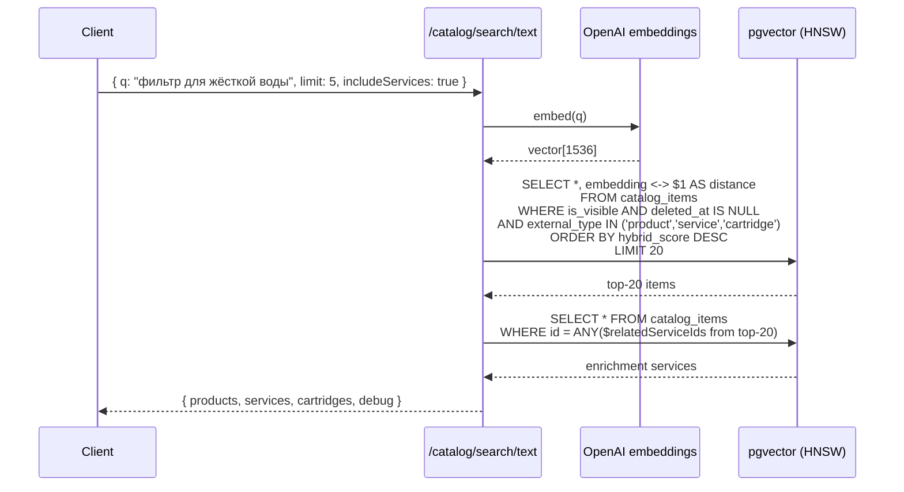
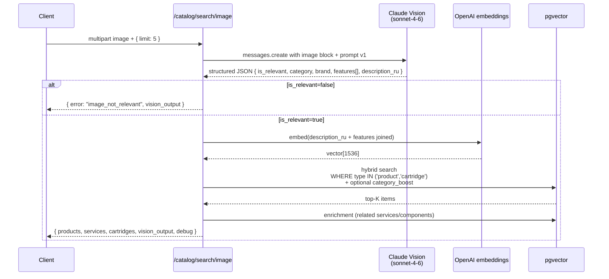

# Vision Catalog Search

> **Статус:** 🟡 черновик / Phase 1 — Flowise эксперименты
> **Связи:** [knowledge-base.md](knowledge-base.md), [ADR-006](../architecture/decisions/006-knowledge-base-as-first-feature.md), [ADR-004 Claude primary](../architecture/decisions/004-claude-as-primary-llm.md)

Фича: **поиск товара/услуги в каталоге Аквафор-Pro по фото или тексту**. Встраивается в `crm-aqua-kinetics` (собственный продукт разработчика) — пользователь CRM (менеджер / инженер) присылает фото сломанного узла, за пару секунд видит подходящую замену из каталога ~500 товаров MoySklad.

---

## Что строим

Гибридный поиск по каталогу:
- **text query** `"фильтр для жёсткой воды"` → embedding → pgvector cosine top-K
- **image query** фото узла → Claude Vision → структурированное описание → embedding → тот же pgvector top-K

Каталог наполняется **push-модели** от внешних систем (CRM, 1С, ручной импорт): slovo получает events `/catalog/items/bulk` и апсертит. Сам slovo **не знает** что такое MoySklad — это generic RAG-слой над каталогом.

---

## Зачем

1. **Замена вручную-листания каталога.** Пользователь CRM находит нужное за секунды, не минуты.
2. **SME-ассистент для новых сотрудников.** `"всё про обезжелезиватели, диапазон цен"` — smart-filtering вместо иерархии папок.
3. **Vision для клиентских кейсов.** Клиент прислал WhatsApp фото — не надо просить «опишите модель», AI определяет сам.
4. **Фундамент для water-analysis.** Когда AI рекомендует «нужен обратный осмос» — из каталога сразу тянется конкретный SKU с ценой.

---

## Архитектурные решения

### Развёртывание

**slovo — standalone API-сервис.** Отдельный репо, отдельный Docker deploy, HTTP API для внешних feeder'ов. `crm-aqua-kinetics-back` — первый feeder, подключается через HTTP к `POST /catalog/items/bulk` и query endpoints.

**Долгосрочный путь (когда усложнится):** выделить pure logic в `slovo/libs/catalog/` + публиковать как `@slovo/catalog` в private npm registry. CRM получит выбор — HTTP или прямой импорт lib. Сейчас YAGNI, начинаем с HTTP.

### Embedding провайдер

**OpenAI `text-embedding-3-small`** (1536 dim) через `@anthropic-ai/sdk`-style клиент. Причины:
- Доступен через уже настроенный proxy (host.docker.internal:10810 → DE)
- Работает с существующим billing (credits на аккаунте)
- Цена копейки: `$0.02 / 1M tokens × ~300 tokens × 500 items = $0.003` за полный re-embed каталога

**Абстракция `EmbedderService`** в `libs/llm/` — с переключением провайдера через env (`EMBEDDING_PROVIDER=openai|cohere|ollama`). Если в будущем:
- Нужна сильная multilingual для mixed RU/EN описаний → Cohere `embed-multilingual-light-v3` (через ту же BYOK модель)
- Локальный fallback / zero-cost → Ollama `bge-m3` или `multilingual-e5-large` на доступной GPU (пример локального vision-стека есть в `water-analysis-parser` проекте, инфра знакома)

Но всё это — потом. На PR7 берём OpenAI напрямую.

### Rich context сборка — на стороне feeder'а

**Feeder (crm-aqua-kinetics-back) сам собирает текст для embedding** и шлёт в slovo готовый `contentForEmbedding: string`. Причины:
- CRM уже знает про System Bundle структуру MoySklad, `parseServiceRefs`, `parseComponentRefs`, `GroupService.getGroupBundle`
- slovo остаётся generic — просто эмбедит то что пришло, не парсит чужие custom-attributes
- Новый feeder (1С когда будет) сам решает как собирать rich text

Что включает feeder в `contentForEmbedding`:
```
Товар: ${product.name}
${product.description ? 'Описание: ' + product.description : ''}
Категория: ${group.pathName}
Контекст группы: ${systemBundle?.description ?? ''}
${relevant_attributes.map(a => a.name + ': ' + a.value).join('\n')}
```

slovo просто получает эту строку и прогоняет через embedder. Field `rawContent` можно хранить в БД для аудита / re-embed (если сменим модель → пересчитаем embeddings без повторного fetch из MoySklad).

### Services: единая таблица, не отдельная

`CatalogItem` с discriminator `type: 'product' | 'service' | 'bundle' | 'cartridge'`. Все — в одной pgvector таблице.
- Услуги ищутся текстом (`"монтаж обратного осмоса"`) — embedding pipeline тот же
- Image search фильтрует `WHERE type IN ('product', 'cartridge')`, услуги исключаются
- Связи через ID list в JSONB `attributes` (MVP) — не нормализуем таблицы связей пока не понадобится reverse lookup

### Игнорируем кривые категории MoySklad как primary signal

MoySklad `ProductFolder.pathName` — **не таксономия**, а исторически сложенная иерархия менеджеров. Используем только как **дополнительный сигнал** в rich text для embedding. Основной matching — через semantic similarity по description/attributes/group-context, не через filter WHERE category=X.

Если Vision вернул `category: "обратный осмос"` — используем для **ranking boost** при совпадении, но не для жёсткого фильтра.

---

## Pipeline

### Ingestion (push от внешних feeder'ов через bulk API)



**Детали:**
- **Push, не pull.** slovo не знает про MoySklad API / MOY_SKLAD_API_KEY. Feeder (`crm-aqua-kinetics-back` сейчас — собственный продукт разработчика с уже готовой интеграцией MoySklad, 1С или другой источник завтра) выкачивает данные из источника истины, нормализует в generic schema, шлёт в slovo. Добавить второй источник каталога = написать ещё одного feeder'а, slovo не трогается.
- **Два режима sync:**
  - `syncMode: "partial"` — feeder шлёт только изменённые items (при invalidation конкретного ключа Redis). Быстро, без soft-delete GC.
  - `syncMode: "full"` — feeder шлёт весь каталог (полный сброс кеша / manual refresh в админке). slovo чистит отсутствующие через `last_seen_at < sync_start`.
- `content_hash = SHA-256(name + description)` — маркер изменения _текстовых_ полей (того что идёт в embedding). Изменение цены или атрибутов **не** триггерит пересчёт embedding — экономит 90% OpenAI-вызовов при типичном паттерне.
- `last_seen_at` каждого присутствующего в batch item'а обновляется. При `syncMode=full` — всё что не попало в batch с `last_seen_at < sync_start` помечается `deleted_at = NOW()`. Soft-delete, не жёсткое удаление: дилер может искать снятый с продажи товар.
- **Аутентификация:** `Authorization: Bearer <SLOVO_INGEST_API_KEY>` — machine-to-machine, отдельный API key в env обеих сторон. `@UseGuards(ApiKeyGuard)` на endpoint. Не JWT — для service-to-service не нужен.
- **Rate limiting:** отдельный throttle на `/catalog/items/bulk` (например 10 batch/min — batch может содержать до 500 items).
- **Идемпотентность:** `@@unique([externalSource, externalId])` гарантирует идемпотентный upsert. Повторный batch с теми же данными = no-op (hash не меняется).

### Query — text



### Query — image (hybrid vision→text→embedding)



**Почему "hybrid" именно через текстовый мост:** Vision → текст → embedding → поиск по каталогу embedding'ов. Не сравниваем image-embedding напрямую с text-embedding (разные семантические пространства). CLIP мог бы решить это напрямую, но не нужен при 500 товарах — text bridge проще и использует ту же embedding-модель что и text search.

### Hybrid ranking

Финальный score для каждого кандидата:

```
final_score = 0.7 × vector_similarity_normalized   // 0..1 из cosine distance
            + 0.2 × rang_boost                      // 0..1 из rangForApp (нормализованный)
            + 0.1 × category_boost                  // 0..1 если Vision category совпала с item.categoryPath
```

- `vector_similarity_normalized = 1 - cosine_distance` (cosine в pgvector даёт 0 для идентичных, нам нужно наоборот)
- `rang_boost = coalesce(rangForApp, 0) / max_rang` — нормализация относительно максимума в каталоге. Поднимает "поставленные менеджером в приоритет" товары.
- `category_boost` — если Vision вернул `category='обратный осмос'` и у товара `categoryPath` содержит "осмос" — +0.1. Иначе 0. Мягкий boost, не жёсткий фильтр.

Веса 0.7 / 0.2 / 0.1 — начальные. Тунить по реальному UX.

### Enrichment payload — что отдаём клиенту

```json
{
  "products": [
    {
      "id": "...",
      "externalId": "moysklad-uuid",
      "name": "Аквафор DWM-101S",
      "description": "...",
      "salePriceKopecks": 4500000,
      "imageUrl": "...",
      "categoryPath": "Фильтры/Обратный осмос",
      "score": 0.87,
      "score_breakdown": {
        "vector": 0.82,
        "rang": 0.8,
        "category": 1.0
      }
    }
  ],
  "services_suggested": [
    {
      "id": "...",
      "name": "Монтаж фильтра под мойкой",
      "rateOfHours": 2,
      "source_product_ids": ["product-uuid-1"],   // из какого товара подтянули
      "salePriceKopecks": 500000
    }
  ],
  "cartridges_compatible": [
    {
      "id": "...",
      "name": "K1-07 префильтр",
      "salePriceKopecks": 70000,
      "lifespan_months": 6,
      "source_product_ids": ["product-uuid-1"]
    }
  ],
  "vision_output": { ... },                 // при image search — для прозрачности
  "debug": {
    "query_text": "...",                   // для text search или description_ru из vision
    "embedding_provider": "openai:text-embedding-3-small"
  }
}
```

Клиент получает **всё нужное за один запрос** — не ходит дополнительно за услугами и картриджами. Пользовательский UX: товар, сразу под ним кнопки "заказать монтаж" / "нужны картриджи".

---

## Схема данных

```prisma
model CatalogItem {
    id                 String    @id @default(dbgenerated("gen_random_uuid()")) @db.Uuid

    // External identity — slovo не знает про MoySklad специфично.
    // externalSource = 'moysklad' | '1c' | 'manual' | любой другой feeder.
    // externalId — id в источнике истины (moyskladId для MoySklad).
    externalSource     String    @map("external_source") @db.VarChar(64)
    externalId         String    @map("external_id")     @db.VarChar(256)
    externalType       String    @map("external_type")   @db.VarChar(32)   // product | service | bundle | cartridge
    externalUpdatedAt  DateTime  @map("external_updated_at")

    // Базовые поля для отображения / фильтрации
    name               String    @db.VarChar(512)
    description        String?   @db.Text
    salePriceKopecks   Int?      @map("sale_price_kopecks")
    categoryPath       String?   @map("category_path")
    imageUrl           String?   @map("image_url")
    isVisible          Boolean   @default(true) @map("is_visible")
    rangForApp         Int?      @map("rang_for_app")  // ручной приоритет из MoySklad для ranking boost

    // Rich content — то что feeder собрал для embedding (для re-embed при смене
    // модели можно пересчитать не ходя в MoySklad)
    contentForEmbedding String   @map("content_for_embedding") @db.Text

    // Связи (ID list в JSONB) — для enrichment при search:
    //   { relatedServiceIds: ["..."], relatedComponentIds: ["..."] }
    // MVP без нормализации. Когда понадобится reverse-lookup ("какие товары
    // совместимы с этим картриджем") — выделим catalog_item_components table.
    attributes         Json?                                       // raw MoySklad attrs + relatedServiceIds + relatedComponentIds

    // Delta-sync маркеры
    contentHash        String    @map("content_hash") @db.Char(64) // SHA-256(contentForEmbedding)
    lastSeenAt         DateTime  @default(now()) @map("last_seen_at")
    deletedAt          DateTime? @map("deleted_at")

    createdAt          DateTime  @default(now()) @map("created_at")
    updatedAt          DateTime  @updatedAt @map("updated_at")

    // Колонка embedding vector(1536) добавляется отдельной миграцией
    // (Prisma не поддерживает pgvector типы декларативно, см. ADR-005).
    // + HNSW-индекс с vector_cosine_ops.

    @@unique([externalSource, externalId])
    @@index([isVisible, deletedAt])
    @@index([externalType, isVisible, deletedAt])  // для image-search (фильтр по type)
    @@index([lastSeenAt])
    @@index([externalUpdatedAt])
    @@map("catalog_items")
}
```

**Ключевые решения:**
- `externalSource + externalId` — composite unique key, multi-source ready. `moysklad:abc-123` и `1c:def-456` одновременно живут в одной таблице.
- Отдельная таблица, не `knowledge_sources` — разные домены (user uploads vs org catalog), разные lifecycle (ad-hoc vs push-sync), разная авторизация (user-scoped vs read-all + ingest-key-protected).
- `externalType` не enum, а string — расширяется через код feeder'а без миграций БД (завтра добавим `sparepart`, `manual`, etc.).

### Контракт bulk ingest API

```typescript
POST /catalog/items/bulk
Authorization: Bearer <SLOVO_INGEST_API_KEY>
Content-Type: application/json

{
  syncMode: "partial" | "full",
  items: [
    {
      externalId: "a0b1c2d3-...",           // id у feeder'а (moyskladId для CRM)
      externalSource: "moysklad",           // дискриминатор источника
      externalType: "product",              // product | service | bundle | cartridge
      externalUpdatedAt: "2026-04-24T07:00:00Z",

      // Базовые поля для отображения / фильтрации
      name: "Аквафор DWM-101S",
      description: "Фильтр обратного осмоса с минерализатором",
      salePriceKopecks: 4500000,            // 45,000.00 ₽
      categoryPath: "Фильтры / Обратный осмос",
      imageUrl: "https://...",
      isVisible: true,
      rangForApp: 5,                        // ручной приоритет менеджера из MoySklad

      // Rich content для embedding — feeder уже собрал из name + description +
      // group.systemBundle.description + attributes. slovo эмбедит как есть.
      contentForEmbedding: "Товар: Аквафор DWM-101S\nОписание: ...\nКатегория: ...\nКонтекст группы: ...",

      // Связи — ID list, feeder собирает из parseServiceRefs / parseComponentRefs.
      // slovo хранит в JSONB attributes, при search-enrichment JOIN по этим id.
      relatedServiceIds: ["svc-uuid-1", "svc-uuid-2"],       // до 3 услуг
      relatedComponentIds: ["cart-uuid-1", "cart-uuid-2"],   // до 5 картриджей

      // Произвольные MoySklad-специфичные атрибуты — свободный JSONB для UI /
      // будущих фильтров (lifespan, warranty и т.п.).
      attributes: {
        lifespanMonths: 12,
        warrantyRequired: true
      }
    }
  ]
}

Response:
{
  received: 25,
  created: 3,
  updated_metadata_only: 18,   // contentHash совпал, embedding не пересчитан
  re_embedded: 4,              // contentHash поменялся или новая запись
  soft_deleted: 2,             // при syncMode=full
  errors: []
}
```

### Что за `contentHash` и когда пересчитывается embedding

`contentHash = SHA-256(contentForEmbedding)`. Это отличается от v1 плана (где хэш считался по `name + description`) — теперь **весь rich text** участвует в хэше.

**Impact:** если MoySklad обновил только цену товара (name/description/group.description не тронуты) — `contentForEmbedding` у feeder'а получится тот же → тот же hash → embedding не пересчитываем, экономим OpenAI-вызов.

Если изменилось хоть одно из полей которые feeder включает в rich text (например менеджер поправил описание группы) — hash меняется → слово пересчитывается. Это правильное поведение: группа влияет на все товары в ней, при её редактировании пересчитать embeddings — ок.

---

## Фазы реализации

| PR | Скоуп | Новая технология |
|---|---|---|
| **Phase 0 (✅ в процессе)** | Flowise chatflow "Vision Describer" — эксперименты с промптом v1 на тестовых фото. Промпт v1 валидирован на 6 тестах (happy path, edge cases, не-Аквафор бренды, расходники, is_relevant=false). Обнаружены 2 точечных улучшения для v2 (open brand/category вместо closed enum). Финальный промпт → `libs/llm/prompts/vision-catalog.ts` в PR5. | Claude Vision в Flowise UI |
| **PR5** | `libs/llm/` — `EmbedderService` абстракция + `AnthropicVisionService` (Claude Sonnet 4.6). `POST /vision/describe` endpoint: multipart upload, base64, structured JSON output. Используется в PR8 для image search. | Anthropic SDK, multipart, Claude Vision |
| **PR6** | `CatalogItem` Prisma-модель (type discriminator product/service/cartridge/bundle) + миграция. `CatalogIngestService` + `POST /catalog/items/bulk` с `ApiKeyGuard`. Partial/full sync, content_hash delta, soft-delete через last_seen_at. JSONB attributes для relatedServiceIds / relatedComponentIds. Embeddings **пока не считаем**. | ApiKey auth, idempotent bulk upsert |
| **PR7** | Миграция `ALTER TABLE ADD COLUMN embedding vector(1536)` + HNSW index `vector_cosine_ops`. OpenAI text-embedding-3-small через `EmbedderService`. Пересчёт embedding при INSERT / когда content_hash изменился в PR6-флоу. `/catalog/search/text` endpoint с hybrid ranking (vector × 0.7 + rang × 0.2 + category × 0.1) + enrichment (связанные services/cartridges через JSONB ID-lookup). | pgvector HNSW, OpenAI embeddings, hybrid ranking |
| **PR8** | `/catalog/search/image` — склейка PR5-7: Claude Vision → `description_ru + features` → embedding → hybrid search → enrichment. Handling `is_relevant=false` → 400 с vision_output. Swagger примеры с реальными фото из test-set Phase 0. | End-to-end vision → catalog search |
| **PR9 (если понадобится)** | A/B-тест OpenAI vs Cohere multilingual vs Ollama local на реальных RU/EN описаниях. Конфиг `EMBEDDING_PROVIDER` в env. Если OpenAI small справляется — PR9 пропускаем. | Provider-agnostic embedder |
| **Вне slovo (параллельно)** | Feeder side — в `crm-aqua-kinetics-back`: сервис сборки `contentForEmbedding` из `name + description + group.pathName + systemBundle.description + attributes`. Extraction `relatedServiceIds` / `relatedComponentIds` через существующие `parseServiceRefs`/`parseComponentRefs`. Hook на cache invalidation → POST к slovo. Отдельный PR в crm репозитории. | crm → slovo HTTP integration |

---

## Phase 0 — что делаем сейчас в Flowise

**Цель:** подобрать промпт для Vision который даёт стабильный structured JSON для поиска по каталогу.

### Chatflow "Vision Describer" в Flowise

Ноды:
- **ChatAnthropic** — `claude-sonnet-4-6`, поддержка image input через messages
- **Prompt Template** — инструкция "опиши в JSON"
- **Structured Output Parser** (или свой JSON prompt)

### Какой структуры JSON хотим

```json
{
  "category": "обратный осмос",
  "model_hint": "Aquaphor DWM-101S",
  "brand": "Аквафор",
  "features": ["5-ступенчатая очистка", "обратный осмос", "минерализатор"],
  "condition": "внешне исправен",
  "description_ru": "Бытовой фильтр обратного осмоса Аквафор DWM-101S. Пять ступеней очистки с минерализатором. Под мойкой, накопительный бак."
}
```

`description_ru` — это то, что пойдёт в embedding. Остальные поля — для фильтрации / отображения.

### Что проверяем в Flowise (чек-лист)

- [ ] Claude Sonnet видит загруженное изображение
- [ ] Возвращает **валидный JSON** без markdown-обёрток (` ```json `)
- [ ] Русский язык в полях выдерживается
- [ ] На мутных/плохих фото отвечает `{ "category": null, "confidence": "low" }` а не галлюцинирует
- [ ] На не-фильтре (пёс, котёнок) честно говорит `null`
- [ ] Стабильность — одну и ту же картинку прогнать 3 раза, сравнить output

### Тестовый набор фото

Собрать 10-15 фото:
- Исправные фильтры Аквафор (разные модели)
- Сломанные узлы (картридж, мембрана, трубка)
- Коробки/упаковка
- Бланк анализа воды (edge case — AI должен сказать "это не оборудование")
- Случайные фото (кот, чашка кофе) — AI должен вернуть null

Результаты сложить в `docs/experiments/vision-catalog-${date}/` с JSON outputs — чтобы было что сравнивать между итерациями промптов.

---

## Что НЕ делаем в Phase 0

- ❌ Не пишем NestJS endpoint (прототипируем промпт в UI, не коде)
- ❌ Не импортируем каталог (прототипируем на 3-5 известных моделях вручную вписанных в промпт)
- ❌ Не считаем embeddings (только формируем текст который пойдёт в embedding позже)
- ❌ Не думаем про prod-деплой / cost optimization

Финал Phase 0 — **один JSON-файл с промптом который работает** + репорт "на 15 фото работает N/15 корректно". Этот промпт идёт в PR5.

---

## Открытые вопросы

1. **Промпт v2 после Phase 0.** По результатам 6 тестов в Phase 0 промпт v1 хорош на 4/6 (2 проблемы с closed enum brand/category). Нужен ли v2 с open fields? **Решение:** open fields + post-processing canonicalization в NestJS перед записью в БД.
2. **Cost budget на Claude Vision.** $0.003 за image в Sonnet. 100 запросов в день = $0.30/день. OK. Haiku ($0.001/img) — запасной вариант если объём превысит 1000/день.
3. **Веса hybrid ranking (0.7 / 0.2 / 0.1)** — тюнить по UX. Возможна UI с кнопкой "сдвинуть приоритет в сторону популярных" (увеличить rang weight).
4. **Category canonicalization.** Как маппить Vision `category: "обратный осмос"` → MoySklad `categoryPath: "Фильтры/Обратный осмос/..."`? Lookup table или LLM-based? Решение: lookup table с синонимами в `libs/llm/taxonomy/water-equipment.ts`, LLM-маппинг избыточен для 20-30 категорий.

---

## Связи с другими фичами

- **knowledge-base** — те же принципы embedding + pgvector, но для другой сущности (user uploads). Catalog — отдельная модель.
- **water-analysis** (будет позже) — после распознавания параметров из бланка, рекомендует оборудование **через catalog search** — реюз пайплайна.
- **sme-cloning (video-to-artifact)** — аналогично, но vision для видео-кадров.
