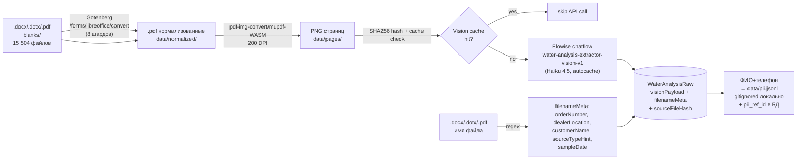
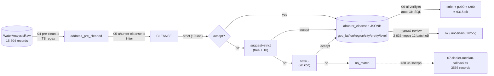

# Water Analysis

> **Статус:** Active. Этап 1.A (extract) и 1.A.5 (address resolution) **закрыты** на 2026-05-05. **На 2026-05-06 в работе:** dealer-median fallback (#38) + Этап 1.B normalization.
> **Связи:** [vision-catalog-search.md](vision-catalog-search.md), [knowledge-base.md](knowledge-base.md), [flowise-naming.md](../guides/flowise-naming.md), [ADR-002 PostgreSQL+pgvector](../architecture/decisions/002-postgresql-with-pgvector.md), [ADR-004 Claude primary](../architecture/decisions/004-claude-as-primary-llm.md), [ADR-005 Prisma+raw queries](../architecture/decisions/005-prisma-with-pgvector.md), [ADR-008 MCP-сервер для Flowise](../architecture/decisions/008-mcp-server-for-flowise.md)
> **Lab journals:** `docs/experiments/water-analysis/2026-05-04-stage-1a-extract-costs.md` (Этап 1.A финал), `2026-05-05-bitrix-archive-merge.md` (расширение dataset 5430 → 15 504), `2026-05-05-address-resolution.md` (Этап 1.A.5).
> **Roadmap pin:** `vision-catalog Phase 3 — water-analysis` (CLAUDE.md → «Roadmap фич»)

Фича: **семантический поиск и кластеризация по 15 504 бланкам анализов воды** —
разово оцифровать существующий архив анализов из CRM aqua-kinetics
(2020-2026, +архив коллеги через Bitrix24), превратить в датасет → векторный
индекс и поверх него запустить набор задач: поиск похожих случаев,
рекомендация оборудования, geo-кластеризация по проблемным зонам, карта анализов.

Главные потребители — менеджеры `crm-aqua-kinetics-front` для подбора решения
новому клиенту по аналогии с историческими случаями, и админ-аналитика
(где какие проблемы воды локально частые).

---

## Что строим

Чёткое разделение на четыре этапа — каждый завершён своей артефактной целью,
последующие этапы могут стартовать независимо после стабилизации предыдущего.

| Этап | Артефакт | Стоимость (фактическая) | Статус |
|---|---|---|---|
| **1.A** Raw extraction | таблица `WaterAnalysisRaw` с 15 504 бланками: `visionPayload` от Claude Haiku 4.5, `filenameMeta` regex, `sourceFileHash` SHA256 для idempotency | **~$183** только Vision-extract (5430 на 2026-05-04 за $62.10 + 10 074 от Bitrix-merge на 2026-05-05 за ~$121) + 40 ₽ Ahunter pilot. Полный Anthropic billing (включая misc + VAT/conversion) — см. lab journal `2026-05-04-stage-1a-extract-costs.md` | ✅ закрыт 2026-05-05 |
| **1.A.5** Address resolution | 15 полей в `WaterAnalysisRaw`: `address_pre_cleaned`, `ahunter_cleansed` JSONB, `geo_lat/lon/region/city/pretty/level`, `ai_verified`. Pre-clean (TS regex) → Ahunter `/cleanse` 3-tier (strict → suggest+strict → smart) → Claude AI verify | **~2 000 ₽** Ahunter `/cleanse` за май: 18 496 API запросов = ~17 296 production (multi-tier overhead, не retries) + ~1 200 пилотные итерации `analyze-cleanse-sample.ts` v1→v5; 12 891 исправлено Ahunter, 11 948 принято нашим postfilter v5. + ~3 часа manual Claude review. Детальный breakdown — lab journal `2026-05-05-address-resolution.md` | ✅ закрыт 2026-05-05 |
| **1.B** Normalization | таблица `WaterAnalysis` с каноническими `params{hardness, iron, ...}`, enum `WaterSourceType`, PII-обезличиванием, derive из `WaterAnalysisRaw` | $0 (детерминированный transform, повторяемо без расходов) | 🟢 в работе |
| **dealer-median fallback** (между 1.A.5 и 1.B) | для 3 556 no_match/empty — медианные lat/lon из `ai_verified='ok'` записей того же dealer'а с пометкой `geo_source='dealer_median'`. Цель: ≥95% records с lat/lon разной точности (precise для 1.A.5 ok, ~5-15 км radius для dealer-median) | $0 (агрегация на стороне БД) | ⏳ TaskList #38 на 2026-05-06 |
| **2** Embeddings | колонка `embedding vector(1536)` + HNSW-индекс + endpoint `/water-analysis/similar` | ~$0.06 OpenAI embeddings + время на формат embedding text | ⏳ после 1.B |
| **3** Real-time + endpoints | webhook из CRM, geo-аналитика, карта МО | infrastructural | ⏳ после 2 |

> **Состояние dataset на 2026-05-05 EOD:**
> - **15 504** total raw records (после Bitrix-merge, +10 074 относительно 5430 на 2026-05-04)
> - **11 948** cleansed через Ahunter (96.7% strict tier, 2.0% smart, 1.3% suggest+strict)
> - **3 556** no_match/empty — на dealer-median
> - **AI verified:** 10 846 ok (90.8%) / 633 uncertain (5.3%) / 469 wrong (3.9%) — цель <5% wrong **выполнена**

---

## Зачем

1. **Подбор оборудования по аналогии.** Менеджер видит новый анализ воды — система за секунду подсказывает «у нас уже было 12 похожих случаев, в 9 из них поставили обратный осмос ОС-15». Снимает тренинг-нагрузку с новых сотрудников.
2. **Geo-кластеризация проблем.** «В районе X жёсткость стабильно >10 °Ж, железо часто >0.5» — основа для маркетинговых кампаний и предкомплектации стока в локальных складах.
3. **Карта анализов** — административная аналитика: видим где плотность реальных пробных точек, где разреженно, какие районы под-обеспечены.
4. **RAG-подложка для будущего chatbot-консультанта.** Клиент в WhatsApp описывает проблему словами → находим похожие исторические анализы → рекомендация на базе реальных кейсов.
5. **Фундамент для real-time ingest.** После backfill 15 504 каждый новый анализ автоматически попадает в индекс — это обычная operational-задача, не аналитический snapshot.

---

## Этап 1.A — Raw extraction

Pipeline в `experiments/water-analysis-dataset/`. Vision-only унификация
ETL'а: один code-path для `.docx`/`.dotx`/`.pdf` независимо от наличия
text-layer. Платим лишние ~$10 на 6000 бланков за то, чтобы не писать три
ветки парсинга и format-detection.

### Pipeline



> Старая Ahunter-фаза `/fetch/address` из изначального плана **отменена** в
> пользу Этапа 1.A.5 (`/cleanse/address` 3-tier с AI-verify) — см. секцию
> «Pivot решений 2026-05-05» ниже. На этап 1.A осталось только Vision +
> filename + PII split.

### Решения по архитектуре этапа 1.A

**Two-table schema (`WaterAnalysisRaw` + `WaterAnalysis`).** Сырое extraction
живёт один раз — нормализация повторяема. Если завтра найдём что нужно
учесть параметр «запах при 60 °C» — он уже в `visionPayload`, добавляем в
normalize.ts и пересчитываем без расходов на Vision. A/B нормализаций — в
секундах.

**Vision-only через Flowise chatflow `water-analysis-extractor-vision-v1`.**
Нода `chatAnthropic` v8 поддерживает только image uploads (не PDF
напрямую — Flowise-обёртка не пробрасывает Anthropic native PDF support).
Поэтому шаг PDF→PNG в tsx-скрипте обязателен.

**PII split (152-ФЗ).** ФИО и телефон лежат в `pii.jsonl` (gitignored,
локально), не отправляются через Flowise → OpenAI. В `WaterAnalysisRaw`
колонок для PII нет на этапе эксперимента. Когда фича пойдёт в slovo
runtime + auth + РФ-инстанс БД — добавим обратно отдельной миграцией.

**Geocoding strategy.** Приоритет — `rawAddress` из тела бланка (это
адрес объекта где брали пробу). Если пусто или невалидно — fallback на
`dealerLocation` из имени файла (точка дилера, приблизительные координаты).
Колонка `geocodeSource: blank | dealer_fallback` помечает что точное, что
приблизительное — на карте видно отличие.

**Filename как cross-check.** Имя файла даёт `filenameSourceTypeHint`
(«колодец»/«скважина»/«родник» из имени). Если Vision сказал
`intakeType: "артезианская скважина"`, а в имени «колодец» — это сигнал
ошибки extraction'а, попадает в EDA-отчёт.

### Источник данных на входе

Бланки лежат в `~/Desktop/water-analysis-digitizer/blanks/` — смешанные
форматы:

| Формат | Доля | Обработка |
|---|---|---|
| `.docx` | большинство (2021-2022) | Gotenberg → PDF → PNG → Vision |
| `.pdf` | разрозненно по годам | напрямую PDF → PNG → Vision |
| `.dotx` | единичные | Gotenberg как docx |
| `.url` | 1 (мусор, ссылка на партию) | пропускаем |

Имя файла — `<orderNumber> <локация> (<клиент>) от <дата>.<ext>`. Regex
вытаскивает все 4 части до Vision-вызова — это бесплатный source of truth
для `orderNumber` (уникальный ключ дедупликации) и `sampleDate`.

### Tool: Flowise chatflow

**`water-analysis-extractor-vision-v1`** — собирается через MCP
(`flowise_chatflow_create` + `flowise-flowdata` builder).

**Структура графа:**

```
chatAnthropic (Haiku 4.5, T=0, streaming=false, allowImageUploads=true)
    → advancedStructuredOutputParser (autofixParser=true, exampleJson=Zod)
```

**Параметры `chatAnthropic` v8 (закоммичены в graph):**

| Параметр | Значение | Почему |
|---|---|---|
| `modelName` | `claude-haiku-4-5` | дешевле sonnet, vision-quality достаточен |
| `temperature` | `0` | extraction должен быть детерминирован |
| `streaming` | `false` | batch-mode, не интерактив |
| `allowImageUploads` | `true` | Vision вход обязателен |
| `extendedThinking` | — | Haiku не поддерживает (hide-rule в schema) |

**`advancedStructuredOutputParser`:**

| Параметр | Значение | Почему |
|---|---|---|
| `autofixParser` | `true` | страховка: если первый ответ невалиден — повторный call для починки |
| `exampleJson` | `WaterBlankExtractionV1` Zod | shape extraction результата |

### Zod schema `WaterBlankExtractionV1`

```ts
import { z } from 'zod';

export const WaterBlankExtractionV1 = z.object({
    blankNumber: z.string().nullable()
        .describe('Номер бланка/протокола как в документе'),
    sampleDate: z.string().nullable()
        .describe('Дата отбора пробы (YYYY-MM-DD)'),
    testDate: z.string().nullable()
        .describe('Дата проведения анализа (YYYY-MM-DD)'),

    customerName: z.string().nullable()
        .describe('ФИО заказчика'),
    customerPhone: z.string().nullable()
        .describe('Телефон заказчика'),
    objectAddress: z.string().nullable()
        .describe('Адрес объекта (где брали пробу), как написано в бланке'),

    intakeType: z.string().nullable()
        .describe('Тип источника воды как в бланке: "скважина", "колодец", "родник", "водопровод"'),
    appearance: z.string().nullable()
        .describe('Внешний вид воды (мутная/прозрачная/осадок/запах)'),

    params: z.array(z.object({
        name: z.string()
            .describe('Название параметра как в бланке ("Жёсткость общая")'),
        valueRaw: z.string()
            .describe('Значение строкой как написано ("7.2", "<0.1", "не обнаружено")'),
        unitRaw: z.string().nullable()
            .describe('Единица измерения как написано ("мг-экв/л", "°Ж")'),
    })).describe('Все количественные параметры воды на бланке'),

    notes: z.string().nullable()
        .describe('Нестандартные пометки, рукописные правки, печати'),
});

export type TWaterBlankExtractionV1 = z.infer<typeof WaterBlankExtractionV1>;
```

**Принципы schema:**
- Все строковые поля nullable — лаборатории заполняют по-разному, гипотеза «всё всегда есть» не выдержит реальности.
- `valueRaw` / `unitRaw` строками (не числом) — нормализация в этапе 1.B, raw остаётся честным до конца.
- Никаких enum'ов на raw-уровне — `intakeType: string`, не `intakeType: WaterSourceType`. Enum появится только в нормализованной таблице.
- `.describe()` на каждом поле — Claude использует эти описания при extraction'е.

### System prompt

Лежит в `experiments/water-analysis-dataset/prompts/water-blank-extractor.md`,
цельный текст применяется в `chatAnthropic` ноде через UI или
`flowise_chatflow_update` после создания.

```
Ты — парсер бланков лабораторных анализов воды (российские лаборатории,
СанПиН 1.2.3685-21). Тебе дают одно или несколько изображений страниц
одного бланка анализа.

Задача: извлечь метаданные и все количественные параметры воды в
структурированном виде.

ПРАВИЛА:
1. Возвращай только то что реально видишь на бланке. Не угадывай,
   не нормализуй, не интерпретируй.
2. Значения параметров — строкой как написано (valueRaw).
   Сохраняй "<0.1", "не обнаружено", "след.", "8,3" с запятой как есть.
3. Единицы измерения — строкой как написано (unitRaw):
   "мг-экв/л", "°Ж", "ммоль/л" — каждое как есть, без приведения.
4. intakeType — строкой как в бланке: "скважина 30м", "колодец",
   "родник", "водопровод", "из крана". Не нормализуй в enum.
5. objectAddress — адрес объекта где брали пробу (не адрес
   лаборатории, не адрес магазина-дилера). Если несколько мест —
   взять точку отбора.
6. Даты в формате ISO 8601 (YYYY-MM-DD). "19.07.2021" → "2021-07-19".
7. Если поля нет в бланке — null. Не выдумывай.
8. notes — нестандартная информация: пометки лаборанта, нечитаемые
   места, рукописные правки, печати.
9. params — ВСЕ количественные показатели в таблице:
   жёсткость, железо, марганец, мутность, цветность, запах, pH,
   минерализация, нитраты, нитриты, аммоний, хлориды, сульфаты,
   фториды, окисляемость, прочие. Включая "не обнаружено" / "<ПО".
```

### Зависимости pipeline

| Зависимость | Где живёт | Назначение |
|---|---|---|
| **Gotenberg** | `experiments/water-analysis-dataset/docker-compose.yml`, `127.0.0.1:3120` | docx/dotx → pdf через HTTP API |
| **pdf-img-convert** | npm dep в experiments-папке | pdf → png pure-JS, без node-gyp/system binaries (ключевое для Windows) |
| **Flowise** | `127.0.0.1:3130` (уже в `docker-compose.infra.yml`) | Vision-extraction через chatflow |
| **Ахантер** | внешний API, `AHUNTER_API_KEY` | geocoding |
| **Postgres** | `127.0.0.1:5433` (slovo dev БД, уже в `docker-compose.infra.yml`) | хранение `WaterAnalysisRaw` |

### Phases этапа 1.A — все закрыты

1. ✅ **Pilot 1 файл** — полный pipeline на одном реальном бланке. Ручная сверка JSON output ↔ что на бланке.
2. ✅ **Pilot 10 файлов** — стабилизация промпта на разных шаблонах.
3. ✅ **Stress 100 файлов** — random-sample, замер cost+time. Прогон через autocache + 4-shard parallel дал устойчивые ~30 RPM (sequential было 7-8 RPM).
4. ✅ **Full 5430 файлов** (2026-05-04) — 4-shard parallel, 2h 24m wall, $44.04. Полный счёт в lab journal `2026-05-04-stage-1a-extract-costs.md`.
5. ✅ **Bitrix-merge +10 074** (2026-05-05) — добавлены архивные бланки 2020-2026 от коллеги через Bitrix24 Drive (Playwright-скрипт обходит 2 GB / 30s server-side ZIP лимит). Ускорение 8 шардов параллельно, ~$121 Vision. Lab journal `2026-05-05-bitrix-archive-merge.md`.

**Итого Этап 1.A:** 15 504 records в `WaterAnalysisRaw`, ~$183 Vision, идемпотентно через `sourceFileHash` (SHA256 файла) + UNIQUE на `orderNumber`.

---

## Этап 1.A.5 — Address resolution (закрыт 2026-05-05)

Отдельная фаза между 1.A (Vision extract) и 1.B (Normalization). В
изначальном плане её не было — добавлена когда стало ясно, что простой
`/fetch/address` даёт ~60% records с lat/lon при заметной доле смысловых
ошибок (Ahunter возвращает `precision/recall=100%/100%` для семантически
неверных совпадений типа Малаховка→Малахово).

**Цель:** ≥95% records с usable lat/lon при <5% wrong-match rate. **Достигнуто:**
90.8% точных совпадений на 11 948 cleansed (3.9% wrong) + dealer-median
fallback на оставшиеся 3 556 запланирован на 2026-05-06.

### Pipeline



### Шаги

1. **`04-pre-clean.ts`** (TS regex, $0). Strip phone-prefix (любая позиция),
   скобки, tail-noise (`Обр.№X`, `после фильтра`, `скважина X м`, `родник`,
   `колодец`), common typos OCR (`СНГ→СНТ`, `ДНТ→ДНП`), preserve hyphens
   через placeholder-токены. **Результат:** 15 504 / 18 сек, 2 132 (13.7%)
   стали пустыми после clean (мусор-маркер) → `tier=empty`.

2. **`05-ahunter-cleanse.ts`** (Ahunter `/cleanse/address`). Three-tier с
   postfilter v5 (см. ниже). SHA256 cache в `data/.ahunter-cleanse-cache/`.
   **Результат:** 17m 30s wall, 11 948 matched / 3 556 reject.

3. **`06-ai-verify.ts`** (Claude review). Auto-OK SQL для
   `tier='strict' AND precision≥90 AND recall≥80` → 9 315 records.
   Остальные 2 633 через 12 batch'ей ручного review в чат-сессии (Claude
   читает JSONL по одной записи, выдаёт verdict ok/uncertain/wrong с notes).

### Postfilter v5

Без него Ahunter `precision=100%` встречается на семантически неверных
матчах. Финальная стратегия:

- **Region whitelist:** МО + соседние (Рязанская, Тульская, Тверская,
  Калужская, Владимирская, Ярославская, Смоленская). Smart-результат вне
  whitelist → reject.
- **Dealer-region match:** если dealer привязан к региону (Рязань →
  Рязанская обл.), reject если pretty не из этого региона.
- **Bare-name dealer-city check:** для одно-словных запросов («Малаховка»)
  требуем dealer city в pretty — иначе reject (защита от ambiguous matches).
- **Token-overlap ≥0.5:** жёсткий semantic-фильтр.

### Антипаттерны Ahunter (что обнаружили на manual review)

Ловится на завтрашних дополнительных regex'ах + dealer-city prefer:

1. **Phone-prefix как номер дома** — `8916141604 СНТ X` после неполного
   pre-clean → `дом 89XX`. Ловит большинство, но варианты с разделителями
   (`8916/161-04`) проскакивают.
2. **«Образец №X», «Обр.№X», «№X колодец» → дом X.** Ahunter трактует
   «номер образца воды» как «номер дома».
3. **нп → улица того же корня** (smart wrong). Лермонтово → ул Лермонтова.
   Ясенево → ул Ясеневая. Пушкино → ул Пушкина Малаховка.
4. **Регион потерян → fallback в МО.** «Тульская обл., СНТ X» теряет
   «Тульская обл.» при cleanse, fallback в pretty=Ступино.
5. **Малаховка ≠ Малахово, Барыбино ≠ Барыбино.** Совпадающие имена в
   разных районах (пгт Малаховка / с Малахово; мкр Барыбино / д Барыбино).
6. **Объекты-водоисточники как адреса.** `родник`, `колодец`, `скважина`,
   `водопровод` — это **тип образца**, не адрес.
7. **Воскресенск (МО) → Воскресенские Ворота (Москва центр).** Suggest
   возвращает Москву как expansion.

### Поля в `WaterAnalysisRaw` (мигр. `add_address_resolution_fields`)

| Поле | Тип | Назначение |
|---|---|---|
| `address_pre_cleaned` | `VarChar(512)` | Результат TS pre-clean |
| `address_pre_cleaned_at` | `DateTime` | Timestamp |
| `ahunter_cleansed` | `Json` | Полный JSONB ответ Ahunter `/cleanse` (для оптимизации без повторных API-вызовов) |
| `ahunter_cleansed_at` | `DateTime` | Timestamp |
| `ahunter_cleansed_tier` | `VarChar(20)` | `strict` / `suggest+strict` / `smart` / `no_match` / `empty` |
| `ahunter_cleansed_query` | `VarChar(512)` | Query, отправленный в Ahunter (после postfilter wrap) |
| `geo_lat`, `geo_lon` | `Float` | Координаты |
| `geo_region`, `geo_city` | `VarChar(64)` | Денормализованные удобные поля |
| `geo_pretty` | `VarChar(512)` | Полный canonical address от Ahunter |
| `geo_level` | `VarChar(16)` | `Region` / `City` / `District` / `Place` / `Site` / `Street` (точность матча) |
| `ai_verified` | `VarChar(16)` | `ok` / `uncertain` / `wrong` (см. tech-debt #21 — кандидат на enum) |
| `ai_verified_at`, `ai_verified_notes` | | Reasoning от Claude review (~3 слова на запись) |

Lab journal с pipeline diagram, итерациями v1→v5 на пилоте 200 random,
полной таблицей 12 batch'ей verification и метриками — в
`docs/experiments/water-analysis/2026-05-05-address-resolution.md`.

---

## Этап 1.B — Normalization

Detrminированный transform `WaterAnalysisRaw` → `WaterAnalysis`. Без LLM,
без Vision — только маппинг и валидация. Гонится локально, повторяемо,
$0 расходов.

### Что делается

1. **Param mapping** — `"Жёсткость общая"` / `"Жёсткость общ."` / `"Hardness"` → `paramCode: hardness`. Lookup-таблица из ~50 канонических параметров (СанПиН + распространённые лабораторные синонимы).
2. **Unit conversion** — `"мг-экв/л"` / `"°Ж"` / `"ммоль/л"` → каноническая единица. По жёсткости: `1 °Ж = 1 мг-экв/л = 0.5 ммоль/л` (нюанс — `°Ж = мг-экв/л` исторически, но в новых стандартах `°Ж` = градус жёсткости — таблица учитывает).
3. **Value parsing** — `"7,2"` → `7.2`, `"<0.1"` → `0.05` (половина детектируемого порога), `"не обнаружено"` → `null` с флагом `belowDetectionLimit: true`.
4. **SourceType inference** — Vision дал `intakeType: "артезианская скважина 30м"`, regex имени файла дал `filenameSourceTypeHint: "скважина"` → enum `WaterSourceType.well`. Cross-check ловит ошибки extraction'а.
5. **PDK flagging** — по справочнику СанПиН 1.2.3685-21 (взят из старого `water-analysis-parser/src/config/sanpin-norms.ts`) — для каждого числового параметра считаем `exceedsPdk: boolean`.
6. **Address breakdown** — copy из `WaterAnalysisRaw.geo_*` (уже разобрано на Этапе 1.A.5). В `WaterAnalysis` денормализованные `region/district/locality/lat/lon` + `geocodeSource: blank | dealer_median | none` (новое значение `dealer_median` для записей с fallback на median координат дилера).
7. **PII-обезличивание** — derive `customerNameRef` (FK в `pii.jsonl` id), без хранения ФИО/телефона в `WaterAnalysis`. См. memory `project_water_analysis_pii_strategy` + tech-debt #35.

### Версионирование нормализации

Колонка `WaterAnalysis.normalizationVersion: String` (`"v1.0.0"`). Когда
правила меняются — bump версии и пересчёт. Можно держать несколько
параллельных версий в БД для A/B сравнения качества.

---

## Этап 2 — Embeddings (отложен до завершения 1.A+1.B)

Решается **после** EDA на нормализованных данных. До этого момента всё —
гипотезы, и формат `embedding text` критически зависит от того что реально
лежит в `WaterAnalysis.params`.

### Открытые вопросы (решаем после 1.B)

1. **Что эмбеддить — формат embedding text:**
   - **B (предварительный выбор)**: структурированный шаблон (`Источник: колодец\nРегион: Московская обл., Ступино\nЖёсткость: 7.2 (превыш. ПДК)\nЖелезо: 0.8 (превыш. ПДК)...`). Детерминированно, $0, фокус на хим.профиле.
   - **C**: narrative от Claude Haiku. Богаче семантически, но дороже на 6000 (~$3) и stochastic.

2. **Адрес в embedding text** — фиксировано: **только regional context** (область + район/город) идёт в текст. Полный адрес и координаты — метаданные. Координаты в embedding не идут вообще: text-encoder не понимает числа географически (`55.7` ≠ ближе к `55.8`).

3. **Embedding модель** — `text-embedding-3-small` (default по slovo) vs Cohere multilingual (для русских доменных терминов).

4. **Стратегия дедупликации** — что делать с повторными анализами одного клиента/места за разные даты:
   - Эмбеддить каждый отдельно (история динамики воды на одной точке).
   - Эмбеддить только последний на (адрес × источник).
   - Эмбеддить все, но при поиске возвращать только уникальные по (customerId × address).

### Архитектурные константы (не пересматриваются)

- **Координаты не идут в embedding** — числовая мусорная пыль для text-encoder'а.
- **Embedding через Flowise**, не напрямую OpenAI — slovo шлёт rich-text в Flowise, провайдер эмбеддингов меняется без изменения slovo-кода.
- **Pgvector + HNSW** — `ALTER TABLE "WaterAnalysis" ADD COLUMN embedding vector(1536)` через `migrate dev --create-only` + ручная правка migration.sql.
- **Geo-фильтр на SQL-уровне** — `WHERE ST_DWithin(...) AND embedding <-> $query` (или Haversine если PostGIS избыточен).

---

## Этап 3 — Real-time + endpoints

После 1.A + 1.B + 2 — endpoint(ы) и интеграция с CRM.

| Шаг | Артефакт |
|---|---|
| Endpoint `POST /water-analysis/similar` | top-K по входному анализу через pgvector + опц. radius-фильтр |
| Endpoint `GET /water-analysis/map` | данные для карты МО (bbox, geo-кластеризация) |
| Webhook из CRM на новый анализ | автоматический ingest в этап 1.A pipeline → этап 1.B нормализация → этап 2 embedding |
| MinIO bucket для real-time bланков | централизованное хранение бланков от менеджеров CRM (вместо локальной папки) |

### Архитектурные решения этапа 3

**Webhook trigger или polling?** В CRM-aqua-kinetics нужен webhook на
событие «загружен новый бланк» с payload `{orderNumber, fileUrl}` →
publish в RabbitMQ queue `water-analysis.ingest` → worker processor
читает файл из CRM-storage, гонит через 1.A pipeline.

**Idempotent ingest** — ключ дедупликации `orderNumber` (uniqueness
constraint на `WaterAnalysisRaw.orderNumber`).

**Throttle/budget cap** — как в vision-catalog Phase 1 (Telegram alert
при превышении дневного бюджета на Vision). Переиспользуем паттерн.

---

## Prisma schema (этап 1.A + 1.A.5 + 1.B)

> **Источник правды:** `prisma/schema/water-analysis.prisma`. Этот раздел —
> упрощённая выжимка на момент 2026-05-05 (после миграций
> `add_water_analysis`, `add_pii_ref_id`, `add_address_resolution_fields`).
> Embedding column добавится в Этапе 2 отдельной миграцией.

### `WaterAnalysisRaw` — append-only, immutable

```prisma
model WaterAnalysisRaw {
    id              String   @id @default(dbgenerated("gen_random_uuid()")) @db.Uuid

    // === Этап 1.A — Vision extract + filename + idempotency ===
    orderNumber     String   @unique @map("order_number") @db.VarChar(32)
    sourceFileName  String   @map("source_file_name") @db.VarChar(512)
    sourceFileHash  String?  @map("source_file_hash") @db.VarChar(64)  // SHA256 для idempotency
    filenameMeta    Json     @map("filename_meta")                     // regex parse имени файла
    visionPayload   Json     @map("vision_payload")                    // raw Claude Vision output
    visionModel     String   @map("vision_model") @db.VarChar(64)
    visionTokensIn  Int      @map("vision_tokens_in")
    visionTokensOut Int      @map("vision_tokens_out")
    piiRefId        String?  @map("pii_ref_id") @db.VarChar(64)        // FK в pii.jsonl

    // === Legacy /fetch/address pipeline (заменён на 1.A.5, оставлен для аудита) ===
    ahunterRawAddress     String?  @map("ahunter_raw_address") @db.VarChar(512)
    ahunterRawResponse    Json?    @map("ahunter_raw_response")
    ahunterDealerResponse Json?    @map("ahunter_dealer_response")

    // === Этап 1.A.5 — address resolution pipeline ===
    addressPreCleaned     String?   @map("address_pre_cleaned") @db.VarChar(512)
    addressPreCleanedAt   DateTime? @map("address_pre_cleaned_at")

    ahunterCleansed       Json?     @map("ahunter_cleansed")            // полный JSONB ответ /cleanse
    ahunterCleansedAt     DateTime? @map("ahunter_cleansed_at")
    ahunterCleansedTier   String?   @map("ahunter_cleansed_tier") @db.VarChar(20)
    ahunterCleansedQuery  String?   @map("ahunter_cleansed_query") @db.VarChar(512)

    geoLat                Float?    @map("geo_lat")
    geoLon                Float?    @map("geo_lon")
    geoRegion             String?   @map("geo_region") @db.VarChar(64)
    geoCity               String?   @map("geo_city") @db.VarChar(64)
    geoPretty             String?   @map("geo_pretty") @db.VarChar(512)
    geoLevel              String?   @map("geo_level") @db.VarChar(16)

    aiVerified            String?   @map("ai_verified") @db.VarChar(16)
    aiVerifiedAt          DateTime? @map("ai_verified_at")
    aiVerifiedNotes       String?   @map("ai_verified_notes") @db.VarChar(512)

    extractedAt     DateTime @default(now()) @map("extracted_at")
    normalized      WaterAnalysis?

    @@index([extractedAt])
    @@index([sourceFileHash])
    @@index([ahunterCleansedAt])
    @@index([aiVerified])
    @@index([geoLat, geoLon])
    @@map("water_analysis_raw")
}
```

### `WaterAnalysis` — derived, перегенерируемые (Этап 1.B)

```prisma
model WaterAnalysis {
    id              String    @id @default(dbgenerated("gen_random_uuid()")) @db.Uuid
    rawId           String    @unique @map("raw_id") @db.Uuid
    raw             WaterAnalysisRaw @relation(fields: [rawId], references: [id], onDelete: Cascade)

    orderNumber     String    @unique @map("order_number")

    // Канонизированные значения (derive из visionPayload + filenameMeta)
    sampleDate      DateTime  @map("sample_date")
    testDate        DateTime? @map("test_date")
    intakeType      WaterSourceType @map("intake_type")
    appearance      String?

    // params{hardness:{value,unit,exceedsPdk,belowDetectionLimit}, iron:{...}, ...}
    params          Json

    // Адрес — copy из WaterAnalysisRaw.geo_* (уже разрешён на Этапе 1.A.5)
    canonicalAddress String?  @map("canonical_address")
    region          String?
    district        String?
    locality        String?
    lat             Float?
    lon             Float?
    geocodeSource   GeocodeSource @map("geocode_source")

    // Из имени файла
    dealerLocation  String?   @map("dealer_location")
    customerNameRef String?   @map("customer_name_ref")  // FK в pii.jsonl id

    normalizationVersion String @map("normalization_version")  // "v1.0.0"
    normalizedAt    DateTime  @default(now()) @map("normalized_at")

    // embedding column — добавится в этапе 2 через manual migration
    // ALTER TABLE water_analysis ADD COLUMN embedding vector(1536);
    // CREATE INDEX water_analysis_embedding_hnsw_idx ON water_analysis
    //     USING hnsw (embedding vector_cosine_ops);

    @@index([region, district])
    @@index([sampleDate])
    @@index([intakeType])
    @@index([normalizationVersion])
    @@map("water_analysis")
}

enum WaterSourceType {
    well        // скважина
    well_dug    // колодец
    municipal   // водопровод
    spring      // родник
    river       // открытый водоём
    other

    @@map("water_source_type")
}

enum GeocodeSource {
    blank             // адрес из тела бланка → Ahunter strict/suggest matched
    dealer_fallback   // [legacy] /fetch/address по dealerLocation
    none              // все методы провалились

    // === PROPOSED — добавляются миграцией add_dealer_median_geocode_source 2026-05-06 ===
    // smart           // smart-tier match с postfilter v5
    // dealer_median   // 1.A.5 не нашёл, использован median lat/lon dealer'а

    @@map("geocode_source")
}
```

> **Текущая схема в БД содержит только 3 значения** (`blank`, `dealer_fallback`,
> `none`). `smart` и `dealer_median` — **планируются** к добавлению вместе
> с derive в `WaterAnalysis` (Этап 1.B) и dealer-median fallback (#38).

### Миграции

| Миграция | Дата apply | Что добавляет |
|---|---|---|
| `add_water_analysis` | 2026-05-04 | Базовая `WaterAnalysisRaw` + `WaterAnalysis` + 2 enum |
| `add_pii_ref_id` | 2026-05-04 | `piiRefId` колонка + UNIQUE collision pre-check |
| `add_address_resolution_fields` | 2026-05-05 | 15 полей Этапа 1.A.5 + 3 индекса |
| `add_dealer_median_geocode_source` *(планируется 2026-05-06)* | — | Расширение enum `GeocodeSource` (`smart`, `dealer_median`) |

---

## Что точно НЕ делаем

- **Не выносим в отдельный сервис.** ADR-001 modular monolith — фича живёт в slovo.
- **Не покупаем Qdrant/Pinecone.** ADR-002 — pgvector, точка.
- **Не зовём OpenAI напрямую из slovo-api.** Embedding только через Flowise.
- **Не суём координаты в эмбеддинг.** Метаданные в отдельных колонках, фильтрация на SQL-уровне.
- **Не суём полный адрес («ул. Ленина, д. 5») в эмбеддинг.** Только regional context («Московская обл., Ступинский р-н»). Полный адрес и координаты — метаданные.
- **Не используем Document Stores Flowise для бланков.** DS — RAG-инструмент (chunking + embed). Наша задача — ETL (file → structured JSON → DB). DS не помогает.
- **Не тащим логику CRM в slovo.** Парсинг PDF/scan и сборка structured JSON — да; знание про MoySklad/customer-attributes — нет.
- **Не храним PII в БД на этапе эксперимента.** ФИО+телефон → `pii.jsonl` локально. Когда фича пойдёт в slovo runtime + auth + РФ-инстанс — добавим обратно.
- **Не делаем гибридный extraction (text-layer для docx + Vision для сканов).** Vision-only унификация выбрана сознательно: одна ветка кода, $10 лишних на 6000 — приемлемо за устранение format-detection логики.

---

## Pivot решений (decision log)

Изменения относительно изначального плана 2026-05-04 — фиксируем явно,
чтобы при возврате к документу через месяц не было «откуда это взялось».

### 2026-05-05 — Bitrix-merge: dataset 5430 → 15 504

**Было в плане:** работаем с 5430 бланками из локальной папки
`~/Desktop/water-analysis-digitizer/blanks/` (2020-2022, разреженно за 2024-2025).

**Стало:** найден shared доступ через Bitrix24 Drive у коллеги — полный
архив 2020-2026. Скачан Playwright-скриптом (page-by-page, обход 2 GB / 30s
server-side ZIP лимит), извлечено 10 074 новых файла (smart-unzip с дедупом
по orderNumber). Vision-обработка через 8 шардов параллельно.

**Эффект:** dataset вырос почти в 3 раза, особенно усилился свежий период
2024-2026. Lab journal — `2026-05-05-bitrix-archive-merge.md`.

### 2026-05-05 — `/cleanse/address` вместо `/fetch/address`

**Было в плане:** «Не используем Ахантер `/cleanse/address` (10 коп).
Только `/fetch/address` (20 коп) ради качества standardization для
embedding-консистентности (этап 2). Экономия 600 ₽ не стоит шума в
векторном пространстве».

**Стало:** на 5430 records `/fetch/address` дал ~60% match rate без
postfilter, с непредсказуемыми smart-результатами (тип Малаховка→Малахово
с `precision/recall=100%`). Перешли на `/cleanse/address` 3-tier
(strict → suggest+strict → smart) с собственным postfilter v5
(region whitelist + dealer-region match + bare-name dealer-city +
token-overlap≥0.5) + AI-verification.

**Эффект:** 90.8% точных совпадений (3.9% wrong, цель <5% выполнена) на
11 948 cleansed. Стоимость **~2 000 ₽** (вместо ожидаемых 600 ₽ экономии)
— оправдана на порядок более высоким качеством. Lab journal —
`2026-05-05-address-resolution.md`.

**Embedding consistency**, ради которого исходно выбирался `/fetch`:
сохраняется через денормализованные `geo_pretty` (canonical address
от Ahunter) — он будет источником для regional context в embedding text
на Этапе 2.

### 2026-05-05 — добавлен Этап 1.A.5 как отдельная фаза

**Было в плане:** address breakdown (region/district/locality/lat/lon)
делается в Этапе 1.B normalization из сырого `ahunterResponse`.

**Стало:** address resolution выделен в отдельный Этап 1.A.5 — потому что
это не «детерминированный transform $0», а полноценный pipeline с
Ahunter API + AI verify (~2 000 ₽ + ~3 часа). Этап 1.B остался за
нормализацией параметров/единиц/PDK.

**Эффект:** разделение по природе ответственности (deterministic free vs
API-driven paid). 1.A.5 уже закрыт, 1.B остаётся повторяемым $0 transform.

---

## Связанные tech-debt и зависимости

- `libs/geocoding` — будет создан в этапе 3 как переиспользуемый клиент Ахантера (сейчас в crm-aqua-kinetics-back есть `proxy.service.ts` с интеграцией). На этапе 1.A.5 — прямой fetch в tsx-скрипте.
- `apps/worker/src/processors/water-analysis-ingest.processor.ts` — в этапе 3 при real-time ingest.
- Throttle/budget cap на Vision-extraction (этап 3 при real-time) — реюз паттерна из vision-catalog Phase 1.
- Старый репозиторий `~/Desktop/water-analysis-parser` — забираем только `src/config/sanpin-norms.ts` (справочник СанПиН для нормализации в этапе 1.B). OpenAI/Ollama-сервисы и helpers `extract-json-block` / `smart-fix-json` — не нужны (`tool_use` Claude через Flowise гарантирует валидный JSON).

**Tech-debt пункты в `docs/architecture/tech-debt.md`:**

- **#21** — Prisma enum для `WaterAnalysisRaw.aiVerified` (`ok|uncertain|wrong`) и `geoLevel` (`Region|City|...`). Защита от опечаток `'OK'` vs `'ok'` в downstream queries. Триггер: перед прогоном dealer-median-fallback.
- **#22** — PostGIS GiST/SP-GiST на `(geo_lat, geo_lon)` при росте × 10 или появлении UI «найди похожие в радиусе». Текущий composite btree подходит для bounding-box, не для радиального поиска.

**TaskList items** (live backlog в IDE, не в `tech-debt.md`):

- **#35** PII обезличивание при derive `WaterAnalysisRaw → WaterAnalysis`. ФИО+телефон не попадают в `WaterAnalysis`, только `customerNameRef` (FK в `pii.jsonl`).
- **#36** Manual address override для top-dealers без геоинфы (Опт, Промотдел, Сервис без ТЦ-адреса). Manual lookup координат склада/офиса.
- **#38** `07-dealer-median-fallback.ts` для 3 556 no_match/empty. **На 2026-05-06 (сегодня).**

---

## Структура `experiments/water-analysis-dataset/`

```
experiments/water-analysis-dataset/             # gitignored целиком (правило experiments/)
├── README.md                                   # инструкция запуска pipeline
├── docker-compose.yml                          # Gotenberg для docx→pdf
├── package.json                                # локальные deps (pdf-img-convert, zod, playwright)
├── prompts/
│   └── water-blank-extractor.md                # system prompt для Vision chatflow
├── schemas/
│   └── water-blank-extraction-v1.ts            # Zod schema
├── scripts/
│   ├── 00-create-chatflow.ts                   # discover node specs + build flowData + create Flowise chatflow
│   ├── 00-fetch-bitrix.ts                      # Playwright скрипт скачивания архива через Bitrix24 Drive
│   ├── 00b-smart-unzip.ts                      # извлечение только новых orderNumber из ZIP-ов
│   ├── 01-convert.ts                           # docx/dotx → pdf через Gotenberg
│   ├── 02-rasterize.ts                         # pdf → png (mupdf-WASM)
│   ├── 03-extract.ts                           # Flowise prediction + insert WaterAnalysisRaw + pii.jsonl
│   ├── 04-geocode.ts                           # [LEGACY] Ahunter /fetch/address — заменён на 04-pre-clean+05-cleanse
│   ├── 04-pre-clean.ts                         # Этап 1.A.5: TS regex pre-clean адресов
│   ├── 05-ahunter-cleanse.ts                   # Этап 1.A.5: 3-tier Ahunter /cleanse + postfilter v5
│   ├── 06-ai-verify.ts                         # Этап 1.A.5: auto-OK SQL + manual review batch loop
│   ├── 07-dealer-median-fallback.ts            # ⏳ на 2026-05-06: median координаты для no_match/empty
│   ├── analyze-cleanse-sample.ts               # пилотные итерации v1→v5 на 200 random для калибровки
│   ├── check-stats.ts                          # SELECT COUNT по tier/verdict/cleansed
│   ├── _phase-log.ts                           # phase timing log в data/.phase-timings.jsonl
│   ├── backup-raw.sh                           # pg_dump в YandexDisk
│   └── 99-eda.ts                               # гистограммы, карта МО, кластеры
└── data/
    ├── normalized/                             # *.pdf после Gotenberg
    ├── pages/                                  # *.png страниц
    ├── pii.jsonl                               # ФИО+телефон, gitignored
    ├── .ahunter-cleanse-cache/<sha>.json       # SHA256-key cache Ahunter responses
    ├── .ai-verdicts-batch{1..12}.json          # AI-verification verdicts (gitignored, содержат orderNumber↔verdict)
    ├── .phase-timings.jsonl                    # тайминги каждой фазы pipeline
    └── extraction-logs/                        # raw response каждого Vision-вызова для отладки
```

---

## Timeline

### Этап 1.A — extract (закрыт 2026-05-05)

- [x] **2026-05-04** — согласована архитектура (этап 1.A → 1.B → 2 → 3), Vision-only, two-table schema, PII split, Gotenberg + pdf-img-convert, Zod-schema `WaterBlankExtractionV1`, system prompt, конвенции нейминга Flowise.
- [x] **2026-05-04** — `prisma/schema/water-analysis.prisma` + миграция, скелет `experiments/water-analysis-dataset/`, chatflow `water-analysis-extractor-vision-v1` через MCP.
- [x] **2026-05-04** — Pilot 1 → Pilot 10 → Stress 100 → Full 5430 (4-shard parallel, 2h 24m wall, $44.04).
- [x] **2026-05-04** — review через `llm-integration-reviewer` + `architect-reviewer`, обновлён prompt (few-shot, whitelist canonical params, valueRaw extras).
- [x] **2026-05-04** — SHA256 file hash + Vision response cache для idempotency, миграция `add_pii_ref_id` + UNIQUE collision pre-check.
- [x] **2026-05-05 утро** — Bitrix24 архив коллеги: Playwright скрипт скачивания, smart-unzip с дедупом по orderNumber, +10 074 новых (8-shard parallel, ~$121 Vision).

### Этап 1.A.5 — address resolution (закрыт 2026-05-05)

- [x] **2026-05-05 день** — миграция `add_address_resolution_fields` (15 полей в `WaterAnalysisRaw`), pre-clean v4 регекс, итерации analyze-cleanse-sample v1→v5 на пилоте 200 random.
- [x] **2026-05-05 вечер** — Ahunter `/cleanse` 3-tier на 15 504 records (17m 30s wall, ~2 000 ₽), 11 948 cleansed.
- [x] **2026-05-05 ночь** — AI verification: auto-OK SQL для 9 315 high-confidence + manual review через 12 batch'ей по ~200 records (2 633 verdicts: 1 333 ok / 633 uncertain / 469 wrong).

### Сегодня (2026-05-06)

- [ ] **#38** `07-dealer-median-fallback.ts` для 3 556 no_match/empty — median lat/lon из `ai_verified='ok'` записей того же dealer'а с пометкой `geo_source='dealer_median'`. Цель: ≥95% records с usable lat/lon.
- [ ] **#36** Manual address override для top-dealers без геоинфы (Опт, Промотдел, Сервис).
- [ ] **#21** Prisma enum для `aiVerified` / `geoLevel` (защита от опечаток типа `'OK'` vs `'ok'`).
- [ ] **#35** Этап 1.B — derive `WaterAnalysis` (param mapping, unit conversion, value parsing, sourceType inference, PDK flagging, address copy из `geo_*`, PII обезличивание).
- [ ] **EDA** на map-quality по dealer'ам, distribution wrong/uncertain.

### Backlog после 1.B

- [ ] **#13** Переименование существующих chatflows под новую конвенцию (`flowise-naming.md`).
- [ ] **#18** Extract в `libs/water-blank-extraction` (Variant C продуктизация — после стабилизации 1.B + Этапа 2).
- [ ] **#22** PostGIS GiST на `(geo_lat, geo_lon)` при росте × 10 / появлении UI «найди в радиусе».
- [ ] Этап 2: embedding column + HNSW + endpoint `/water-analysis/similar`.
- [ ] Этап 3: webhook из CRM + `/water-analysis/map` endpoint + carousel в фронте.
