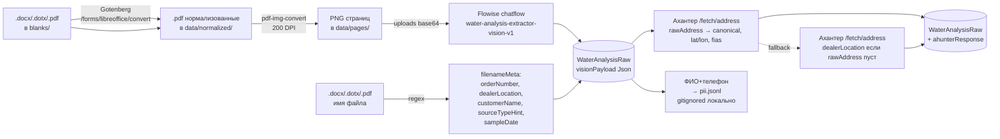

# Water Analysis

> **Статус:** Active (план согласован 2026-05-04, имплементация Этап 1 в работе)
> **Связи:** [vision-catalog-search.md](vision-catalog-search.md), [knowledge-base.md](knowledge-base.md), [flowise-naming.md](../guides/flowise-naming.md), [ADR-002 PostgreSQL+pgvector](../architecture/decisions/002-postgresql-with-pgvector.md), [ADR-004 Claude primary](../architecture/decisions/004-claude-as-primary-llm.md), [ADR-005 Prisma+raw queries](../architecture/decisions/005-prisma-with-pgvector.md), [ADR-008 MCP-сервер для Flowise](../architecture/decisions/008-mcp-server-for-flowise.md)
> **Roadmap pin:** `vision-catalog Phase 3 — water-analysis` (CLAUDE.md → «Roadmap фич»)

Фича: **семантический поиск и кластеризация по 6000 бланкам анализов воды** —
разово оцифровать существующий архив анализов из CRM aqua-kinetics, превратить
в датасет → векторный индекс и поверх него запустить набор задач: поиск
похожих случаев, рекомендация оборудования, geo-кластеризация по проблемным
зонам, карта анализов.

Главные потребители — менеджеры `crm-aqua-kinetics-front` для подбора решения
новому клиенту по аналогии с историческими случаями, и админ-аналитика
(где какие проблемы воды локально частые).

---

## Что строим

Чёткое разделение на четыре этапа — каждый завершён своей артефактной целью,
последующие этапы могут стартовать независимо после стабилизации предыдущего.

| Этап | Артефакт | Расчётная стоимость |
|---|---|---|
| **1.A** Raw extraction | таблица `WaterAnalysisRaw` со всеми 6000 бланками: `visionPayload` от Claude как есть, `filenameMeta` regex, `ahunterResponse` целиком | ~$15-20 Claude Vision + ≤1 200 ₽ Ахантер ≈ **3 000 ₽** |
| **1.B** Normalization | таблица `WaterAnalysis` с каноническими `params{hardness, iron, ...}`, enum `WaterSourceType`, разобранным адресом | $0 (детерминированный transform, повторяемо без расходов) |
| **2** Embeddings | колонка `embedding vector(1536)` + HNSW-индекс + endpoint `/water-analysis/similar` | ~$0.06 OpenAI embeddings + время на формат embedding text |
| **3** Real-time + endpoints | webhook из CRM, geo-аналитика, карта МО | infrastructural |

---

## Зачем

1. **Подбор оборудования по аналогии.** Менеджер видит новый анализ воды — система за секунду подсказывает «у нас уже было 12 похожих случаев, в 9 из них поставили обратный осмос ОС-15». Снимает тренинг-нагрузку с новых сотрудников.
2. **Geo-кластеризация проблем.** «В районе X жёсткость стабильно >10 °Ж, железо часто >0.5» — основа для маркетинговых кампаний и предкомплектации стока в локальных складах.
3. **Карта анализов** — административная аналитика: видим где плотность реальных пробных точек, где разреженно, какие районы под-обеспечены.
4. **RAG-подложка для будущего chatbot-консультанта.** Клиент в WhatsApp описывает проблему словами → находим похожие исторические анализы → рекомендация на базе реальных кейсов.
5. **Фундамент для real-time ingest.** После backfill 6000 каждый новый анализ автоматически попадает в индекс — это обычная operational-задача, не аналитический snapshot.

---

## Этап 1.A — Raw extraction

Pipeline в `experiments/water-analysis-dataset/`. Vision-only унификация
ETL'а: один code-path для `.docx`/`.dotx`/`.pdf` независимо от наличия
text-layer. Платим лишние ~$10 на 6000 бланков за то, чтобы не писать три
ветки парсинга и format-detection.

### Pipeline



### Решения по архитектуре этапа 1.A

**Two-table schema (`WaterAnalysisRaw` + `WaterAnalysis`).** Сырое extraction
живёт один раз — нормализация повторяема. Если завтра найдём что нужно
учесть параметр «запах при 60 °C» — он уже в `visionPayload`, добавляем в
normalize.ts и пересчитываем без расходов на Vision. A/B нормализаций — в
секундах.

**Vision-only через Flowise chatflow `water-analysis-extractor-vision-v1`.**
Нода `chatAnthropic` v8 поддерживает только image uploads (не PDF
напрямую — Flowise-обёртка не пробрасывает Anthropic native PDF support).
Поэтому шаг PDF→PNG в tsx-скрипте обязателен.

**PII split (152-ФЗ).** ФИО и телефон лежат в `pii.jsonl` (gitignored,
локально), не отправляются через Flowise → OpenAI. В `WaterAnalysisRaw`
колонок для PII нет на этапе эксперимента. Когда фича пойдёт в slovo
runtime + auth + РФ-инстанс БД — добавим обратно отдельной миграцией.

**Geocoding strategy.** Приоритет — `rawAddress` из тела бланка (это
адрес объекта где брали пробу). Если пусто или невалидно — fallback на
`dealerLocation` из имени файла (точка дилера, приблизительные координаты).
Колонка `geocodeSource: blank | dealer_fallback` помечает что точное, что
приблизительное — на карте видно отличие.

**Filename как cross-check.** Имя файла даёт `filenameSourceTypeHint`
(«колодец»/«скважина»/«родник» из имени). Если Vision сказал
`intakeType: "артезианская скважина"`, а в имени «колодец» — это сигнал
ошибки extraction'а, попадает в EDA-отчёт.

### Источник данных на входе

Бланки лежат в `~/Desktop/water-analysis-digitizer/blanks/` — смешанные
форматы:

| Формат | Доля | Обработка |
|---|---|---|
| `.docx` | большинство (2021-2022) | Gotenberg → PDF → PNG → Vision |
| `.pdf` | разрозненно по годам | напрямую PDF → PNG → Vision |
| `.dotx` | единичные | Gotenberg как docx |
| `.url` | 1 (мусор, ссылка на партию) | пропускаем |

Имя файла — `<orderNumber> <локация> (<клиент>) от <дата>.<ext>`. Regex
вытаскивает все 4 части до Vision-вызова — это бесплатный source of truth
для `orderNumber` (уникальный ключ дедупликации) и `sampleDate`.

### Tool: Flowise chatflow

**`water-analysis-extractor-vision-v1`** — собирается через MCP
(`flowise_chatflow_create` + `flowise-flowdata` builder).

**Структура графа:**

```
chatAnthropic (Haiku 4.5, T=0, streaming=false, allowImageUploads=true)
    → advancedStructuredOutputParser (autofixParser=true, exampleJson=Zod)
```

**Параметры `chatAnthropic` v8 (закоммичены в graph):**

| Параметр | Значение | Почему |
|---|---|---|
| `modelName` | `claude-haiku-4-5` | дешевле sonnet, vision-quality достаточен |
| `temperature` | `0` | extraction должен быть детерминирован |
| `streaming` | `false` | batch-mode, не интерактив |
| `allowImageUploads` | `true` | Vision вход обязателен |
| `extendedThinking` | — | Haiku не поддерживает (hide-rule в schema) |

**`advancedStructuredOutputParser`:**

| Параметр | Значение | Почему |
|---|---|---|
| `autofixParser` | `true` | страховка: если первый ответ невалиден — повторный call для починки |
| `exampleJson` | `WaterBlankExtractionV1` Zod | shape extraction результата |

### Zod schema `WaterBlankExtractionV1`

```ts
import { z } from 'zod';

export const WaterBlankExtractionV1 = z.object({
    blankNumber: z.string().nullable()
        .describe('Номер бланка/протокола как в документе'),
    sampleDate: z.string().nullable()
        .describe('Дата отбора пробы (YYYY-MM-DD)'),
    testDate: z.string().nullable()
        .describe('Дата проведения анализа (YYYY-MM-DD)'),

    customerName: z.string().nullable()
        .describe('ФИО заказчика'),
    customerPhone: z.string().nullable()
        .describe('Телефон заказчика'),
    objectAddress: z.string().nullable()
        .describe('Адрес объекта (где брали пробу), как написано в бланке'),

    intakeType: z.string().nullable()
        .describe('Тип источника воды как в бланке: "скважина", "колодец", "родник", "водопровод"'),
    appearance: z.string().nullable()
        .describe('Внешний вид воды (мутная/прозрачная/осадок/запах)'),

    params: z.array(z.object({
        name: z.string()
            .describe('Название параметра как в бланке ("Жёсткость общая")'),
        valueRaw: z.string()
            .describe('Значение строкой как написано ("7.2", "<0.1", "не обнаружено")'),
        unitRaw: z.string().nullable()
            .describe('Единица измерения как написано ("мг-экв/л", "°Ж")'),
    })).describe('Все количественные параметры воды на бланке'),

    notes: z.string().nullable()
        .describe('Нестандартные пометки, рукописные правки, печати'),
});

export type TWaterBlankExtractionV1 = z.infer<typeof WaterBlankExtractionV1>;
```

**Принципы schema:**
- Все строковые поля nullable — лаборатории заполняют по-разному, гипотеза «всё всегда есть» не выдержит реальности.
- `valueRaw` / `unitRaw` строками (не числом) — нормализация в этапе 1.B, raw остаётся честным до конца.
- Никаких enum'ов на raw-уровне — `intakeType: string`, не `intakeType: WaterSourceType`. Enum появится только в нормализованной таблице.
- `.describe()` на каждом поле — Claude использует эти описания при extraction'е.

### System prompt

Лежит в `experiments/water-analysis-dataset/prompts/water-blank-extractor.md`,
цельный текст применяется в `chatAnthropic` ноде через UI или
`flowise_chatflow_update` после создания.

```
Ты — парсер бланков лабораторных анализов воды (российские лаборатории,
СанПиН 1.2.3685-21). Тебе дают одно или несколько изображений страниц
одного бланка анализа.

Задача: извлечь метаданные и все количественные параметры воды в
структурированном виде.

ПРАВИЛА:
1. Возвращай только то что реально видишь на бланке. Не угадывай,
   не нормализуй, не интерпретируй.
2. Значения параметров — строкой как написано (valueRaw).
   Сохраняй "<0.1", "не обнаружено", "след.", "8,3" с запятой как есть.
3. Единицы измерения — строкой как написано (unitRaw):
   "мг-экв/л", "°Ж", "ммоль/л" — каждое как есть, без приведения.
4. intakeType — строкой как в бланке: "скважина 30м", "колодец",
   "родник", "водопровод", "из крана". Не нормализуй в enum.
5. objectAddress — адрес объекта где брали пробу (не адрес
   лаборатории, не адрес магазина-дилера). Если несколько мест —
   взять точку отбора.
6. Даты в формате ISO 8601 (YYYY-MM-DD). "19.07.2021" → "2021-07-19".
7. Если поля нет в бланке — null. Не выдумывай.
8. notes — нестандартная информация: пометки лаборанта, нечитаемые
   места, рукописные правки, печати.
9. params — ВСЕ количественные показатели в таблице:
   жёсткость, железо, марганец, мутность, цветность, запах, pH,
   минерализация, нитраты, нитриты, аммоний, хлориды, сульфаты,
   фториды, окисляемость, прочие. Включая "не обнаружено" / "<ПО".
```

### Зависимости pipeline

| Зависимость | Где живёт | Назначение |
|---|---|---|
| **Gotenberg** | `experiments/water-analysis-dataset/docker-compose.yml`, `127.0.0.1:3120` | docx/dotx → pdf через HTTP API |
| **pdf-img-convert** | npm dep в experiments-папке | pdf → png pure-JS, без node-gyp/system binaries (ключевое для Windows) |
| **Flowise** | `127.0.0.1:3130` (уже в `docker-compose.infra.yml`) | Vision-extraction через chatflow |
| **Ахантер** | внешний API, `AHUNTER_API_KEY` | geocoding |
| **Postgres** | `127.0.0.1:5433` (slovo dev БД, уже в `docker-compose.infra.yml`) | хранение `WaterAnalysisRaw` |

### Phases этапа 1.A

1. **Pilot 1 файл** — полный pipeline на одном реальном бланке. Ручная сверка JSON output ↔ что на бланке. Корректировка промпта/schema если нужно.
2. **Pilot 10 файлов** — 5 разных `.docx` шаблонов + 5 `.pdf` (text-layer и сканы). Метрики: % полностью извлечённых параметров, корректность даты/адреса, проблемы со схемой. Стабилизация промпта.
3. **Stress 100 файлов** — random-sample, batch run, замер cost+time, ловля кривых шаблонов. Корректировки на основе anomalies.
4. **Full 6000 файлов** — idempotent (ключ дедупликации = `orderNumber`), чекпоинты в `WaterAnalysisRaw` после каждого файла, можно прерывать/продолжать.

---

## Этап 1.B — Normalization

Detrminированный transform `WaterAnalysisRaw` → `WaterAnalysis`. Без LLM,
без Vision — только маппинг и валидация. Гонится локально, повторяемо,
$0 расходов.

### Что делается

1. **Param mapping** — `"Жёсткость общая"` / `"Жёсткость общ."` / `"Hardness"` → `paramCode: hardness`. Lookup-таблица из ~50 канонических параметров (СанПиН + распространённые лабораторные синонимы).
2. **Unit conversion** — `"мг-экв/л"` / `"°Ж"` / `"ммоль/л"` → каноническая единица. По жёсткости: `1 °Ж = 1 мг-экв/л = 0.5 ммоль/л` (нюанс — `°Ж = мг-экв/л` исторически, но в новых стандартах `°Ж` = градус жёсткости — таблица учитывает).
3. **Value parsing** — `"7,2"` → `7.2`, `"<0.1"` → `0.05` (половина детектируемого порога), `"не обнаружено"` → `null` с флагом `belowDetectionLimit: true`.
4. **SourceType inference** — Vision дал `intakeType: "артезианская скважина 30м"`, regex имени файла дал `filenameSourceTypeHint: "скважина"` → enum `WaterSourceType.well`. Cross-check ловит ошибки extraction'а.
5. **PDK flagging** — по справочнику СанПиН 1.2.3685-21 (взят из старого `water-analysis-parser/src/config/sanpin-norms.ts`) — для каждого числового параметра считаем `exceedsPdk: boolean`.
6. **Address breakdown** — `ahunterResponse` парсится в отдельные колонки `region/district/locality/lat/lon/fiasId`.

### Версионирование нормализации

Колонка `WaterAnalysis.normalizationVersion: String` (`"v1.0.0"`). Когда
правила меняются — bump версии и пересчёт. Можно держать несколько
параллельных версий в БД для A/B сравнения качества.

---

## Этап 2 — Embeddings (отложен до завершения 1.A+1.B)

Решается **после** EDA на нормализованных данных. До этого момента всё —
гипотезы, и формат `embedding text` критически зависит от того что реально
лежит в `WaterAnalysis.params`.

### Открытые вопросы (решаем после 1.B)

1. **Что эмбеддить — формат embedding text:**
   - **B (предварительный выбор)**: структурированный шаблон (`Источник: колодец\nРегион: Московская обл., Ступино\nЖёсткость: 7.2 (превыш. ПДК)\nЖелезо: 0.8 (превыш. ПДК)...`). Детерминированно, $0, фокус на хим.профиле.
   - **C**: narrative от Claude Haiku. Богаче семантически, но дороже на 6000 (~$3) и stochastic.

2. **Адрес в embedding text** — фиксировано: **только regional context** (область + район/город) идёт в текст. Полный адрес и координаты — метаданные. Координаты в embedding не идут вообще: text-encoder не понимает числа географически (`55.7` ≠ ближе к `55.8`).

3. **Embedding модель** — `text-embedding-3-small` (default по slovo) vs Cohere multilingual (для русских доменных терминов).

4. **Стратегия дедупликации** — что делать с повторными анализами одного клиента/места за разные даты:
   - Эмбеддить каждый отдельно (история динамики воды на одной точке).
   - Эмбеддить только последний на (адрес × источник).
   - Эмбеддить все, но при поиске возвращать только уникальные по (customerId × address).

### Архитектурные константы (не пересматриваются)

- **Координаты не идут в embedding** — числовая мусорная пыль для text-encoder'а.
- **Embedding через Flowise**, не напрямую OpenAI — slovo шлёт rich-text в Flowise, провайдер эмбеддингов меняется без изменения slovo-кода.
- **Pgvector + HNSW** — `ALTER TABLE "WaterAnalysis" ADD COLUMN embedding vector(1536)` через `migrate dev --create-only` + ручная правка migration.sql.
- **Geo-фильтр на SQL-уровне** — `WHERE ST_DWithin(...) AND embedding <-> $query` (или Haversine если PostGIS избыточен).

---

## Этап 3 — Real-time + endpoints

После 1.A + 1.B + 2 — endpoint(ы) и интеграция с CRM.

| Шаг | Артефакт |
|---|---|
| Endpoint `POST /water-analysis/similar` | top-K по входному анализу через pgvector + опц. radius-фильтр |
| Endpoint `GET /water-analysis/map` | данные для карты МО (bbox, geo-кластеризация) |
| Webhook из CRM на новый анализ | автоматический ingest в этап 1.A pipeline → этап 1.B нормализация → этап 2 embedding |
| MinIO bucket для real-time bланков | централизованное хранение бланков от менеджеров CRM (вместо локальной папки) |

### Архитектурные решения этапа 3

**Webhook trigger или polling?** В CRM-aqua-kinetics нужен webhook на
событие «загружен новый бланк» с payload `{orderNumber, fileUrl}` →
publish в RabbitMQ queue `water-analysis.ingest` → worker processor
читает файл из CRM-storage, гонит через 1.A pipeline.

**Idempotent ingest** — ключ дедупликации `orderNumber` (uniqueness
constraint на `WaterAnalysisRaw.orderNumber`).

**Throttle/budget cap** — как в vision-catalog Phase 1 (Telegram alert
при превышении дневного бюджета на Vision). Переиспользуем паттерн.

---

## Prisma schema (этап 1.A + 1.B)

Файл `prisma/schema/water-analysis.prisma` — две модели + два enum'а.
Embedding column **не** включена (добавится в этапе 2 отдельной миграцией).

```prisma
// Этап 1.A — сырое extraction. Append-only, immutable.
model WaterAnalysisRaw {
    id              String    @id @default(dbgenerated("gen_random_uuid()")) @db.Uuid
    orderNumber     String    @unique @map("order_number")
    sourceFileName  String    @map("source_file_name")

    // Vision raw output как пришёл
    visionPayload   Json      @map("vision_payload")
    visionModel     String    @map("vision_model")
    visionTokensIn  Int       @map("vision_tokens_in")
    visionTokensOut Int       @map("vision_tokens_out")

    // Filename regex parser raw
    filenameMeta    Json      @map("filename_meta")

    // Ahunter raw response, что вернул на rawAddress (или dealerLocation fallback)
    ahunterRawAddress     String?  @map("ahunter_raw_address")
    ahunterRawResponse    Json?    @map("ahunter_raw_response")
    ahunterDealerResponse Json?    @map("ahunter_dealer_response")

    extractedAt     DateTime  @default(now()) @map("extracted_at")

    normalized      WaterAnalysis?

    @@index([extractedAt])
    @@map("water_analysis_raw")
}

// Этап 1.B — нормализованные. Derived from raw, перегенерируемые.
model WaterAnalysis {
    id              String    @id @default(dbgenerated("gen_random_uuid()")) @db.Uuid
    rawId           String    @unique @map("raw_id") @db.Uuid
    raw             WaterAnalysisRaw @relation(fields: [rawId], references: [id], onDelete: Cascade)

    orderNumber     String    @unique @map("order_number")
    sourceFileName  String    @map("source_file_name")

    // Канонизированные значения
    sampleDate      DateTime  @map("sample_date")
    testDate        DateTime? @map("test_date")
    intakeType      WaterSourceType @map("intake_type")
    appearance      String?

    // params{hardness:{value,unit,exceedsPdk,belowDetectionLimit}, iron:{...}, ...}
    params          Json

    // Адрес — каноническая форма от Ахантера
    canonicalAddress String?  @map("canonical_address")
    fiasId          String?   @map("fias_id")
    region          String?
    district        String?
    locality        String?
    lat             Float?
    lon             Float?
    geocodeSource   GeocodeSource @map("geocode_source")

    // Из имени файла
    dealerLocation  String?   @map("dealer_location")
    customerNameRef String?   @map("customer_name_ref")  // FK в pii.jsonl id

    normalizationVersion String @map("normalization_version")  // "v1.0.0"
    normalizedAt    DateTime  @default(now()) @map("normalized_at")

    // embedding column — добавится в этапе 2 через manual migration
    // ALTER TABLE water_analysis ADD COLUMN embedding vector(1536);
    // CREATE INDEX water_analysis_embedding_hnsw_idx ON water_analysis
    //     USING hnsw (embedding vector_cosine_ops);

    @@index([region, district])
    @@index([sampleDate])
    @@index([intakeType])
    @@index([normalizationVersion])
    @@map("water_analysis")
}

enum WaterSourceType {
    well        // скважина
    well_dug    // колодец
    municipal   // водопровод
    spring      // родник
    river       // открытый водоём
    other

    @@map("water_source_type")
}

enum GeocodeSource {
    blank             // адрес из тела бланка → Ахантер
    dealer_fallback   // адрес объекта пуст → Ахантер по dealerLocation
    none              // оба источника пусты или невалидны

    @@map("geocode_source")
}
```

---

## Что точно НЕ делаем

- **Не выносим в отдельный сервис.** ADR-001 modular monolith — фича живёт в slovo.
- **Не покупаем Qdrant/Pinecone.** ADR-002 — pgvector, точка.
- **Не зовём OpenAI напрямую из slovo-api.** Embedding только через Flowise.
- **Не суём координаты в эмбеддинг.** Метаданные в отдельных колонках, фильтрация на SQL-уровне.
- **Не суём полный адрес («ул. Ленина, д. 5») в эмбеддинг.** Только regional context («Московская обл., Ступинский р-н»). Полный адрес и координаты — метаданные.
- **Не используем Document Stores Flowise для бланков.** DS — RAG-инструмент (chunking + embed). Наша задача — ETL (file → structured JSON → DB). DS не помогает.
- **Не тащим логику CRM в slovo.** Парсинг PDF/scan и сборка structured JSON — да; знание про MoySklad/customer-attributes — нет.
- **Не используем Ахантер `/cleanse/address` (10 коп).** Только `/fetch/address` (20 коп) ради качества standardization для embedding-консистентности (этап 2). Экономия 600 ₽ не стоит шума в векторном пространстве.
- **Не храним PII в БД на этапе эксперимента.** ФИО+телефон → `pii.jsonl` локально. Когда фича пойдёт в slovo runtime + auth + РФ-инстанс — добавим обратно.
- **Не делаем гибридный extraction (text-layer для docx + Vision для сканов).** Vision-only унификация выбрана сознательно: одна ветка кода, $10 лишних на 6000 — приемлемо за устранение format-detection логики.

---

## Связанные tech-debt и зависимости

- `libs/geocoding` — будет создан в этапе 3 как переиспользуемый клиент Ахантера (сейчас в crm-aqua-kinetics-back есть `proxy.service.ts` с интеграцией). На этапе 1.A — прямой fetch в tsx-скрипте.
- `apps/worker/src/processors/water-analysis-ingest.processor.ts` — в этапе 3 при real-time ingest.
- Throttle/budget cap на Vision-extraction (этап 3 при real-time) — реюз паттерна из vision-catalog Phase 1.
- Старый репозиторий `~/Desktop/water-analysis-parser` — забираем только `src/config/sanpin-norms.ts` (справочник СанПиН для нормализации в этапе 1.B). OpenAI/Ollama-сервисы и helpers `extract-json-block` / `smart-fix-json` — не нужны (`tool_use` Claude через Flowise гарантирует валидный JSON).

---

## Структура `experiments/water-analysis-dataset/`

```
experiments/water-analysis-dataset/
├── README.md                   # инструкция запуска pipeline
├── docker-compose.yml          # Gotenberg для docx→pdf
├── package.json                # локальные deps (pdf-img-convert, zod)
├── .gitignore                  # data/, pii.jsonl, *.png
├── prompts/
│   └── water-blank-extractor.md
├── schemas/
│   └── water-blank-extraction-v1.ts
├── scripts/
│   ├── 01-convert.ts           # docx/dotx → pdf через Gotenberg
│   ├── 02-rasterize.ts         # pdf → png (pdf-img-convert)
│   ├── 03-extract.ts           # Flowise prediction + insert WaterAnalysisRaw + pii.jsonl
│   ├── 04-geocode.ts           # Ahunter + update raw record
│   ├── 05-normalize.ts         # WaterAnalysisRaw → WaterAnalysis
│   └── 99-eda.ts               # гистограммы, карта МО, кластеры
└── data/
    ├── normalized/             # *.pdf после Gotenberg
    ├── pages/                  # *.png страниц
    ├── pii.jsonl               # ФИО+телефон, gitignored
    └── extraction-logs/        # raw response каждого Vision-вызова для отладки
```

---

## TODO перед стартом этапа 1.A

- [x] Согласовать архитектуру (этап 1.A → 1.B → 2 → 3) — **2026-05-04**
- [x] Согласовать Vision-only подход — **2026-05-04**
- [x] Согласовать two-table schema — **2026-05-04**
- [x] Согласовать PII split — **2026-05-04**
- [x] Согласовать Gotenberg + pdf-img-convert — **2026-05-04**
- [x] Зафиксировать Zod-schema `WaterBlankExtractionV1` — **2026-05-04**
- [x] Зафиксировать system prompt — **2026-05-04**
- [x] Конвенции нейминга Flowise — `docs/guides/flowise-naming.md`, **2026-05-04**
- [ ] Создать `prisma/schema/water-analysis.prisma` + миграция
- [ ] Создать скелет `experiments/water-analysis-dataset/`
- [ ] Создать chatflow `water-analysis-extractor-vision-v1` через MCP
- [ ] Pilot test 1 файл → корректировки
- [ ] Pilot 10 → Stress 100 → Full 6000
