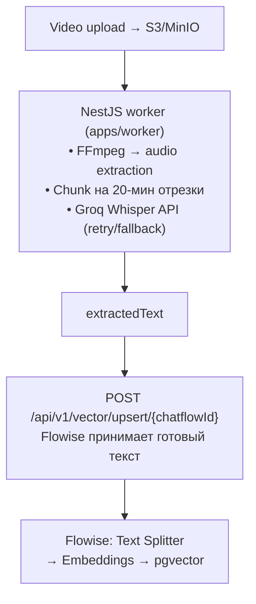
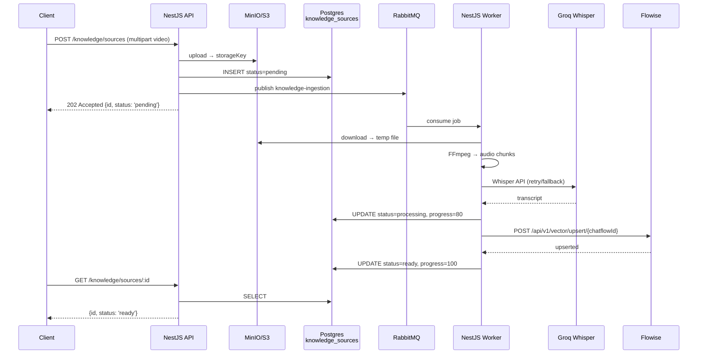
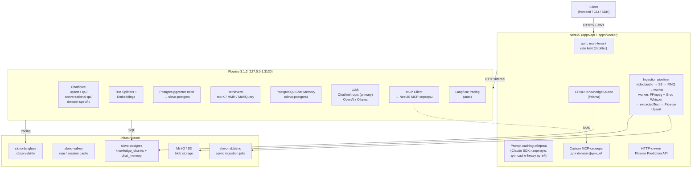

# Flowise 3.1.2 в slovo — что умеет, чего нет, как компенсировать

> **Дата:** 2026-04-22 (вечер)
> **Статус (2026-04-30):** ⚠️ **частично историческая reference**. Содержит общий обзор Flowise 3.x фич (LLM/embeddings/chunking/retrieval/memory) — это актуально. Конкретные операционные вопросы (S3 endpoint gotchas, prompt caching status, `promptValues` workaround, как создать chatflow программно) **переехали** в:
>   - **ADR-008** (`docs/architecture/decisions/008-flowise-mcp.md`) — обоснование MCP-арсенала + extract план.
>   - **CLAUDE.md** секция «MCP-арсенал для работы с Flowise» — главное правило «через MCP, не curl».
>   - **`apps/mcp-flowise/README.md`** — примеры по каждой группе из 66 tools.
>   - **`docs/experiments/vision-catalog/2026-04-29-document-store-vector-pipeline.md`** — lab journal с reproducible recipe всех ритуалов.
>   - **Memory entries** `feedback_flowise_full_api_coverage`, `project_flowise_minio_s3_endpoint`, `feedback_read_flowise_source`, `project_mcp_flowise_arsenal`.
>
> Этот документ держим как **источник «концептуального landscape»** Flowise (что вообще можно и нельзя делать), но за конкретикой — в источники выше.
>
> **Основано на:** research официальной доки Flowise 3.x + обсуждение с разработчиком.
> **Замечание:** старая версия этого документа была по тьюториалу Flowise 2.x (`test-marpla/docs/tutorial/`). В 3.x многое изменилось.
> **Связанные:** `docs/architecture/decisions/006-knowledge-base-as-first-feature.md`, `docs/architecture/decisions/008-flowise-mcp.md`, `docs/features/knowledge-base.md`.

---

## TL;DR

**Flowise 3.1.2 — production LLM-orchestration слой для slovo.** Покрывает ~70% AI-pipeline: LLM (Claude, OpenAI, Ollama), embeddings + pgvector, chunking, retrieval, Memory 10 типов, MCP client с готовыми серверами, Langfuse native.

**НЕ покрывает 3 критичных для slovo вещи:** транскрибация видео/аудио, prompt caching Claude, async long-running jobs. Всё это **инжектим из NestJS** через стандартные интеграционные точки Flowise.

---

## ✅ Что Flowise 3.1.2 умеет «из коробки»

### Ingestion (text, PDF, URL, и т.п.)

| Источник | Как |
|---|---|
| **Plain text** | Text Loader node + Vector Upsert API |
| **PDF** | PDF Loader node (автоматически парсит) |
| **CSV / Excel** | CSV/Excel Loader node |
| **URL (web article)** | Cheerio/Playwright Web Scraper loader |
| **GitHub repo** | GitHub Loader node |
| **Notion, Confluence, Jira** | Отдельные ноды есть |
| **Vector Upsert API** | `POST /api/v1/vector/upsert/{chatflowId}` — multipart файл → Flowise сам chunk + embed + save в pgvector за один вызов |

### Chunking (Text Splitters)

- Recursive Character (по умолчанию, разбивает `\n\n` → `\n` → `. ` → ` `)
- Character Text Splitter
- Token Text Splitter
- Markdown Text Splitter
- Code Text Splitter
- HTML Text Splitter

**Gotcha:** chunk size по умолчанию в **символах**, не токенах (1 токен ≈ 4 символа).

### Embeddings

- OpenAI (`text-embedding-3-small` / `-3-large` / `ada-002`)
- Cohere (`embed-multilingual-v3.0` — хорошо с русским)
- HuggingFace (self-hosted / Inference API)
- Ollama (локальные модели)
- Google / VoyageAI / Mistral / Jina

### Vector Stores

- **Postgres/pgvector** — нода работает с **существующей** схемой (НЕ создаёт таблицы сама)
- Pinecone, Qdrant, Chroma, Faiss, Weaviate, Milvus, Redis Vector
- In-memory (для прототипов)

### LLM providers

- **Anthropic Claude** — `ChatAnthropic` нода (first-class)
- OpenAI (`gpt-4o`, `o1`, и т.д.)
- Google Gemini / VertexAI
- Groq (те же модели + Whisper только через API, но **без Whisper-ноды**)
- Ollama (локальные)
- Mistral, Cohere, TogetherAI, Perplexity, и ещё 10+

### Memory (10 типов)

| Тип | Хранение | Persistence |
|---|---|---|
| Buffer Memory | RAM | ❌ теряется при рестарте |
| Window Memory (`k` последних) | RAM | ❌ |
| Summary Memory (LLM суммирует) | RAM | ❌ |
| Entity Memory | RAM | ❌ |
| **Redis-Backed Chat Memory** | Redis | ✅ TTL |
| **PostgreSQL Chat Memory** | Postgres | ✅ постоянно |
| MongoDB Atlas Memory | MongoDB | ✅ |
| Zep Memory | Zep (внешний) | ✅ |
| OpenAI Assistant Memory | OpenAI Threads API | ✅ |
| Conversation Summary Memory | RAM + optional external | ⚠️ |

Изоляция по `sessionId` (передаётся через `overrideConfig.sessionId`).

### Retrieval

- top-K similarity search через любой vector store
- **Conversational Retrieval QA Chain** — готовая нода: query reformulation через LLM → retrieval → ответ с memory
- MultiQuery Retriever (упоминается)
- Contextual Compression Retriever
- Parent Document Retriever

### LLM Response Cache (6 типов)

Кешируют **полный ответ LLM по hash от input**. Если инпут совпал — возвращают закешированный output без обращения к провайдеру. Подключаются к input-порту `Cache` у LLM-ноды (например ChatAnthropic, ChatOpenAI).

| Тип | Хранение | Persistence | Use case |
|---|---|---|---|
| **InMemory Cache** | RAM Flowise-процесса | ❌ теряется при рестарте | Быстрые dev-итерации |
| **Redis Cache** | Redis (self-hosted) | ✅ TTL | Prod, single-region |
| **Upstash Redis Cache** | Upstash (managed) | ✅ | Prod, serverless-friendly |
| **Momento Cache** | Momento (managed serverless cache) | ✅ | Prod, globally distributed |
| **InMemory Embedding Cache** | RAM, для embedding результатов | ❌ | Dedupe embed-вызовов в рамках одной сессии |
| **Redis Embedding Cache** | Redis, для embedding результатов | ✅ | Prod dedupe эмбеддингов |

**Важно:** это **не** Claude `cache_control`. Это кеш **ответов** на уровне Flowise. Экономия 100% токенов **только** при идентичных input'ах (тот же system + тот же user message). Если поменялся хоть один символ в user части — кеш не сработает.

**Useful для:**
- **FAQ-сценарии** — одни и те же вопросы от разных юзеров (при условии что мы не нормализуем sessionId в hash-ключ)
- **Идемпотентные трансформации** (category classification, NER, fixed-template summarization)
- **Dedupe embedding вызовов** — если тот же текст приходит дважды, не платим OpenAI второй раз

**Не useful для:**
- RAG Q&A — разные вопросы, даже по одному источнику, дают разный hash
- Conversational chat — история в input меняется каждое сообщение

### LLM: Claude `cache_control` (Anthropic prompt caching)

**Проверено в эксперименте A (2026-04-23) — тремя путями:**

1. **UI Flowise 3.1.2** → ChatAnthropic → Additional Parameters: только Streaming, Extended Thinking, Max Tokens, Top P, Top K. Поля для `cache_control` нет.
2. **Исходник `packages/components/nodes/chatmodels/ChatAnthropic/ChatAnthropic.ts`:**
   ```typescript
   const obj: Partial<AnthropicInput> & BaseLLMParams = {
       temperature, modelName, anthropicApiKey,
       streaming, maxTokens, topP, topK, cache
   }
   ```
   Строго типизированный объект без `additionalConfig` / `modelKwargs` / `extraParams` / custom headers. Workaround на уровне ноды нет.
3. **GitHub Issues — feature requests открыты и висят:**
   - [#4289](https://github.com/FlowiseAI/Flowise/issues/4289) *«Support for Anthropic Prompt Caching»* — open с 2025-04-20, без ответа maintainer'ов
   - [#4634](https://github.com/FlowiseAI/Flowise/issues/4634) *«Native Prompt Caching & Token Optimization»* — open с 2026-03-18, пользователи в комментариях пишут про 40% лишних токенов

**Как инжектить (решение A3):** для cache-heavy путей (длинный system prompt, большой retrieved context, повторяющиеся tool definitions) — тонкий сервис в NestJS с `@anthropic-ai/sdk` напрямую + `cache_control: { type: 'ephemeral' }`. Для остального — через Flowise как обычно.

**Watch list:** подписаться на #4289 и #4634. Если Flowise когда-то реализует — переезжаем на штатный путь.

### Speech-to-Text в embedded-чате

Chatflow Configuration → **Speech To Text** — транскрибация голосовых сообщений **внутри** Flowise-чата в real-time. Провайдеры:

- **OpenAI Whisper** — через OpenAI API
- **Groq Whisper** — быстрый и дешёвый (у нас уже используется в батче, ключ будет готов)
- **Assembly AI**
- **LocalAI STT** — self-hosted
- **Azure Cognitive Services**

Применение для slovo: в Phase 3 Q&A-чат пользователь сможет **говорить голосом**, не печатать. Ноль кода — галочка в Chatflow Config. **Но работает только с short voice-message, не с upload'ом большого видео** — для batch-ingestion нужен наш worker, см. раздел «Batch-транскрибация» ниже.

### Text-to-Speech

Тоже в Chatflow Configuration — озвучка ответов LLM. Провайдеры: OpenAI TTS, ElevenLabs, Azure TTS, LocalAI. Опционально для Phase 3 если захочется voice-ответы.

### LLM: Claude Extended Thinking (reasoning)

В `ChatAnthropic` ноде есть toggle **Extended Thinking** — включает chain-of-thought reasoning mode для Claude Sonnet 3.7+ / Claude 4. Модель «думает» перед ответом, это даёт лучшее качество на сложных задачах (анализ, multi-step логика).

**Полезно для:** water-analysis (лабораторные показатели → рекомендации), SEO-генерация с жёсткими правилами, structured extraction из транскриптов.

### MCP — Model Context Protocol

**Flowise — хороший MCP-клиент.** Готовые интеграции:

- **Custom MCP** — любой MCP-сервер по stdio / HTTP / SSE
- **PostgreSQL MCP** — SELECT к БД как tool
- **GitHub MCP** — работа с репозиториями
- **Slack MCP** — отправка сообщений
- **Browserless MCP** (добавлен в 3.1.2) — headless браузер
- **Brave Search MCP** — веб-поиск
- **Pipedream MCP** (добавлен в 3.1.2) — 2000+ готовых интеграций
- **Supergateway MCP** — stdio ↔ HTTP/SSE прокси

### Prediction API и streaming

- `POST /api/v1/prediction/{chatflowId}` — основной endpoint
- Body: `question`, `streaming`, `overrideConfig`, `history`, `uploads`
- **Real SSE streaming** в 3.x (в 2.x был псевдо) — токены идут по мере генерации
- Structured Output Parser автоматически отключает streaming (нельзя валидировать partial JSON)

### Observability — Langfuse native

- Включается в UI: Chatflow settings → Analyse Chatflow → Langfuse
- Auto-tracing: LLM-вызовы, retrievals, tool use, timings, cost
- Поддерживаются также LunaryAI, Langsmith, LangWatch, Arize, Phoenix, Opik

### Admin / deployment

- Workspaces (разделение chatflow по командам)
- Per-chatflow API keys
- Export/import chatflow как JSON — можно хранить в git
- SQLite (dev) / MySQL / PostgreSQL (prod) для persistence самого Flowise

---

## ❌ Чего Flowise НЕ умеет (нужно инжектить)

### 1. Batch-транскрибация больших видео/аудио — **нет, критично**

**Важное уточнение (2026-04-23):** в Flowise 3.1.2 **есть** встроенный **Speech-to-Text** в Chatflow Configuration с провайдерами **OpenAI Whisper, Groq Whisper, Assembly AI, LocalAI STT, Azure Cognitive Services**. Но это **live voice input для embedded-чата**, не batch-ingestion.

| Сценарий | Подходит Flowise Speech-to-Text? |
|---|---|
| Юзер нажимает микрофон в Flowise-чате → записывает короткий voice-question 10-30 секунд → Flowise транскрибирует on-the-fly → LLM отвечает | ✅ Да, встроено одной галочкой в Chatflow Config → Speech To Text |
| Юзер загружает 2-часовой вебинар → нужно фоново транскрибировать, вернуть прогресс, сохранить в knowledge base | ❌ Нет — sync HTTP-запрос, timeout ~30s, весь аудио-буфер в RAM Flowise-процесса, нет retry/fallback, нет прогресса для клиента |

**Для slovo:**
- **Live voice Q&A по knowledge base** (Phase 3) → используем встроенный Flowise Speech-to-Text с Groq Whisper. Ноль кода.
- **Batch ingestion видео/аудио для knowledge base** (Phase 2) → обязателен собственный NestJS worker + RMQ. Без этого большие файлы ляжут.

**Как инжектить batch-pipeline:** NestJS worker делает транскрибацию (retry/fallback, chunking, прогресс), Flowise получает уже готовый `extractedText` через Vector Upsert API.



Планируемые пути (knowledge-base Phase 2+, **не реализовано на 2026-05-02**): `libs/ingest/adapters/video/` и `libs/ingest/transcription/groq-whisper.service.ts`. Phase 1 закрыта только text-адаптером (`apps/api/src/modules/knowledge/`), video/audio адаптеры отложены до триггера потребителем — см. ADR-006 амендмент 2026-05-02.

### 2. Prompt caching для Claude — **не документировано**

**Критично для slovo экономически.** Claude `cache_control: { type: 'ephemeral' }` даёт 90% скидку на повторяющемся system prompt. В UI Flowise 3.x в `ChatAnthropic` ноде этого не видно.

**Сценарии ответа после эксперимента A:**

- **(A1) Есть скрытое поле в Additional Parameters** — используем штатно.
- **(A2) Нет — можно через Custom JS Function node** с прямым вызовом `@anthropic-ai/sdk` и ручной настройкой cache_control.
- **(A3) Совсем нет —** для caching-критичных путей (system prompt >1024 токенов) пишем отдельный NestJS-сервис через Claude SDK напрямую. Гибрид: Flowise для обычных chatflow, NestJS для cache-heavy.

### 3. Long-running async jobs — нет worker-примитивов

Flowise работает **синхронно через Prediction API**. Таймаут по умолчанию ~30 сек. Транскрибация 2-часового видео никак не впишется.

**Как инжектить:** RabbitMQ worker в NestJS (`apps/worker/`). Процесс:



### 4. Multi-tenant data isolation на уровне vector store — не автомат

Flowise pgvector-retriever **не фильтрует автоматически по пользователю**. Chunks всех юзеров лежат в одной таблице.

**Как инжектить:** добавляем `user_id` в `metadata` каждого chunk при upsert, в chatflow retriever ставим metadata filter `{ user_id: {{vars.user_id}} }`. `user_id` передаём через `overrideConfig.vars`.

### 5. Rate limiting на API-уровне — минимальный

Flowise не даёт гранулярного rate-limit (per-user / per-endpoint).

**Как инжектить:** `@nestjs/throttler` в слое NestJS. Клиент **не** ходит в Flowise напрямую, только через наш API.

### 6. User management / JWT auth — нет

Flowise workspaces и API keys — это для admin-уровня, не для end-user auth.

**Как инжектить:** NestJS guards + JWT. Клиент → JWT в header → NestJS auth → `userId` в request → формирует `sessionId = userId` для Flowise.

### 7. Кастомная pre-processing логика ingestion — ограниченная

Flowise Document Loaders generic: валидация контента, normalization, PII-стрипинг — в коробке нет.

**Как инжектить:** NestJS pre-processing между S3 и Flowise upsert. Пример: расшифровали видео → прогнали через регэксп-редактор PII → отправили во Flowise.

---

## Доступ из Docker к Anthropic/OpenAI через HTTP-прокси (RU-окружение)

### Проблема

Docker Desktop на Windows использует WSL2 со своим сетевым стеком, **системный VPN/прокси Windows не захватывает outbound-трафик контейнеров**. Anthropic/OpenAI из РФ-IP возвращают `403 Forbidden`. Нужно настроить proxy **внутри контейнера**.

### Осложнение: Node.js fetch (undici) не читает `HTTP_PROXY`

Переменные `HTTP_PROXY`/`HTTPS_PROXY` читает GNU wget, curl, Python requests — но **не Node.js fetch через undici**. LangChain / `@anthropic-ai/sdk` в Flowise используют именно undici. Просто прокинуть env-vars недостаточно.

### Решение — monkey-patch через preload

`docker/flowise-proxy-bootstrap.cjs` на старте Node.js настраивает глобальный `undici.setGlobalDispatcher(new ProxyAgent(HTTPS_PROXY))`. Подключается через `NODE_OPTIONS="--require /scripts/flowise-proxy-bootstrap.cjs"`.

```yaml
# docker-compose.infra.yml
flowise:
    environment:
        HTTP_PROXY: ${HOST_HTTP_PROXY:-http://host.docker.internal:10810}
        HTTPS_PROXY: ${HOST_HTTP_PROXY:-http://host.docker.internal:10810}
        NO_PROXY: localhost,127.0.0.1,slovo-postgres,slovo-valkey,...
        NODE_OPTIONS: --require /scripts/flowise-proxy-bootstrap.cjs
    extra_hosts:
        - "host.docker.internal:host-gateway"
    volumes:
        - ./docker/flowise-proxy-bootstrap.cjs:/scripts/flowise-proxy-bootstrap.cjs:ro
```

**Предусловие:** на хосте должен крутиться HTTP-прокси (tinyproxy/privoxy/winhttpproxy — конвертирует SOCKS/WireGuard → HTTP CONNECT). Пример: `tinyproxy` на `127.0.0.1:10810`, upstream — SSH-туннель до VPS в Европе.

### Проверка что работает

```bash
# Должен вернуть IP-прокси (Frankfurt), не IP РФ
docker exec slovo-flowise node -e "fetch('https://api.ipify.org').then(r=>r.text()).then(console.log)"
```

Для prod-окружения (когда сервер сам в EU/US datacenter) — proxy не нужен, убираем эти env-vars и volume-mount.

---

## Эксперименты для финализации ADR-006

### ✅ A. `cache_control` в ChatAnthropic — ЗАКРЫТ (2026-04-23)

**Проверено в UI Flowise 3.1.2:** Additional Parameters ноды ChatAnthropic содержат только Streaming, Extended Thinking, Max Tokens, Top P, Top K. Поля `cache_control` нет.

**Решение: A3 — гибрид.** Для cache-heavy путей (длинный system prompt или большой retrieved context, повторяющийся между запросами) — NestJS wrapper через `@anthropic-ai/sdk` с `cache_control: { type: 'ephemeral' }`. Для прочих LLM-вызовов — Flowise ChatAnthropic как обычно.

**Бонус находка:** Flowise LLM Response Cache (6 типов) через input-порт `Cache` — полезен для FAQ-паттернов и dedupe эмбеддингов. Подробности в разделе «LLM Response Cache» выше.

### ✅ B. `overrideConfig.promptValues` — ДОКОПАЛИСЬ (2026-04-23)

Test 2 c двумя переменными (`{language}` + `{input}`) закрыл вопрос. `promptValues` в LLM Chain **работает**, просто механика нюансная.

**Финальный тест (прошёл ✅):**

Template: `Расскажи на {language} языке коротко про: {input}`

```bash
curl -X POST /api/v1/prediction/{id} \
  -H "Content-Type: application/json; charset=utf-8" \
  --data-binary @utf8-test.json
```

```json
{
  "question": "российских кошках",
  "overrideConfig": { "promptValues": { "language": "украинском" } }
}
```

**Ответ:** *«# Російські кішки — Російська блакитна — це одна з найвідоміших порід з Росії...»*
→ **украинский язык + русские коты** = работает как задумано.

### Механика по исходнику (`packages/components/nodes/chains/LLMChain/LLMChain.ts`)

```typescript
const options = {
    ...promptValues,           // API override + partial vars (мёрджатся)
    [lastValue]: input         // `question` API → ПОСЛЕДНЯЯ переменная шаблона
}
```

**Правила:**

1. **Последняя переменная шаблона** автоматически получает значение из `question` API через `[lastValue]: input`. Это жёсткий auto-map, `promptValues` его **не перебивает**.
2. **Все остальные переменные** (`{language}`, `{tenant}`, `{style}` и т.д.) — берутся из `overrideConfig.promptValues`. **Работает корректно** после включения Security → Override Configuration → `promptValues` toggle + Save.
3. **Partial vars в UI ноды (Format Prompt Values)** имеют приоритет выше API. Для чистого override — очистить partial vars в ноде.

### Почему сначала казалось что «не работает»

Три наложившихся источника ошибок в наших тестах:

1. **Partial vars `{topic: "Мальта"}` в UI ноды** → API override не подхватывался, подменялся UI-значением.
2. **После очистки** → `{topic}` стал **единственной и последней** переменной → Flowise подставил `question: "ignored"` в `{topic}` через auto-map → Claude получил "Расскажи коротко про: ignored" и галлюцинировал на неполном контексте (Мальта/Керамика/Вышгород).
3. **UTF-8 в curl Git Bash** ломался — русский текст `"российских кошках"` в теле запроса превращался в `������` → Claude интерпретировал кракозябры как «запрос про русское» → отвечал про русскую литературу.

Все три проблемы **не на стороне Flowise**. Flowise работает как надо, просто механика `[lastValue]: input` для LLM Chain не очевидна из UI/docs.

### Работает везде

| Chain-тип | `overrideConfig.promptValues` | Примечание |
|---|---|---|
| **LLM Chain** | ✅ Работает (для non-last переменных) | Наш тест сегодня |
| **Conversational Retrieval QA Chain** | ✅ Работает | Основной для slovo |
| **Tool Agent** | ✅ Работает | Проверено в `ToolAgent.ts` + issue #2991 |
| **Conversation Chain** | ✅ Работает | |
| **Worker** (multi-agent) | ✅ Работает | |

### Практическая матрица для slovo

| Use case | Как делаем |
|---|---|
| **Одна user-var** (Q&A вопрос) | Template `{input}` → `question` API → auto-map работает |
| **User-var + system-var** (язык, tenant, persona) | Template `{language}...{input}` → `question` для input (auto), `overrideConfig.promptValues.language` для остальных |
| **Много system-vars + user-var** | Последняя = `{input}` ← `question`, остальные через `promptValues` |
| **Полный override template** | Security → Template toggle → `overrideConfig.template` |

### Порядок приоритета (от низшего к высшему)

1. **UI partial vars** (Prompt Template → Format Prompt Values) — default для переменной
2. **API `overrideConfig.promptValues`** — **перебивает** UI partial vars (при включённом toggle в Security)
3. **`question` API** → **последняя переменная шаблона** — жёсткий auto-map, ни UI ни API на это не влияют

**Таблица из 5 тестов (2026-04-23, Test 3 Parts A+B):**

| Template | UI partial | API override | `question` | Результат |
|---|---|---|---|---|
| `про: {input}` | — | — | `"russian cats"` | `{input}` ← `question`, ответ про котов ✅ |
| `про: {topic}` | — | `{input: x}` | `ignored` | `{topic}` ← `question` (auto), promptValues.input нигде — галлюцинация ❌ |
| `на {language}... про: {input}` | — | `{language: укр}` | `рус коты` | Украинский про рус котов ✅ |
| `на {language}... про: {input}` | `{language: англ}` | — | `рус коты` | Английский про рус котов ✅ |
| `на {language}... про: {input}` | `{language: англ}` | `{language: укр}` | `рус коты` | **Украинский** (API перебил UI) ✅ |

### Production gotchas

1. **UI partial vars** — для безопасных дефолтов (формат ответа, style, лимиты), которые обычно не меняются. API override перебивает их корректно.
2. **UTF-8 в API-клиенте** — `Content-Type: application/json; charset=utf-8` + передавать body как бинарник (`--data-binary @file` в curl, `Buffer.from(str, 'utf-8')` в Node). Без этого русский / эмодзи ломаются в кракозябры.
3. **Security → Override Configuration toggle для `promptValues`** включать + Save. Без этого API-override игнорируется.
4. **Последняя переменная шаблона резервируется для `question`** — проектируй шаблоны так, чтобы user-input был **последним** плейсхолдером (стандартно `{input}`).

### Production паттерн для slovo

```typescript
// NestJS AIGeneratorService.generate(dto)
await fetch(`${flowiseUrl}/api/v1/prediction/${chatflowId}`, {
    method: 'POST',
    headers: { 'Content-Type': 'application/json; charset=utf-8' },
    body: Buffer.from(JSON.stringify({
        question: dto.userQuery,           // → последняя переменная шаблона автоматом
        overrideConfig: {
            sessionId: dto.userId,         // изоляция Memory по пользователю
            promptValues: {
                language: dto.language,    // → {language} в system prompt
                tenant: dto.tenantId,      // → {tenant} в system prompt
                persona: dto.personaName,  // → {persona} в system prompt
                // userQuery НЕ включаем сюда — оно уже в `question`
            },
        },
    }), 'utf-8'),
});
```

Template ноды для такого запроса:

```
Ты — AI-ассистент {persona} для клиента {tenant}.
Отвечай на {language} языке.
...system instructions...

Вопрос пользователя: {input}
```

**`{input}` — обязательно последний**, остальные плейсхолдеры выше. Тогда `question` подставится в `{input}`, а остальные — из `promptValues`.

**Вывод:** `overrideConfig.promptValues` в Flowise 3.x — рабочий механизм для всех chain-нод (LLM Chain, Conversational Retrieval QA, Tool Agent, Worker, Conversation Chain). Для production slovo это основной путь dynamic parameter injection. Fallback через склейку в `question` (как в test-marpla) остаётся валидным для простых случаев с одной переменной.

### ✅ C. Postgres vector store — ЗАКРЫТ (2026-04-23)

Изучили исходник `packages/components/nodes/vectorstores/Postgres/driver/TypeORM.ts`.

**Flowise Postgres vector store — схема, которую он создаёт:**

```sql
CREATE EXTENSION IF NOT EXISTS vector;
CREATE TABLE IF NOT EXISTS ${tablename} (
    "id" uuid NOT NULL DEFAULT gen_random_uuid() PRIMARY KEY,
    "pageContent" text,
    metadata jsonb,
    embedding vector
);
```

- Колонки: `id` (UUID, auto-gen), `pageContent` (text, имя настраивается через `contentColumnName`), `metadata` (jsonb), `embedding` (vector без указания размерности)
- Имя таблицы — настраивается через поле **Table Name** в ноде или `overrideConfig`
- `CREATE TABLE IF NOT EXISTS` — Flowise **создаёт таблицу сам**, если её нет. Если есть с другой схемой — будет ошибка при INSERT.
- **Нет upsert**: используется `documentRepository.save()` без `ON CONFLICT` → дубликаты при повторном ingest одного источника. Решение — подключить **Record Manager** (input-порт ноды) для дедупликации через hash.
- **Нет HNSW/IVFFlat индекса**: Flowise их не создаёт. При >10K chunks поиск становится медленным — добавляем индекс отдельной миграцией Prisma.

**Retrieval SQL:**

```sql
SELECT *, embedding <=> $1 as "_distance"
FROM ${tablename}
WHERE (metadata @> $2 AND NOT (metadata ? 'FLOWISE_CHATID')) OR metadata @> $4
ORDER BY "_distance" ASC
LIMIT $3;
```

- Оператор `<=>` (cosine distance) — дефолт. Через `distanceStrategy` в UI: `cosine` / `euclidean` / `innerProduct`.
- **pgMetadataFilter** = JSON → `metadata @> $filter`. Для multi-tenant: `{"user_id": "${userId}"}`.
- `LIMIT` = Top K (настраивается в ноде или overrideConfig).

**Библиотека под капотом:** LangChain `@langchain/community/vectorstores/typeorm` (не `/pgvector`), через TypeORM.

### Решение для slovo — две таблицы

Наша Prisma-модель `KnowledgeChunk` с полями `sourceId`/`position`/`createdAt` **несовместима** с Flowise-схемой. Варианты VIEW или переименования колонок — создают больше проблем чем решают.

**Правильный дизайн:**

```
knowledge_sources          ← Prisma-managed
  Domain: id, userId, sourceType (video|text|pdf|...),
          status (pending|processing|ready|failed),
          progress, title, storageKey, metadata,
          createdAt, updatedAt
  Ответственность NestJS:
  - CRUD через apps/api/src/modules/knowledge/
  - Upload → S3 → RMQ → worker (Phase 2)
  - Transcribe через Groq Whisper (Phase 2)
  - После извлечения текста → POST /api/v1/vector/upsert/{chatflowId}

knowledge_chunks           ← Flowise-managed (схема TypeORM driver)
  Колонки: id, pageContent, metadata (jsonb), embedding (vector)
  metadata включает:
    - source_id  ← связь с knowledge_sources (app-уровень)
    - user_id    ← для pgMetadataFilter (multi-tenant)
    - position   ← порядковый номер chunk внутри source
    - chunk_metadata (опционально) — timestamps для видео, страницы для PDF
  HNSW индекс: добавляем Prisma-миграцией --create-only
```

**Multi-tenant isolation:**
```json
// В Postgres vector retriever → pgMetadataFilter
{ "user_id": "${req.user.id}" }
```
Работает на уровне SQL `WHERE metadata @> '{"user_id":"..."}'::jsonb` — пользователь видит только свои chunks.

**Преимущества такой архитектуры:**

1. Чистое разделение ownership — Prisma не трогает vector-таблицу, Flowise не знает о `knowledge_sources`.
2. `POST /api/v1/vector/upsert/{chatflowId}` работает нативно — NestJS отдаёт `extractedText` + metadata.source_id + metadata.user_id, Flowise chunk + embed + save.
3. Prisma forward-only миграции продолжают работать.
4. Multi-tenant через стандартный механизм Flowise.

**Cleanup при удалении source:**
NestJS хук в `knowledge.service.ts`:
```typescript
async deleteSource(sourceId: string) {
    await this.prisma.knowledgeSource.delete({ where: { id: sourceId } });
    // Flowise API: DELETE chunks where metadata.source_id = sourceId
    await this.flowiseClient.deleteVectors(chatflowId, {
        metadata: { source_id: sourceId },
    });
}
```

**HNSW индекс — ручная миграция Prisma** (через `prisma migrate dev --create-only`):
```sql
-- prisma/migrations/YYYYMMDD_add_hnsw_index/migration.sql
CREATE INDEX IF NOT EXISTS idx_knowledge_chunks_embedding_hnsw
ON knowledge_chunks
USING hnsw (embedding vector_cosine_ops);

-- опционально — index на metadata для pgMetadataFilter
CREATE INDEX IF NOT EXISTS idx_knowledge_chunks_metadata
ON knowledge_chunks
USING gin (metadata);
```

### ✅ D. Phase 0 vision-catalog-search — ЗАКРЫТ (2026-04-29)

Smoke-test полного pipeline на 3 sample items из CRM-snapshot:

```
Json File loader → Recursive Splitter (chunk=1000, overlap=200)
                                    ↓
OpenAI Embeddings (text-embedding-3-small, 1536-dim) → Postgres (catalog_chunks)
                                    ↓
                  Conversational Retrieval QA Chain
                          ↑                  ↑
                  ChatAnthropic          Buffer Memory
                  (Claude Haiku 4.5,
                   temp=0)
```

**Результат:** 4 чистых чанка (один длинный item разрезан на 2 chunk'а с overlap), retrieval запросом `"какой смеситель есть для кухни"` → возвращает все 3 товара ранжированных по cosine similarity. Cost ~$0.0001 на query (Haiku passthrough).

#### Json File loader — каверзы которые выяснили

- **`Pointers Extraction` СКРЫТ когда `Separate by JSON Object: ON`** — если изначально toggle был ON, поле hidden, любые введённые значения **не сохраняются**. После toggle OFF поле видно, но пустое — нужно перезаполнить. Источник `Json.ts:79`:
  ```ts
  hide: { separateByObject: true }
  ```
- **Pointers Extraction = пусто → loader extract'ит ВСЕ strings** из объекта (UUID, имена, полевые значения) — каждое строковое поле становится отдельным document'ом. С нашим JSON `[{externalId, externalType, name, contentForEmbedding}]` без pointers получили 13 docs вместо 3-6 (всё кроме contentForEmbedding — мусор для embedding).
- **`Additional Metadata` требует leading slash** — `/externalId` (jsonpointer RFC 6901), не `{externalId}`. Без слэша значение **молча игнорируется** (`Json.ts:181`):
  ```ts
  const values = Object.values(this.metadataMapping).filter(
      (value) => typeof value === 'string' && value.startsWith('/')
  )
  ```
- **JSON-редактор UI добавляет случайные пробелы в ключи** — встретили `" externalId"` (с пробелом в начале) при первом добавлении. В выходных метаданных получим тот же ключ с пробелом. Удалить → ввести заново внимательно.
- **Файл хранится как `FILE-STORAGE::["filename"]` reference**, не inline base64. В `Export Chatflow` поле `jsonFile` показывается пустым, но физически файл лежит в `/root/.flowise/storage/<orgId>/<chatflowId>/`. Не паника — `node -e 'console.log(...)' < export.json` покажет `false`, а на самом деле всё на месте.

#### Production-flow в slovo не использует UI loader

slovo `apps/worker` будет POST'ить документы через `/api/v1/vector/upsert/<id>` с `overrideConfig` — никаких UI loader'ов не нужно. Json File нода на канвасе chatflow остаётся только для ручного debug в UI.

### ✅ E. Open question #2 (retriever-only без LLM) — ОТВЕТ ЕСТЬ через Document Store API (2026-04-29)

**Изначальный вопрос:** возможно ли в Flowise 3.1.2 получить retriever output БЕЗ LLM passthrough?

#### Через `/api/v1/prediction/<chatflowId>` — НЕТ

В `flowise/dist/utils/index.js:283` есть строгая валидация ending node:

```js
if (endingNodeData.category !== 'Chains' &&
    endingNodeData.category !== 'Agents' &&
    endingNodeData.category !== 'Engine' &&
    endingNodeData.category !== 'Multi Agents' &&
    endingNodeData.category !== 'Sequential Agents') {
    throw new InternalFlowiseError(500, 'Ending node must be either a Chain or Agent or Engine')
}
```

Vector Store не входит в allowlist. **Issue [#3610](https://github.com/FlowiseAI/Flowise/issues/3610)** запрашивает фичу «Return source document without LLM» — **закрыт как `not planned`**.

#### Через Document Store API — ДА, нативный endpoint без LLM

```
POST /api/v1/document-store/vectorstore/query
Authorization: Bearer <FLOWISE_API_KEY>
Content-Type: application/json
{ "storeId": "<uuid>", "query": "какой смеситель есть" }

Response:
{
  "timeTaken": 145,
  "docs": [
    { "pageContent": "Название: ...", "metadata": { "externalId": "..." }, "id": "..." }
  ]
}
```

Реализация в `services/documentstore/index.js:1170` (`queryVectorStore`) — **ровно retriever.invoke без LLM**:

```js
const retriever = await vectorStoreObj.init(...)        // тот же Postgres node
const results = await retriever.invoke(data.query)       // pgvector cosine search
return { timeTaken, docs: results.map(r => ({ pageContent, metadata, id })) }
```

Flowise использует тот же `nodesPool.componentNodes` и для Chatflow и для Document Store, поэтому **Document Store поддерживает все те же** vector stores и embedders что Chatflow (включая Postgres + наш `catalog_chunks` table).

#### Сравнение для search

| Метрика | Через Chatflow + Haiku | Через Document Store |
|---|---|---|
| Cost / search | ~$0.0001 | ~$0.0000004 (только query embedding) |
| Latency | ~1.5s (Haiku completion) | ~150ms (одна embedding + SQL) |
| Hallucination в text | возможна | НЕТ — text не возвращается |
| LLM calls | 1 | 0 |
| Месячный cost при 100/день | $0.30 | ~$0 |

#### Решение для slovo

Каталог переезжает на Document Store. В PR7 `slovo /catalog/search/text`:
- slovo вызывает `POST /document-store/vectorstore/query` напрямую
- парсит `docs[]`, делает hybrid re-rank (rang_for_app + category boost) + enrichment через Prisma
- **никакого Haiku passthrough, никакого Chain'а на пути search**

Chatflow остаётся для:
- `vision-catalog-describer-v1` (image → JSON description) — нужен Chain ending для prediction API
- ручного UI-debug каталога при необходимости

### ✅ F. Open question #1 (langchain_pg_embedding table name) — ЗАКРЫТ (2026-04-29)

В **knowledge-base** Flowise создаёт таблицу с именем `langchain_pg_embedding` (langchain дефолт). В **catalog-search** при тесте — создаётся таблица **с именем из `Table Name` поля Postgres-ноды**, у нас задано `catalog_chunks`.

Schema автоматически:

```sql
CREATE TABLE catalog_chunks (
    id          uuid PRIMARY KEY DEFAULT gen_random_uuid(),
    "pageContent" text,
    metadata    jsonb,
    embedding   vector
);
```

Без HNSW-индекса — добавить отдельной Prisma миграцией через `--create-only` после первого upsert (по тому же паттерну что для knowledge_chunks в ADR-006).

**Связь с Prisma-managed таблицами** — app-level через `metadata.externalId`, никаких database-level FK (так же как в ADR-006 для knowledge_chunks ↔ knowledge_sources).

---

## Архитектурная картина для slovo



---

## Чек-лист «Flowise vs NestJS» для новой задачи

Когда появляется новая фича, задавай вопросы в этом порядке:

1. **Есть ли LLM-работа?** Chain/agent/tool use / embedding / retrieval → **Flowise chatflow.**
2. **Нужно обработать аудио/видео?** → **NestJS worker** (Groq Whisper через `libs/ingest/` — Phase 2+ knowledge-base, на 2026-05-02 ещё не реализовано).
3. **System prompt длинный (>1024 токенов) и повторяется?** → либо Flowise с cache_control (если тест A покажет что можно), либо NestJS обёртка с Claude SDK.
4. **Нужен real-time прогресс/SSE / long-running?** → NestJS API + worker, Flowise как downstream.
5. **Custom tool/функция домена?** → NestJS expose как MCP-сервер, Flowise-агент использует через MCP client node.
6. **Multi-tenant фильтр данных?** → NestJS передаёт `userId` в `overrideConfig.vars`, Flowise retriever фильтрует по metadata.
7. **Нужно логирование/метрики/cost-tracking?** → Langfuse включается одной галочкой в Flowise UI.

---

## Gotchas и подводные камни

- **Postgres node не создаёт таблиц** — создавайте Prisma-миграцией заранее.
- **HNSW/IVFFlat индекс** на vector-колонке создаётся вручным SQL в миграции через `migrate dev --create-only` (см. ADR-005).
- **Streaming + Structured Output Parser** несовместимы — или/или.
- **Tool Agent требует Memory** — даже если её не используешь, добавь Buffer Memory, иначе ошибка (из тьюториала 2.x, в 3.x скорее всего то же).
- **Chunk size в символах**, не в токенах. 1 токен ≈ 4 символа. 500 токенов ≈ 2000 символов.
- **Vectors от разных embedding-моделей несовместимы** — смена модели = re-embed всех chunks.
- **`overrideConfig.promptValues`** — требует эксперимента B. Если сломан — обходим через форматированный `question`.
- **Export chatflow JSON** — один большой `flowData` JSON, плохо читается в git diff. Храним в `flowise/chatflows/*.json`, но версионирование на уровне комментариев/PR-описаний.

---

## Ссылки

- Release notes Flowise: https://github.com/FlowiseAI/Flowise/releases
- Docs index: https://docs.flowiseai.com/sitemap
- Prediction API: https://docs.flowiseai.com/api-reference/prediction
- Vector Upsert API: https://docs.flowiseai.com/api-reference/vector-upsert
- Memory types: https://docs.flowiseai.com/integrations/langchain/memory
- Postgres vector: https://docs.flowiseai.com/integrations/langchain/vector-stores/postgres
- Analytics/Langfuse: https://docs.flowiseai.com/using-flowise/analytics
- ADR-006 — решение использовать Flowise как runtime
- Тьюториал разработчика (2.x, исторический): `C:\Users\Diamond\Desktop\test-marpla\docs\tutorial\`
