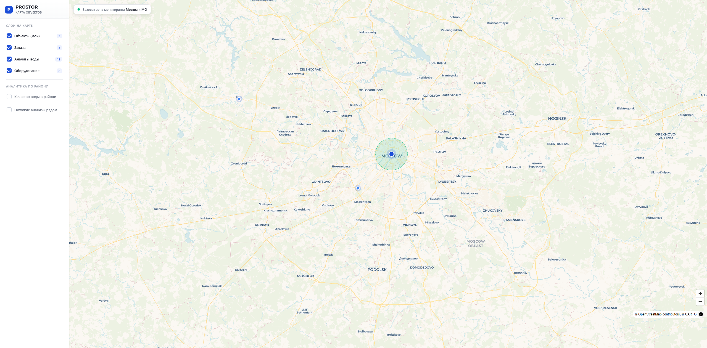
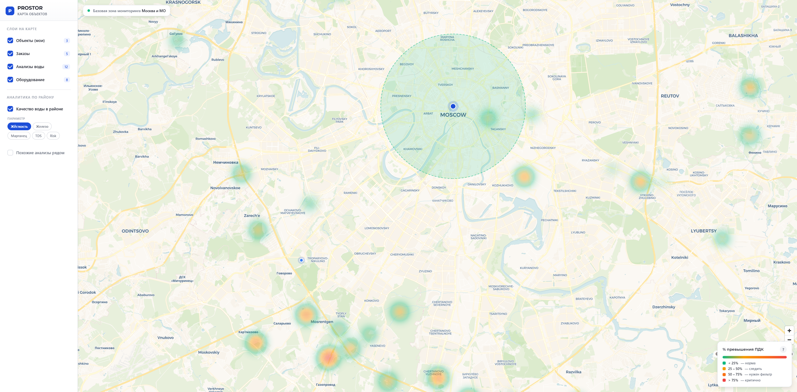
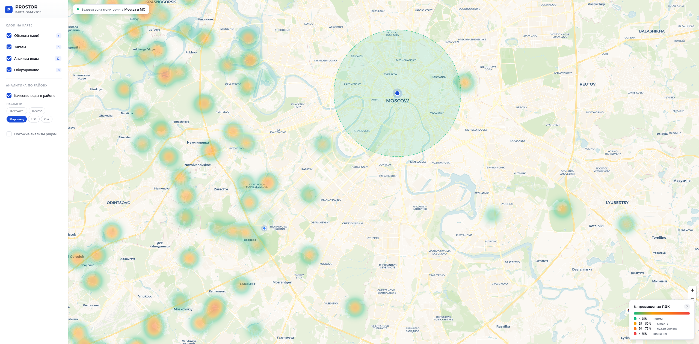
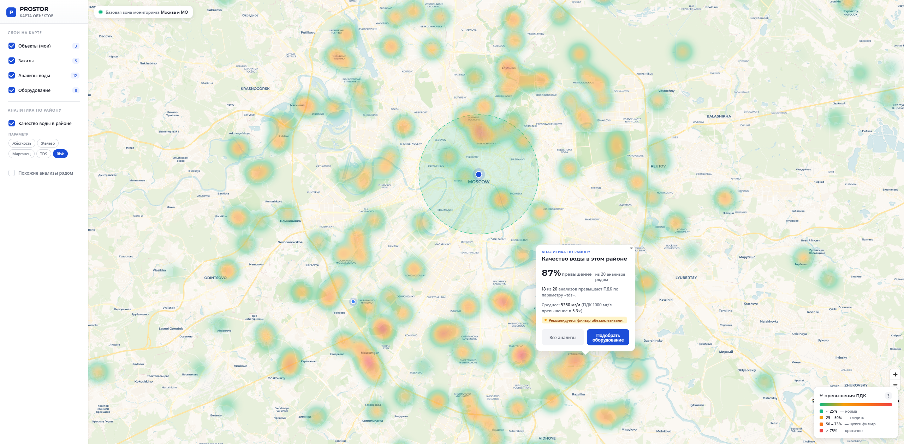
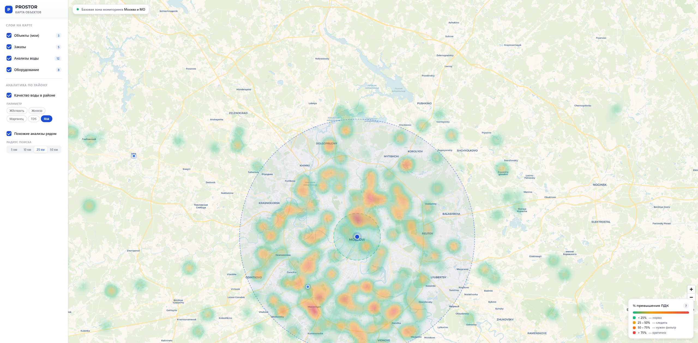

# Аквафор-Pro · Статус разработки и возможности

> **Назначение:** одностраничник для руководителя — где мы сейчас, что готово показать вживую, какие ещё направления реальны на наших данных. Без обязательств по срокам и ценам — это инвентарь возможностей для совместного выбора приоритетов.
> **Дата:** 7 мая 2026.
> **Связи:** [vision-catalog executive summary](vision-catalog-executive-summary.md) · [water-analysis executive summary](water-analysis-executive-summary.md)

---

## TL;DR

За апрель-май закрыты **две основные фичи** в production:

1. **Поиск по каталогу Аквафор-Pro** — клиент даёт фото или описание оборудования, система за секунду находит подходящие позиции из 155 товаров.
2. **Структурированный архив анализов воды** — 15 504 бланка 2020-2026 превращены в датасет с географической привязкой и поиском похожих анализов за ~600 мс.

Дополнительно собран **демо-прототип тепловой карты качества воды по Подмосковью** — на наших реальных данных рабочий, готов к внедрению в клиентский кабинет.

Дальше — 4 направления развития, выбор приоритета за вами.

---

## Где мы сейчас (закрыто и работает в проде)

### ✅ Поиск по каталогу — vision-catalog-search

- 155 товаров Аквафор-Pro обогащены AI-описанием через Claude Vision
- Endpoint `POST /catalog/search` принимает: текстовый запрос / до 5 фото / комбинацию
- Все режимы за один HTTP-вызов, ~1 сек ответ
- Стоимость разработки: ~$0.49 ≈ 39 ₽ на полный цикл experiment + production hardening
- 591 unit-тест, защита от перерасхода (бюджетный лимит + Telegram-алерт)

Детали — [vision-catalog executive summary](vision-catalog-executive-summary.md).

### ✅ Структурированный архив анализов воды — water-analysis

- 15 504 бланка анализов воды Аквафор-Pro 2020-2026 переведены в structured dataset
- 21 параметр в канонических единицах (мг/л, мг-экв/л, ЕМФ), флаги превышения ПДК
- 97% качество нормализации, 93% end-to-end accuracy на ручной сверке
- 97.6% записей с координатами (геокодирование через Ahunter)
- Endpoint `POST /water-analysis/similar` — клиент даёт анализ, получает топ-K максимально похожих бланков из архива
- Стоимость разработки: 23 779 ₽ (Anthropic API + Ahunter + OpenAI embeddings)
- 128 тестов

Детали — [water-analysis executive summary](water-analysis-executive-summary.md).

### 📊 Демо-прототип тепловой карты качества воды

Прототип готов и **рабочий на реальных данных** (МО + Москва). Интерактивная карта с переключением между 5 параметрами и слоем «похожие анализы рядом». Клиент видит **«у соседей в радиусе 10 км — 73% превышений по железу»** — прямая мотивация заказать оборудование.

#### Галерея состояний прототипа

**1. Главный обзорный вид — параметр Железо, область Москва+МО.**

Heatmap по концентрации превышений ПДК железа: зелёный (норма) → жёлтый (внимание) → оранжевый (фильтр нужен) → красный (критично). Слева sidebar с управлением слоями, справа карта с пином клиента.

**2. Параметр «Жёсткость» — другая картина по тем же районам.**

Превышения жёсткости распределены гораздо равномернее — это видно из медианной карты (50%+ превышений по всему МО — данные подтверждают что умягчитель нужен почти везде).

**3. Параметр «Марганец» — локальные горячие точки.**

Марганец в отличие от жёсткости имеет региональные «карманы» — отдельные районы с критически высоким превышением. Это показывает где нужны специализированные фильтры.

**4. Risk-score combined — «общая картина проблем» одним взглядом.**

Нормализованная сумма превышений 5 параметров. Тёмно-красные зоны = «здесь вода требует комплексного решения», зелёные = «единичные параметры в норме».

**5. Поиск похожих анализов в радиусе 25 км — самый эффектный сценарий.**

Активны оба слоя: heatmap по Risk-score + radius-зона 25 км вокруг точки клиента. Внутри радиуса видно концентрацию проблемных кластеров — система покажет «у X из Y соседей был похожий анализ, в N случаях ставили оборудование Z».

#### Полный набор

11 скриншотов по разным состояниям лежат в `docs/management/screenshots/heatmap-prototype/`:

| № | Файл | Что показывает |
|---|---|---|
| 01 | `01-overview-iron-default.png` | Стартовый вид — Железо, обзор МО |
| 02 | `02-zoomed-iron-clusters.png` | Zoom 11 — кластеры Железа |
| 03 | `03-param-hardness.png` | Жёсткость |
| 04 | `04-param-manganese.png` | Марганец |
| 05 | `05-param-tds.png` | Минерализация (TDS) |
| 06 | `06-param-risk-combined.png` | Combined Risk-score |
| 07 | `07-similar-analyses-25km.png` | + слой Похожие анализы 25 км |
| 08 | `08-zoomed-detailed-moscow.png` | Максимальный zoom — Москва |
| 09 | `09-popup-attempt.png` | Risk + Similar 25 км (главный кадр) |
| 10 | `10-fullpage-all-active.png` | Полный fullpage все слои |
| 11 | `11-hi-res-1920.png` | Высокое разрешение 1920×1200 для печати |

Текущий статус — прототип. Production-версия с подключением к нашему API + интеграция в клиентский кабинет — отдельный шаг (см. направление 1 ниже).

---

## Что готово показать вживую при встрече

| Что | Как смотрим |
|---|---|
| Поиск по каталогу — текст + до 5 фото | Реальные запросы прямо в браузере на работающем endpoint'е |
| Поиск похожих анализов воды | То же — даём свой анализ, видим 10 похожих из 15 504 |
| Тепловая карта качества воды по МО | Открываем HTML-прототип в браузере, демо с интерактивным переключением параметров |
| Структура датасета анализов | Открываем pgAdmin / Prisma Studio, показываем 15 504 записи, географическое распределение, EDA-графики |

---

## Что можно делать дальше (4 направления)

### 1. Тепловая карта в клиентском кабинете

**Что даёт:** клиент на главной видит карту своего района с heatmap качества воды. Конкретный сигнал — «у 73% соседей превышение по железу», прямой call-to-action «Подобрать оборудование» с переходом в каталог.

**Зрелость:** готов рабочий прототип на реальных данных МО+Москва, нужна production-интеграция (бэкенд endpoint + frontend в существующем PROSTOR).

**Объём работ:** ориентировочно одна неделя (бэкенд + фронт + тесты).

**Зависимости:** ничего — данные и инфраструктура готовы.

### 2. Алгоритм подбора оборудования по анализу воды

**Что даёт:** связка «анализ воды → рекомендованные товары Аквафор-Pro». Клиент даёт анализ — система предлагает «по таким параметрам обычно ставят X + Y + Z». Объединяет два уже готовых датасета — каталог 155 товаров и архив 15 504 анализов.

**Зрелость:** техническая инфраструктура готова с обеих сторон, **нужны правила подбора от вашего специалиста по водоочистке** — какие параметры (или комбинации) → к какому оборудованию ведут. Без этой экспертизы алгоритм построить нельзя — это именно ваше know-how, не наша зона.

**Объём работ:** ~1 неделя реализации после получения правил + время специалиста на формализацию правил.

**Зависимости:** специалист по водоочистке Аквафор-Pro для определения правил.

### 3. Real-time ingest новых анализов из CRM

**Что даёт:** каждый новый бланк анализа автоматически попадает в индекс через webhook из CRM. Клиент сразу видит его в кабинете, поиск похожих автоматически расширяется. Никакого ручного импорта — нагрузка на менеджеров не растёт.

**Зрелость:** наш pipeline готов принимать новые бланки. Нужно настроить отправку webhook'а со стороны CRM Аквафор-Pro при загрузке нового анализа.

**Объём работ:** ~3 дня на нашей стороне, плюс работа на стороне CRM (зависит от вашей команды).

**Зависимости:** доступ к CRM-команде для настройки webhook'а.

### 4. Mobile-приложение PROSTOR

**Что даёт:** тот же функционал в мобильной форме. Дизайн клиентской главной уже готов в Pencil-проекте (3 viewport: iPhone / iPad / Desktop), показано в исходном дизайне.

**Зрелость:** дизайн готов, реализации нет.

**Объём работ:** оценим отдельно после согласования формата (PWA / native iOS+Android / гибрид).

**Зависимости:** ваше решение по форме (PWA быстрее и дешевле, native — нативный UX).

---

## Честный scope тепловой карты

> Чтобы при показе клиентам не было неожиданностей.

**Где карта точно работает:**

- **Москва + Подмосковье** — 73% датасета (11 638 бланков на эти два региона). На zoom 8-12 при сетке 5 км — в среднем 50-100 анализов на ячейку. Достоверно для всех 5 параметров.
- **Рязанская область** — частично (309 бланков), плотность ниже, показываем но с пометкой.

**Где осторожнее:**

- **Остальные регионы РФ** — данных <1 sample на 100 км². Решение: показываем как «недостаточно данных» (сероватый overlay) или ограничиваем зону карты только МО+Москва+Рязанская.

**Чего не делаем:**

- Не «дорисовываем» данные там где их нет. Если в регионе 5 анализов — не показываем как достоверный сигнал.
- Не предсказываем точные параметры воды для конкретного дома где не было замера. Показываем агрегат «среднее по N анализам в радиусе X км» с явной подписью.

Для core-рынка Аквафор-Pro (Подмосковье + Москва) карта **полная и достоверная**.

---

## Что нужно от Аквафор для следующего шага

| Запрос | Зачем |
|---|---|
| Решение по приоритету направлений (1 / 2 / 3 / 4) | Чтобы мы сфокусировались на одном-двух пунктах, а не размазывали ресурс |
| Специалист по водоочистке для алгоритма подбора (направление 2) | Без правил «параметр воды → товар» алгоритм не построим — это ваше доменное знание |
| Способ обновления каталога | Сейчас 155 товаров — snapshot. Если каталог расширяется — нужен механизм синхронизации |
| Согласование формата фронта | Встраиваем в существующий клиентский кабинет prostor-app, отдельное приложение, или mobile-only? |

---

## Технологический стек (для IT-директора если есть)

| Компонент | Назначение | Лицензия |
|---|---|---|
| NestJS + Prisma + TypeScript | Backend | Open-source |
| PostgreSQL + pgvector + PostGIS | Хранилище, векторный и гео-поиск | Open-source |
| Flowise | LLM-оркестрация и retrieval-pipeline | Open-source |
| Anthropic Claude (Vision + Sonnet) | Извлечение данных из бланков, анализ изображений | Платный, по токенам |
| OpenAI text-embedding-3-large | Векторизация для семантического поиска | Платный, по токенам |
| MinIO / S3 | Хранение исходных файлов и фото каталога | Open-source / standard |
| Docker + Docker Compose | Развёртывание | Open-source |

Без vendor lock-in: при необходимости провайдер LLM меняется в одной точке (Flowise UI), исходный код slovo не трогаем.

---

## Резюме одной фразой

**За апрель-май в production: поиск по каталогу 155 товаров Аквафор-Pro, структурированный архив 15 504 анализов воды с поиском похожих, демо-прототип тепловой карты по Подмосковью на реальных данных. Готовы развернуть карту в клиентский кабинет, построить алгоритм подбора оборудования (нужны правила от вашего специалиста), подключить real-time ingest из CRM, или начать mobile — приоритет за вами.**
