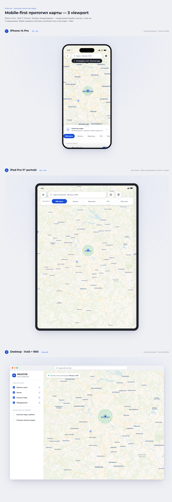
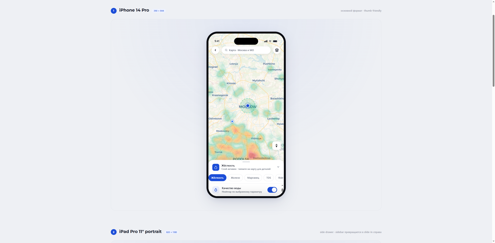
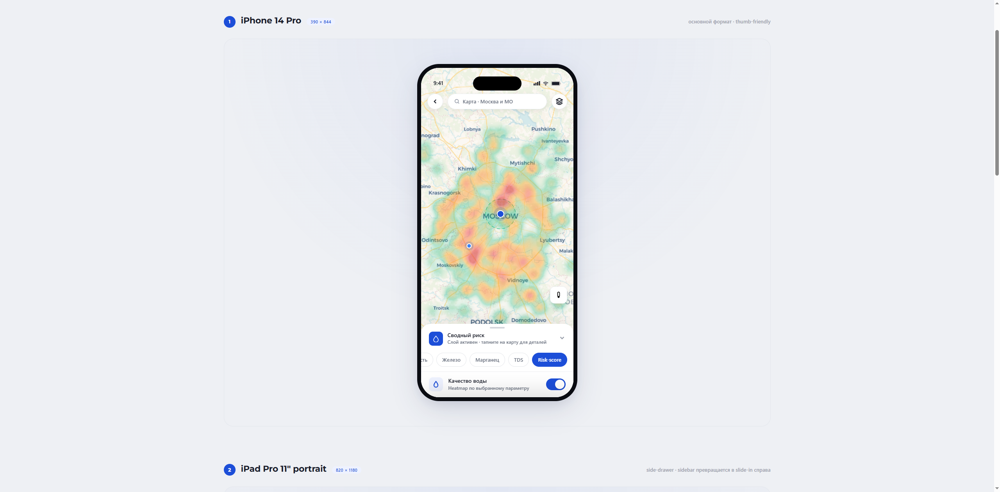
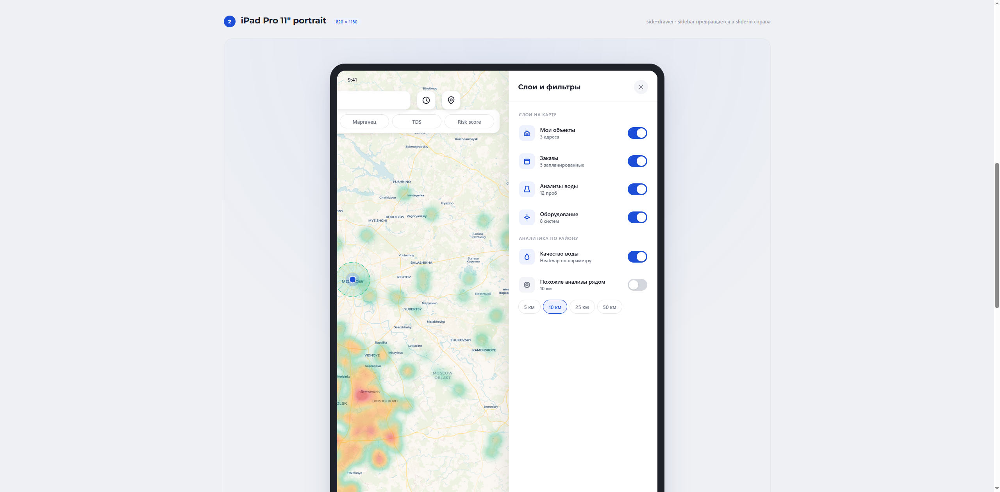
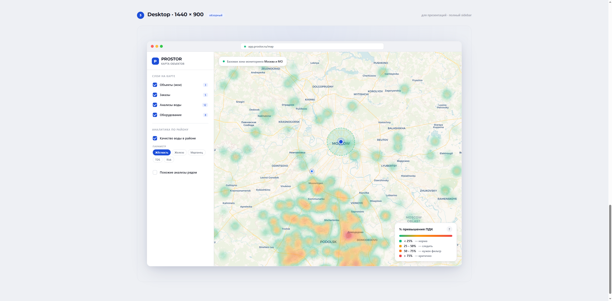

# Аквафор-Pro · Статус разработки и возможности

> **Назначение:** одностраничник для руководителя — где мы сейчас, что готово показать вживую, какие ещё направления реальны на наших данных. Без обязательств по срокам и ценам — это инвентарь возможностей для совместного выбора приоритетов.
> **Дата:** 7 мая 2026.
> **Связи:** [vision-catalog executive summary](vision-catalog-executive-summary.md) · [water-analysis executive summary](water-analysis-executive-summary.md)

---

## TL;DR

За апрель-май у нас **готовы к показу две основные фичи** (работают локально, покрыты тестами, готовы к демонстрации; до production-деплоя на стороне Аквафор — отдельный шаг):

1. **Поиск по каталогу Аквафор-Pro** — клиент даёт текстовое описание (например, «обезжелезиватель для скважины») или фото оборудования (до 5 ракурсов одного товара — определить что стоит / подобрать аналог / сменный картридж). Система за секунду находит подходящие позиции из 155 товаров.
2. **Структурированный архив анализов воды** — 15 504 бланка 2020-2026 превращены в датасет с географической привязкой и поиском похожих анализов за ~600 мс.

Дополнительно собран **визуальный mobile-first прототип тепловой карты качества воды** — UX-mockup с тремя viewport (iPhone / iPad / Desktop), показывает как фича будет выглядеть в клиентском приложении PROSTOR. Приложение проектируется **mobile-first** — основной сценарий: клиент со смартфоном.

Дальше — 4 направления развития (3 готовых + 1 потенциальное расширение Vision-распознавания проблем воды), выбор приоритета за вами.

---

## Где мы сейчас (фичи готовы, ждут production-деплоя на стороне Аквафор)

### ✅ Поиск по каталогу — vision-catalog-search

- 155 товаров Аквафор-Pro обогащены AI-описанием через Claude Vision (категория, бренд, модель, особенности)
- Endpoint `POST /catalog/search` принимает: текстовый запрос / до 5 фото оборудования / комбинацию
- **Что Vision сейчас распознаёт:** фото оборудования или его упаковки (фильтры, картриджи, мембраны, помпы, УФ-лампы). Несколько ракурсов одного товара (фронт + наклейка с моделью + упаковка) объединяются в одно описание.
- **Чего не делает (важная честная граница):** Vision настроен на оборудование. Фото мутной/ржавой воды в стакане сейчас вернёт «не оборудование». Это потенциальное расширение — см. направление 4 ниже.
- Все режимы за один HTTP-вызов, ~1 сек ответ
- 591 unit-тест, защита от перерасхода (бюджетный лимит + Telegram-алерт)

Детали — [vision-catalog executive summary](vision-catalog-executive-summary.md).

### ✅ Структурированный архив анализов воды — water-analysis

- 15 504 бланка анализов воды Аквафор-Pro 2020-2026 переведены в structured dataset
- 21 параметр в канонических единицах (мг/л, мг-экв/л, ЕМФ), флаги превышения ПДК
- 97% качество нормализации, 93% end-to-end accuracy на ручной сверке
- 97.6% записей с координатами (геокодирование через Ahunter)
- Endpoint `POST /water-analysis/similar` — клиент даёт анализ, получает топ-K максимально похожих бланков из архива
- 128 тестов

Детали — [water-analysis executive summary](water-analysis-executive-summary.md).

### 📊 Визуальный прототип тепловой карты — mobile-first

**Что это:** интерактивный UX-mockup от Anthropic Claude Design — показывает **как фича будет выглядеть и работать на трёх устройствах одновременно**: iPhone 14 Pro (390×844), iPad Pro 11" portrait (820×1180), Desktop 1440×900.

**Что это даёт:** клиент в кабинете PROSTOR видит **«у соседей в радиусе 5 км — 73% превышений по железу, 17 из 24 анализов»** — прямая мотивация заказать оборудование. CTA-кнопка «Подобрать оборудование» уводит в каталог.

**Что важно:** карта на скриншотах рисуется по демо-данным (это прототип, не подключение к нашей БД), но **логика отображения**, переключение параметров, цветовая шкала, bottom-sheet на мобильном, side-drawer на iPad, sidebar на десктопе — всё рабочее. Реальных данных у нас достаточно: 15 504 анализа с координатами, PostGIS-геоиндекс настроен, в датасете извлечено и нормализовано **19 параметров СанПиН 1.2.3685-21** (по справочнику покрываем 24, реально измеряемых в бланках — 19). Из них **14 имеют покрытие свыше 50%** и пригодны для агрегации в карту: жёсткость, железо, марганец, мутность, цветность, pH, минерализация (TDS), нитраты, сульфиды, сероводород, магний, фториды, окисляемость, запах. Остальные 5 (кальций, хлориды, нитриты, аммоний, характер запаха) измеряются редко (<5% бланков) — для карты не годятся, но видны в карточке отдельного анализа. В прототипе для UX-чистоты показано 5 топ-важных как pills-селектор (Жёсткость / Железо / Марганец / TDS / Risk-score) — добавление любого из 14 это конфигурация фронта, не разработка backend.

**Что нужно для production:** подключить интерфейс к нашему API `/water-analysis/heatmap` — около недели работы (бэкенд эндпоинт + порт прототипа во фронт + тесты).

#### Главные кадры

**1. Все три viewport на одной странице (обзор для презентации).**

iPhone сверху (mobile-first — основной формат), iPad в середине, Desktop снизу. Каждый — независимый maplibre-инстанс, единая визуальная система.

**2. iPhone — главный сценарий с активным heatmap слоем.**

Bottom-sheet снизу с параметром (Жёсткость / Железо / Марганец / TDS / Risk-score) горизонтальной pill-каруселью, тоггл слоя «Качество воды», список объектов клиента, аналитика по району. Карта на весь экран под bottom-sheet — heatmap занимает максимум площади. Empty-state «Активируйте слой ↓» работает как FTUX-подсказка для новых пользователей.

**3. iPhone — Risk-score combined (общий риск).**

Переключение параметра меняет цветовое распределение мгновенно. Risk-score — composite-показатель, объединяющий несколько параметров в один индекс, чтобы дать «общую картину проблем» одним взглядом (точная формула — на этапе production-реализации, согласовываем со специалистом по водоочистке).

**4. iPad portrait — slide-in drawer вместо постоянного sidebar.**

Sidebar справа выезжает по тапу на меню-кнопку. Параметр-pills сверху над картой (места хватает на одну строку, не нужен horizontal scroll). Popup-карточка «Качество воды» с метриками и CTA внизу слева — тот же UX что на iPhone, но крупнее.

**5. Desktop 1440×900 — обзорный формат.**

Sidebar постоянный слева, карта занимает оставшееся пространство. Полный список слоёв и аналитики виден сразу без раскрытий. Использование: десктопная вкладка приложения, презентация руководству, аналитический dashboard для менеджера.

#### Бонус — 3D-режим карты

maplibre-gl поддерживает **3D-tilt и rotation** out-of-the-box: правая кнопка мыши + drag (или двумя пальцами на тачскрине) — карта наклоняется под углом, тёплые точки heatmap буквально «выпирают» из плоскости в перспективе. Бесплатная фича библиотеки, можно показать руководителю при встрече для wow-эффекта.

#### Полный набор скриншотов

9 кадров по разным состояниям лежат в `docs/management/screenshots/heatmap-prototype-mobile/`:

| № | Файл | Что показывает |
|---|---|---|
| 01 | `01-fullpage-3viewports.png` | Обзор 3 viewport на одной странице (для presentation) |
| 02 | `02-iphone-default.png` | iPhone — стартовое состояние, без активных слоёв |
| 03 | `03-ipad-default.png` | iPad — стартовое состояние |
| 04 | `04-desktop-default.png` | Desktop — стартовое состояние |
| 05 | `05-desktop-heatmap-on.png` | Desktop — heatmap включён, параметр Жёсткость |
| 06 | `06-iphone-heatmap-on.png` | iPhone — heatmap включён, bottom-sheet expanded |
| 07 | `07-ipad-heatmap-on.png` | iPad — drawer открыт, heatmap включён |
| 08 | `08-fullpage-all-active.png` | Полный fullpage все 3 viewport с активными слоями |
| 09 | `09-iphone-risk-score.png` | iPhone — параметр Risk-score combined |

Архив прежнего desktop-only прототипа (предыдущая итерация) лежит рядом в `docs/management/screenshots/heatmap-prototype/` — оставлен для истории, mobile-first вариант актуальный.

---

## Что готово показать вживую при встрече

| Что | Как смотрим |
|---|---|
| Поиск по каталогу — текст + до 5 фото | Реальные запросы прямо в браузере на работающем endpoint'е |
| Поиск похожих анализов воды | То же — даём свой анализ, видим 10 похожих из 15 504 |
| Тепловая карта на трёх устройствах | Открываем `prostor-heatmap-mobile-standalone.html` в браузере, скроллим между iPhone / iPad / Desktop, переключаем параметры, тапаем по карте |
| 3D-наклон карты | Правая кнопка мыши + drag в любом из 3 viewport — карта наклоняется в перспективу |
| Структура датасета анализов | Открываем pgAdmin / Prisma Studio, показываем 15 504 записи, географическое распределение, EDA-графики |

---

## Что можно делать дальше (4 направления)

### 1. Тепловая карта в клиентском приложении

**Что даёт:** клиент на главной экране (mobile-first) видит карту своего района с heatmap качества воды. Конкретный сигнал — «у 73% соседей превышение по железу, 17 из 24 анализов в радиусе 5 км», прямой call-to-action «Подобрать оборудование» с переходом в каталог.

**Зрелость:** готов рабочий прототип на 3 viewport (iPhone / iPad / Desktop), нужна production-интеграция (бэкенд endpoint + порт фронта в существующее приложение PROSTOR).

**Объём работ:** ориентировочно одна неделя (бэкенд + фронт-порт + тесты).

**Зависимости:** ничего — данные и инфраструктура готовы.

### 2. Алгоритм подбора оборудования по анализу воды

**Что даёт:** клиент даёт анализ — система предлагает подходящее оборудование Аквафор-Pro по правилам специалиста.

**Как работает:** rules-based engine. Специалист по водоочистке формирует правила вида «жёсткость > 7 мг-экв/л → умягчитель из категории X», «железо > 0.3 мг/л + марганец > 0.1 → обезжелезиватель Y». Мы реализуем движок, который применяет эти правила к параметрам анализа и подбирает товары из каталога по категориям.

**Что архив 15 504 анализов даёт дополнительно** (но не вместо правил): в архиве **нет связки** «анализ → какое оборудование поставили» (этих данных в бланках нет). Архив показывает **картину распределения проблем по регионам** (через тепловую карту) и **похожие анализы соседей** (через `/water-analysis/similar`), но «какой товар по похожему анализу» вывести из истории нельзя.

**Зрелость:** техническая инфраструктура готова с обеих сторон (каталог + анализы), **нужны правила от вашего специалиста по водоочистке**. Без правил алгоритм построить нельзя — это ваше доменное know-how, не наша зона.

**Объём работ:** ~1 неделя реализации движка после получения правил + время специалиста на их формализацию.

**Зависимости:** специалист по водоочистке Аквафор-Pro для определения правил.

### 3. Real-time ingest новых анализов из CRM

**Что даёт:** каждый новый бланк анализа автоматически попадает в индекс через webhook из CRM. Клиент сразу видит его в кабинете, поиск похожих автоматически расширяется. Никакого ручного импорта — нагрузка на менеджеров не растёт.

**Зрелость:** наш pipeline готов принимать новые бланки. Нужно настроить отправку webhook'а со стороны CRM Аквафор-Pro при загрузке нового анализа.

**Объём работ:** ~3 дня на нашей стороне, плюс работа на стороне CRM (зависит от вашей команды).

**Зависимости:** доступ к CRM-команде для настройки webhook'а.

### 4. Vision-распознавание проблемы воды по фото (потенциальное расширение)

**Что даёт:** клиент фотографирует мутную воду в стакане / ржавчину в раковине / осадок на фильтре — система распознаёт характер проблемы и предлагает подходящее оборудование. Низкий порог входа: не нужно заполнять анкету, нужен один кадр телефона.

**Зрелость:** **сейчас не работает** — vision-catalog настроен на распознавание оборудования (фото воды вернёт «не оборудование», 400). Чтобы заработало — расширение promt-инструкций второй веткой распознавания (отдельный mode «problem-photo» с своими категориями: мутность / цветность / ржавчина / запах / осадок), плюс расширение AI-описаний товаров problem-tag'ами для матчинга. Технически просто, но требует валидации — нужен набор тестовых фото проблем воды и оценка точности распознавания.

**Объём работ:** ~1 неделя (расширение prompt'а + тест-сет 30-50 фото проблем + валидация матчинга на каталоге).

**Зависимости:** тестовый набор фотографий типичных проблем воды (можем собрать сами или попросить у вас из практики мастеров).

---

## Честный scope тепловой карты

> Чтобы при показе клиентам не было неожиданностей.

**Где карта точно работает:**

- **Москва + Подмосковье** — 73% датасета (11 638 бланков на эти два региона). На zoom 8-12 при сетке 5 км — в среднем 50-100 анализов на ячейку. Достоверно для всех 21 параметра датасета (включая жёсткость, железо, марганец, нитраты, фториды, мутность, цветность, pH, минерализацию).
- **Рязанская область** — частично (309 бланков), плотность ниже, показываем но с пометкой.

**Где осторожнее:**

- **Остальные регионы РФ** — данных <1 sample на 100 км². Решение: показываем как «недостаточно данных» (сероватый overlay) или ограничиваем зону карты только МО+Москва+Рязанская.

**Чего не делаем:**

- Не «дорисовываем» данные там где их нет. Если в регионе 5 анализов — не показываем как достоверный сигнал.
- Не предсказываем точные параметры воды для конкретного дома где не было замера. Показываем агрегат «среднее по N анализам в радиусе X км» с явной подписью.

Для core-рынка Аквафор-Pro (Подмосковье + Москва) карта **полная и достоверная**.

---

## Что нужно от Аквафор для следующего шага

| Запрос | Зачем |
|---|---|
| Решение по приоритету направлений (1 / 2 / 3 / 4) | Чтобы мы сфокусировались на одном-двух пунктах, а не размазывали ресурс |
| Специалист по водоочистке для алгоритма подбора (направление 2) | Без правил «параметр воды → товар» алгоритм не построим — это ваше доменное знание |
| Способ обновления каталога | Сейчас 155 товаров — snapshot. Если каталог расширяется — нужен механизм синхронизации |
| Согласование точки встраивания фронта | Встраиваем тепловую карту в существующее приложение PROSTOR (mobile-first), как новый layer-toggle на главной с картой |

---

## Технологический стек (для IT-директора если есть)

| Компонент | Назначение | Лицензия |
|---|---|---|
| NestJS + Prisma + TypeScript | Backend | Open-source |
| PostgreSQL + pgvector + PostGIS | Хранилище, векторный и гео-поиск | Open-source |
| Flowise | LLM-оркестрация и retrieval-pipeline | Open-source |
| **maplibre-gl** + **OpenStreetMap (CARTO Voyager)** | Карта и heatmap в клиентском приложении | Open-source, без vendor lock-in |
| Anthropic Claude **Sonnet 4.6** (Vision) | Распознавание фото оборудования при поиске клиента (search-time) — старшая модель для качества | Платный, по токенам |
| Anthropic Claude **Haiku 4.5** (Vision) | Извлечение данных из бланков анализов (ingest) + обогащение каталога визуальными описаниями (ingest) — быстрая дешёвая модель для пакетной обработки | Платный, по токенам |
| OpenAI **text-embedding-3-large** (3072 dim) | Векторизация для семантического поиска (анализы воды + каталог товаров) | Платный, по токенам |
| MinIO / S3 | Хранение исходных файлов и фото каталога | Open-source / standard |
| Docker + Docker Compose | Развёртывание | Open-source |

Без vendor lock-in: при необходимости провайдер LLM меняется в одной точке (Flowise UI), исходный код slovo не трогаем. Карта на open-source maplibre-gl + OSM tiles, без платных ключей и SLA-зависимостей от Mapbox/Google Maps.

---

## Резюме одной фразой

**За апрель-май у нас готовы к показу: поиск по каталогу 155 товаров Аквафор-Pro (по тексту или фото оборудования), структурированный архив 15 504 анализов воды с 21 параметром (СанПиН 1.2.3685-21) и поиском похожих, mobile-first прототип тепловой карты на 3 viewport (iPhone/iPad/Desktop) с интерактивным radius-поиском. Готовы развернуть карту в клиентское приложение PROSTOR (~1 неделя), построить алгоритм подбора оборудования (нужны правила от вашего специалиста), подключить real-time ingest из CRM, расширить Vision на распознавание проблем воды по фото — приоритет за вами.**
