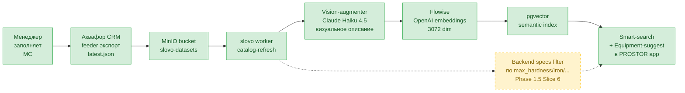

# Руководство по заполнению карточек товаров в МойСклад — для семантического AI-поиска

> **Кому:** менеджерам Аквафор-Pro и дилерам, заполняющим карточки товаров в МойСклад (далее — МС).
>
> **Зачем:** карточки питают AI-поиск и подбор оборудования в приложении PROSTOR. Чем точнее карточка — тем точнее работает «Умный поиск» («Сфоткай — найдём») и автоматические рекомендации фильтров по адресу клиента (карта качества воды).
>
> **Что меняется:** сейчас карточки заполняются как есть; этот документ описывает **как реально feeder Аквафор-CRM превращает карточку в текст для семантического поиска** и какие зоны (описание, атрибуты, фото, услуги группы) заполнять для максимальной точности AI.
>
> **Версия документа:** 1.4 (2026-05-19, синхронизировано с реальным кодом feeder'a `crm-aqua-kinetics-back/src/modules/moy-sklad/modules/catalog-sync/` — функции `fetchGroupContext`, `buildContentForEmbedding`, `parseComponentRefs`).
>
> **Два типа атрибутов в гайде:**
>
> - **✅ Существуют в МС** — атрибуты которые уже **используются в production** (CRM-back для notifications о замене картриджей и заполнения гарантийных талонов). Точные имена синхронизированы с кодом CRM (`src/modules/moy-sklad/modules/product/helpers/parse-maintenance-attributes.ts`).
> - **➕ Предлагается добавить** — атрибуты для AI-фичей (smart-search, подбор по карте) которые пока не существуют в МС и требуют разовой настройки администратором МС.
>
> Менеджер **не создаёт дубли** существующих атрибутов; новые атрибуты добавляются администратором МС один раз, потом заполняются менеджерами.

---

## Состояние backend (на 2026-05-19)

| Что | Где | Статус | Когда заработает |
|---|---|---|---|
| Описание / название / `pageContent` → embedding | slovo | ✅ работает | с 2026-05-02 (vision-catalog Phase 1) |
| Фото → Vision-augmenter описывает в текст → embedding | slovo | ✅ работает | с 2026-05-02 |
| 3 режима умного поиска (текст / фото / гибрид) | slovo | ✅ работает | с 2026-05-15 (smart-search Phase 1) |
| `matchScore: 0..100` per товар | slovo | ✅ работает | с 2026-05-15 |
| Dedupe chunks → unique products | slovo | ✅ работает | с 2026-05-18 (Phase 1.5 Slice 1) |
| **Любые новые атрибуты МС → семантический поиск** (через секцию «Характеристики:» embedding'а) | slovo | ✅ работает | auto-pickup feeder'a, без работы программистов |
| Category-aware re-ranking (фото RO → топ-3 RO, не проточные) | slovo | 🟡 скоро | Phase 1.5 Slice 3 |
| Structured numeric filter по `max_*` атрибутам (категорически отбрасывать товары не подходящие по воде) | slovo | 🟡 скоро | Phase 1.5 Slice 6 |
| Bbox image overlay (annotated rectangles на фото) | slovo | 🟡 скоро | Phase 1.5 Slice 4 (decision gate — Haiku precision) |
| Bundled services «Монтаж 2 500 ₽» в product card | slovo | 🟡 скоро | Phase 1.5 Slice 5 |
| Equipment-suggest filter по `max_*` атрибутам | slovo | 🟡 скоро | Phase 1.5 Slice 6 Step 3 |

**Что это значит для менеджера:**

1. **AI-подбор по карте и smart-search «Сфоткай — найдём» уже работают** — на основе текстового описания и фото карточек. Заполнение описаний и качественных фото даёт **немедленный эффект** на точность подбора.
2. **Существующие атрибуты МС** («Первый-Пятый элемент для обслуживания» — попадают в embedding как «Расходники», «Средний срок службы расходника, месяцев» — попадает в Характеристики embedding'а, «Электронный гарантийный талон» — используется CRM для гарантийных обязательств) — **уже используются** в продакшене. Услуги для embedding'а тянутся **через System Bundle группы** товаров, не через атрибуты карточки.
3. **Любые новые атрибуты МС автоматически попадают в семантический поиск** — feeder каждые 4 часа подхватывает все non-empty атрибуты карточки (кроме 4 служебных) и кладёт в секцию «Характеристики:» embedding'а. Менеджер с админом МС могут расширять семантическое богатство карточек **без программистов**: добавили атрибут «Макс. жёсткость, мг-экв/л» → через 4 часа клиенты находят товары по запросу «фильтр для жёсткой воды до N мг-экв/л» через семантический матч.
4. **Phase 1.5 Slice 6** добавит **дополнительно structured numeric filter** — категорически отбрасывать товары не подходящие по реальной воде клиента (например, кувшин при жёсткости 12 мг-экв/л). Семантический поиск работает уже сейчас, structured filter — улучшит точность на edge cases.

Дальше по тексту метки `[работает]` / `[скоро]` / `[план]` указывают статус каждой фичи.

---

## TL;DR (1 минута на чтение)

Чтобы AI-поиск работал семантически точно (не предлагал кувшин для жёсткой воды свыше 7 мг-экв/л) и smart-search «Сфоткай — найдём» подбирал правильные товары, в карточке должны быть три вещи:

1. **Чёткое название и описание** — что это, для какой воды, под мойку или магистральный.
2. **Качественные фото:** основное — прозрачный PNG без фона (как сейчас в каталоге Аквафор-Pro, единый стиль), плюс желательно 2-3 дополнительных в разных ракурсах (товар в установленном состоянии, детали). AI описывает каждое фото в текст и использует для всех 3 режимов умного поиска: только текст / только фото / гибрид.
3. **Пределы работы по параметрам воды** — «жёсткость до 7 мг-экв/л», «железо до 0.3 мг/л» и т.д. — по 17 параметрам СанПиН. Сейчас этой информации в карточках нет почти нигде.

Плюс правильная категория МС (через неё подтягивается System Bundle группы с услугами и описанием) и заполненные существующие атрибуты карточки («Первый-Пятый элемент для обслуживания» для расходников, «Средний срок службы расходника, месяцев» на карточке картриджа, «Электронный гарантийный талон» для CRM). Имена расходников и услуг **обогащают семантический поиск** (по запросу «фильтр с установкой» AI находит товары у которых в System Bundle группы привязана «Установка смесителя 2-в-1»).

Документ объясняет какие именно зоны карточки попадают в embedding и как этим управлять. Никакого выбора «варианта» нет — feeder автоматически собирает данные из **описания + всех атрибутов карточки + System Bundle группы + фото**. Менеджер заполняет все эти зоны параллельно, каждая даёт свой эффект.

---

## Зачем AI читает карточки

В приложении PROSTOR (карта качества воды + каталог) работают **три** функции, питающиеся из карточек МС:

### 1. Подбор фильтров по адресу (карта `/water`)

Клиент ставит пин на карте → PROSTOR прогнозирует химический состав воды для адреса (на основе соседних реальных анализов в радиусе) → подбирает фильтры. **Пример:** прогноз показывает жёсткость 12 мг-экв/л → AI должен предложить системы обратного осмоса или умягчители, но **не** кувшины (они для лёгкой воды).

**Статус:**

- ✅ Семантический поиск **уже работает** на любых атрибутах карточки (включая новые `max_*`, `aquaphor_filter_type` и т.д.) — feeder автоматически забирает их в embedding через секцию «Характеристики:». Запрос «фильтр обратного осмоса для жёсткой воды до 10 мг-экв/л» уже сейчас находит товары с соответствующими атрибутами через embedding similarity.
- 🟡 **Structured numeric filter** (категорически отбрасывать товары не подходящие по реальной воде — например, кувшин при жёсткости 12) — Phase 1.5 Slice 6, в работе. Даст +20-30% точности на edge cases.

### 2. Умный поиск «Сфоткай — найдём» (smart-search) — 3 режима

Умный поиск работает в **трёх режимах**, клиент выбирает удобный:

1. **Только текст** — клиент пишет: «фильтр под мойку как у мамы», «фильтр для жёсткой воды», «недорогой кувшин для дачи». AI ищет товары по семантическому совпадению **с текстовым описанием карточки** (включая augmented description от Vision на ingest).
2. **Только фото** — клиент фотографирует фильтр на полке (свой или у соседа). Vision описывает фото в текст, AI ищет ближайшие совпадения по визуальным признакам.
3. **Гибрид (текст + фото)** — клиент фотографирует и тут же уточняет: «фильтр как на фото, но дешевле» или «такой же, но без накопительного бака». AI комбинирует визуальные признаки + текстовое уточнение в один запрос. **Это самый мощный режим** — текст резко сужает кандидатов от Vision, точность подбора резко вырастает.

### Как карточка должна работать во всех 3 режимах

Чтобы товар находился в **любом** из режимов, карточка должна иметь **обе сильные стороны**:

- **Текстовое описание с конкретикой** — параметры, контекст использования, ключевые термины. Это работает для text-only и для гибрида (текстовая часть).
- **Качественные фото в 3-5 ракурсах** — общий вид + установленный товар + детали. Это работает для image-only и для гибрида (visual часть). Vision-augmenter на этапе ingest описывает каждое фото в текст и добавляет в семантический индекс товара, поэтому **хорошие фото бустят и текстовый поиск тоже** — товар становится findable по запросам типа «фильтр с прозрачными колбами», даже если в текстовом описании прозрачность колб не упомянута.

### Пример работы всех 3 режимов

Клиент в Москве со скважиной, жёсткая вода, ищет фильтр под мойку.

| Режим | Что клиент сделал | Как AI отрабатывает | Какая карточка побеждает |
|---|---|---|---|
| Текст | «Фильтр под мойку для жёсткой воды частный дом скважина» | Семантический поиск по описаниям | Карточка с «обратный осмос», «жёсткая вода», «скважина», `max_hardness_mg_eq_l: 12` |
| Фото | Загрузил фото 4-колбовой системы у соседа | Vision описывает: «компактный белый фильтр под мойку, четыре прозрачные колбы, накопительный бак, изогнутый кран» → AI ищет похожие в каталоге | Карточка с фото идентичной 4-колбовой системы, augmented description совпадает на 90%+ |
| Гибрид | Загрузил то же фото + «но подешевле и без бака» | Vision описывает фото + текст резко сужает: исключает RO с баками, оставляет проточные 4-колбовые без бака | Карточка проточного 4-колбового фильтра без бака с подходящей ценой |

В каждом режиме **выигрывают карточки, у которых обе части (текст + фото) заполнены хорошо**. Карточка с богатым описанием но без фото проиграет фото-режим. Карточка с хорошими фото но скудным описанием проиграет гибрид-режим (текстовое уточнение не найдёт за что зацепиться).

Сейчас AI часто ошибается из-за того, что в описаниях нет явной категории и пределов, а фото однотипные (только studio shots на белом фоне). После заполнения по этому руководству — товар будет конкурентоспособен во всех 3 режимах.


---

## Как карточка превращается в текст для AI (embedding)

Эта секция — **самая важная** для понимания. Здесь точная структура текста, в который превращается карточка МС перед отправкой в OpenAI для создания семантического вектора (embedding). Чем точнее менеджер понимает этот процесс — тем эффективнее заполняет карточки.

### Точный формат текста embedding'а

Feeder Аквафор-CRM (`build-content-for-embedding.ts`) для каждого товара собирает текст в таком формате:

```
Название: <product.name>
Описание: <product.description>
Категория: <categoryPath — путь в МС>
Контекст группы: <описание группы из System Bundle>
Характеристики:
- <атрибут МС: значение>
- <атрибут МС: значение>
- ...все атрибуты карточки кроме служебных (см. ниже)
Монтажные услуги: <услуги kind=installation>
Сервисное обслуживание: <услуги kind=maintenance>
Услуги: <услуги kind=other>
Расходники (картриджи): <модули, привязанные к карточке>

Визуальный вид: <описание фото от Claude Vision>
```

Дополнительно slovo Vision-augmenter добавляет блок «Визуальный вид» с описанием каждого фото товара (например: «компактный белый фильтр под мойку с двумя прозрачными цилиндрическими колбами»).

### Какие атрибуты карточки попадают в «Характеристики:»

**Все атрибуты МС товара попадают в embedding** через секцию «Характеристики:» в формате `- <имя атрибута>: <значение>`, кроме четырёх служебных:

- «Видимость для приложения» (бизнес-флаг)
- «Ранг для приложения» (UI-сортировка)
- **«Электронный гарантийный талон»** (бизнес-логика CRM, мастер заполняет ГТ — не семантика)
- «NULL»

**Что это значит для атрибутов `max_hardness_mg_eq_l`, `aquaphor_filter_type` и других предлагаемых:** они будут **немедленно** работать для семантического поиска, как только администратор МС добавит их и менеджер заполнит. Атрибут `max_hardness_mg_eq_l: 10` появится в embedding как `- max_hardness_mg_eq_l: 10`, и клиент пишущий «фильтр обратного осмоса для жёсткой воды до 10 мг-экв/л» получит этот товар в результатах поиска через семантический матч. Phase 1.5 Slice 6 добавит **дополнительный numeric filter** поверх (категорическое отбрасывание не подходящих по воде товаров), но базовый семантический поиск по этим атрибутам работает с первого refresh feeder'а.

### ✨ Магия: новые атрибуты МС автоматически попадают в embedding

**Это самая важная часть руководства для администратора МС.**

Pipeline feeder'a Аквафор-CRM устроен так, что **любой новый атрибут**, который администратор МС добавит в карточке товара, **автоматически попадёт в embedding** при следующем cron-обновлении (до 4 часов) без какой-либо работы программистов на стороне slovo или CRM.

Правила автоматического подхвата (из кода `build-content-for-embedding.ts`):

- ✅ Имя атрибута **не входит** в служебный список `SKIP_ATTRIBUTE_NAMES` (4 атрибута, см. выше)
- ✅ Значение не пустое (`null`, `undefined`, `""` — пропускаются)
- ✅ Тип значения: **строка / число / boolean** — все три работают через автоматическое преобразование `stringifyAttributeValue`
- ✅ **Ссылочные атрибуты** (ссылка на товар или папку в МС) — feeder автоматически берёт `.name` из ссылки

**Что это меняет для бизнеса:**

- Администратор МС с менеджером могут **расширять семантическое богатство** карточек без релизов, тикетов разработке, ожиданий деплоя
- Добавили атрибут «Тип установки» с значениями «под мойку / на стояк / магистральная» → через 4 часа клиенты ищут «фильтр на стояк» и получают точные совпадения
- Добавили атрибут «Совместимость со смесителями» → клиенты ищут «фильтр для смесителя 2-в-1» и получают релевантные товары
- Эксперимент стоит 0 рублей и 4 часов времени

**Что Phase 1.5 даст сверх этого:**

Семантический поиск через embedding — **«нечёткий» матч**: запрос «жёсткая вода до 10» найдёт товары с атрибутом `max_hardness_mg_eq_l: 10`, но также и `max_hardness_mg_eq_l: 7` (если description семантически близок), и `max_hardness_mg_eq_l: 12` (тоже близок). Это нормально для смежных кандидатов.

**Phase 1.5 Slice 6** добавит **structured numeric filter** — категорическое отбрасывание товаров не подходящих по воде клиента: если у клиента жёсткость 12, **исключить** товары с `max_hardness_mg_eq_l < 12` (даже если они в семантическом топ-3 из embedding). Это даст +20-30% точности на edge cases.

То есть **семантика работает сразу**, structured filter — позже как уточнение для точности. Менеджер не теряет времени — заполнение атрибутов даёт пользу с первого refresh feeder'а.

### Откуда берутся «Услуги» и «Расходники» в embedding'е

**Услуги** (Монтажные / Сервисное обслуживание / Прочие):

- Источник — **System Bundle**, привязанный к группе товаров в МС (folder с pathName, например «Очистка воды/Аквафор/Дополнительно/Смесители 2 в 1»)
- К System Bundle привязываются товары-услуги с пометкой kind (installation / maintenance / other)
- **Все товары группы получают одинаковый набор услуг** из этого Bundle. Не нужно привязывать услуги к каждой карточке поштучно.
- Из того же System Bundle берётся **описание группы** → в строку «Контекст группы»
- **Кто настраивает:** администратор МС, разовая работа на каждую группу

**Расходники** (картриджи):

- Источник — атрибуты карточки фильтра «Первый/Второй/Третий/Четвёртый/Пятый элемент для обслуживания»
- Это **product-level** — у каждой модели свой набор картриджей
- **Кто настраивает:** менеджер карточки, при создании/изменении конкретного фильтра

### Пример (реальный chunk «Смеситель кухонный модель С125»)

Embedding text который реально ушёл в OpenAI:

```
Название: Смеситель кухонный модель С125
Описание: Кран-смеситель 2 в 1 Аквафор C125 устанавливается на мойку/столешницу...
Категория: Очистка воды/Аквафор/Дополнительно/Смесители 2 в 1
Контекст группы: Смесители для водопроводной и фильтрованной воды
Характеристики:
- Длина: 50
- Ширина: 32
- Высота: 7
- Наименование для Маркета: Кран-смеситель Аквафор C125 (2 в 1)
- Бренд для Маркета: Аквафор
- Поставщик для Маркета: ООО «Аквафор»
- Коробка: 4
Монтажные услуги: Установка смесителя 2 в 1 Аквафор, Демонтаж старого смесителя клиента, Установка насоса (ПН), повышающего давление
Сервисное обслуживание: Ремонт /Замена крана для чистой воды
Услуги: Установка смесителя 2 в 1 (стороннего производителя), Ремонт крана 2 в 1, Установка клапана защиты от протечек, Замена таблетки в клапане защиты от протечек, Ремонт насоса (ПН), повышающего давление

Визуальный вид: Кран для фильтрованной воды из нержавеющей стали с высокой изогнутой гусиной шеей, двумя боковыми рычажными ручками управления и аэратором на излив.
```

Видно сразу несколько важных моментов:

- Услуги разделены на 3 категории (Монтажные, Сервисное обслуживание, прочие Услуги) — это автоматически по полю `kind` в System Bundle
- «Контекст группы: Смесители для водопроводной и фильтрованной воды» — это описание System Bundle группы «Смесители 2 в 1»
- Все технические характеристики попали в Характеристики (даже Длина/Ширина/Высота и Бренд для Маркета)
- «Визуальный вид» сгенерирован Claude Vision из фото товара
- На карточке не указаны расходники (это смеситель, у него нет картриджей) — секция «Расходники (картриджи)» в embedding отсутствует

### Что менеджеру делать с этой информацией

1. **Понимать что заполненный атрибут — это +1 строка в семантический поиск.** Каждый атрибут МС товара становится частью embedding'а. Чем больше значимых атрибутов — тем точнее AI находит товар по разным запросам клиентов.
2. **Описание (`product.description`) — ключевая зона.** AI читает первым делом текст описания. Опечатки, маркетинговая болтовня, отсутствие специфики — снижают качество embedding'а.
3. **Категория МС важна:** через категорию определяется System Bundle группы → услуги и описание группы. Карточка в неправильной категории получит чужие услуги в embedding.
4. **Атрибуты-числа (`max_hardness_mg_eq_l: 10`) и атрибуты-справочники (`aquaphor_filter_type: обратный осмос`) одинаково работают** — попадают в Характеристики как `- название: значение`.

---

## Зоны заполнения карточки

Из секции «Как карточка превращается в embedding» видно: feeder собирает текст из **четырёх параллельных зон**, каждая попадает в свою часть embedding'a. Менеджер заполняет **все зоны**, у каждой своя роль. Нет выбора «или текст или атрибуты» — обе работают.

### Зона 1. Поле «Описание» товара в МС (свободный текст)

**Куда попадает:** в начало embedding как `Описание: <текст>`.

**Что писать:** rich-text нарратив про товар — контекст использования, особенности, что **НЕ** удаляет (важно для honesty), преимущества над аналогами.

**Пример:**

```
Что удаляет: хлор, тяжёлые металлы, нефтепродукты, органику, бактерии, цисты лямблий.
Что НЕ удаляет: растворённые газы (сероводород, аммиак) — нужен отдельный картридж.
Особенности: компактный корпус, низкое давление работы, экономит до 9 тонн воды/год.
Подходит для квартир, дач, частных домов с центральным водопроводом или скважиной с подготовленной водой.
```

**Зачем:** AI ищет по семантическому смыслу. Описание даёт нарратив и нюансы которые не выражаются числами.

### Зона 2. Атрибуты МС товара (структурированные поля)

**Куда попадает:** в секцию `Характеристики:` embedding как список `- <имя атрибута>: <значение>`.

**Что заполнять:** числовые/справочные/boolean атрибуты карточки. **Любые** атрибуты МС автоматически попадают в embedding (кроме 4 служебных), без работы программистов — см. блок «✨ Магия» в секции embedding format выше.

**Пример:**

```
Атрибуты карточки фильтра Аквафор DWM-101S:
- Макс. жёсткость, мг-экв/л: 12
- Макс. железо, мг/л: 0.5
- Макс. марганец, мг/л: 0.3
- Макс. TDS, мг/л: 2000
- Бренд для Маркета: Аквафор
- Длина: 28
- Ширина: 14
- Высота: 38

→ в embedding:
Характеристики:
- Макс. жёсткость, мг-экв/л: 12
- Макс. железо, мг/л: 0.5
- ... и т.д.
```

**Зачем:** structured данные для точного семантического матча по числам и категориям. Атрибут «Макс. жёсткость 12» в embedding'е позволяет AI находить товар по запросу «фильтр для жёсткой воды 12 мг-экв/л».

### Зона 3. Карточка картриджа — собственные атрибуты + ссылка с фильтра

**Куда попадает:** через 5 атрибутов «Первый-Пятый элемент для обслуживания» на карточке фильтра. Имена картриджей попадают в embedding фильтра как `Расходники (картриджи): К5, К2, КО-50S, К7`. Сами карточки картриджей имеют отдельные embeddings — клиент ищет «угольный картридж» → AI находит «Модуль сменный К2».

**Что заполнять на карточке фильтра:** 5 ссылочных атрибутов на картриджи в порядке от первой ступени.

**Что заполнять на карточке картриджа:** «Средний срок службы расходника, месяцев» (число) + любые другие атрибуты которые описывают функцию (например «Пористость, мкм: 10», «Регенерируется солью: да»).

### Зона 4. System Bundle группы товаров (услуги + описание группы + картинки)

**Куда попадает:**

- Описание System Bundle → в embedding как `Контекст группы: <text>`
- Привязанные к Bundle услуги (kind=installation/maintenance/other) → разделены по 3 секциям в embedding: `Монтажные услуги:` / `Сервисное обслуживание:` / `Услуги:`
- Картинки Bundle → Vision-augmenter описывает наряду с product photos

**Что заполнять:** ничего на стороне менеджера карточки. **Администратор МС** разово настраивает System Bundle на каждую группу товаров (folder с pathName).

**Зачем:** услуги одинаковы для всей группы → нет смысла привязывать к каждой карточке. Описание группы даёт смысловой контекст для всех товаров в ней (для «Смесители 2 в 1» это «Смесители для водопроводной и фильтрованной воды»).

### Зона 5. Фото товара

**Куда попадает:** slovo Vision-augmenter (Claude Haiku 4.5) описывает каждое фото в текст → добавляется в embedding как `Визуальный вид: <описание>`.

**Что заполнять:** основное фото — прозрачный PNG без фона (стандарт каталога), плюс 2-3 дополнительных в разных ракурсах (см. раздел «Фото товара»).

### Итог

| Зона | Заполняет | Куда в embedding |
|---|---|---|
| Описание (`product.description`) | Менеджер карточки | `Описание: <text>` |
| Атрибуты карточки | Менеджер карточки (типы создаёт админ МС) | `Характеристики: - <имя>: <значение>` |
| 5 ссылок на картриджи | Менеджер карточки фильтра | `Расходники (картриджи): <имена>` |
| Атрибуты карточки картриджа | Менеджер карточки картриджа | `Характеристики:` (в embedding'е картриджа) |
| Услуги + описание группы | Админ МС, через System Bundle группы | `Монтажные услуги:` / `Контекст группы:` |
| Фото | Менеджер карточки | `Визуальный вид:` (slovo Vision) |

Все зоны работают **параллельно** и **автоматически попадают** в embedding каждые 4 часа (cron feeder).

---

## Структура карточки — что менеджеру заполнять

### Шаг 1. Кастомные атрибуты МС (5-7 полей на категорию)

Администратор МС создаёт атрибуты в настройках. **Список атрибутов по 5 категориям товаров:**

#### Существующие атрибуты МС (✅ используются)

Эти атрибуты уже используются в pipeline данных Аквафор-CRM → slovo. Точные имена синхронизированы с кодом feeder'а (`parse-maintenance-attributes.ts`, `build-content-for-embedding.ts`).

**На карточке фильтра (попадают в embedding для AI):**

| Атрибут МС | Тип | Пример | Что делает |
|---|---|---|---|
| ✅ «Первый элемент для обслуживания» | ссылка на товар-картридж | Модуль сменный К5 | попадает в «Расходники (картриджи):» секцию embedding |
| ✅ «Второй элемент для обслуживания» | ссылка на товар-картридж | Модуль сменный К2 | то же |
| ✅ «Третий элемент для обслуживания» | ссылка на товар-картридж | Модуль сменный мембранный КО-50S | то же |
| ✅ «Четвёртый элемент для обслуживания» | ссылка на товар-картридж | Модуль сменный К7 | то же |
| ✅ «Пятый элемент для обслуживания» | ссылка на товар-картридж | (пусто, если 4 ступени) | то же |

**На карточке фильтра (НЕ попадают в embedding, но используются CRM):**

| Атрибут МС | Тип | Пример | Что делает |
|---|---|---|---|
| ✅ «Электронный гарантийный талон» | boolean | да (для основных фильтров) / нет (для аксессуаров) | если true — мастер обязан заполнить ГТ с серийным номером при монтаже. К AI-поиску не относится (исключён из embedding) |
| ⚠️ «Первая/Вторая/Третья услуга для обслуживания» | ссылка на товар-услугу | (могут быть пусты) | существуют в МС, но **не используются** feeder'ом для AI/embedding (услуги берутся через System Bundle группы). Возможно legacy для другой UI |

**На карточке картриджа (попадает в embedding):**

| Атрибут МС | Тип | Пример | Что делает |
|---|---|---|---|
| ✅ «Средний срок службы расходника, месяцев» | число | 6 (К5) / 12 (К2) / 24 (мембрана) | попадает в «Характеристики:» секцию embedding + используется другими функциями PROSTOR (расчёт замен с поправкой на жильцов) |

**На уровне группы товаров (через System Bundle):**

| Что | Где | Что делает |
|---|---|---|
| ✅ Услуги (товары-услуги kind=installation/maintenance/other) | привязаны к System Bundle группы | feeder тянет один раз для всех товаров группы → попадают в embedding как «Монтажные услуги:» / «Сервисное обслуживание:» / «Услуги:» |
| ✅ Описание группы | поле description System Bundle | попадает в embedding как «Контекст группы:» |
| ✅ Картинки группы | прикреплены к System Bundle | Vision-augmenter описывает наряду с product photos |

#### Предлагаемые новые атрибуты МС (➕ требуют разовой настройки администратора)

Эти атрибуты **не существуют в МС сейчас**, нужны для AI-фичей (smart-search, подбор по карте). Администратор МС создаёт их один раз через справочники / дополнительные поля, потом менеджеры заполняют.

| Атрибут МС | Тип | Пример | Зачем AI |
|---|---|---|---|
| ➕ `aquaphor_filter_type` | справочник | «обратный осмос» | основная категория для AI (Phase 1.5 Slice 2) |
| ➕ `stages_count` | число | 4 | количество ступеней очистки |
| ➕ `housing_standard` | справочник | «DWM» / «Кристалл» / «10″ Slim Line» / «10″ BigBlue» / «20″ BigBlue» / «Гросс» / «Фаворит» / «—» | стандарт корпуса (для совместимости картриджей) |

#### Полный справочник атрибутов «пределы очистки на входе»

Это **те же 17 параметров СанПиН 1.2.3685-21**, что используются в реальных водо-анализах (отчёты на сайте/в приложении Аквафор-Pro показывают эти параметры). AI сравнивает прогноз/реальный анализ воды у клиента с пределами каждого фильтра.

**Правила:**

- Атрибут **заполняется только если фильтр работает с этим параметром.** Пустое значение для AI = «не учитывать в подборе по этому параметру» (не «работает на любых значениях»).
- Значение = **максимум на входе**, при котором фильтр сохраняет паспортную эффективность очистки. Источник — паспорт производителя или техническая консультация.
- Единицы измерения = **строго те же что в водо-анализе** (см. колонку «Единица»). Это позволяет AI сравнивать без конвертации.

| Атрибут МС | Параметр | Единица | ПДК СанПиН | Пример (DWM-101S RO) | Пример (Фаворит) | Пример (Гросс 10″) |
|---|---|---|---|---|---|---|
| `max_hardness_mg_eq_l` | Жёсткость общая | мг-экв/л | 7 / 10 | 12 | 7 | пусто |
| `max_iron_mg_l` | Железо общее | мг/л | 0.3 | 0.5 | 0.3 | 0.5 (Fe-картридж) |
| `max_manganese_mg_l` | Марганец | мг/л | 0.1 | 0.3 | 0.1 | пусто |
| `max_tds_mg_l` | Общая минерализация (TDS) | мг/л | 1000 / 1500 | 2000 | 1500 | пусто |
| `max_chlorides_mg_l` | Хлориды | мг/л | 350 | 700 | 350 | пусто |
| `max_sulfates_mg_l` | Сульфаты | мг/л | 500 | 800 | 500 | пусто |
| `max_nitrates_mg_l` | Нитраты | мг/л | 45 | 90 | 45 | пусто |
| `max_nitrites_mg_l` | Нитриты | мг/л | 3.0 | 5.0 | 3.0 | пусто |
| `max_ammonium_mg_l` | Аммоний-ион | мг/л | 1.5 | 2.0 | 1.5 | пусто |
| `max_fluorides_mg_l` | Фториды | мг/л | 1.5 | 2.0 | 1.5 | пусто |
| `max_hydrogen_sulfide_mg_l` | Сероводород | мг/л | 0.03 | пусто (нужен доп.картридж) | пусто | 0.5 (угольный) |
| `max_permanganate_ox_mg_l` | Перм. окисляемость | мгО2/л | 5 / 7 | 10 | 7 | 5 |
| `max_turbidity_emf` | Мутность | ЕМФ | 2.6 | 50 | 10 | 100 |
| `max_color_degrees` | Цветность | градус | 20 / 30 | 100 | 30 | 50 |
| `max_odor_score` | Запах | балл | 2 / 3 | 5 | 3 | 5 |
| `ph_range_min` | pH (нижний предел работы) | ед. | 6.0 | 5.0 | 6.0 | 5.0 |
| `ph_range_max` | pH (верхний предел работы) | ед. | 9.0 | 9.5 | 9.0 | 9.5 |

**Минимум на категорию** (что обязательно заполнить, в порядке частоты проблем по реальным анализам Москвы и МО):

| Категория | Обязательные атрибуты | Желательные | Опциональные |
|---|---|---|---|
| `reverse_osmosis` (RO) | `max_hardness`, `max_iron`, `max_manganese`, `max_tds`, `max_chlorides`, `max_nitrates` | `max_sulfates`, `max_ammonium`, `max_fluorides`, `ph_range_min/max` | Остальные |
| `flow_filter` (проточные) | `max_hardness`, `max_iron`, `max_manganese`, `max_chlorides` | `max_tds`, `max_nitrates`, `max_permanganate_ox` | Остальные |
| `pre_filter` (предфильтры) | `max_iron`, `max_manganese`, `max_turbidity`, `max_temperature_c`, `max_pressure_bar` | `max_permanganate_ox`, `max_hydrogen_sulfide` (если угольный) | Остальные |
| `replacement_module` (картриджи) | ✅ «Средний срок службы расходника, месяцев» (существует, критично для CRM-уведомлений), ➕ `cartridge_standard`, ➕ `cartridge_function`, плюс пределы той функции которую выполняет | — | — |
| `accessory` (аксессуары) | — (нет очистки) | — | — |

#### Дополнительные атрибуты «удаляет / не удаляет» (бинарные)

Для классов загрязнений, где нет ПДК как числа, но важна функциональная возможность фильтра:

| Атрибут МС | Тип | Пример | Зачем |
|---|---|---|---|
| ➕ `removes_chlorine` | да/нет | да | удаляет свободный хлор и хлорорганику |
| ➕ `removes_bacteria` | да/нет | да (для RO с мембраной), нет (для проточных) | удаляет бактерии и вирусы |
| ➕ `removes_gases` | да/нет | нет (требует доп. картридж) | удаляет растворённые газы (H2S, NH3, CO2) |
| ➕ `removes_heavy_metals` | да/нет | да | удаляет тяжёлые металлы (свинец, медь, кадмий, никель) |
| ➕ `removes_organics` | да/нет | да | удаляет органику (пестициды, нефтепродукты) |
| ➕ `softening_efficiency_pct` | число | 95 (RO) / 70 (умягчающий картридж) | % удаления солей жёсткости (для оценки выходного качества) |

#### Атрибуты для «Сменные модули» (картриджи)

| Атрибут МС | Тип | Пример | Зачем AI / backend |
|---|---|---|---|
| ✅ «Средний срок службы расходника, месяцев» | число | 6 (К5) / 24 (мембрана) | **критично:** работает в CRM сейчас, корректируется по жильцам (формула base × 4/residents) |
| ➕ `aquaphor_filter_type` | справочник | «сменный картридж» | категория для AI |
| ➕ `cartridge_standard` | справочник | «DWM/Кристалл» / «Фаворит» / «10″ Slim Line» / «BigBlue 10″» / «BigBlue 20″» | совместимость |
| ➕ `cartridge_function` | справочник | «механика» / «уголь» / «умягчение» / «железо» / «мембрана» / «комплект» | функция |
| ➕ `resource_liters` | число | 8000 | ресурс в литрах |
| ➕ `regenerable` | да/нет | да | регенерируемый (для умягчителей) |

Плюс — те `max_*` атрибуты из общей таблицы (➕ новые), которые соответствуют функции картриджа: для механического — `max_turbidity_emf`, `max_pressure_bar`; для умягчающего — `max_hardness_mg_eq_l`; для Fe-картриджа — `max_iron_mg_l`, `max_manganese_mg_l`.

**«Средний срок службы расходника, месяцев» — обязательный для всех картриджей.** Указывается базовый срок для семьи из 4 человек. Используется другими функциями приложения PROSTOR (карточка расходников клиента, расчёт сроков замены).

#### Атрибуты для «Дополнительно» (краны, клапаны, аксессуары)

| Атрибут МС | Тип | Пример | Зачем AI |
|---|---|---|---|
| ➕ `aquaphor_filter_type` | справочник | «аксессуар» | категория |
| ➕ `accessory_kind` | справочник | «кран чистой воды» / «клапан защиты протечек» / «трубка» / «фитинг» / «датчик» | вид |
| ➕ `compatible_with` | справочник (multi) | DWM, Кристалл, Фаворит, OSMO | какие системы поддерживает |

Пределы очистки `max_*` для аксессуаров не заполняются (они не очищают воду).

**Справочник `aquaphor_filter_type` — 6 значений (закрытый список):**
1. `reverse_osmosis` — обратный осмос
2. `flow_filter` — проточный фильтр под мойку
3. `pre_filter` — магистральный предфильтр
4. `replacement_module` — сменный картридж
5. `accessory` — аксессуар
6. `other` — другое (защитный fallback, минимизировать использование)

Эти 6 значений выведены из аудита текущих 155 карточек (May 18, 2026 — все товары попадают в одно из этих 6 ведёр).

### Шаг 2. Описание (структурированный текст)

В поле «Описание» МС пишется текст по шаблону (см. раздел «Шаблоны описаний» ниже). Главное правило:

**Атрибут — источник правды, описание — пересказ для человека.** Если в атрибуте `max_hardness_mg_eq_l = 10`, в тексте описания можно писать «эффективно работает при жёсткости до 10 мг-экв/л» — но не «до 12» (рассинхрон собьёт AI и клиента).

---

## Пределы очистки — формат записи и обоснование

### Почему 17 параметров

Реальные анализы воды Аквафор-Pro (5000+ архивных анализов в Москве и МО) измеряют **17 регулируемых СанПиН параметров**:

```
Органолептика (3):    запах, цветность, мутность
Обобщённые (5):       TDS, жёсткость общая, перм. окисляемость, pH, щёлочность (опц.)
Неорганические (9):   железо, марганец, хлориды, сульфаты, нитраты, нитриты,
                      аммоний, фториды, сероводород
```

Источник нормативов — **СанПиН 1.2.3685-21** «Гигиенические нормативы и требования к обеспечению безопасности воды питьевой», действует с 01.03.2021 до 01.03.2027.

Когда клиент в приложении PROSTOR ставит пин на адрес — AI прогнозирует все 17 параметров для этого адреса (на основе соседних реальных анализов в радиусе) и сравнивает с пределами каждого фильтра в каталоге. Если в карточке заполнены только 3 атрибута (`max_hardness`, `max_iron`, `max_tds`) — AI учитывает только эти 3, остальные 14 параметров для подбора игнорирует.

**Чтобы рекомендация была полной**, в карточке должны быть указаны пределы по всем параметрам, на которых фильтр работает (см. таблицы атрибутов выше).

### Правила записи

1. **Единицы — те же что в СанПиН.** Жёсткость только мг-экв/л (не °dH, не ppm). Железо только мг/л (не мкг/л). См. колонку «Единица» в таблице атрибутов.
2. **Числа — десятичная точка**, не запятая. `10.0`, не `10,0`.
3. **Без диапазонов в одном атрибуте.** Не «5-10 мг-экв/л» — это либо `max_hardness_mg_eq_l: 10` (верхний предел), либо два атрибута `_min` + `_max` (для pH использовать `ph_range_min` + `ph_range_max`).
4. **Если параметр не критичен для фильтра** (например, кран для чистой воды не очищает) — оставить пустым, не писать «0» или «не применимо». Пустое для AI = «не учитывать по этому параметру».
5. **Источник значения** — паспорт производителя (Аквафор техническая документация). Если паспорта нет — оценка по аналогии с похожим товаром (DWM-101S, DWM-202S) или техническая консультация.

### Как AI использует пределы

В `equipment-suggest` (рекомендации по карте) и smart-search (поиск по фото/тексту):

1. AI прогнозирует или знает реальный состав воды у клиента: например, `hardness_total: 12 мг-экв/л`, `iron_total: 0.8 мг/л`, `manganese_total: 0.4 мг/л`.
2. Для каждого товара проверяет: `max_hardness_mg_eq_l >= 12 AND max_iron_mg_l >= 0.8 AND max_manganese_mg_l >= 0.4 AND ...` (по всем 17 параметрам).
3. Товары, у которых хотя бы один заполненный атрибут НЕ проходит — отбрасываются.
4. Среди оставшихся ранжирует по семантической релевантности описания запросу клиента.

**Пример работы:**

| Параметр у клиента | Фильтр-кувшин (макс. 7) | Фаворит проточный (макс. 7) | DWM-101S RO (макс. 12) |
|---|---|---|---|
| `hardness_total: 12` | ❌ не подходит | ❌ не подходит | ✓ подходит |
| `iron_total: 0.8` | ❌ (макс. 0.3) | ❌ (макс. 0.3) | ✓ (макс. 0.5 — на грани, но проходит при дополнительной предочистке) |

AI рекомендует DWM-101S, фильтр-кувшин и Фаворит исключаются автоматически — клиент видит только релевантные товары.

---

## Услуги и расходники — реальная структура МС

Услуги и расходники работают через **два разных уровня** привязки. Менеджер должен понимать оба, чтобы AI получил правильные данные.

### Услуги (монтаж / сервис / прочее) → group-level через System Bundle

**Где привязываются:** в МС у каждой группы товаров (folder с определённым `pathName`, например «Очистка воды/Аквафор/Дополнительно/Смесители 2 в 1») может быть **System Bundle** — служебный bundle. К этому System Bundle привязываются:

- **Товары-услуги** — кладутся как components с пометкой kind:
  - `installation` → попадают в embedding как «Монтажные услуги»
  - `maintenance` → попадают как «Сервисное обслуживание»
  - `other` → попадают как «Услуги»
- **Описание группы** в поле description Bundle'а — попадает в embedding как «Контекст группы»
- **Картинки группы** — slovo Vision-augmenter описывает их так же как product photos, обогащает embedding

**Все товары группы получают одинаковый набор услуг** — feeder вытягивает их один раз для всей группы.

**Кто настраивает:** администратор МС, разовая работа на каждую группу. Создать System Bundle, привязать применимые услуги и описание, привязать pathName к нужной folder. Менеджер карточек товаров **ничего не делает** с услугами — они подтягиваются автоматически если карточка лежит в правильной группе.

**Атрибуты карточки «Первая/Вторая/Третья услуга для обслуживания» — в feeder/AI не используются.** Эти атрибуты существуют в МС (через `parseServiceRefs` в коде CRM), но в pipeline для slovo embedding они не попадают — feeder тянет услуги через System Bundle группы. Атрибуты могут быть legacy для другой UI-функции CRM. Менеджеру **не нужно** их заполнять для AI-поиска.

### Расходники (картриджи) → product-level через 5 атрибутов карточки

**Где привязываются:** на карточке каждого фильтра в МС есть 5 ссылочных атрибутов:

- ✅ «Первый элемент для обслуживания» — ссылка на товар-картридж
- ✅ «Второй элемент для обслуживания» — ссылка
- ✅ «Третий элемент для обслуживания» — ссылка
- ✅ «Четвёртый элемент для обслуживания» — ссылка
- ✅ «Пятый элемент для обслуживания» — ссылка

Заполняются по порядку от первой ступени к последней. Лишние оставляются пустыми (feeder пропускает).

В embedding попадают в виде: `Расходники (картриджи): К5, К2, КО-50S, К7`. Названия картриджей становятся семантическими якорями — клиент пишущий «фильтр с угольным картриджем» получит товары где привязан «Модуль сменный К2 (угольная очистка)».

**Кто настраивает:** менеджер карточки фильтра. У DWM-101S — свои 4 картриджа, у Аквафор Гросс — свои 3.

### Атрибут на карточке картриджа

- ✅ «Средний срок службы расходника, месяцев» — числовой (6 для К5, 24 для мембраны КО-50S). Указывается базовый срок для семьи из 4 человек — другие функции приложения PROSTOR корректируют по фактическому количеству жильцов автоматически.

В embedding попадает как `- Средний срок службы расходника, месяцев: 6` в Характеристиках.

### Атрибут «Электронный гарантийный талон»

- ✅ «Электронный гарантийный талон» — boolean (true/false)

**В embedding НЕ попадает** (исключён в `SKIP_ATTRIBUTE_NAMES` feeder'a). Это бизнес-логика CRM: если `true`, при завершении заказа на установку мастер обязан заполнить ГТ с серийным номером в приложении PROSTOR. К AI-поиску отношения не имеет.

Менеджер заполняет: `true` для основных фильтров (RO, проточные, предфильтры с серийным номером), `false` для аксессуаров и расходников.

### Что менеджеру делать в МС

1. **Положить карточку фильтра в правильную категорию МС** (например, «Очистка воды/Аквафор/Фильтры с краном/Обратноосмотические системы»). Через категорию определяется System Bundle группы → подтянутся правильные услуги и описание группы в embedding. Карточка в неправильной группе получит чужие услуги.
2. **Заполнить 5 атрибутов «...элемент для обслуживания»** на карточке фильтра — перечислить картриджи в порядке от первой ступени к последней.
3. **На карточке каждого картриджа** — обязательно заполнить «Средний срок службы расходника, месяцев».
4. **Boolean «Электронный гарантийный талон»** — `true` для фильтров где нужен ГТ, `false` для аксессуаров.
5. **Цены услуг** — заполнены в карточках самих товаров-услуг, не на карточке фильтра.

### Что улучшить (для администратора МС)

1. **System Bundles настроены для всех категорий товаров.** Каждая группа в МС должна иметь System Bundle с описанием и услугами. Без него embedding товара теряет «Контекст группы» и блок «Монтажные услуги».
2. **Унификация наименования услуг.** Если в МС есть две позиции «Установка под мойку Аквафор» и «Монтаж под раковину» — это разные товары-услуги, AI воспринимает их как разные понятия. Унифицировать в одну.
3. **Все картриджи имеют «Средний срок службы расходника, месяцев».** Без этого другие функции PROSTOR (расчёт замен) не сработают.

### В описании товара про услуги/расходники писать НЕ нужно

Услуги, описание группы и картриджи приходят в embedding отдельно (через feeder), **дублировать их в тексте описания не нужно**. Это создаёт два источника правды, один из которых неизбежно устареет.

**Исключение** — особенности конкретной модели, которые отличают её от похожих в группе. Например, «эта модель монтируется только на стояк ХВС, не на горячую» — особенность отдельного товара, имеет смысл в описании карточки.

---

## Фото товара — критично для AI

Фото из карточки МС используется AI **двумя способами**, оба важные:

1. **На этапе загрузки в AI (ingest)** — Claude Vision (Haiku 4.5) описывает каждое фото в текст («компактный белый фильтр под мойку с двумя прозрачными колбами, накопительным баком слева, хромированным краном»). Это описание добавляется в семантический индекс товара. Чем лучше фото — тем точнее AI-описание — тем findable товар в текстовом поиске («хочу фильтр с прозрачными колбами»).
2. **При поиске «Сфоткай — найдём»** — клиент в приложении загружает свою фотку фильтра (своего или у соседа), AI описывает её таким же образом и ищет ближайшие совпадения по augmented descriptions из каталога.

Плохие или однотипные фото → AI описывает товар поверхностно → товар не находится даже при явном запросе.

### Технические требования

1. **Минимум 1 фото** на товар (обязательно). Желательно 3-5 (см. «Ракурсы» ниже).
2. **Основное фото — прозрачный PNG без фона** (стандарт каталога Аквафор-Pro). Дополнительные фото могут быть JPEG/PNG/WebP.
3. **Разрешение ≥ 800×800** пикселей. Меньше — Vision хуже распознаёт детали (колбы, индикаторы, маркировка).
4. **Формат JPEG / PNG / WebP.** Не SVG, не GIF, не TIFF.
5. **Размер файла ≤ 5 МБ** на фото.

### Ракурсы — что снимать (для фильтров)

Чем больше **разных ракурсов** и **состояний** товара — тем лучше Vision-augmenter описывает товар и тем точнее матчинг по фото от клиента. Рекомендуемый комплект:

1. **Основное фото — товар без фона (прозрачный PNG)** (1 шт) — это «продающее» фото для каталога и приложения PROSTOR. Сейчас весь каталог Аквафор-Pro оформлен так, выглядит чисто и единообразно. Фон удалён, остаётся только сам товар на прозрачной подложке. Это стандарт для основного фото — **обязательно прозрачный PNG, не JPEG с белым фоном**.
2. **Товар в установленном состоянии** (1-2 шт, опционально) — фильтр под мойкой, предфильтр на стояке, картридж в корпусе. Это **мощно для smart-search**: клиент фотографирует свой фильтр в кухонной обстановке → AI ищет похожие фото в каталоге. Если в каталоге только основное фото без фона — AI не свяжет клиентское «фильтр в обстановке» с товаром так точно как мог бы. Эти фото **второстепенные**, не заменяют основное.
3. **Детали** (1-2 шт, опционально) — картриджи отдельно с маркировкой, кран чистой воды крупным планом, накопительный бак, индикаторы.
4. **Упаковка** (опционально) — коробка с маркировкой модели. Помогает Vision определить модель когда клиент фотографирует упаковку в магазине.
5. **В работе/в эксплуатации** (опционально) — рука открывает кран, льётся вода, индикатор замены картриджа загорелся. Это даёт AI контекст «состояние», что повышает релевантность для запросов типа «фильтр у которого индикатор замены загорелся».

**Главное правило:** первое фото — всегда прозрачный PNG без фона (стандарт каталога Аквафор-Pro). Дополнительные фото — приветствуются, повышают качество AI-распознавания и контекст для smart-search.

### Что НЕ годится (anti-patterns)

- **Только логотип Аквафор на белом фоне** без самого товара → Vision опишет «логотип бренда», товар не findable.
- **Фото с витрины магазина с ценниками, скидками, соседними товарами** → Vision цепляет ценники и соседние продукты как features этого товара. Использовать чистые product shots.
- **Фотографии с маркетплейсов (Ozon, Wildberries)** с водяными знаками, логотипами других магазинов, рамками → выглядит непрофессионально + Vision описывает маркировку маркетплейса как часть товара.
- **Однотипные фото** (3 ракурса одинаковые) → AI получит одно и то же описание × 3. Лучше 1 хорошее фото чем 5 одинаковых.
- **Размытые, тёмные, с пересветом** → Vision увидит «размытое изображение» вместо деталей.
- **Со старыми моделями вместо текущей** → AI будет матчить клиентов на снятый с производства товар.

### Шаблон для категорий

| Категория | Обязательно | Желательно |
|---|---|---|
| `reverse_osmosis` (RO) | Общий вид + товар под мойкой (установлен) | + картриджи отдельно + кран чистой воды + индикаторы |
| `flow_filter` (проточный) | Общий вид + товар под мойкой | + картриджи отдельно + кран |
| `pre_filter` (предфильтр) | Общий вид + товар на стояке/трубе | + детали корпуса + картридж внутри (с открытой колбой) |
| `replacement_module` (картридж) | Сам картридж крупным планом с маркировкой | + картридж рядом с фильтром, для которого подходит |
| `accessory` (аксессуар) | Общий вид + товар в применении (кран установлен на мойке) | + детали резьбы, размеров |

### Источник фото

- **Только оригинальные фото** от Аквафор-Pro, нашего фотографа, или дилера с разрешением.
- **Никаких водяных знаков, логотипов чужих сайтов, фотографий товара с маркетплейсов.** При проверке carrier модерации Vision может расценить «www.competitor.com» на фото как product feature.

---

## Шаблоны заполнения по категориям

Каждый шаблон описывает **две зоны**:

1. **Атрибуты МС** — что заполнить в structured-полях карточки (типы создаются админом МС разово). Они автоматически попадают в `Характеристики:` секцию embedding'а.
2. **Поле «Описание»** — свободный текст с **нарративом**, который **не дублирует атрибуты**. Только то, что не помещается в structured поле: что/что НЕ удаляет (с объяснением), контекст использования, особенности модели.

**Главное правило:** если данные есть в атрибуте — **не писать их в описании**. Дублирование создаёт два источника правды и шумит embedding. Атрибут «Кол-во ступеней: 4» в Характеристики секцию embedding'а уйдёт автоматически — повторять в описании «Количество ступеней: 4» **не нужно**.

### Шаблон для категории `reverse_osmosis` (обратный осмос)

**Атрибуты МС (структурированные поля карточки):**

```
- aquaphor_filter_type: reverse_osmosis
- stages_count: [N]
- housing_standard: DWM / Кристалл / [другой]
- productivity_liters_per_day: [N]
- has_storage_tank: да / нет
- storage_tank_volume_liters: [N если есть]
- max_hardness_mg_eq_l: [N]
- max_iron_mg_l: [N]
- max_manganese_mg_l: [N]
- max_tds_mg_l: [N]
- max_chlorides_mg_l: [N]
- max_nitrates_mg_l: [N]
- removes_chlorine: да
- removes_bacteria: да
- removes_gases: нет (требует доп. картридж)
- removes_heavy_metals: да
- removes_organics: да
- softening_efficiency_pct: 95
+ 5 ссылочных атрибутов «Первый-Пятый элемент для обслуживания»
+ «Электронный гарантийный талон»: да
```

**Поле «Описание» — нарратив (без дублирования атрибутов):**

```
Аквафор [МОДЕЛЬ] — система обратного осмоса под мойку.

Что НЕ удаляет:
- Растворённые газы (сероводород, аммиак) — нужен отдельный картридж
- Полезные минералы (если важно — выбирайте модель с минерализатором)

Контекст использования:
Подходит для квартир, дач, частных домов с центральным водопроводом или скважиной с подготовленной водой (после механической предочистки).

Особенности (только если отличают эту модель от других в группе):
- [Если есть минерализатор — указать]
- [Если есть встроенный насос — указать]
- [Если компактная конструкция без бака — указать]
- [Если особенность монтажа — указать]
```

**Что НЕ дублировать в описании:** список «что удаляет» (есть в `removes_*` атрибутах), тип системы, ступени, производительность, пределы воды (все есть в атрибутах). Также — услуги, расходники, гарантия (приходят через System Bundle группы и 5 элементов).

### Шаблон для категории `flow_filter` (проточный под мойку)

**Атрибуты МС:**

```
- aquaphor_filter_type: flow_filter
- stages_count: [N]
- housing_standard: Кристалл / Фаворит
- productivity_liters_per_hour: [N]
- max_hardness_mg_eq_l: [N]
- max_iron_mg_l: [N]
- max_manganese_mg_l: [N]
- max_chlorides_mg_l: [N]
- removes_chlorine: да
- removes_softening: да (для Кристалл H) / нет (для Фаворит)
- removes_bacteria: нет
- removes_gases: нет
+ 5 ссылочных атрибутов «Первый-Пятый элемент для обслуживания»
+ «Электронный гарантийный талон»: да
```

**Поле «Описание» — нарратив:**

```
Аквафор [МОДЕЛЬ] — проточный фильтр под мойку.

Что НЕ удаляет:
- Соли жёсткости свыше предельного значения (для жёсткой воды — выбирать обратный осмос)
- Бактерии (для бактерицидной защиты — UV-лампа отдельно)
- Растворённые газы

Контекст использования:
Подходит для квартир с центральным водопроводом, где жёсткость не превышает порога фильтра и нет высокого железа. Альтернатива обратному осмосу при ограниченном бюджете и небольшом расходе воды.

Особенности (только если отличают эту модель):
- [Если индикатор замены картриджей — указать]
- [Если корпус прозрачный — указать]
- [Если режим переключения чистая/обычная вода — указать]
```

### Шаблон для категории `pre_filter` (магистральный предфильтр)

**Атрибуты МС:**

```
- aquaphor_filter_type: pre_filter
- mount_location: стояк / под мойку / магистраль
- housing_standard: 10″ Slim Line / 10″ BigBlue / 20″ BigBlue / Гросс
- max_temperature_c: [N]
- max_pressure_bar: [N]
- max_turbidity_emf: [N]
- max_iron_mg_l: [N если с Fe-картриджем]
- removes_mechanical: да
- removes_iron: да / нет
- removes_chlorine: да / нет (если угольный)
+ 5 ссылочных атрибутов на сменные элементы (если корпус)
```

**Поле «Описание» — нарратив:**

```
Аквафор [МОДЕЛЬ] — магистральный предфильтр.

Что НЕ удаляет:
- Растворённые соли (это предочистка, не питьевой фильтр)
- Бактерии

Контекст использования:
Защищает бытовую технику (стиральная машина, водонагреватель, котёл) от механических примесей и накипи. Также облегчает работу основного питьевого фильтра под мойкой.

Особенности (только если отличают эту модель):
- [Корпус металлический — для высокого давления]
- [Прозрачный корпус — для контроля загрязнённости]
- [Поворачивающийся кронштейн / быстроразъёмное крепление]
```

### Шаблон для категории `replacement_module` (сменный модуль / картридж)

**Атрибуты МС (на карточке самого картриджа):**

```
- aquaphor_filter_type: replacement_module
- cartridge_standard: DWM/Кристалл / Фаворит / 10″ Slim Line / BigBlue 10″ / BigBlue 20″
- cartridge_function: механика / уголь / умягчение / железо / мембрана / комплект
- resource_liters: [N]
- service_life_months: [N]   ← существующий атрибут МС «Средний срок службы расходника, месяцев»
- regenerable: да / нет
- max_temperature_c: [N]
- max_pressure_bar: [N]
+ соответствующие функции max_* (для умягчающего — max_hardness, для Fe — max_iron)
```

**Поле «Описание» — нарратив:**

```
Сменный модуль Аквафор [НАЗВАНИЕ].

[1-2 предложения про материал и принцип работы — например «изготовлен из 100%-го полипропилена с градиентной структурой переменной пористости»]

Когда менять:
[Конкретные индикаторы — изменение цвета, падение скорости фильтрации, по календарю]

Особенности (только если важно):
- [Если регенерируется солью — кратко описать]
- [Если совместим с разными моделями — указать список]
```

### Шаблон для категории `accessory` (аксессуар)

**Атрибуты МС:**

```
- aquaphor_filter_type: accessory
- accessory_kind: кран чистой воды / клапан защиты от протечек / трубка / фитинг / монтажный набор / датчик
- compatible_with: DWM, Кристалл, Фаворит, OSMO   ← multi-ref / справочник
+ при необходимости: длина, размер резьбы, материал — отдельные атрибуты
+ «Электронный гарантийный талон»: нет (обычно для аксессуаров не нужен)
```

**Поле «Описание» — нарратив:**

```
[НАЗВАНИЕ] — аксессуар для систем водоочистки Аквафор.

Назначение:
[Конкретное описание функции — для чего этот товар, что улучшает или защищает]

Особенности (только если важны):
- [Если ставится только при основной установке фильтра — указать]
- [Если требует отдельной услуги монтажа — указать]
```

---

## Examples — карточки до и после

### Пример 1. RO-система (до и после)

**До (текущая карточка Аквафор DWM-101S — выдержка из реального МС):**

```
Описание:
Система обратного осмоса DWM-101S Морион предназначена для бытовой очистки 
воды, служа качественной заменой воды в бутылках. Вне зависимости от качества 
входящей воды, Морион удаляет любые премеси, будь то токсичные вещества или 
вирусы, и делает воду мягкой, избавляя от образования накипи на весь срок 
службы мембраны.

Технология устройства систем линейки DWM (Drinking Water Machine) иная чем в 
классических системах обратного осмоса с внешним накопительным баком, занимая 
в два раза меньше места под раковиной. Помимо этого, DWM-101S Морион экономит 
до 9 тонн воды в год и работает при низком давлении.

Атрибуты МС: <не заполнены>
```

**Проблемы:**

- Нет явных пределов очистки → AI не знает что предлагать клиенту с жёсткостью 12 мг-экв/л
- Нет явной категории → AI смешивает с проточными системами при photo search
- Нет связанных расходников и услуг в тексте → клиент не знает «что покупать через полгода»
- «удаляет любые премеси» — маркетинговый язык, AI парсит как noise, не как конкретные параметры

**После (по шаблону):**

```
Атрибуты МС:
Базовая категоризация:
- aquaphor_filter_type: reverse_osmosis
- stages_count: 4
- housing_standard: DWM
Существующие атрибуты МС на карточке фильтра (✅ работают сейчас):
- ✅ «Первый элемент для обслуживания»: Модуль сменный К5 (механическая предочистка) — попадает в embedding как «Расходники»
- ✅ «Второй элемент для обслуживания»: Модуль сменный К2 (угольная предочистка) — то же
- ✅ «Третий элемент для обслуживания»: Модуль сменный мембранный КО-50S (мембрана) — то же
- ✅ «Четвёртый элемент для обслуживания»: Модуль сменный К7 (финишная очистка) — то же
- ✅ «Электронный гарантийный талон»: да (мастер заполняет ГТ при монтаже) — не embedding, CRM-only

На карточке каждого картриджа отдельно — ✅ «Средний срок службы расходника, месяцев»: 6 / 12 / 24 / 12 соответственно.

Услуги (Монтаж под мойку — 2 500 ₽, Замена картриджей — 1 500 ₽, Диагностика — 800 ₽) и описание группы «Обратноосмотические системы» — подтягиваются автоматически из System Bundle группы товаров в МС (привязан администратором МС). Не требуют действий менеджера карточки.

Пределы очистки (обязательные для RO):
- max_hardness_mg_eq_l: 12
- max_iron_mg_l: 0.5
- max_manganese_mg_l: 0.3
- max_tds_mg_l: 2000
- max_chlorides_mg_l: 700
- max_nitrates_mg_l: 90

Пределы очистки (желательные для RO):
- max_sulfates_mg_l: 800
- max_ammonium_mg_l: 2.0
- max_fluorides_mg_l: 2.0
- ph_range_min: 5.0
- ph_range_max: 9.5

Функциональные возможности:
- removes_chlorine: да
- removes_bacteria: да
- removes_gases: нет
- removes_heavy_metals: да
- removes_organics: да
- softening_efficiency_pct: 95

Описание (свободный текст, только нарратив без дублирования атрибутов):
Аквафор DWM-101S Морион — компактная система обратного осмоса под мойку 
без внешнего накопительного бака.

Что НЕ удаляет:
- Растворённые газы (сероводород, аммиак) — нужен отдельный картридж
- Полезные минералы (если важно — выбирайте DWM-101S с минерализатором)

Контекст использования:
Подходит для квартир, дач, частных домов с центральным водопроводом. 
Особенно эффективна при жёсткой воде (свыше 7 мг-экв/л) и высоком уровне 
TDS — где обычные проточные фильтры бессильны.

Особенности (отличают эту модель в группе RO):
- Компактный корпус — занимает в 2 раза меньше места под раковиной
- Низкое давление работы — не требует доп. насоса при 2.5 бар
- Экономит до 9 тонн воды в год (мембрана высокой селективности)
```

(Услуги и расходники приходят автоматически из System Bundle группы и 5 ссылок «...элемент для обслуживания» — в описании их не дублируем. Список «что удаляет», тип системы, кол-во ступеней, производительность — всё в атрибутах, не повторяем.)

**Результат для AI и backend:**

- При жёсткости 12 мг-экв/л + железе 0.5 + марганце 0.3 у клиента → DWM-101S проходит все три проверки и попадает в рекомендации ✓
- Smart-search по фото DWM-101S → AI знает что это `reverse_osmosis`, не путает с проточными
- Клиент в приложении видит «Монтаж — 2 500 ₽, Замена картриджей раз в 6 мес — 1 500 ₽» (из связей группы) автоматически
- **Существующие атрибуты МС** («Первый-Пятый элемент для обслуживания» + «Средний срок службы расходника» на картриджах) — заполнены, другие функции приложения PROSTOR (карточка расходников, расписание замен) работают сразу
- Маркетплейсы получают 14+ structured характеристик + читабельное описание

### Пример 2. Бракованная карточка (что не делать)

**Плохо:**

```
Описание:
Купи фильтр! Очень классный! Спешите!

Атрибуты МС:
- max_hardness_mg_eq_l: 999
- aquaphor_filter_type: <пусто>
```

**Что не так:**

- Описание = маркетинговая болтовня, нулевая информация для AI и для клиента
- `max_hardness: 999` — нереалистичное значение, AI начнёт рекомендовать этот товар для воды любой жёсткости, что приведёт к жалобам клиентов
- `aquaphor_filter_type` пустой — AI не знает к какой категории относить, fall back на `other`

**Как исправить:** заполнить по шаблону соответствующей категории, использовать реальные технические значения.

---

## Что происходит дальше (в slovo)

Для уверенности, что заполнение оправдано — кратко о том, что делает AI с карточкой.



Сплошные зелёные узлы = **работает сейчас** (Phase 1 AI-поиск). Пунктирные с жёлтой заливкой = **в работе** (Phase 1.5 — новые атрибуты МС для AI-фильтрации по воде).

1. CRM Аквафор каждые 4 часа выгружает все карточки в файл `latest.json` (через MoySklad API).
2. slovo worker скачивает файл, валидирует структуру.
3. Для каждой карточки добавляется визуальное описание от Claude Vision (распознаёт фото товара) — это даёт AI «глаза» когда клиент фотографирует фильтр на полке.
4. Текст карточки (атрибуты + описание + услуги + визуальное описание) превращается в embedding — числовой вектор в 3072 измерения, отражающий смысл.
5. Embedding сохраняется в семантическом индексе.
6. Когда клиент в PROSTOR ищет «фильтр под мойку как у мамы» или фотографирует свой фильтр — AI ищет ближайшие по смыслу карточки в индексе и подбирает оборудование с учётом ограничений (max hardness, max iron — из атрибутов).

Цикл от «менеджер сохранил карточку в МС» до «AI учитывает изменения в подборе» — **до 4 часов** (один прогон feeder cron). После hot-reload модулей slovo — реальное время.

---

## Опциональный приём — естественный отбор у топ-карточек маркетплейсов

> Этот раздел — **не обязательное правило**, а образовательный пример. Понимание принципа поможет менеджеру делать карточки лучше во всех аспектах, не только в копировании структуры с маркетплейсов.

### Принцип

Wildberries и Ozon ранжируют товары на тех же алгоритмах, что наш AI в PROSTOR — **embedding similarity + контекстуальные сигналы**. Это значит что топ-3 карточек в любой категории на маркетплейсе — это **«успешные мутации»** в эволюционном смысле: миллионы микро-A/B-тестов «продавец написал → клик → продажа или нет» естественно отобрали структуру и ключевые слова, которые семантические алгоритмы понимают лучше всего.

Продавцы маркетплейсов **редко понимают это теоретически** — они интуитивно копируют успешных конкурентов, и алгоритмический сигнал просто транслируется дальше. Тот же принцип работает в SEO-описаниях сайтов производителей, лендингах, описаниях в Google Shopping. **Это универсальный паттерн** — везде где есть семантический ранжирующий алгоритм + достаточно конкуренции, успешные тексты сходятся к похожей структуре.

### Что менеджер может из этого взять

Если **нет идей с чего начать** или хочется проверить «правильно ли я структурировал» — посмотрите топ-3 карточек товаров той же категории на Wildberries и Ozon (с фильтром «по продажам» или «по рейтингу»). Они продемонстрируют:

- **Какие секции в Описании** обычно есть (например, у топ-3 RO-фильтров часто: «Принцип работы / Что удаляет / Технические характеристики / Что в комплекте / Гарантия»).
- **Какие ключевые термины** клиенты понимают и ищут («обратноосмотическая мембрана», «многоступенчатая очистка», «накопительный бак»).
- **Какие контексты использования** упоминают («для семьи 2-4 человека», «для квартиры с центральным водопроводом», «для дачи со скважиной»).

### Что копировать **можно**

- Структуру секций (какие блоки и в каком порядке)
- Ключевые термины (для семантических якорей)
- Контексты использования (сегменты клиентов)

### Что копировать **нельзя**

- **Текст 1-в-1** — плагиат, поисковые системы и AI распознают дубли, плюс юридический риск.
- **Числовые значения параметров.** Многие продавцы на маркетплейсах **завышают** (например, «жёсткость до 100 мг-экв/л»!) чтобы попасть в большее количество поисковых выдач. Для нашего AI это **критическая ошибка**: подбор по реальной воде даст товар, который физически не справится → клиент недоволен → возврат → жалоба. **Числа всегда брать из паспорта Аквафор**, не у конкурента.
- **Маркетинговый язык** — «удаляет любую грязь!», «лучший в своём классе!», «100% защита семьи!» — это для AI шум, embedding теряет фокус. Рабочий язык: «удаляет железо до 0.5 мг/л, марганец до 0.3 мг/л, бактерии 95%».

### Общее правило

Брать **структуру и язык — да**. Брать **значения и маркетинговые обещания — нет**. Структура работает на семантику поиска, значения определяют точность подбора по воде клиента, и эти две вещи живут в разных слоях карточки.

---

## Acceptance — как понять что карточка хорошо заполнена

Чек-лист менеджера перед сохранением карточки:

**[Сразу работает]** — даёт немедленный эффект на AI-поиск:

**[✅ Уже работает в production]** — даёт немедленный эффект:

- [ ] Текстовое описание содержит ключевые секции (Что удаляет / Что НЕ удаляет / Контекст использования) — embedding учитывает с момента следующего refresh feeder'а (до 4 часов)
- [ ] Основное фото — прозрачный PNG без фона (стандарт каталога Аквафор-Pro), желательно ещё 2-3 дополнительных в разных ракурсах (см. секцию «Фото товара») — Vision-augmenter обработает на следующем refresh
- [ ] ✅ «Первый-Пятый элемент для обслуживания» (для фильтров) — перечислены все картриджи в порядке от первой ступени к последней (попадают в embedding как «Расходники (картриджи)»)
- [ ] ✅ Категория МС правильная (например, «Очистка воды/Аквафор/Фильтры с краном/Обратноосмотические системы») — через категорию подтягивается System Bundle группы с услугами и описанием в embedding
- [ ] ✅ «Электронный гарантийный талон» (boolean) — выставлен правильно (true для основных фильтров с серийным номером, false для аксессуаров)
- [ ] ✅ «Средний срок службы расходника, месяцев» (для картриджей) — заполнен числом (срок для семьи из 4 человек, другие функции PROSTOR корректируют автоматически)
- [ ] Карточка лежит в правильной категории МС (не «Дополнительно» если это фильтр)

**[➕ Желательные новые атрибуты]** — **семантический поиск работает на них сразу** (как только админ МС создаст атрибут и менеджер заполнит, через 4 часа cron — попадают в embedding автоматически). В Phase 1.5 slovo добавит **дополнительный structured numeric filter** поверх (категорическое отбрасывание не подходящих по воде товаров):

- [ ] ➕ `aquaphor_filter_type` атрибут выбран из 6 значений (требует разовой настройки администратора МС)
- [ ] ➕ `stages_count` (для фильтров) и ➕ `housing_standard` (для совместимости с картриджами) заполнены
- [ ] ➕ **Все обязательные** `max_*` атрибуты заполнены согласно категории (см. таблицу «Минимум на категорию»):
  - RO: 6 атрибутов (`max_hardness`, `max_iron`, `max_manganese`, `max_tds`, `max_chlorides`, `max_nitrates`)
  - Проточные: 4 атрибута (`max_hardness`, `max_iron`, `max_manganese`, `max_chlorides`)
  - Предфильтры: 5 атрибутов (`max_iron`, `max_manganese`, `max_turbidity`, `max_temperature_c`, `max_pressure_bar`)
- [ ] ➕ **Желательные** `max_*` атрибуты заполнены где есть данные (см. таблицу)
- [ ] ➕ Бинарные атрибуты заполнены: `removes_chlorine`, `removes_bacteria`, `removes_gases`, `removes_heavy_metals`, `removes_organics`

**Минимум для немедленной публикации:** все пункты группы **[✅ Уже работает]**. Это даёт работающий AI-поиск по описанию и фото плюс корректное отображение расходников и услуг в приложении PROSTOR. Группа **[🟡 Скоро]** заполняется впрок — после deploy Phase 1.5 slovo начнёт дополнительно отбрасывать товары не подходящие по реальной воде клиента (например, кувшин при жёсткости >7).

**Услуги, сервис и расходники в описании дублировать НЕ нужно** — они приходят автоматически из связей группы МС.

---

## FAQ для менеджеров

**Q: А если у меня товар с особенностями, не подходящий ни под один шаблон?**

A: Заполняйте атрибуты как для **ближайшей** категории, в описании пишите особенности в свободной форме. AI всё равно прочитает текст и сделает правильные выводы — главное чтобы атрибуты не были пустыми и фото были.

**Q: Атрибутов получается 12-17 на RO-фильтр. Это много. Можно меньше?**

A: **Обязательных** — 6 (`max_hardness`, `max_iron`, `max_manganese`, `max_tds`, `max_chlorides`, `max_nitrates` для RO). Это критичный минимум для AI-подбора по реальной воде. Остальные 11 — желательные/опциональные, сильно повышают точность но не обязательны.

Логика: в реальных анализах воды Москвы и МО частота превышения по параметрам распределена так — на первом месте жёсткость (60%+ анализов с превышением), потом железо (40%), марганец (25%), хлориды (15%), TDS (10%), нитраты (8%). Эти 6 параметров покрывают **97% реальных проблем** клиентов в нашей сервисной зоне. Остальные параметры (фториды, сульфаты, аммоний, сероводород) встречаются реже, но если фильтр на них работает — лучше указать.

**Q: А если я не знаю точных значений (max_hardness)?**

A: Возьмите из паспорта производителя (Аквафор технические условия), у нас они должны быть. Если паспорта нет — оцените по аналогии с похожим товаром в каталоге (DWM-101S имеет 12 мг-экв/л — другие RO-системы Аквафор обычно тоже 10-12). Лучше консервативная оценка (поставить меньшее значение) чем оптимистичная — рекомендация не упадёт, но клиент будет доволен реальной фильтрацией.

**Q: А что про услуги и расходники? Привязывать к каждой карточке или к группе?**

A: По-разному:

- **Расходники (картриджи)** — на **карточку фильтра**, через 5 атрибутов «Первый/Второй/Третий/Четвёртый/Пятый элемент для обслуживания». Это product-level: у DWM-101S свой набор картриджей, у Аквафор Гросс — свой.
- **Срок службы** каждого картриджа — в его собственной карточке через атрибут «Средний срок службы расходника, месяцев».
- **Услуги (монтаж, сервис)** — на **группу товаров в МС** через **System Bundle** (привязан к folder группы). Все товары группы получают одинаковый набор услуг. Менеджер карточки ничего не делает с услугами — они подтягиваются автоматически если карточка в правильной группе. Настройку System Bundle делает администратор МС разово.

Эти данные **уже работают** в pipeline embedding'а: расходники попадают в секцию «Расходники (картриджи):» embedding'а, услуги — в «Монтажные услуги:» / «Сервисное обслуживание:» / «Услуги:», описание группы — в «Контекст группы:».

**Q: Я уже заполнил 50 карточек по старому формату. Нужно всё переписывать?**

A: Атрибуты — да, нужно заполнить (это новые поля). Описание — можно постепенно дообогащать при следующем touch'е карточки. Главное — не вычищать старый текст ради чистоты, AI справится и со смесью.

**Q: Что если МС не позволяет добавить кастомный атрибут?**

A: МС позволяет — это администратор Аквафор должен один раз настроить справочники и поля в категории товаров. Это разовая работа на ~2-4 часа администратора. Если есть вопросы — обращаться к [контакт администратора МС].

**Q: Зачем такие сложности? Раньше же работало.**

A: Раньше работал ручной подбор менеджером по телефону. AI-приложение PROSTOR заменяет менеджера для типовых запросов («подберите фильтр по моему адресу»), но без структурированных данных AI ошибается. Дополнительно — атрибуты улучшают карточки на маркетплейсах (Ozon / WB требуют structured данные для попадания в категории), что увеличивает продажи через эти каналы.

---

## Связанные документы

- Технический план backend-обработки карточек: `docs/features/smart-search-phase-1-5-backend.md` (slovo)
- Архитектурное решение catalog-ingest: `docs/architecture/decisions/007-catalog-ingest-contract.md` (slovo)
- Справочник параметров воды (источник единиц измерения): `libs/water-blank-extraction/src/sanpin/sanpin-1-2-3685-21-v1.0.0.ts` (slovo)

---

**Версия документа:** 1.0 (2026-05-19)
**Автор:** slovo team (для Аквафор-Pro)
**Контакты для уточнений:** [контакт slovo team]
