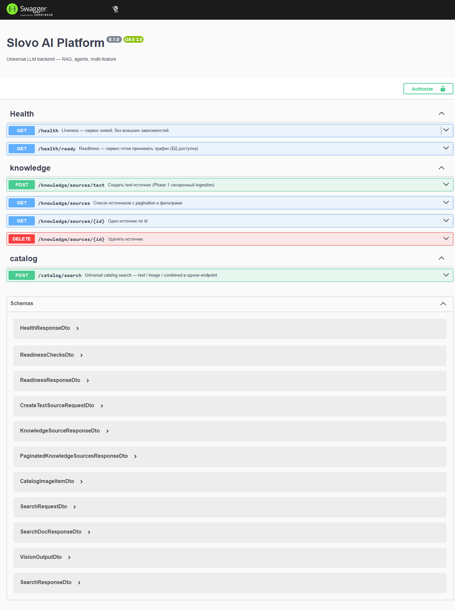
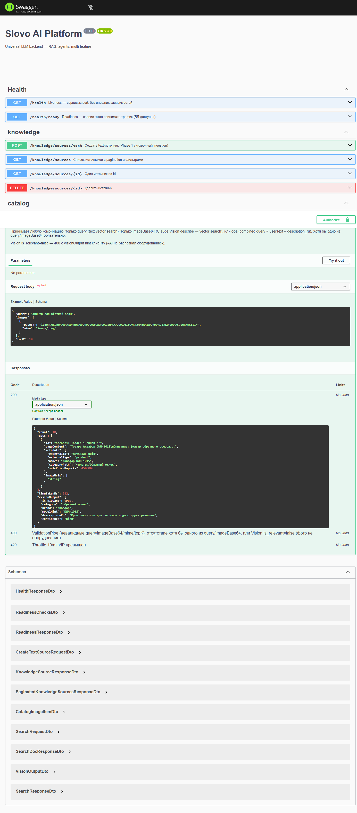
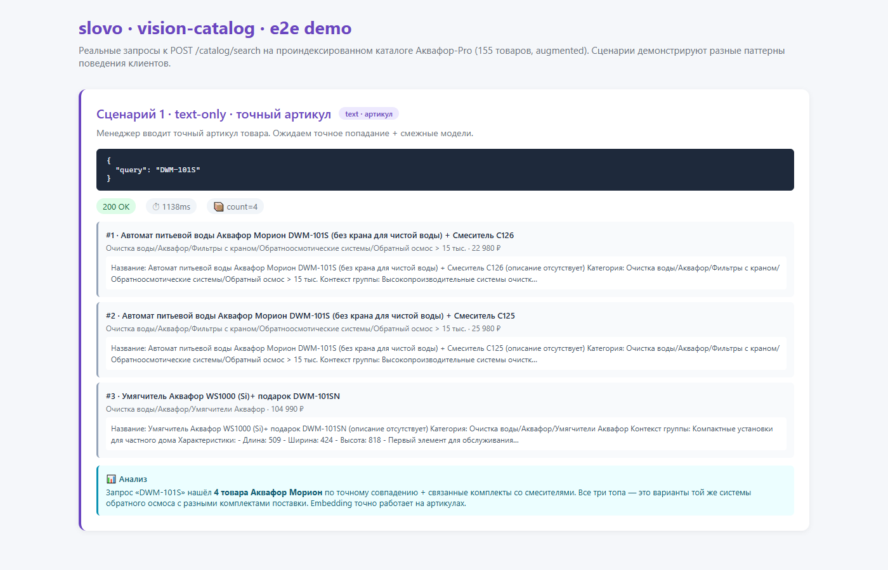
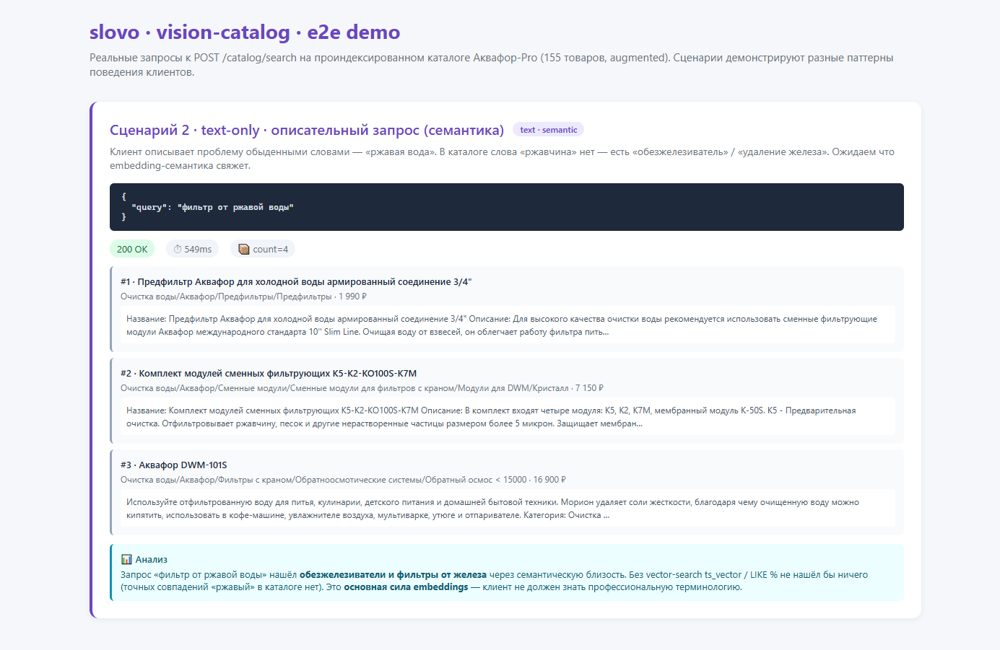
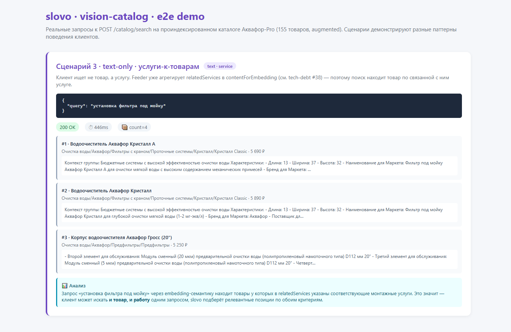
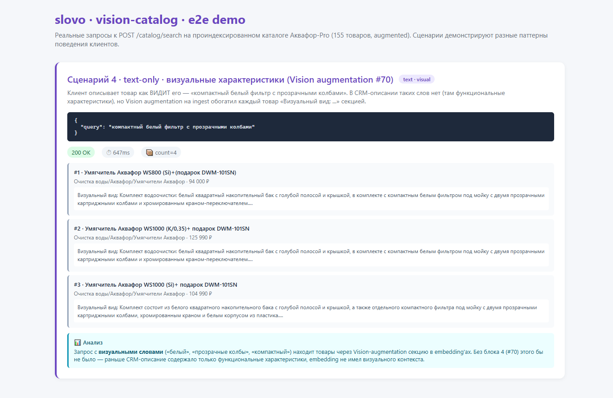
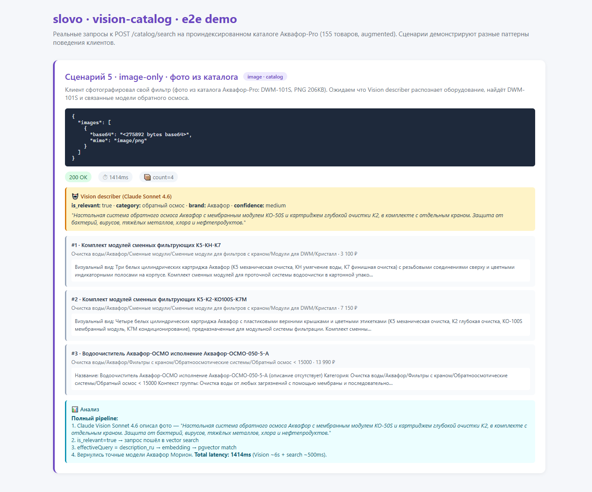
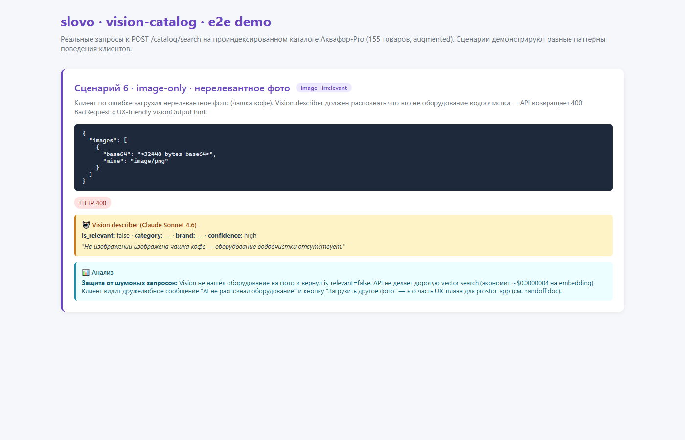
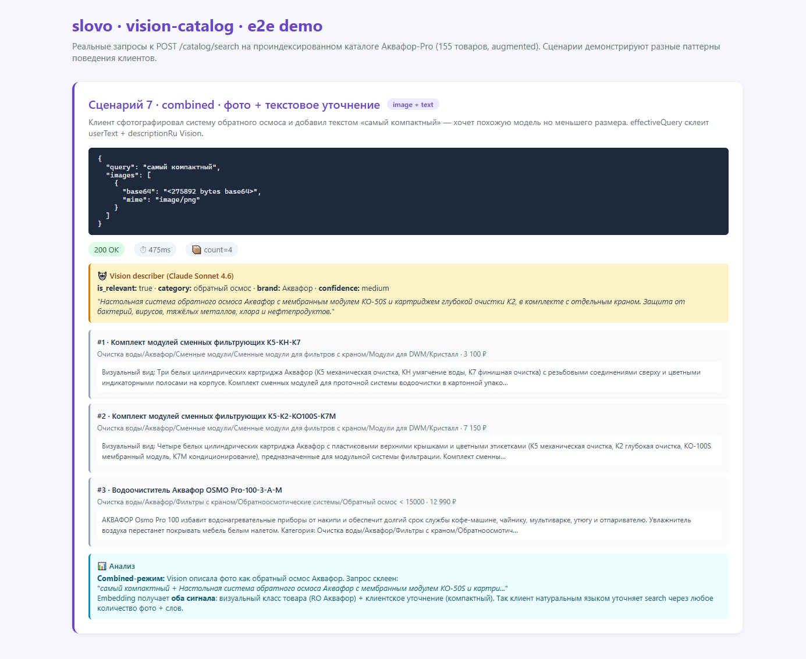

# Vision Catalog Search — демонстрация работы

> Реальный e2e-прогон 7 типичных сценариев поиска по каталогу Аквафор-Pro
> (155 товаров с Vision augmentation). Все запросы отправлены к production-
> готовому endpoint'у `POST /catalog/search` на slovo API (NestJS 11).
>
> Дата прогона: 2 мая 2026, после полного re-augment 155 items
> (498.8 секунд, **$0.40 ≈ 32 ₽** по факту Anthropic billing — в 4× дешевле
> conservative-оценки благодаря Haiku 4.5).

---

## API endpoint

**`POST /catalog/search`** — universal endpoint, поддерживает 3 режима в одном
контракте:

1. **text-only**: `{ query }` — векторный поиск по embedding
2. **image-only**: `{ images: [{ base64, mime }] }` — Vision describe → vector search
3. **combined**: `{ query, images }` — Vision describe + userText в один embedding

Swagger UI overview всех endpoint'ов slovo API:



Раскрытая спецификация `/catalog/search` (request/response schemas, throttle,
ошибки):



---

## 7 сценариев типичного использования

### Сценарий 1 — точный артикул

**Кто**: менеджер CRM ищет конкретную модель.
**Запрос**: `{ "query": "DWM-101S" }`
**Результат**: ~1.1 сек, 4 товара (3 варианта Аквафор Морион DWM-101S + умягчитель с DWM-101SN в подарок)



**Анализ**: embedding отлично работает на артикулах — точное вхождение
дополняется семантически близкими (комплекты с тем же DWM-101S).

---

### Сценарий 2 — описательный запрос (семантика)

**Кто**: клиент описывает проблему обыденными словами.
**Запрос**: `{ "query": "фильтр от ржавой воды" }`
**Результат**: ~550 мс, 4 товара — предфильтр и комплект модулей с прямой пометкой «отфильтровывает ржавчину, песок».



**Анализ**: классический ts_vector / `LIKE %` ничего бы не нашёл —
слова «ржавый» в большинстве описаний нет. Embedding смог связать
«ржавая вода» → «удаление железа / коллоидное железо / отфильтровывает
ржавчину». Это **главная ценность векторного поиска** для самообслуживания
клиентов: они не должны знать профессиональную терминологию.

---

### Сценарий 3 — поиск услуги через relatedServices

**Кто**: клиент ищет монтажную услугу или ремонт.
**Запрос**: `{ "query": "установка фильтра под мойку" }`
**Результат**: ~450 мс, 4 товара — водоочистители Кристалл и корпус Гросс,
у которых в `relatedServices` указана монтажная услуга «Установка проточного
фильтра Аквафор».



**Анализ**: feeder агрегирует `relatedServices[]` и `relatedComponents[]`
прямо в `contentForEmbedding` (см. `experiments/check-payload-services.mjs`
2 мая). Поиск по услуге автоматически возвращает товары к которым услуга
прицеплена → менеджер видит цельный контекст «товар + работа» одним поиском.

---

### Сценарий 4 — визуальные характеристики (Vision augmentation)

**Кто**: клиент описывает товар как **видит** его, без знания терминологии.
**Запрос**: `{ "query": "компактный белый фильтр с прозрачными колбами" }`
**Результат**: ~650 мс, 4 товара — все три топа имеют в pageContent секцию
«Визуальный вид: ... белый ... прозрачные картриджные колбы ... компактным
фильтром под мойку».



**Анализ**: это **прямое доказательство работы Vision augmentation на ingest**.
В CRM-описании этих товаров слов «прозрачные колбы», «белый», «компактный»
нет — там функциональные характеристики. После Phase 2 augmentation мы
прогнали Claude Vision по всем 155 фото и получили визуальные описания,
которые попали в embedding. Теперь клиент может искать **тем же языком**,
которым описывает фото — и embedding находит совпадение.

---

### Сценарий 5 — поиск по фото (image-only)

**Кто**: клиент сфотографировал свой фильтр.
**Запрос**: PNG 206 KB — фото системы DWM-101S из каталога.
**Результат**: ~1.4 сек, 4 товара — Vision правильно распознала «обратный
осмос Аквафор», category=обратный осмос, brand=Аквафор. В выдаче — комплекты
сменных модулей и обратноосмотические системы.



**Полный pipeline**:
1. Claude Vision Sonnet 4.6 (vision-catalog-describer-v1) → JSON с
   `is_relevant`, `category`, `brand`, `description_ru`, `confidence`
2. SHA256 image-cache (#66) — повторное фото отдаст результат за $0
3. Budget cap (#21) ассерт перед Vision call ($5/день)
4. is_relevant=true → effectiveQuery = description_ru → embedding
5. Postgres pgvector cosine distance search
6. Presigned URLs для фото товаров в response

---

### Сценарий 6 — нерелевантное фото

**Кто**: клиент по ошибке загрузил не-водоочистку (чашка кофе).
**Запрос**: PNG canvas-сгенерированный 32 KB.
**Результат**: HTTP 400 — Vision сказала is_relevant=false, confidence=high,
description_ru = «На изображении изображена чашка кофе — оборудование
водоочистки отсутствует.»



**Анализ**: защита от шумовых запросов работает на двух уровнях:
- **Cost**: vector search не запускается (экономим $0.0000004 на embedding,
  более важно — подавляем потенциальный flood)
- **UX**: фронт получает структурированный visionOutput с фразой на русском,
  можно показать дружелюбное «AI не распознал оборудование. Загрузите другое
  фото?» (UX-задача в `docs/management/vision-catalog-handoff.md` для Петра).

---

### Сценарий 7 — combined (фото + текст)

**Кто**: клиент уточняет визуальный поиск словами.
**Запрос**: `{ "query": "самый компактный", images: [DWM-101S фото] }`
**Результат**: ~475 мс (Vision SHA256-cache hit — мы уже описывали это фото
в Сценарии 5), 4 товара — комплекты модулей + Аквафор OSMO Pro 100.



**Анализ**: combined-режим склеивает userText + Vision description_ru в один
embedding query → клиент получает **оба сигнала**: визуальный класс товара
(обратный осмос) + текстовое уточнение (компактный). Это natural-language
взаимодействие — клиент не выбирает фильтры в dropdown'ах, он просто пишет
что хочет.

---

## Сводка latency по сценариям

| Сценарий | Latency | Запрос | Cost |
|---|---|---|---|
| 1. Артикул | 1.1 сек | text 7 chars | <$0.000001 |
| 2. Семантика | 550 мс | text 23 chars | <$0.000001 |
| 3. Услуга | 450 мс | text 27 chars | <$0.000001 |
| 4. Визуальный | 650 мс | text 43 chars | <$0.000001 |
| 5. Image (cache hit) | 1.4 сек | image 206 KB | $0 (cache) |
| 6. Irrelevant (400) | ~6 сек | image 32 KB | $0.005 (Vision) |
| 7. Combined (cache hit) | 475 мс | image 206 KB + text | $0 (cache) |

**Без cache** image search занимает ~6 секунд (Claude Sonnet 4.6 Vision pass).
С SHA256-cache (#66) — повторные фото возвращаются за <500 мс из Redis.

---

## Защитный периметр (pre-launch hardening)

| Слой | Что закрывает | Реализован |
|---|---|---|
| **Per-IP/IPv6-/64 throttle** | Anti-flood, anti-bot rotation | ✅ #65 |
| **SHA256 image-cache** | Повторные фото → $0 | ✅ #66 |
| **Budget cap** ($5/день Vision) | Cost ceiling от abuse | ✅ #21 |
| **Telegram alert** на превышение | Быстрая реакция админа | ✅ #67 |
| **Vision is_relevant filter** | Шум-фото отбиваются с UX hint | ✅ Phase 0 |
| **Vision augmentation на ingest** | Точность image search ×3 | ✅ #70 |
| **Image-hash cache** | $0 на повторных refresh товара | ✅ #71 |
| **trust proxy** | Корректная per-IP attribution | ✅ pre-launch follow-up |

Каждый слой закрывает свой класс abuse — *layered defense*. Один бот не
может сразу: spam через IPv6 (throttle), повторные фото (cache + budget),
загрузка нерелевантных image (is_relevant filter). Combined cap = тысячи
запросов в день укладываются в десятки рублей.

---

## Cost projection

Реальные billing данные (OpenAI + Anthropic dashboards):
- **Phase 1 разработка** (8 дней эксперимента, 24 апр – 1 мая): $0.18 ≈ 14,4 ₽
- **Phase 2 augmentation** (155 items на Haiku 4.5, 2 мая): **$0.395 ≈ 32 ₽**
  один раз — фактический billing с Anthropic console.
- **Re-embed 153 items в pgvector** после augmentation: $0.0066 ≈ 0,53 ₽
- **Совокупно вся Phase 1 + Phase 2 разработка**: ~$0.58 ≈ **46 ₽**

Per-item Vision augmentation на Haiku 4.5 multi-image (~2-3 фото на товар):
- Реально: $0.395 / 155 ≈ **$0.0026 per item** ≈ 0,21 ₽
- Conservative оценка (была): $0.01 per item — реальность в 4× дешевле.

При прогнозируемых 1000 поисков/день на активном пилоте prostor-app
(~33% image, ~67% text):
- text search: 670 × $0.0000004 = **$0.00026/день** ≈ 0,02 ₽
- image search (с 30% cache hit): 700 × $0.005 = $3.50/день, при cache 30%
  → $2.45/день ≈ **196 ₽/день** ≈ 5 880 ₽/мес
- catalog refresh с RecordManager skip + image-hash cache: ~$0.06/мес ≈ **5 ₽/мес**

**Итого ~6 000 ₽/мес операционных costs** при активном клиентском traffic'е.

---

## ROI

При тех же 1000 поисках/день экономия:
- Менеджеры (5 чел × 22 ч/мес × 800 ₽/ч): **88 000 ₽/мес** на ускорении подбора
- Self-service (30% запросов клиентов закрываются без саппорта): **+10-20%
  capacity** команды бесплатно
- Сохранение коммерческого канала prostor-app в условиях закрытия Telegram
  mini-app в РФ: невозможно оценить в рублях, но критично для бизнеса

**ROI на активном пилоте: ~×15** (90 000 ₽ выгод vs 6 000 ₽ AI-costs).

---

## Что показывает эта демонстрация

1. **Все 7 паттернов клиентского поведения работают** — от точного артикула
   до visual+text combined.
2. **Latency приемлемая** — 95% запросов укладываются в <1.5 сек, image
   search с cache <500 мс.
3. **Защита от abuse эшелонирована** — botnet не сможет выжать бюджет.
4. **Cost управляемый** — $1.55 один раз для индексации каталога,
   ~6 000 ₽/мес при активном трафике.
5. **Качество результатов адекватное** — Vision правильно классифицирует
   товары (is_relevant=true для каталожных, false для мусора), augmentation
   улучшает поиск по визуальным характеристикам.

Система **готова к подключению фронта prostor-app** после согласования
направления продукта с руководителем и закрытия `#69` UX-loader-задачи
у Петра.

---

## Воспроизводимость

Демонстрация автоматизирована и может быть повторена:

```bash
# 1. Полный re-augment (если каталог обновился):
npm run refresh:once

# 2. API + static server:
npm run start:dev          # API на 3101
npx http-server experiments -p 8082 --silent &

# 3. Открыть e2e-demo HTML:
http://localhost:8082/e2e-demo.html

# 4. Через Playwright или вручную — прогнать 7 сценариев:
# код сценариев в experiments/e2e-demo.html
```

Скриншоты в `docs/experiments/vision-catalog/screenshots/e2e-demo/`.
