# Анализ воды Аквафор: 15 504 бланка превращены в структурированный датасет

> Executive summary для руководителя. Технические детали — `docs/features/water-analysis.md`, разведочный анализ — `docs/experiments/water-analysis/2026-05-06-stage-1b-eda.md`.
> **Статус:** ✅ Этапы 1.A (extract) + 1.A.5 (geocode + AI-verify) + 1.B (normalize) + **Phase 2 (embeddings + endpoint поиска похожих)** закрыты на 7 мая 2026. Endpoint `POST /water-analysis/similar` принимает анализ воды и за ~600 мс возвращает топ-K максимально похожих бланков из 15 504. Готов к подключению алгоритма подбора оборудования и интеграции с `prostor-app` / CRM Аквафор-Pro.

---

## Что построено

AI-pipeline превращения **5 484 файлов исторических бланков воды** Аквафор-Pro (DOCX/DOTX от 2020 до 2026 года) в **структурированный датасет** для аналитики и подбора оборудования.

```mermaid
flowchart LR
    A[5 484 DOCX/DOTX<br/>исходные бланки] --> B[Конвертация<br/>в PDF + PNG]
    B --> C[Claude Vision<br/>извлечение параметров]
    C --> D[15 504 бланка<br/>в WaterAnalysisRaw]
    D --> E[Геокодирование<br/>через Ahunter]
    E --> F[AI-verify адресов<br/>97.6% с координатами]
    F --> G[Нормализация<br/>parsers + СанПиН справочник]
    G --> H[15 504 в WaterAnalysis<br/>21 paramCode + флаги]
    H --> I[Embeddings<br/>OpenAI 3072 dim]
    I --> J[Endpoint /similar<br/>топ-K за 600 мс]
```

**Что значит «структурированный»:** для каждого бланка извлечены и приведены к единым единицам измерения 14-16 химических параметров (железо, марганец, жёсткость, нитраты, мутность, pH, минерализация, и др.), плюс метаданные — координаты, тип источника, глубина скважины, имя лаборатории.

---

## Бизнес-ценность

| Что улучшается | Как |
|---|---|
| **База для алгоритма подбора оборудования** | 15 504 примера с региональной привязкой + связка с vision-catalog (155 товаров) — специалист по водоочистке сможет построить правила «параметр → товар», система применит их на новых анализах |
| **Аналитика рынка** | Видно где (по регионам/районам/глубинам скважин) какие проблемы воды доминируют — фокус продаж |
| **Поиск похожих анализов** | Клиент даёт свой анализ — система находит 5-10 максимально похожих в датасете и показывает что им подбирали |
| **Скорость подготовки КП** | Менеджер видит «по таким параметрам в этом районе обычно ставят X» — не нужно думать с нуля |
| **Тренды по сезонам / годам** | 6 лет данных — видна динамика: куда движется качество воды в МО |
| **Обоснование маркетинга** | Цифры «50% скважин МО превышают ПДК по железу» — это готовый аргумент для рекламы |

---

## Технологический стек

| Компонент | Назначение | Лицензия |
|---|---|---|
| **Claude Vision (Haiku 4.5)** | Извлечение значений из сканов бланков | Pay-as-you-go ~$0.0001/бланк |
| **Gotenberg** | Конвертация DOCX/DOTX → PDF | Open-source, self-hosted |
| **pdf-img-convert** | PDF → PNG для Vision API | Open-source |
| **Ahunter API** | Геокодирование адресов (РФ-лицензия) | Платная подписка |
| **PostgreSQL + PostGIS + pgvector** | Хранение, гео-поиск, будущие embeddings | Open-source |
| **NestJS + Prisma + Docker** | Backend и инфраструктура | Open-source |
| **TypeScript + Jest** | Нормализатор СанПиН-справочник + 110 unit-тестов | Open-source |

---

## Стоимость

### Что компания заплатила за 15 504 бланка (Этап 1.A)

| Статья | $ | ₽ (≈100 ₽/$) |
|---|---:|---:|
| Anthropic API base (Claude Haiku 4.5) | $176.25 | 17 625 ₽ |
| VAT 21% (digital services) | +$37.01 | +3 700 ₽ |
| Currency conversion (~2%) | +$4.27 | +427 ₽ |
| Ahunter (геокодирование + cleanse адресов) | — | ≥ 2 000 ₽ |
| OpenAI embeddings (`text-embedding-3-large`, 15 504 анализа) | $0.29 | 29 ₽ |
| **Total Этап 1.A + Phase 2 real-spend** | **~$217.82 + Ahunter** | **≥ 23 779 ₽** |
| Per-record (без Ahunter и embeddings, который фиксированный) | $0.014 | **~1.40 ₽/бланк (Anthropic)** |

**Что в эту цифру не входит** (бесплатное):
- Нормализация (только локальный CPU, TypeScript без API) — $0
- Хранение (PostgreSQL) — ~$0 (15 504 строк ≈ 30 MB)

### Что закладывать на дальше

| Задача | Стоимость | Когда |
|---|---:|---|
| ~~Vision retry для 994 бланков~~ | **$0 (сделано)** | ✅ 1 084 бланков восстановлены через pdftotext (text-based PDF), Mg coverage поднялась с 88.9% до **95.9%** без затрат |
| ~~Embeddings + endpoint поиска похожих~~ | **$0.29 (сделано)** | ✅ Phase 2 закрыт 2026-05-07: 15 504 embeddings через OpenAI `text-embedding-3-large` (3072 dim) за 176 секунд, endpoint `POST /water-analysis/similar` с фильтрами region / depth / intakeType |
| Live-запросы (новый клиент → подбор похожих анализов) | **~$0.00002/запрос** (≈0.002 ₽) | Pay-per-use, embedding запроса при поиске. На 100 000 запросов в месяц — ~200 ₽ |
| Прод-инстанс PostgreSQL + Hetzner | **~50 €/мес** | После запуска фичи в `prostor-app` |
| Equipment-matcher endpoint (когда специалист задаст правила) | $0 | Phase 3, требует правил «параметр воды → товары» от специалиста Аквафор |
| Geo-фильтр по радиусу от точки клиента | $0 | Phase 2.5, при появлении prostor-app виджета (нужен конкретный UX-кейс) |

**Главная экономия:** все 15 504 исторических бланка распознаны единоразово — повторно платить не нужно. При росте до 50 000 бланков extraction будет стоить пропорционально (~70 000 ₽).

---

## Главные находки в датасете

### Распределение источников

| Тип источника | Бланков | % | Что значит для бизнеса |
|---|---:|---:|---|
| **Скважина** | 10 277 | **66.3%** | Основной сегмент клиентов Аквафор |
| **Водопровод** | 3 384 | 21.8% | Городские квартиры, частные дома с центральным |
| **Колодец** | 1 800 | 11.6% | Дача, верховодка |
| Родник + другое | 43 | 0.3% | Нерепрезентативная выборка |

### Главный сигнал рынка

**Половина скважинных бланков** превышает ПДК по 5 ключевым параметрам.

> **Знаменатель:** % от бланков типа где параметр был измерен (а не от всех бланков типа). Это интуитивно понятный угол — «из тех где меряли — сколько превышают».

| Параметр (ПДК СанПиН 1.2.3685-21) | % скважин превышают | % водопровод превышают | Какое оборудование адресует |
|---|---:|---:|---|
| Жёсткость > 7 мг-экв/л | **55.7%** | 50.1% | Умягчитель |
| Мутность > 2.6 ЕМФ | **54.9%** | 28.7% | Механическая фильтрация |
| Железо > 0.3 мг/л | **50.1%** | 25.1% | Обезжелезиватель |
| Цветность > 20 град | **46.5%** | 23.0% | Угольный фильтр (часто органика) |
| Марганец > 0.1 мг/л | **41.7%** | 23.8% | Безреагентная или реагентная система |

> **Интерпретация:** Скважины МО объективно требуют комплексной водоподготовки — это не маркетинговое преувеличение, а медианная реальность. **Что чем фильтровать конкретно — определяет специалист по водоочистке** на основе профиля каждого анализа.

### Глубина источников (по запросу руководителя)

| Тип | Бланков | Средняя глубина | Медиана | Max | Что значит |
|---|---:|---:|---:|---:|---|
| **Скважина** | 7 884 | **49.1 м** | 47 м | 300 м | Между верховодкой и артезианской |
| Колодец | 742 | 8.4 м | 8 м | 39 м | Всегда верховодка |
| Водопровод | 8 | 79 м | 65 м | 160 м | Малая выборка, нерепрезентативно |

### Корреляция глубина ↔ качество воды (только скважины)

| Диапазон глубин | Бланков | Fe avg, мг/л | Mn avg, мг/л | Жёсткость avg | Что подбирать |
|---|---:|---:|---:|---:|---|
| **< 25 м (верховодка)** | 1 393 | **2.55** | **0.583** | 7.27 | Полная система: уголь + обезжелезиватель + умягчитель |
| 25-50 м | 2 724 | 1.36 | 0.275 | 7.55 | Стандартный пакет |
| **50-100 м** | 3 406 | **1.16** | **0.194** | 7.34 | Минимум по Fe/Mn |
| 100-200 м (артезианская) | 354 | 1.65 | 0.236 | 7.66 | Базовый + умягчитель |
| > 200 м (глубокая артезианская) | 7 | 0.18 | 0.069 | **11.48** | Акцент на умягчении |

> **Сигнал для алгоритма подбора:** скважины до 25 м — самая грязная вода, требует **полного комплекта**; 50-100 м — самая чистая по Fe/Mn (но жёсткость остаётся проблемой везде).

### География

| Регион | Бланков | % |
|---|---:|---:|
| Московская область | 11 356 | **73.2%** |
| Москва | 282 | 1.8% |
| Рязанская | 309 | 2.0% |
| Без региона (геокодирование не дало результата) | 3 556 | 22.9% |

73% датасета — Подмосковье. Это и core-рынок Аквафор-Pro, и наибольшая статистическая значимость. 23% бланков без региона — кандидат на manual review (план следующих этапов).

---

## Какие параметры доступны для downstream-алгоритмов

> **Важно:** алгоритм подбора оборудования (какой параметр → какой фильтр) — это задача **специалиста по водоочистке** Аквафор. Мы предоставляем датасет химических параметров + bridge к каталогу оборудования (через vision-catalog: 155 товаров с описаниями уже доступны). Совмещение этих двух датасетов позволит специалисту построить алгоритм матчинга.

### Покрытие параметров в датасете

| Параметр | % покрытия | Тип значения |
|---|---:|---|
| Жёсткость общая (hardness_total) | 97% | мг-экв/л |
| Железо общее (iron_total) | 99.8% | мг/л |
| Марганец (manganese) | 99.9% | мг/л |
| Окисляемость перманганатная | 97.8% | мг/л |
| Цветность | 100% | град |
| Мутность | 100% | ЕМФ |
| pH | 100% | ед. |
| Минерализация (TDS) | 100% | мг/л |
| Нитраты | 99% | мг/л |
| Сероводород / сульфиды | 99.7% / 99.6% | мг/л |
| Запах (числовая интенсивность) | 99.3% | балл |
| Запах (характер: землистый/жжёный/...) | 0.7%* | строка |
| Магний | 95.9% | мг/л |
| Электропроводность | 62%** | мкСм/см |
| Фториды | 91.3% | мг/л |
| Кальций | 0.3% | мг/л |
| Хлориды | 0.006% (1 запись) | мг/л |
| Нитриты | 0.22% | мг/л |
| Аммоний | 0% (не измеряется) | мг/л |

\* В 99.3% бланков числовая интенсивность 0-5 баллов. Буквенный код характера запаха по ГОСТ 3351 (1ж, 2зис, 3хл) пока в paramsUnknown — задача парсинга в backlog.
\*\* Только в новом 16-строчном шаблоне бланка.

### Что есть для географической аналитики

| Что | Покрытие |
|---|---:|
| Координаты (lat/lon) — позволяют находить анализы в радиусе X км | 97.6% |
| Регион / город (region / locality) | 73% МО + 4% Москва/Рязань |
| Тип источника (скважина/колодец/водопровод) | 100% |
| Глубина источника (для скважин/колодцев) | 55.7% — есть только в новых шаблонах |
| Дата отбора | 100% |

### Bridge к каталогу оборудования

Параллельно в slovo уже работает **vision-catalog-search** — 155 товаров Аквафор-Pro с фото, ценами, описаниями (см. `docs/management/vision-catalog-executive-summary.md`). Когда специалист определит правила соответствия «параметр воды → товар», их будет легко связать через семантический поиск на стороне vision-catalog.

---

## Честные ограничения датасета

> Чтобы при глубоком анализе не было неожиданностей.

| Ограничение | Влияние | План |
|---|---|---|
| **Магний — 95.9% покрытие** (14 861 / 15 504) | Старые шаблоны бланков 2020-2022 (~800 шт, 13-14 строк) физически не содержали Mg/Ca — это особенность лабораторного шаблона того периода, не потеря данных. В новых бланках 2024-2026 — **99.6-99.8% после pdftotext rescue** (1 084 бланка восстановлены без Vision API из text-layer PDF) | 53 PDF (broken font encoding) — на Tesseract OCR в backlog |
| **Кальций — 0.3%** (48 бланков) | Аквафор-лаборатория не измеряет Ca в стандартном пакете. Для общего подбора умягчителя достаточно жёсткости. Индекс Лангелье недоступен | Принять как есть — для прикладных задач не критично |
| **Хлориды — 1 запись** на 15 504 | Не входит в стандартный пакет Аквафор | Принять как есть |
| **Запах — 0.7% бланков** (111) с буквенным кодом по ГОСТ 3351 («3ж») | Числовая интенсивность сохранена в 99.3% бланков. Характер запаха (землистый/жжёный/болотный = органика) — пока не парсится | Backlog: парсинг character — повышает точность подбора угольного фильтра |
| **Outliers** (Mg=5045, odor=53, Fe=187) | Vision OCR-ошибки в единичных бланках, попадают в paramFlags для review | Не влияют на медианы/p95, при аналитике использовать robust-статистику |

### Метрики качества (3 разных угла, чтобы не путать)

| Метрика | Значение | Что значит |
|---|---|---|
| **Качество TS-парсера** | **97% clean** | Из 100 случайных бланков 97 не имеют логических дефектов нормализации |
| **End-to-end accuracy vs PNG** | **93%** | Независимый агент-аудитор сверил 25 random бланков с PNG — 23 совпали полностью |
| **Magnesium coverage в новых бланках (16 строк)** | **99.83%** | Свежие данные 2023-2026 практически без потерь |

---

## Что дальше

### ✅ Phase 2 (закрыта 2026-05-07)

| Что сделано | Артефакт | Затраты |
|---|---|---:|
| Embeddings 15 504 бланков → векторный индекс | OpenAI `text-embedding-3-large` (3072 dim), Flowise Document Store с HNSW pgvector | $0.29 (29 ₽) |
| Endpoint `POST /water-analysis/similar` | Принимает структурированный анализ + опциональные фильтры (regionContains, localityContains, depthRange, matchIntakeType), возвращает топ-K похожих за ~600 мс | $0 |
| Throttle 60 запросов/мин/IP | Защита от перегрузки индекса при public deploy | $0 |
| 128 unit/e2e-тестов | Контракт endpoint'а зафиксирован тестами, регрессия ловится в CI | $0 |

### Phase 2.5 (отложена до prostor-app потребителя)

| Задача | Когда триггерится |
|---|---|
| Geo-фильтр по радиусу от точки клиента (`PostGIS ST_DWithin`) | Когда виджет в prostor-app появится — будет конкретный UX-кейс (radius hard-cutoff vs weighted re-rank по дистанции) |
| Endpoint `GET /water-analysis/by-region/:region` — статистика воды в районе | Когда понадобится региональная аналитика на витрине |

### Что нужно от Аквафор (бизнес-сторона)

- **Специалист по водоочистке** — определит правила «параметр воды (или комбинация) → подходящие товары/услуги» на основе данных датасета и знания продуктов. Без этого алгоритм подбора построить нельзя.
- Доступ к каталогу товаров Аквафор-Pro для bridge с vision-catalog (часть товаров уже в нашей БД, нужны regularupdate).
- Согласование где встраивать (виджет в `prostor-app` / CRM-карточка / админ-аналитика).

### Phase 3 (после правил подбора)

- Интеграция с `prostor-app` (виджет «загрузите анализ — увидите похожие случаи и рекомендуемое оборудование»)
- Интеграция с CRM Аквафор-Pro (карточка клиента видит автоматическую подсказку)
- Региональная аналитика (карта МО с heatmap по жёсткости/железу/etc.)

---

## Резюме одной фразой

**15 504 бланка анализов воды Аквафор-Pro за 2020-2026 год превращены в структурированный датасет с географической привязкой и векторным индексом; 97% качество нормализации, 93% end-to-end accuracy, 95.9% Mg coverage (с 99.8% в свежих 2024-2026 после pdftotext rescue); стоимость extraction + embeddings ≥ 23 779 ₽ (Anthropic ~21 750 + Ahunter ≥ 2 000 + OpenAI 29 ₽); готов endpoint `POST /water-analysis/similar` отдающий за ~600 мс топ-K похожих с опциональными фильтрами по региону / глубине / типу источника; ждём правил подбора оборудования от специалиста по водоочистке Аквафор.**
