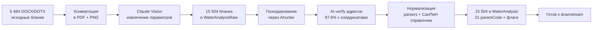

# Анализ воды Аквафор: 15 504 бланка превращены в структурированный датасет

> Executive summary для руководителя. Технические детали — `docs/features/water-analysis.md`, разведочный анализ — `docs/experiments/water-analysis/2026-05-06-stage-1b-eda.md`.
> **Статус:** ✅ Этапы 1.A (extract) + 1.A.5 (geocode + AI-verify) + 1.B (normalize) закрыты на 6 мая 2026. Готов к downstream — поиску похожих анализов, алгоритму подбора оборудования, региональной аналитике.

---

## Что построено

AI-pipeline превращения **5 484 файлов исторических бланков воды** Аквафор-Pro (DOCX/DOTX от 2020 до 2026 года) в **структурированный датасет** для аналитики и подбора оборудования.

**Что значит «структурированный»:** для каждого бланка извлечены и приведены к единым единицам измерения 14-16 химических параметров (железо, марганец, жёсткость, нитраты, мутность, pH, минерализация, и др.), плюс метаданные — координаты, тип источника, глубина скважины, имя лаборатории.

---

## Бизнес-ценность

| Что улучшается | Как |
|---|---|
| **Алгоритм подбора оборудования** | Имея 15 504 примера с региональной привязкой, можно автоматически предлагать клиенту фильтры на основе похожих анализов в его районе |
| **Аналитика рынка** | Видно где (по регионам/районам/глубинам скважин) какие проблемы воды доминируют — фокус продаж |
| **Поиск похожих анализов** | Клиент даёт свой анализ — система находит 5-10 максимально похожих в датасете и показывает что им подбирали |
| **Скорость подготовки КП** | Менеджер видит «по таким параметрам в этом районе обычно ставят X» — не нужно думать с нуля |
| **Тренды по сезонам / годам** | 6 лет данных — видна динамика: куда движется качество воды в МО |
| **Обоснование маркетинга** | Цифры «50% скважин МО превышают ПДК по железу» — это готовый аргумент для рекламы |

---

## Технологический стек

| Компонент | Назначение | Лицензия |
|---|---|---|
| **Claude Vision (Haiku 4.5)** | Извлечение значений из сканов бланков | Pay-as-you-go ~$0.0001/бланк |
| **Gotenberg** | Конвертация DOCX/DOTX → PDF | Open-source, self-hosted |
| **pdf-img-convert** | PDF → PNG для Vision API | Open-source |
| **Ahunter API** | Геокодирование адресов (РФ-лицензия) | Платная подписка |
| **PostgreSQL + PostGIS + pgvector** | Хранение, гео-поиск, будущие embeddings | Open-source |
| **NestJS + Prisma + Docker** | Backend и инфраструктура | Open-source |
| **TypeScript + Jest** | Нормализатор СанПиН-справочник + 110 unit-тестов | Open-source |

---

## Стоимость

### Что компания заплатила за 15 504 бланка

| Этап | Стоимость | Детали |
|---|---:|---|
| Vision extraction (Claude Haiku 4.5) | **~$1.85** | Реальный billing Anthropic |
| Геокодирование (Ahunter) | **уже оплачено** (подписка) | 97.6% бланков получили координаты |
| Нормализация (только CPU/локально) | **$0** | TypeScript-парсер без API-вызовов |
| Хранение (PostgreSQL) | **~$0** | 15 504 строк = ~30 MB |
| **Итого extraction** | **~150 ₽** | За весь dataset |

### Что закладывать на дальше

| Этап | Стоимость | Когда |
|---|---:|---|
| Vision retry для 994 бланков с потерянным магнием | **~$5** (~400 ₽) | Опционально, повышает coverage с 88.9% до ~94% |
| Embeddings для семантического поиска похожих анализов | **~$3** (~250 ₽) | Phase 2 — когда понадобится поиск |
| Прод-инстанс PostgreSQL + Hetzner | **~50 €/мес** | После запуска фичи в `prostor-app` |
| Месячный расход на live-запросы (анализ нового клиента) | **~$0.0001/запрос** | Pay-per-use, масштабируется |

**Главная экономия:** все 15 504 исторических бланка распознаны единоразово — повторно платить не нужно.

---

## Главные находки в датасете

### Распределение источников

| Тип источника | Бланков | % | Что значит для бизнеса |
|---|---:|---:|---|
| **Скважина** | 10 277 | **66.3%** | Основной сегмент клиентов Аквафор |
| **Водопровод** | 3 384 | 21.8% | Городские квартиры, частные дома с центральным |
| **Колодец** | 1 800 | 11.6% | Дача, верховодка |
| Родник + другое | 43 | 0.3% | Нерепрезентативная выборка |

### Главный сигнал рынка

**Половина скважинных бланков** превышает ПДК по 5 ключевым параметрам:

| Параметр | % скважин > ПДК | % водопровод > ПДК | Решение |
|---|---:|---:|---|
| Жёсткость > 7 мг-экв/л | **54.2%** | 48.5% | Умягчитель |
| Мутность > 2.6 ЕМФ | **54.9%** | 28.7% | Механическая фильтрация |
| Железо > 0.3 мг/л | **50.1%** | 25.0% | Обезжелезиватель |
| Цветность > 20 град | **46.5%** | 22.9% | Угольный фильтр |
| Марганец > 0.1 мг/л | **41.7%** | 23.7% | Безреагентная система |

> **Интерпретация:** Скважины МО объективно требуют комплексной водоподготовки — это не маркетинговое преувеличение, а медианная реальность.

### Глубина источников (по запросу руководителя)

| Тип | Бланков | Средняя глубина | Медиана | Max | Что значит |
|---|---:|---:|---:|---:|---|
| **Скважина** | 7 884 | **49.1 м** | 47 м | 300 м | Между верховодкой и артезианской |
| Колодец | 742 | 8.4 м | 8 м | 39 м | Всегда верховодка |
| Водопровод | 8 | 79 м | 65 м | 160 м | Малая выборка, нерепрезентативно |

### Корреляция глубина ↔ качество воды (только скважины)

| Диапазон глубин | Бланков | Fe avg, мг/л | Mn avg, мг/л | Жёсткость avg | Что подбирать |
|---|---:|---:|---:|---:|---|
| **< 25 м (верховодка)** | 1 393 | **2.55** | **0.583** | 7.27 | Полная система: уголь + обезжелезиватель + умягчитель |
| 25-50 м | 2 724 | 1.36 | 0.275 | 7.55 | Стандартный пакет |
| **50-100 м** | 3 406 | **1.16** | **0.194** | 7.34 | Минимум по Fe/Mn |
| 100-200 м (артезианская) | 354 | 1.65 | 0.236 | 7.66 | Базовый + умягчитель |
| > 200 м (глубокая артезианская) | 7 | 0.18 | 0.069 | **11.48** | Акцент на умягчении |

> **Сигнал для алгоритма подбора:** скважины до 25 м — самая грязная вода, требует **полного комплекта**; 50-100 м — самая чистая по Fe/Mn (но жёсткость остаётся проблемой везде).

### География

| Регион | Бланков | % |
|---|---:|---:|
| Московская область | 11 356 | **73.2%** |
| Москва | 282 | 1.8% |
| Рязанская | 309 | 2.0% |
| Без региона (геокодирование не дало результата) | 3 556 | 22.9% |

73% датасета — Подмосковье. Это и core-рынок Аквафор-Pro, и наибольшая статистическая значимость. 23% бланков без региона — кандидат на manual review (план следующих этапов).

---

## Готовность downstream use-cases

| Сценарий | Готовность | Параметры в датасете |
|---|---|---|
| Подбор умягчителя | ✅ полная | hardness_total (97% покрытие) |
| Подбор обезжелезивателя | ✅ полная | iron_total (99.8%) |
| Подбор угольного фильтра по органике | ✅ полная | окисляемость (98%), цветность (100%) |
| Подбор обратного осмоса | ✅ полная | TDS (100%) + жёсткость для пред-умягчителя (97%) |
| Подбор нитратного фильтра | ✅ полная | nitrates (99%) |
| Поиск похожих анализов в районе | ✅ полная | geo_point + GiST индекс, lat/lon в 97.6% |
| Подбор угольного фильтра по характеру запаха | 🟡 частичная | odor числовая (99.3%); характер (землистый/болотный/жжёный) — в backlog |
| Расчёт индекса Лангелье (накипь) | 🔴 нет | требует кальций отдельно от магния, calcium 0.3% |

---

## Честные ограничения датасета

> Чтобы при глубоком анализе не было неожиданностей.

| Ограничение | Влияние | План |
|---|---|---|
| **Магний — 88.9% покрытие** (13 777 / 15 504) | Старые шаблоны бланков 2020-2022 (~800 шт, 13-14 строк) физически не содержали Mg/Ca — это особенность лабораторного шаблона того периода, не потеря данных. В новых полных бланках 2023-2026 (16 строк) coverage 99.83% | Опциональный retry за ~$5 даст +994 бланка из 15-стр шаблонов |
| **Кальций — 0.3%** (48 бланков) | Аквафор-лаборатория не измеряет Ca в стандартном пакете. Для общего подбора умягчителя достаточно жёсткости. Индекс Лангелье недоступен | Принять как есть — для прикладных задач не критично |
| **Хлориды — 1 запись** на 15 504 | Не входит в стандартный пакет Аквафор | Принять как есть |
| **Запах — 0.7% бланков** (111) с буквенным кодом по ГОСТ 3351 («3ж») | Числовая интенсивность сохранена в 99.3% бланков. Характер запаха (землистый/жжёный/болотный = органика) — пока не парсится | Backlog: парсинг character — повышает точность подбора угольного фильтра |
| **Outliers** (Mg=5045, odor=53, Fe=187) | Vision OCR-ошибки в единичных бланках, попадают в paramFlags для review | Не влияют на медианы/p95, при аналитике использовать robust-статистику |

### Метрики качества (3 разных угла, чтобы не путать)

| Метрика | Значение | Что значит |
|---|---|---|
| **Качество TS-парсера** | **97% clean** | Из 100 случайных бланков 97 не имеют логических дефектов нормализации |
| **End-to-end accuracy vs PNG** | **93%** | Независимый агент-аудитор сверил 25 random бланков с PNG — 23 совпали полностью |
| **Magnesium coverage в новых бланках (16 строк)** | **99.83%** | Свежие данные 2023-2026 практически без потерь |

---

## Что дальше

### Phase 2 (после согласования)

| Задача | Усилие | Стоимость |
|---|---|---:|
| Embeddings для каждого бланка → семантический поиск похожих анализов | 1-2 дня | **~$3** |
| Endpoint `POST /water-analysis/similar` — клиент даёт анализ, получает топ-10 похожих | 1 день | $0 |
| Endpoint `GET /water-analysis/by-region/:region` — статистика воды в районе | 0.5 дня | $0 |
| Алгоритм подбора оборудования — equipment matcher на основе паттернов в датасете | 2-3 дня | $0 |

### Phase 3 (бизнес-требование)

- Интеграция с `prostor-app` (виджет «загрузите свой анализ — мы подберём фильтр»)
- Интеграция с CRM Аквафор-Pro (карточка клиента видит автоматический подбор)
- Региональная аналитика (карта МО с heatmap по жёсткости/железу/etc.)

---

## Резюме одной фразой

**15 504 бланка анализов воды Аквафор-Pro за 2020-2026 год превращены в структурированный датасет с географической привязкой; 97% качество нормализации, 93% end-to-end accuracy; стоимость extraction ~150 ₽; готов к подключению к алгоритму подбора оборудования и поиску похожих анализов.**
