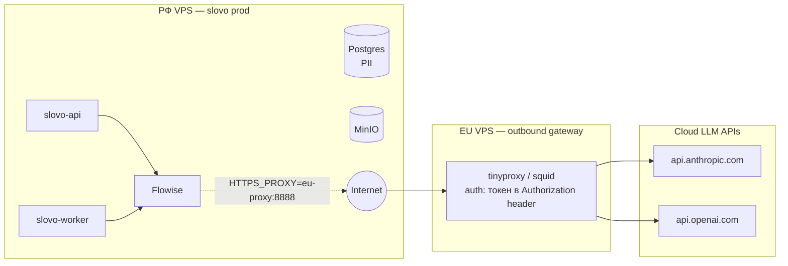

# slovo prod bootstrap

> **Статус:** draft 2026-05-20. Полная реализация в скоупе prod-deployment feature.

Два связанных скрипта для GitOps управления Flowise конфигурацией:

- **`npm run prod:export`** — снимает текущий snapshot Flowise (chatflows + document stores + variables) в `exports/`. Запускается из dev/staging узла после правок в UI. Commit в git → review → push.
- **`npm run prod:bootstrap`** — на prod-узле читает `exports/` + env vars, создаёт credentials из env, импортирует chatflows/document-stores с patch'ингом `{{CREDENTIAL_REF:name}}` ссылок на новые credential UUIDs.

После `docker compose -f docker-compose.prod.yml up -d` запускается `prod:bootstrap` и поднимает всё что **не хранится в docker volumes**:

- Flowise credentials (anthropic-prod, openai, postgres-slovo, minio-slovo) — из env vars
- Flowise document stores — из `exports/document-stores/*.json`
- Flowise chatflows — из `exports/chatflows/*.json`
- Flowise variables — из `exports/variables.json`
- (Опционально) restore Postgres из `.sql.gz` бэкапа
- (Опционально) restore MinIO buckets через `mc mirror`

## Принципы

1. **GitOps через export/import** — конфигурация Flowise живёт в git как JSON snapshot. Менеджер правит chatflow через UI Flowise (dev узел) → `prod:export` сносит exports/ и пишет fresh snapshot → git diff → commit → push. На prod `git pull && prod:bootstrap` поднимает новое состояние. Программные builder'ы (`@slovo/flowise-flowdata`) остаются только для PoC экспериментов, не для prod конфига.

2. **Snapshot, не incremental** — `prod:export` всегда **полностью** перезаписывает `exports/` (clean slate). Если менеджер удалил chatflow в UI — следующий export удалит JSON из git. Версионирование через **git history**, не filename-versioning.

3. **`manifest.json` для quick overview** — генерируется при экспорте. Содержит список всех ресурсов с `flowiseUpdatedDate`, для idempotent diff на bootstrap.

4. **Credentials НИКОГДА не в git** — только из env vars. `prod:export` strip-ит UUID'ы credential references в chatflow flowData → заменяет на `{{CREDENTIAL_REF:<name>}}` placeholder. На bootstrap эти placeholder'ы заменяются на real UUIDs создаваемых credentials по name-lookup.

5. **Идемпотентность** — `prod:bootstrap` проверяет existence по name. Same → skip. Manifest `flowiseUpdatedDate` > deployed → recreate. С `FORCE_RECREATE=1` — удаляет и пересоздаёт всё.

6. **Fail-fast на env** — при отсутствии required env var (например, `ANTHROPIC_API_KEY`) bootstrap падает с понятным сообщением **до** первого MCP вызова.

7. **Не бэкапим derived data** — embeddings в pgvector / chunks в Flowise sqlite **не** в git и не в бэкапах. Они regenerируются за ~10 мин через `catalog-refresh` worker из MinIO `latest.json`. Бэкапим только **source-of-truth**: Postgres business data + MinIO buckets.

## Структура

```
infrastructure/bootstrap/
├── README.md                       # этот файл
├── package.json                    # workspace package, npm run prod:bootstrap
├── tsconfig.json
├── bootstrap.ts                    # entry point, orchestrates 01-04
├── lib/
│   ├── flowise-client.ts           # HTTP-клиент к Flowise (re-uses @slovo/flowise-client)
│   ├── env-validator.ts            # fail-fast валидация required env
│   └── idempotent.ts               # checkExisting → create-or-skip helpers
├── 01-credentials.ts               # Flowise creds из env vars
├── 02-document-stores.ts           # catalog-aquaphor, water-analysis-aquaphor
├── 03-chatflows.ts                 # 5+ chatflows из chatflows/*.json
├── 04-variables.ts                 # cost-cap, throttle-limit и т.д.
├── chatflows/                      # canonical flowData JSON для всех chatflows
│   ├── catalog-vision-augmenter-v1.json
│   ├── vision-catalog-describer-v1.json
│   ├── water-analysis-extractor-vision-v1.json
│   ├── catalog-qa-poc-v1.json       # (опц., если оставляем PoC в проде)
│   └── ...
└── scripts/
    ├── backup.sh                   # pg_dump + mc mirror + rsync на off-site
    └── restore.sh                  # pg_restore + mc mirror restore
```

## Архитектурный слой: EU-proxy для исходящих к Anthropic/OpenAI

**Из РФ нет прямого доступа к `api.anthropic.com` / `api.openai.com`** (geo-block либо на CDN уровне). Прод-инсталляция slovo требует **отдельного EU VPS** с HTTP-proxy:



**Что идёт через proxy:**

- ✅ **Flowise** — все Vision-augmenter и Conversational-QA call'ы к Anthropic; все embedding'и через OpenAI. **Включается через `HTTPS_PROXY` env var в Flowise container**.
- ❌ **slovo-api / slovo-worker** — proxy не нужен. Они дёргают только локальный Flowise (`http://flowise:3000`), не LLM API напрямую.
- ❌ **bootstrap-scripts** — тоже не нужен proxy. Они общаются с локальным Flowise REST (`http://flowise:3000/api/v1/credentials/...`), это intranet вызовы.
- ✅ **Anthropic SDK через slovo-llm-runtime** (если когда-то добавится direct slovo→Anthropic) — Node.js undici ProxyAgent через preload-скрипт (см. `docs/guides/flowise-vs-nestjs.md` секция про prod gotchas). Сейчас slovo direct API calls не делает.

**EU proxy infra** живёт в отдельной директории `infrastructure/eu-proxy/` (TODO черновик):

- `docker-compose.proxy.yml` — tinyproxy (или squid) в Alpine-контейнере
- `tinyproxy.conf` — allow только slovo РФ-узла (по IP), порт 8888, auth через `BasicAuth user:token`
- Развёртывание на любом дешёвом EU VPS (Hetzner CX11 ~3 EUR/мес)
- DNS — отдельный subdomain `proxy.slovo.internal` или просто IP в .env

**Что НЕ делает EU proxy:**

- Не кэширует LLM responses — это задача Flowise (LLM cache + autocache на ChatAnthropic node).
- Не маскирует source IP внутри Anthropic/OpenAI — Anthropic видит EU IP, биллинг идёт как обычно.
- Не делает rate limiting — это уровень slovo budget cap (см. `vision-catalog-search.md` про BudgetService).

**152-ФЗ соответствие:** EU proxy **не хранит PII** — он stateless passthrough. Только passthrough HTTPS-туннель к Anthropic/OpenAI. Сам PII (адреса клиентов, history анализов воды) живёт в РФ Postgres, в content для Vision/embedding PII не передаётся (только generic фото оборудования + catalog descriptions).

## Required env vars

| Var | Required | Описание |
|---|---|---|
| `FLOWISE_API_URL` | ✅ | endpoint Flowise REST (например, http://flowise:3000) |
| `FLOWISE_API_KEY` | ✅ | bearer token Flowise admin API |
| `ANTHROPIC_API_KEY` | ✅ | для credential `anthropic-prod` |
| `OPENAI_API_KEY` | ✅ | для credential `openai-prod` (embeddings) |
| `POSTGRES_HOST` | ✅ | для credential `postgres-slovo-prod` |
| `POSTGRES_PORT` | ✅ | |
| `POSTGRES_DB` | ✅ | |
| `POSTGRES_USER` | ✅ | |
| `POSTGRES_PASSWORD` | ✅ | |
| `S3_ENDPOINT` | ✅ | MinIO endpoint для credential `minio-slovo-datasets` |
| `S3_ACCESS_KEY` | ✅ | |
| `S3_SECRET_KEY` | ✅ | |
| `S3_CATALOG_BUCKET` | ✅ | имя bucket для catalog (`slovo-datasets` по умолчанию) |
| `EU_PROXY_URL` | ✅* | URL EU-proxy (например, `http://1.2.3.4:8888`). \* required в `DEPLOYMENT_REGION=ru`, ignored в `dev`/`eu`. Прокидывается в Flowise container через `HTTPS_PROXY`. |
| `EU_PROXY_AUTH` | ✅* | basic-auth `user:password` для proxy. |
| `DEPLOYMENT_REGION` | ⏳ опц | `ru` (default для prod) / `eu` (если slovo полностью в EU без 152-ФЗ scope) / `dev` (локально). |
| `BACKUP_RESTORE_FROM` | ⏳ опц | путь к `.sql.gz` для pg_restore. Если задан — выполняется перед bootstrap. |

## Usage

### Чистый prod-стек с нуля

```bash
# 1. Поднять инфру
docker compose -f docker-compose.prod.yml up -d

# 2. Дождаться когда Flowise здоров (~30 сек)
until curl -sf $FLOWISE_API_URL/api/v1/ping > /dev/null; do sleep 2; done

# 3. Bootstrap всей конфигурации Flowise
npm run prod:bootstrap

# 4. (Опционально) Restore данных из бэкапа
BACKUP_RESTORE_FROM=/backups/slovo_full_2026-05-19.sql.gz npm run prod:restore

# 5. Запустить первый catalog-refresh (worker подхватит latest.json из MinIO)
docker compose exec slovo-worker npm run trigger-refresh
```

### Повторный запуск (idempotent check)

```bash
npm run prod:bootstrap
# Output:
# [01-credentials] anthropic-prod: already exists, skipped
# [01-credentials] openai-prod: already exists, skipped
# [02-document-stores] catalog-aquaphor: already exists, skipped
# [03-chatflows] catalog-vision-augmenter-v1: already exists, skipped
# ✅ All resources OK, no changes
```

### Force-recreate (для diagnostics)

```bash
FORCE_RECREATE=1 npm run prod:bootstrap
# WARNING: удалит и пересоздаст все ресурсы. ChatHistory в БД сохранится (другая таблица),
# но credentialid'ы в chatflows станут новыми → потребуется ре-link через
# chatflow_update. Bootstrap делает это автоматически после credentials_create.
```

## Что НЕ делает bootstrap

- ❌ Не создаёт Postgres схему — это делает Prisma `migrate deploy` (отдельный шаг в Docker entrypoint slovo-api/worker).
- ❌ Не восстанавливает embeddings — они regenerируются worker'ом из MinIO source.
- ❌ Не настраивает CRM-back. Bootstrap _читает_ MinIO `latest.json`, но кто его _кладёт_ туда — сторонняя система (crm-aqua-kinetics-back на отдельном узле РФ).
- ❌ Не настраивает Nginx / reverse proxy / TLS — это уровень Coolify / Traefik / Caddy.

## Связанные документы

- [docs/features/prod-deployment.md](../../docs/features/prod-deployment.md) — полный план prod-deployment (TODO: написать после черновика)
- [docs/architecture/decisions/007-catalog-ingest-contract.md](../../docs/architecture/decisions/007-catalog-ingest-contract.md) — ADR-007 catalog ingest
- [docs/architecture/decisions/008-mcp-server-flowise.md](../../docs/architecture/decisions/008-mcp-server-flowise.md) — ADR-008 MCP server
- [docs/guides/flowise-naming.md](../../docs/guides/flowise-naming.md) — naming conventions Flowise ресурсов
- [apps/mcp-flowise/README.md](../../apps/mcp-flowise/README.md) — список всех 66 MCP tools

## Open questions

- **Где хранить chatflow flowData JSON?** В `chatflows/*.json` файлами (snapshot) или генерить через `@slovo/flowise-flowdata` builders на каждом запуске? Builder pro — type-safe, легко обновлять модель / промпт. Snapshot pro — точное воспроизведение, видно diff в git. Возможно гибрид: builders для логики, snapshot для проверки.
- **Postgres credential для Flowise** — Flowise хранит chunks в нашей же Postgres `slovo` БД (таблицы `catalog_chunks`, `catalog_record_manager`, `langchain_pg_embedding`). В bootstrap создаём через MCP credential typed `PostgresApi` — но Flowise эту credential привязывает к Document Store config. Нужно тщательно тестировать на чистом стеке.
- **152-ФЗ split** — РФ vs EU узлы. Bootstrap должен знать **где он запускается** и не создавать в EU credentials для PII Postgres (нельзя). Опция через `DEPLOYMENT_REGION=ru|eu` env var.
- **Disaster recovery RTO** — целевое время восстановления после потери всех VPS? 30 мин (docker compose up + bootstrap + restore latest backup) vs warm standby с репликой Postgres. Решает roadmap multi-tenant.
